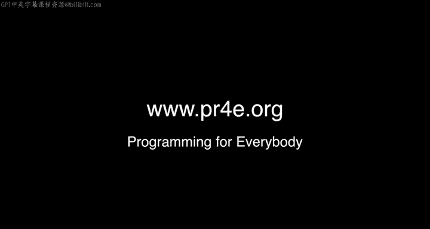

# PostgreSQL for Everybody：P72：特别办公时间：美国俄勒冈州波特兰

## 概述
在本节课中，我们将回顾一次在美国俄勒冈州波特兰市举行的特别办公时间活动。这次活动是课程系列的一部分，旨在让讲师与学生面对面交流，分享学习经验与心得。我们将看到来自不同背景的学生们如何通过本课程学习Python与PostgreSQL，并了解社区支持在在线学习中的重要性。

---

## 活动开场与地点确认

讲师向大家问好，宣布本次办公时间在俄勒冈州波特兰市举行。他起初对地点表述略有迟疑，但随即确认是在波特兰市一条繁忙的街道旁。他表示此次活动非常成功，并希望向课程的其他学员介绍在场的参与者。

---

## 学员自我介绍与分享

以下是参与本次办公时间的学员们的自我介绍。他们分享了学习本课程的动机、进展以及感受。

*   **Arvin**：他报名了多门在线课程，而本Python系列是他第一个全部完成的课程。他感谢了出色的讲师。
*   **Scott**：他为了学习信息科学相关的Python知识而参加了本课程。
*   **Alireza**：他开玩笑说在过去四个月里见查克博士的次数比见自己孩子还多。他已经完成了Python、数据访问和数据结构课程，并认为课程非常棒。
*   **Paul**：他与自己17岁、同样名叫Paul的儿子一起将本课程作为父子项目来学习。对他而言这是爱好，对儿子则是积累未来可用的技能。他的梦想是让这类课程进入每一所高中。
*   **Maddie**：她是一名来自Pitzer学院的有机体生物学专业学生，但对学习Python感到兴奋。
*   **Margaret**：她从田纳西州来此度假。本Python课程是她一直想学习的编程入门课。
*   **Diane**：她正在学习本系列课程的第四门，并计划在今年夏天完成毕业项目。她觉得课程充满乐趣。
*   **Alejandro**：他三年前住在古巴哈瓦那时学习了精彩的互联网历史课程，并因此感谢查克博士。
*   **Andrew**：他与同事Nathan一起加入了Coursera课程。Nathan今天因工作未能到场，但Andrew通过照片让他“虚拟”参与了活动。他感谢查克博士付出的所有出色工作。
*   **Herb**：他在很久以前学习了互联网历史、技术与安全课程，随后成为教学社区的助教，现在是一名导师。他长期参与课程，非常享受帮助学生。

---

## 社区导师的重要性

在Herb自我介绍后，讲师特别强调了社区导师的无私贡献。他指出，像Herb这样的导师不到十位，他们不懈地帮助所有学生，却没有任何报酬。讲师表示，他喜欢拜访导师所在的城市并请他们吃饭，作为对他们多年辛勤工作的一点微薄补偿。

讲师进一步阐述，如果没有像Herb这样的导师，这些课程将无法保持活力。最好的讲座视频、作业和测验，如果缺乏人的互动，效果将大打折扣。因为学习本质上是人的活动，是人与人之间的交流。正是这些导师在讲师和课程内容之外，维持着学习社区的生机。

因此，全体参与者为Herb和其他导师献上了掌声。

---

## 其他参与者与活动预告

随后，其他随机参与者也被邀请介绍自己。

*   **Maureen**：她是一名化学家。她学习本课程的目的是为了能以自动化方式提取数据并每周生成图表，从而摆脱在Excel中手动操作的繁琐。

活动介绍环节至此结束。讲师预告了接下来的办公时间安排：下一场将在不到24小时后于西雅图举行。再之后的一场将在英格兰的布莱切利公园举行。他邀请所有有机会去英格兰度假的学员参加。

---

## 总结
本节课中，我们一起回顾了波特兰特别办公时间的现场情况。我们看到了来自学生、父亲、专业人士等不同背景的学员如何通过“PostgreSQL for Everybody”系列课程开启或深化他们的编程与数据技能之旅。更重要的是，我们认识到在线学习社区中，像导师这样的“人”的因素至关重要，他们的支持与互动是课程保持活力、学员获得成功的关键。本次办公时间生动地展示了技术学习背后温暖的人际连接。