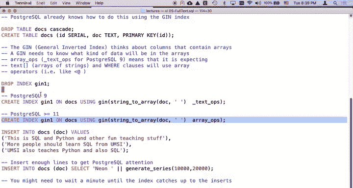
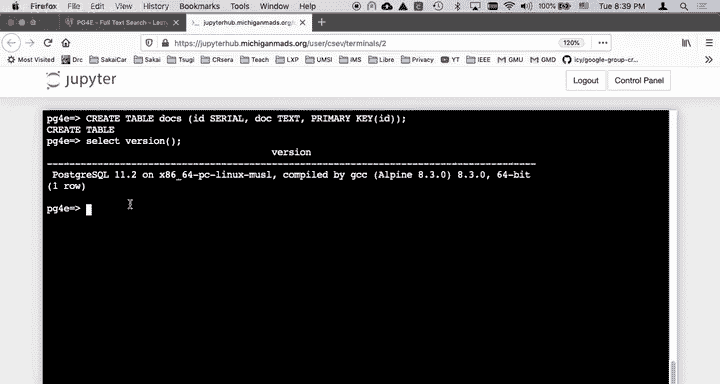
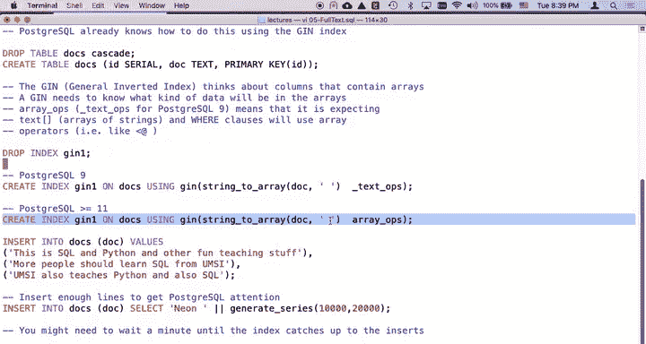
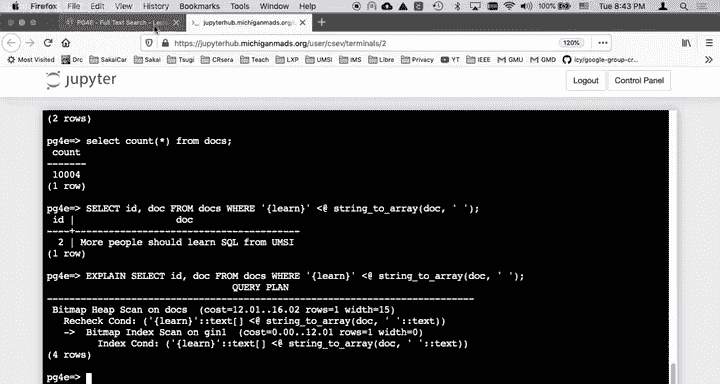

# 密歇根大学《给所有人的PostgreSQL课（数据库设计、SQL、JSON和NLP、ES）｜PostgreSQL for Everybody》中英字幕 - P74：10_GIN倒排索引构建演示.zh_en - GPT中英字幕课程资源 - BV1tj421U7GK

So now we're going to do another the inverted index in Postgres。

 and it just turns out it's a whole bunch easier to do it in Postgress because we're just going to use theGin indexex。

 so let's take a look at the 05 fulltext。sQL document and so let's go ahead and make our docs table。

If you， if you already created if you're doing this like one at you know multiple a time。

 then you can drop the table and drop the indexes。 it's always a good idea。

 I don't have one now there are two ways to create this index。

 you might be using Postgres 9 and you might be using Postgres 11。

 Let's check to see which one I'm doing select。

Version parentheses， yay， I'm Postc 11。 So that means that I have to use this。

I have to use the array ops Now what happened is between Postgres 9 and Postgres 11。

 they sort of merged a lot of array types into one array ops and so life got a lot simpler't you didn't have to tell it the type so I'm going to make this as my index so create index Genin1 on docs using gin string to array doc double quote an array ops is the operator class。

So I'm going to do that， so I've created the table and I'm going to create the index so you can think of this as it understands that this the index is breaking the document into an array。

 and then we have to be able to do array operations on it。

 which you'll see in a moment what array operations are。So I've created the index。

 I'm going to throw some documents in。The same documents。

 and then I'm going to throw some filler lines。So insert into docs and I'm use the generate series to throw 10。

000 more lines in， and that's because sometimes it won't use the index unless it's big enough and as a matter of fact。

 we might find that the explain doesn't work yet， let me try it real quick。Yeah。

 so that's a sequential scan。 And so the problem is is it's actually still at this moment while we're watching it。

 it is working on it just got 10，000 records inserted and it's actually in the background the index is sort of out of date and the index is catching up and so it takes a while。

So we'll come back to that in a second and we'll run it， so let's look at this。

Let's look at that select ID generate series。Inser into docs， right insert into docs。

 And then there's a select。 And then this is just neon concatenated with generaterate series。

 Generate series is sort of a vertical expansion。 that's going to create a series of rows， Nen 10000。

 Nen 10001， Nen 10002。 and that puts 10000 rows in our database。 So if I do was to do I select。Count。

star。From docs。You will see that there is 10004 records in， and that is the3 I put in。

 and then the 10001 that it put in later。Okay， so that's the generaterate series。

 but we talked about that earlier。And let's do this select Now this is this。

 this is an array you can kind of say it contained。

 is this learn array contained within the string to array of doc Now the key thing to anything in an index is to is the where clause is where the index heavy lifting happens。

And the key is to match what you're making the index on to what you're checking against in the wear clauses。

 so the fact that string to array， doc double with a space and array ops。

 that is the thing we've got to have in the wear clause， and of course。

 quote curly brace learn curly brace quote that is a one element string array in Postgres syntax。

We'll go grab that and find the docs。 And so we've found that one。 Select I D。 Now。

 let's just see if the explain is caught up after I blah， blah， blah long enough。 Yy。

 the explain caught up。 So don't feel bad if your explain takes a while。 So we did the same explain。

 We didn't do anything except waiteded。 So it happened there was because we inserted 10000 in1 records it was out of date。

 And so it it said， you know， I， my index isn't quite right。 I'm not going to trust it。

 I'm going to wait until the index catches up。 This is one of the issues of inverted indexes。

 If you're under a heavy insert load。 Po index never catches up or。

It costs you a lot of effort and the index is always behind。 So you're not using it。

 So if you're continuously inserting， then you might never be able to use the index because it's always marked as like incomplete。

 It has to kind of catch back up。 So there's a bunch of reorganization that has to happen。

 But in this particular one， it worked just pey Okay， And so that's pretty much it。

 you did that It's really not damn much work。 You。Create the index。

You get the index expression right， you pick your operator class and then at some point your explains start to work okay。

 so I hope you found that helpful cheers。

