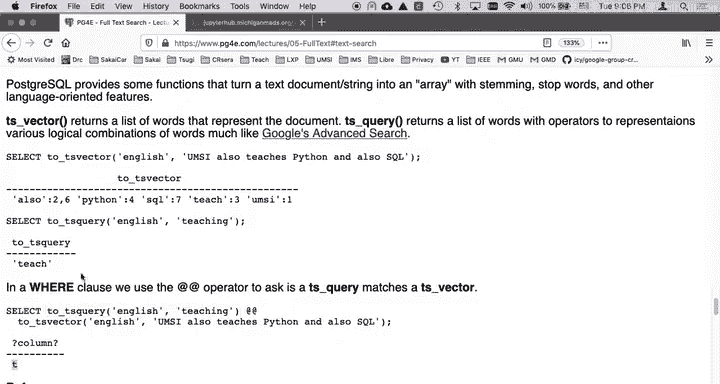
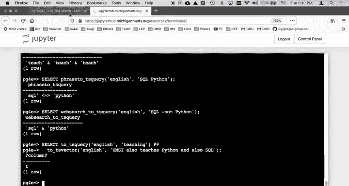
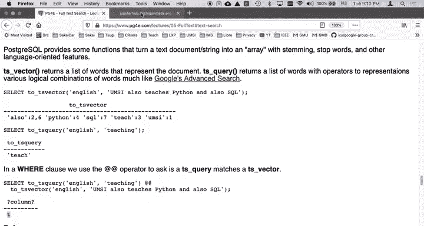

# 密歇根大学《给所有人的PostgreSQL课（数据库设计、SQL、JSON和NLP、ES）｜PostgreSQL for Everybody》中英字幕 - P76：12_全文检索函数tsquery-tsvector演示.zh_en - GPT中英字幕课程资源 - BV1tj421U7GK

So now that we've explored doing some of the stop wordss and stemming using SQL natively。

 we're going to do the much easier way of doing this by building on the Postgres capabilities and their stemming and stop wordss and their ability to store this data very densely far surpasses our ability because they can build indexes specifically for this kind of stuff and they can tweak it and have extensive stop Word lists so really what I just showed you with the doxgen was just to give you a sense of the kind of basic data structures that Postgres is going to make on our behalf。

Before we get in how to do it， it turns out how to do it。 it's not hard at all。

 There are two really important。Fs so in the previous examples。

 we were using string to array to split strings into words， there is a language aware function。

 two functions called TS underscore vector and TS underscore query that basically take strings and turn them into an internal structure。

And so this select2 TS vector， you'll notice that we have to tell it what language it is because then it's using it's picking a dictionary for stemming and stop wordss and other kinds of tuning。

And what that does is it goes and does the stemming and stop wordss and tells you。

 along with a position of the non thrown away stuff， so you'll notice that and is thrown away。

And so that's the and you can see the stemming， if we say2 TS query in teaching。

 you can see that teaching is stemmed down to teach just like what we did in the previous example。

And so then in the where clause so the TS query is a thing you're looking for and a TS vector is a thing that you're indexing。

And this function 2 TS vector and 2 TS query converts using a language to either a TS vector or a TS query object。

 you notice TS query doesn't have a position in it。

These are the positions also is twice in positions two and6， Python is in fourth position。

 SQL's and seventh position teaches， that's what those numbers are telling you。

We use this at double at sign operator， which really is the you think of it。

 you can put various things on one side， but I think of it as like left side TS query， right side。

 TS vector， it returns a true or a false， so let's go ahead and run these commands。

Again， I'm using the www PG3。com lectures/05 full text SQL for the samples， we can run some。

2 TS vector commands， I'll just copy all three of these，2 TS vector commands。

So these selects that have no tables。 They're just kind of running the functions。

 and you'll see like people's been stemmed learn。That one the stop wordss are all happening and so there you go。

 so that's the2 TS vector TS query， you can see some stemming going on。

 let's grab these next four we're going to do a T TS query of teaching。

 teaches and English so teaching。As a query is teach， teach is as a query is teach。

 so that's two examples of stemming。And if we do a 2 TS query of the word and it complains， hey。

 don't put only stop words so I put a stop word and is a common stop word。

 but you'll also know that and you do a 2TS query on something like SQL。

 which it doesn't have a stem for and it's not a stop word and just converts it to lowercase and gives it to us now again。

We we worked really hard to build all this in SQL with like five。

 six line long select statements and the 2 TS query。Does all this for us。So that's quite nice。

So those are so you can also put logical operators。

 the two TS query with the vertical bars as or or or or or And so you can think of this TS query being sent to the database。

 I wish it would be clever enough to realize that teach or teach or teach or teach know you see that it's stemmed at lowercase。

 through way stop words， and it's basically it should really just say teach。

 but teach or teach or teach these TS queries， you can think of them as being sent to the database like hey database。

 you have all these documents。 We're going hand you this query。 It's a parsed query。

 It's like a compiled query。 We're firing it to the database and the database is going to scan the rows or if all goes well。

 it'll use the index instead。Now there's a couple of different ways to do this。

 there is plain text to TS query， like in this case， plain to TS query of SQL。

 let me grab both of them。This one I don't like so much because this applies all the words half that it implies and and of course it's doing stemming and it's doing。

 but if you do this plain 2 TS query， that implies and between all of the operators。

There is a phrase， and that basically says we want phrase to TS query says I wouldn't want to see SQL followed by Python and again。

 stemmed in lowercase。If you are Postgres 11 or later， which I happen to be in this particular one。

 you can do web search to TS query Now web search to TS query uses a syntax that I think was pioneered by Google that's got a couple of special things in there it also tolerates it does something if you have like a syntax error it doesn't freak out and you're kind of expected that this can be type by the user and not blow the system up some of these things like plain to TS query or to TS query you can type syntax errors in the query so you have to be careful。

 but the phrase to and a web search to。Don't need that okay and so we can ask， you know。

 we can ask whether or not a particular query is inside of a particular text vector and this is kind of where you're stemming and stopboarding so you have to stem and stopboard the query and then you have to stem and stop word the thing that you're querying。

So we'll stop here， but then up next we're going to show how you actually do the index using these functions。

