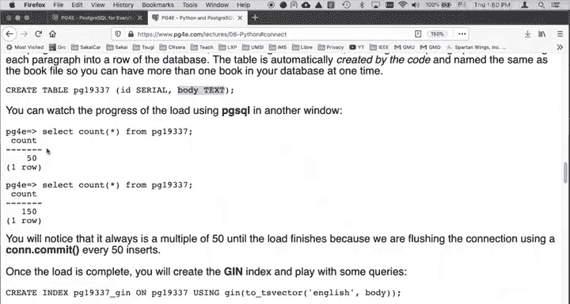
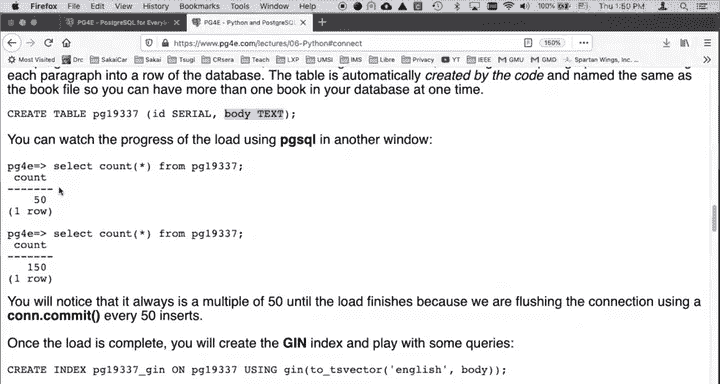

# 密歇根大学《给所有人的PostgreSQL课（数据库设计、SQL、JSON和NLP、ES）｜PostgreSQL for Everybody》中英字幕 - P80：16_PostgreSQL与Python集成讲座.zh_en - GPT中英字幕课程资源 - BV1tj421U7GK

Welcome to our lecture on Postgress and Python。 Up till now。

 we've been typing SQL commands through PgSQL。 It's quite easy in Postgres to， in effect。

 simulate what PgSQL is doing because PgSQL is just a client。

 The Postgres server somewhere else on the network。

 It's got an IP address and an ID and Passory we log into it， and then we send commands to it。

 PGSQL is just one piece of software。 One of many pieces of software that's capable of taking SQL commands and sending them another piece of software that can do it is actually Python。

And so in now and Python can handle text so well， so we're going to do a series of things where we actually sort of use text。

 read text with Python， maybe talk to an API， parse that。

 and then put it into a database and we can actually clean up data， we've done data cleaning in SQL。

 but when you get to Python then you have a lot more power than you do in SQL。So the first thing。

 let me zoom this up a little bit， the first thing to know about Python is that you have to have this PSY COPG2 that's a Python。

Connection to Postgres or something like that。 And then with that。

 you're going to then make a connection。 This connection is basically logging in the Postgress server。

 that can fail。 You might have a bad idea or password or have the host name wrong when we do this on my online examples。

 We'll have the file hidden up you why so you don't have to actually have the secrets right in that file Now you can send。

Commands through this connection， but we tend to want to maybe have， in a sense。

 more than one client at a time。 So we use a thing called a cursor。

 a cursor is a lot like a file handle or a socket if you' programmed network sockets。

 And so you actually say to the connection。 you say hey， connection give me a cursor。

 I would like to start sending Sql commands。 and then you start sending SQl commands by typing the cursor is an object and you type the called the execute method in that object and you start sending it strings and literally they're just strings。

 It doesn't have to be constants。 They can be strings that you can catate together to make more things。

 and then you can put subtal parameters which will quickly see。 And so here I have a。G me a cursor。

 drop a table， here's some more cursor execute now you can use the cursor over and over again。

 but now what we're doing is we're actually sending a command and then after that command is done。

 then we get back in the cursor what's called a record set。

And then we can iterate loop through by saying give me the next row， give me the next row。

 so think how you type a select command and then it brings you a bunch of rows well in Python you do a select command and you have a handle through which you can see the rows because there could be one row or thousands and thousands of rows so you tend to have to write a loop unless you know you're getting exactly one so fetch one says get me the next row whatever that is now a row is a tuple and if there are no rows you get none back and so this。

It's very simple， you can take a look at that sample code。

 and the first really big sample we're going to do is we're going to read through the text of a book。

 this is from the Gutenberg Project， funny thing it's called PG。Postgres is PG。

 but the PG19337 is one of the they free and open textbooks。

 this happens to be Charles Dickens Christmas Carol， I think。

And we're going to read that as a text file， and then we're going to load that into a database and then build a full text index and then play with that full text index and I have instructions。

 this loadbook do PY I'm going to do a walkthrough for you in that there's some utility code that I give you my us。

 there's a hidden buy that puts the secrets in and then you're going to grab the。Grab the text。

 die downloading that with a w get then run the code。

 the code simply what the code does is it looks through the file and takes paragraphs like a paragraph here。

 there's this paragraph here and it takes multiple line paragraphs and string them into one long text line and then throws away extra blank stuff and then puts that in a database and puts it in a database that basically has a single field called body which is a text field and so this ends up with effectively one row per paragraph in this book and then we play with it you know as the thing is running as this loadbook is running you can watch using a PostgPSql and another window and。

And you can watch it， it actually commits every 50 records， so you'll see that once in a while。

🎼And then we're going to play with it and we'll just make a TS query and this is really just a different way of getting and filling up a significantly larger database with some interesting information and then we play with queries and I'll do this all in a nice little run through so in the next lecture we'll talk a little bit about probably the most complex thing this particular in this particular week and that is application that I wrote that loads a bunch of email data from an online source。

