# 密歇根大学《给所有人的PostgreSQL课（数据库设计、SQL、JSON和NLP、ES）｜PostgreSQL for Everybody》中英字幕 - P81：17_Python连接PostgreSQL基础演示.zh_en - GPT中英字幕课程资源 - BV1tj421U7GK

Hello and welcome to another sample code walk crew for our Postgres class。

 we're currently working on connecting Python and Postgress。

And so the first thing we're going to do is and by the way you can get the sample SQL that I'm using。

 I really prefer to run through this by simply copying and pasting After the class you can keep these SqL files they're great examples I refer back to them myself because once I figure something out sometimes it's like put two parentheses around it I'm like why did I do that but I would keep these so this files at www。

pgfr。com/ lecture/06 python。sqL。And I always put comments at the beginning of these files。

 so the first thing that I want to show you， so what I've got going here is I've got one screen that I'm going to one tab that's going to have my copying and pasting stuff。

 one tab where I'm going to run my Linux Uni commands and run all my Python code。

 and then one tab that's connected to my database。

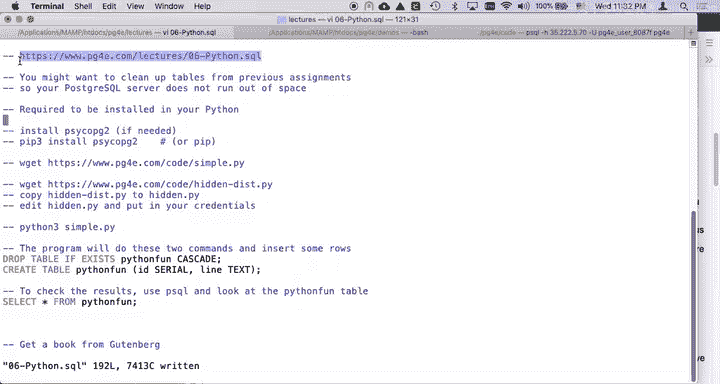

And you may need another tab that has your tunnel if you're behind a IP filtering。

 so you may need a fourth tab， but I'm just all set。

So the first thing that I suggest that you do once in a while is just do a DT command in PG for E and you see I've got a couple of databases。

 doc ST and stop wordss and doc ST and stop wordss and I mean I should probably clean those up so you just say drop table。

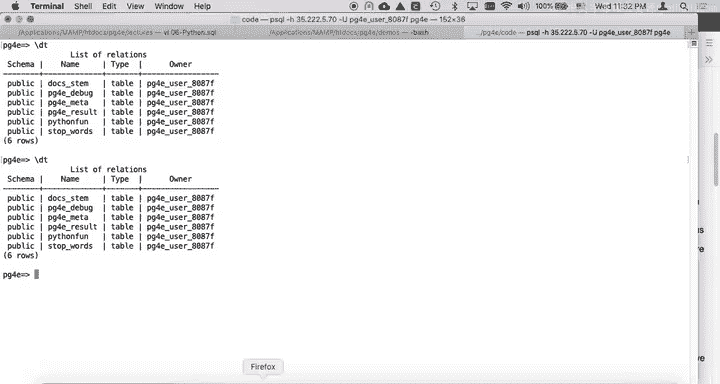

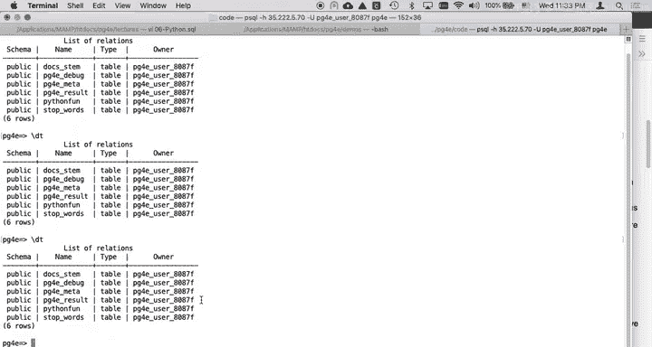

Doocks。Stem oops， well， I can't type docs。Stam。

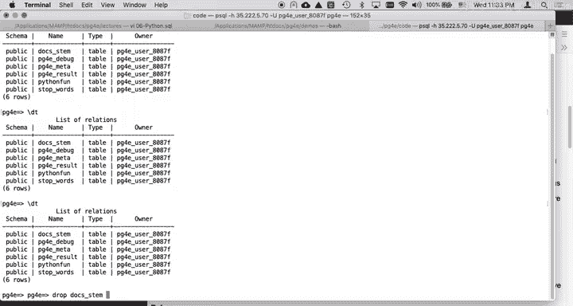

Cascade。Yeah。

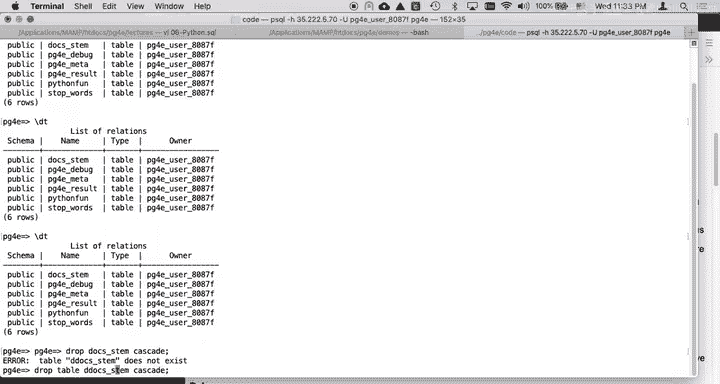

Something was on there， okay， drop table doc stem cascade cascade just means if there's any foreign keys it wipes out the other tables as well。

 stop words。

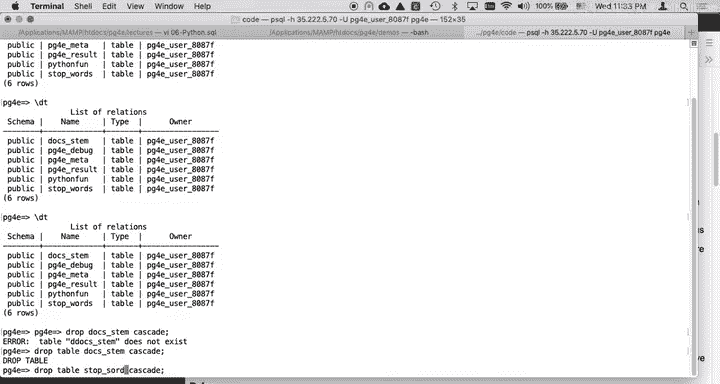

And now on do Dt now don't delete either any of these Py free debug meta or result， oh。

 I got to get rid of the Python Fun2 drop table， Python fun cascade。

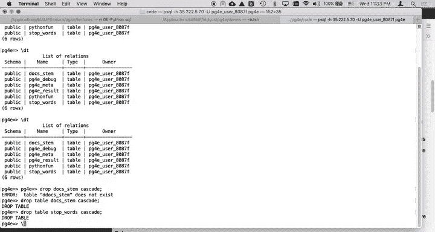

嗯。

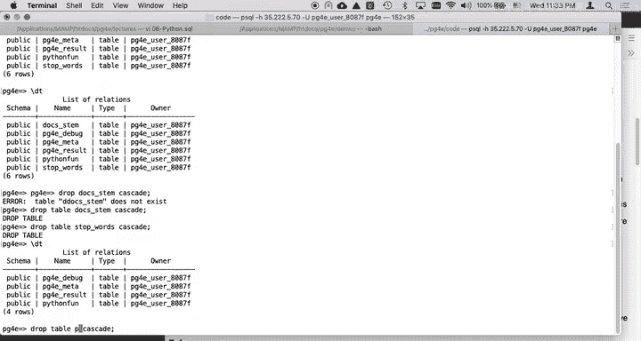

I on fun cascade。 So now I've got three tables left PG free debug， PG free meta， PG free result。

 and these are all things that the auto grader is going to use and or need。 So if you mess these up。

There is an early assignment that gets them set back up for you so that it's not fatal if you delete them。

 you just got to go back and get them fixed， otherwise the autograders are going to be unhappy。

 They're also a way for you to look at results of the autograders but we're not doing an autograder right now I'm going to clear my screen and so let's get to this So the first thing is is you've got to have a connector what's called a database connector and it's got to be a piece of code installed in your Python。

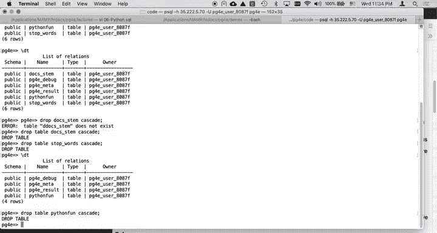

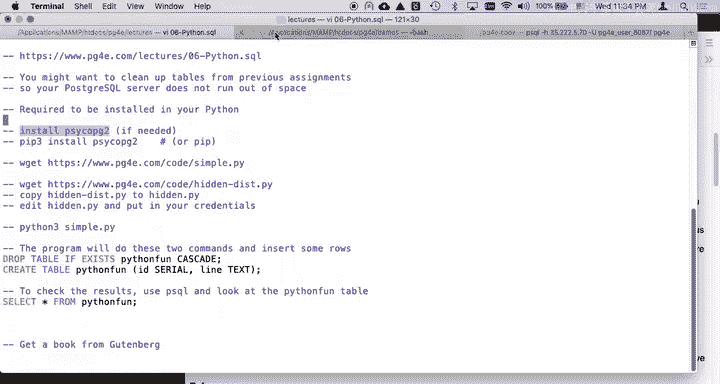

And you can check to see if it's installed by just saying。Going into the Python。And saying import。

PS Y， COP G2 is that what this is， I couldn't remember what the name pu？

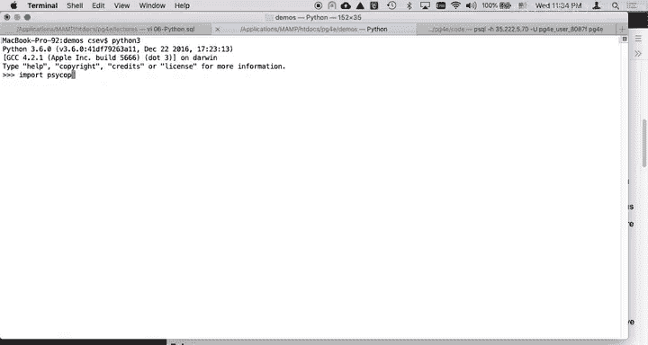

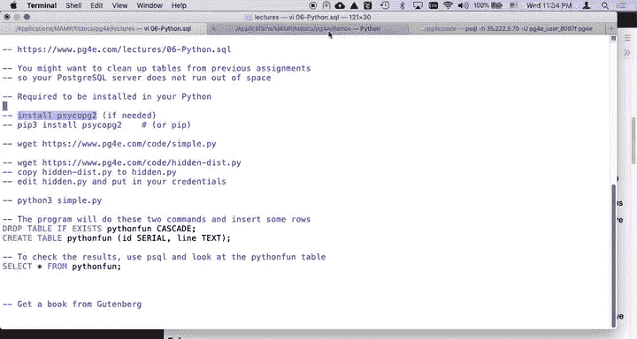

Psyops， is's what it seems like to me。And if that works， then you're good。Don't run this PIP command。

 but if it doesn't work and this is the part where it all depends on how your Python is set up and everyone installs Python in a weird way。

 if you' got an Ananacondo or this， I actually don't even use virtual environments and people tell me I'm terrible but I just my Mac is nice and clean and I've got a brew installed Python 3 so I can just say PIipP3 install。

Sy cop 2。And it says PG2。Says I've already got it so I'm good that means that and of course。

 what'll happen is。

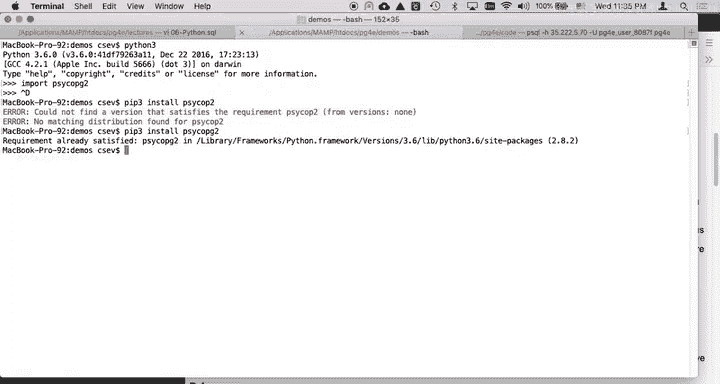

this code will blow up in simple dot Py， so let me go grab the simple dot Py code。

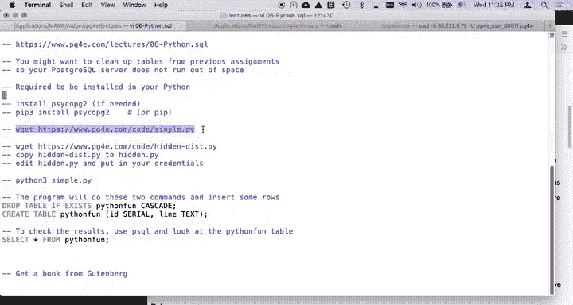

I just used a W get。To htbs wwwpjfree。com/code/simple。

pyy and that in effect downloaded that file so I can edit that file， simple。pyy， and so we see that。

The next file I'm told to get is a W get Pgfr code hiddendden disk。pyy。

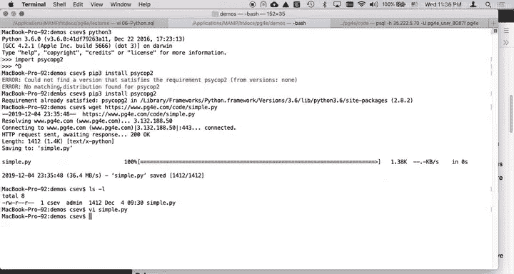

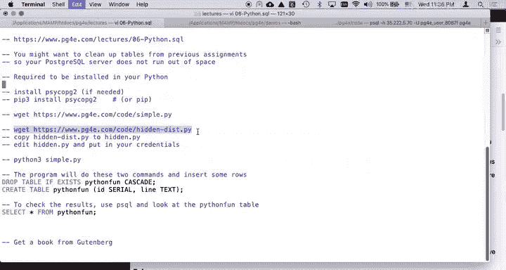

Now， the key thing here is if you take a look at hidden disk in general。

 when people build code and they're going to give you like sample code。

 hidden disk is copied to hidden disk。 Py and so。

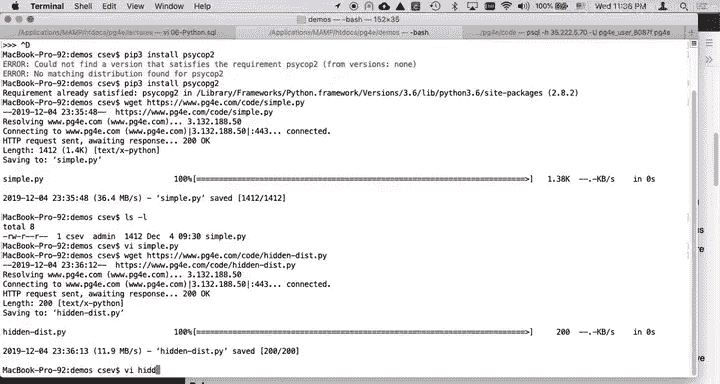

So the file that really matters， the file it's really going to be used is called hidden PY。

 and you can move it or you can copy it hidden disk PY。And then the idea is。

 is that hidden disk has sample data， but hidden。Has your real data。 Now。

 I'm not going to show you my real data。 I have my real data。In a slide a folder right next door。

Copyhidden pie dot。So copy that yours won't be in dot。t scode。And so now sitting here。

 I've got hidden disk pi and hidden Pi， hiddenist has sample the sample connection data。

 That's the connection data。 that's same connection data that you're sitting using over here to connect to your database。

 It's all in there， I'm not going to show it to you。 And if you take a look at simple dot P Y。

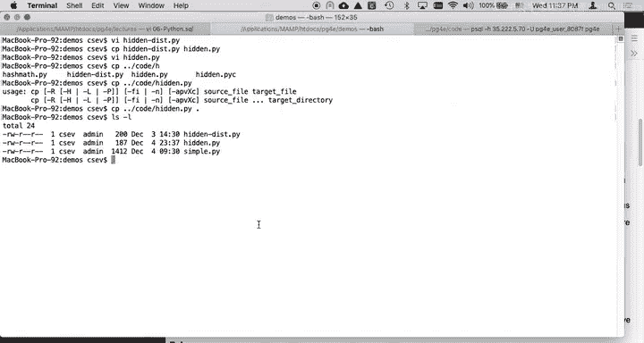

We're importing it and then all of the secrets in this connection。

So when you do this Psi COPG2 connect， you've got to tell it the host you're going to。

 the database that you're going to。The the user that you're going to connect with and the password you're going to connect with the net connect time mod is just three seconds。

So what happens is so this secrets that's just going and grabbing the secrets。

 which is just a dictionary out of that hidden dot PY file。

 and then I can look it up in that dictionary， the keys that were in that file。

Now connection in Python is it's not exactly the same as it's very similar to in a sense。

 this connection。

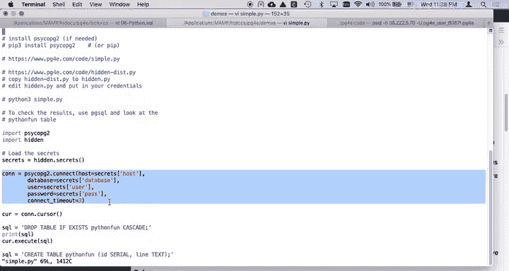

But you don't when you type commands， you get what's called a cursor。

 and so if I do a slash Dt in this case and I say select。Star from Pg4 E result just。For ya。

In a sense， what we would do in was we have this connection。

 but then we would create a cursor and then use the cursor to send the command。

 and then the cursor would then allow us to read the records that come back。

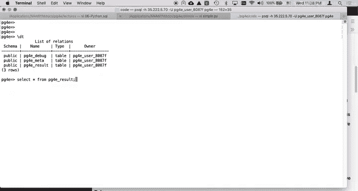

No， that's too long。

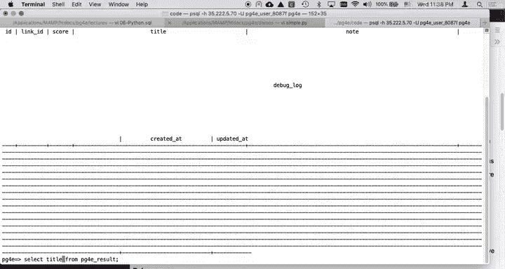

So so the cursor would take this command， select title from PG3 result。

 it would send it to the database， then we would get back in a sense a handle and then we would loop through and read all of the records that come back in the record set So you see this where we make the connection Now the connection can blow up if you have the wrong ID or the wrong password or the wrong host or whatever But really if we want to send commands。

 we call ask for a cursor So we say hey connection give me a cursor and a cursor is where what we send SQL commands to inside of Python。

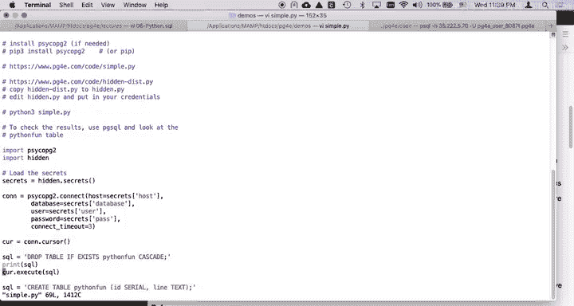

So I'm just putting SQL to drop table if exists Python fun。

 You'll see that I drop often when I'm writing Python code。 If I really want it to start fresh。

 I drop the table， and then I create the table as compared to making myself manually drop or create the table。

 I'm going to print it out。 and then I'm going to execute it。

 And so to execute that actually sends it。And send it to the database and that could blow up if I made a typographical error here and we'll see a mistake in a second。

 it'll blow up， that execute will blow up。Then I'm going to create a table。

 I'm going to just get a auto increment serial and a text and I'm going to run that one so that's sending that And then this conduct commit。

 we do this on the connection object it basically flushes at all the database server Sometimes the connection in the cursor to be efficient。

 it doesn't actually send every command instantly it kind of cues them up and then and so commit says。

 look， you may or may not have sent all of these commands。

 but I want you to send them now I'm going to wait so when you see this commit。

What you might see is your program running and running and running and you do a commit and it pauses for a second and it's forcing all that stuff in the database and the commit does not finish until data is actually written to the disk in a database。

 which is really quite nice。And then I'm going to do insert 10 records。

The first thing that you see here is that。There is a percent S， this is a substitution parameter。

And insert into Python fun line values percent S， the percent S is a substitution parameter。

 and if I'm going to execute that SQL， then I send it a topple with a one to one correspondence that this variable TxT。

 which is a string。Is one to one correspondence to these percent ss now this little TxT comma parenthesesis。

 this is the weird thing we do in Pyon when we have a one tuple。

 we go percent thing comma closed parentheesis and there's only one of them but that's the way it knows it's a tuple and so it's just one tuple we'll see later when we have more than one of these things it actually makes more sense there's the SQL with a substitution areas is the first parameter to execute and then a tuple which is the variables that represent the substitutions。

And then I'm going to commit。 So these four inserts might actually not be sent to the database。

 It might just kind to remember them。 But when the commit happens。

 then all those 10 things are going to be there。 You can do a select statement。

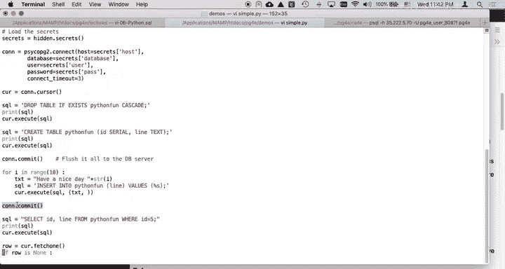

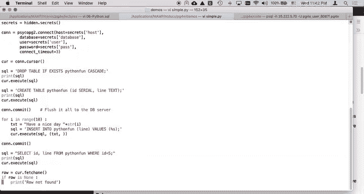

So we send a select statement and print it。With wear clauses， etc ce。

 and I do the execute now what happens is is then at that point this cursor。

 once I've executed that select ID line from Python Fund where ID equals 5。

Then cur is like a handle and I can read it and the fetch one method is kind of like read one line。

Or read one row as it were， because you can， in this case， I'm asking for two things， IDd in line。

And so row ends up being a tuple。 row sub 0 is ID D， and row sub1 is line。 But if there was nothing。

 then fetchch1 will give me back none。 Otherwise， I'm going to print it out here。

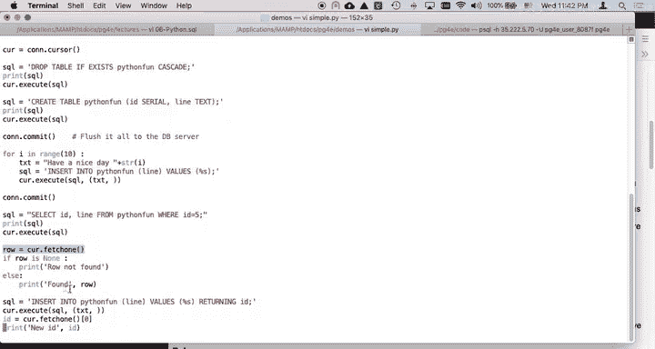

Okay。😊，So。That is kind of a return value。 That's the pattern of a return value or a return set of records。

 So the fetch1， you can， and we'll do this later， willll do it over and over and over again in a loop until row is none and that you kind of hit the end of your record set。

And the whole thing is very efficient and it might call the database once。

 it might send a network request once or twice or， but it's all optimized and you don't worry about it。

 you just say， let me read through those return records。

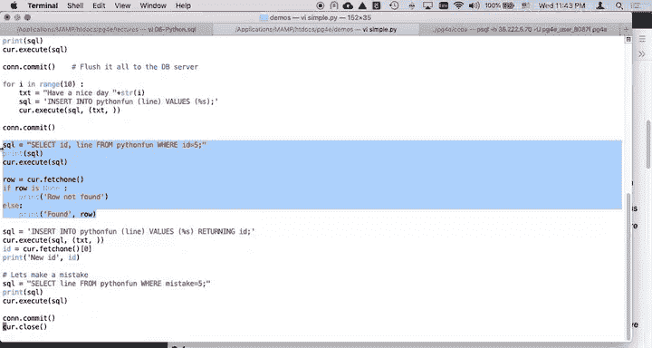

Then what we have is insert another insert where we're going to insert another line with this returning ID。

 and that's where we want to know what was the unique key in the serial column that was assigned。

And so then we just give it some more text that we're actually going to send the second line twice。

 last line twice， and then we're going to this insert actually returns a record set and we fetch that record set and then we take the sub0ro element of it。

 and then that turns out to be the ID。And then you can well then the next thing this thing is going to do is make a mistake where this is a syntax error in the SQL to show you how the execute actually blows up now this is going to die right here so they'll never get to the point where it does the connection commit and then cursor close。

 which is a good way to clean things up at the end of this program。

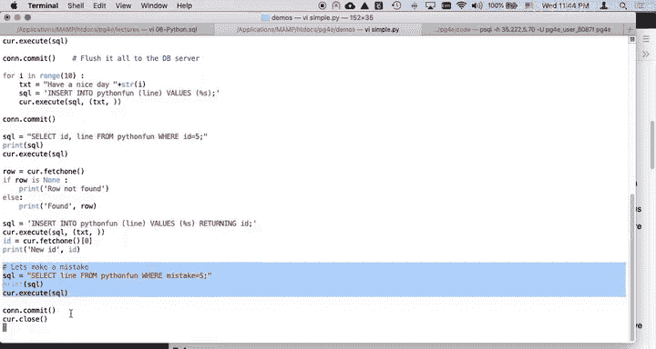

Okay。So let's go back here。 And just before we start this program。 So this is one of the nice things。

 So when these Python programs are running， you can simultaneously watch what they're doing。

 This one here is going to run so fast， we can't stop it in the middle。

 Some of your later applications are going to run slowly and you can watch what they're doing as they're talking to the database。

 So the first thing we notice is there's no table here。 So now we're just going to run that Python 3。

Simple dot Py。So it dropped the table， it created the table， it inserted all those rows。

 it selected an ID line where IDd equals 5 and it found the line5 so I can go take this one over here and I can run it so you see that's what that select ID line from Python fund where ID equals 5 gives me back a row row 5。

 that says hi a nice day4 and you can see I see that same thing then I insert a new record So if I do a select star over here in PG in my PSQL。

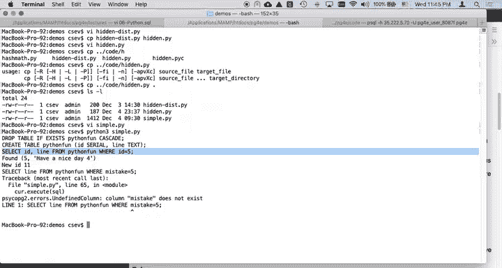

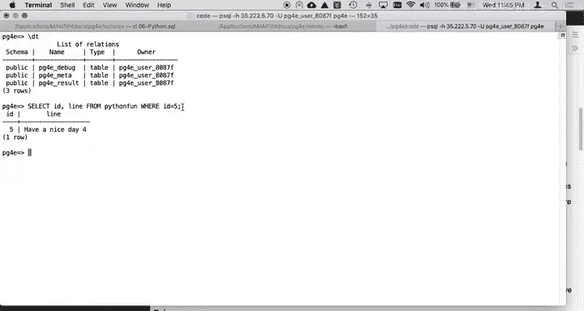

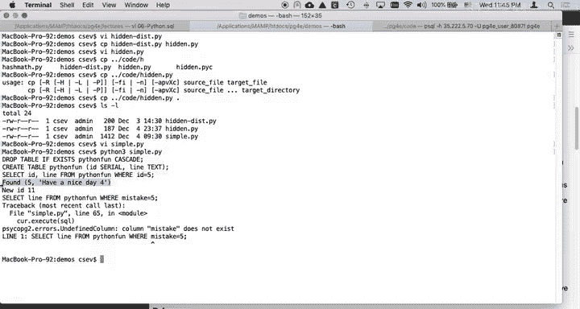

From Python fun。Who I'm always transcribing my O and my R。From。You can see that。

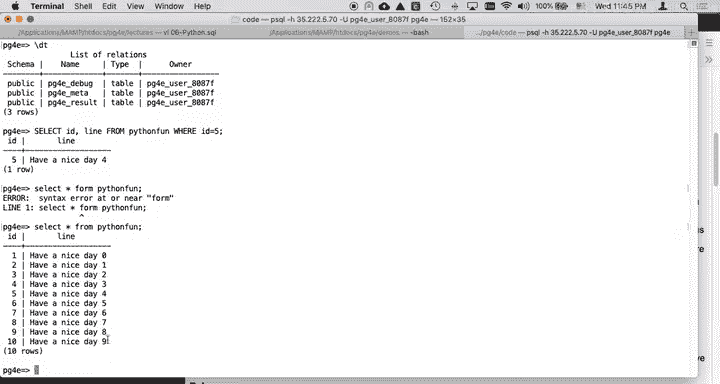

Oh， oh no。 What happened。 Oh oh， look， see this new I 11。 That's pretty awesome。 See new I 11。

 and then I blew up。 Let me show you what happened there because the thing that freaked me out is I did a select star from Python fun and I do not have a row 11 in my database。

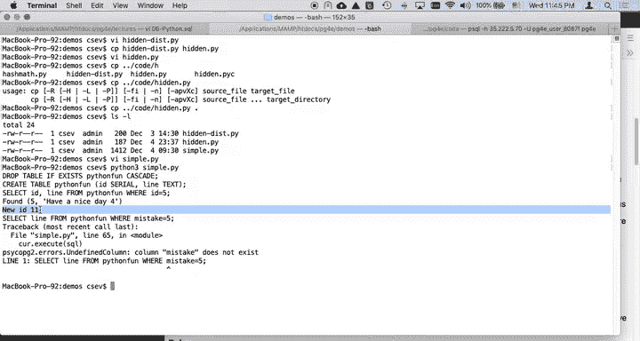

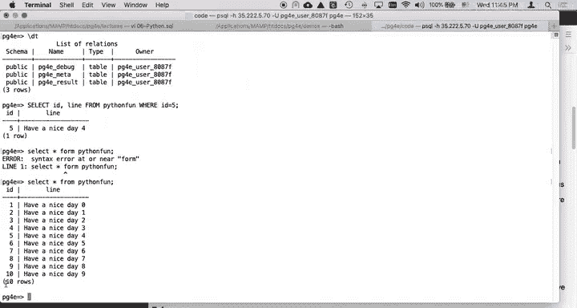

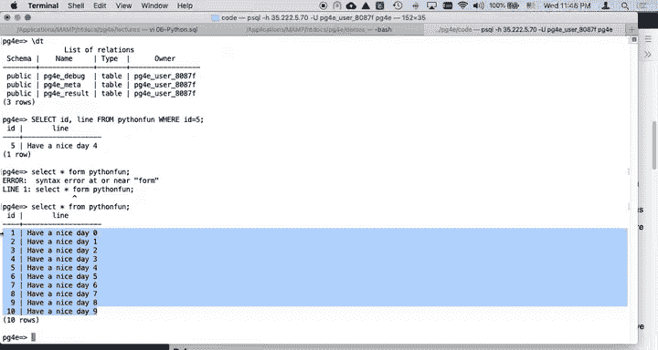

Can you guess why that is？Let me bring up to sample bo。pyy。

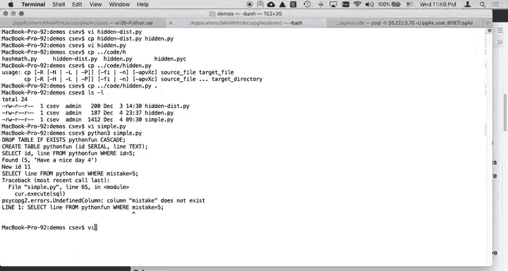

Simple dot P，So I did this insert and I printed out the new ID。

 but somehow when I go look in the database， it's not there。

Pause the video if you want to think about it for a minute， just stare at it。ok。

I you then pause and now I'm going to show you。So this is an example where the SQL executed。

 but because this blew up， it never did the commit。

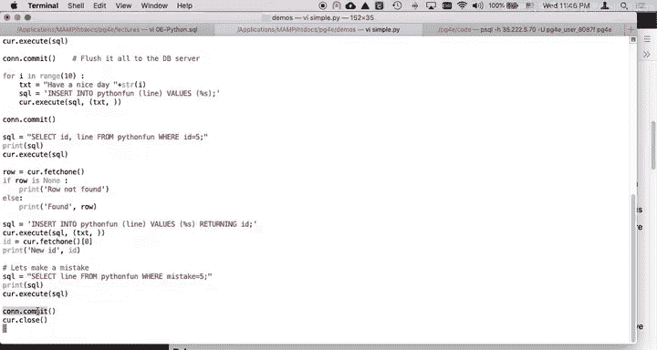

And what happened was。Both this， both the SQL for the insert statement and the SQL for the select statement were kind of running。

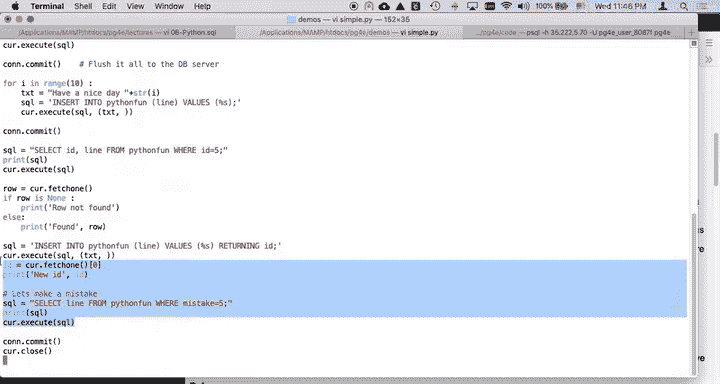

And this ran， but it didn't actually flush it to the database until we said concommit。

 So this is an example where this insert sort of happened， but it didn't happen。

Because it didn't get flush because it couldn't con commit， so you got to be careful。

Where all of a sudden， you're like， I'm really surprised that my data didn't end up there。 Now。

 you'll notice that what I tend to do is not。 Sometimes you have a thing called autocommit where you're going to put a commit after every one of these execute statements。

's that's a bit of overkill。 So you'll notice in some of the things I commit any every 10 inserts or every 50 inserts or something like that。

 Otherwise it'd be a lot slower。 And you'll see when when when it's doing a commit and we run some of those other bits of code。

 it's going to work。 So。

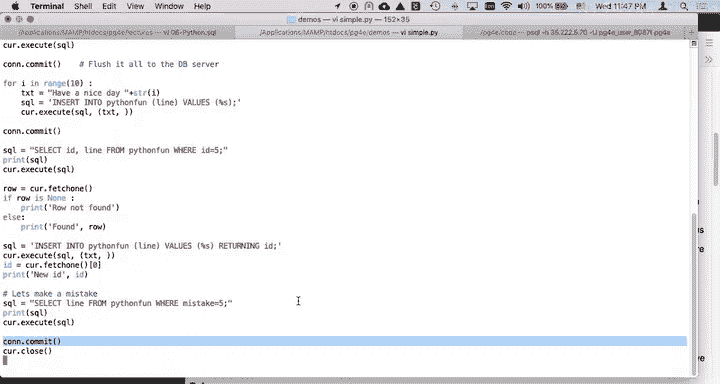

There we go， a little bit of simple Python just to sort of see what the basic idea is of talking from Python to Postgres SQL。

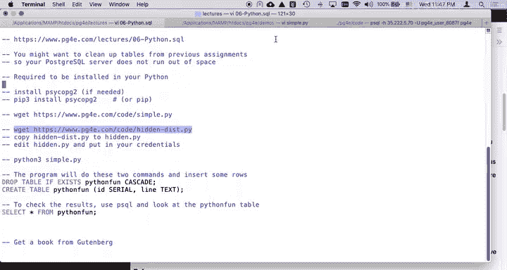