# PostgreSQL for Everybody：P84：邮件归档系统演示（第一部分）📧

## 概述

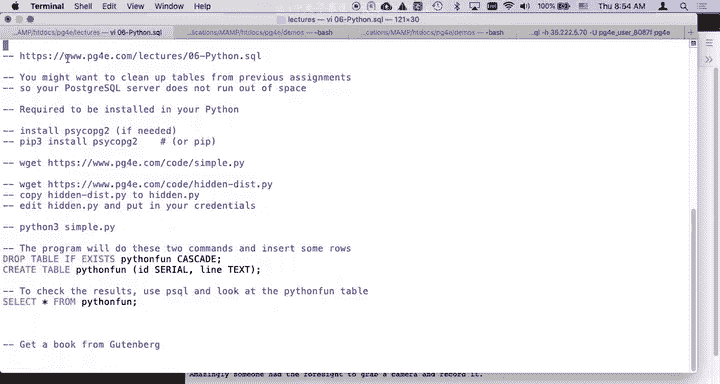

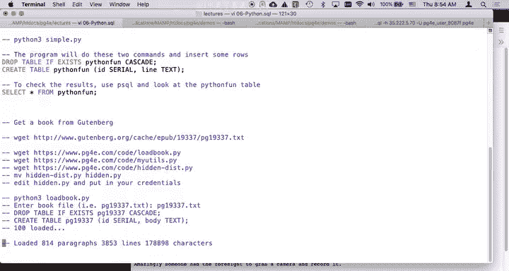

在本节课中，我们将学习如何使用Python代码将Mbox格式的邮件数据加载到PostgreSQL数据库中。这是一个相对复杂的示例，涉及数据清洗、解析和数据库操作，我们将逐步解析其工作原理。

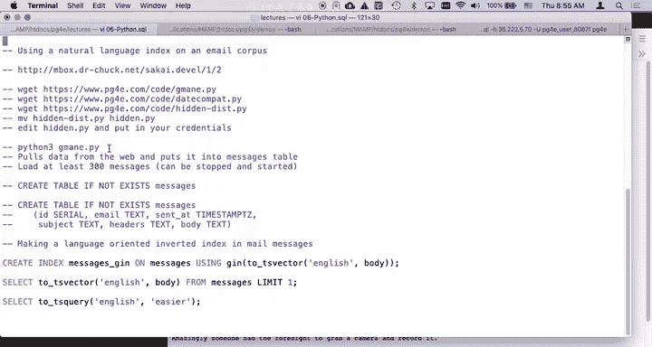

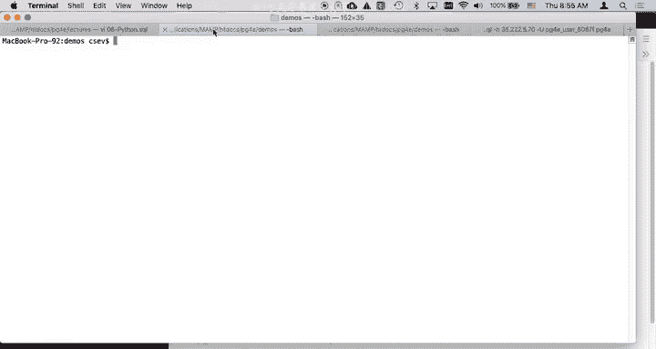

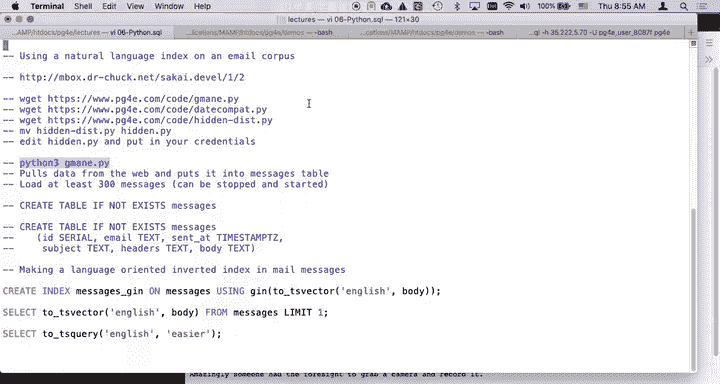

## 代码结构与数据源

我们使用的代码位于 `pg4e.com/lectures/06python-sql` 目录下的 `email-corpus-1` 文件中。程序将从 `inbox.drchuck.net` 服务器获取邮件数据。该数据源来自2005年一个开源项目的邮件列表存档。

以下是程序需要导入的辅助文件：
*   `gmane.py`
*   `datecompat.py`
*   `hidden.py`

运行程序前，请确保数据库中没有名为 `messages` 的表。如果存在，请先执行 `DROP TABLE messages;` 命令将其删除。

## 运行数据加载程序

启动程序非常简单，只需在命令行执行：
```bash
python gmane.py
```
程序运行后会询问要获取多少封邮件。输入数字（例如100）后，程序将开始从服务器获取并解析邮件，然后插入到数据库的 `messages` 表中。

程序采用分批提交的策略，每处理50条记录提交一次，每处理100条记录暂停片刻。这样设计既保证了效率，也方便用户随时中断（例如按 `Ctrl+C`）而不丢失已提交的数据。

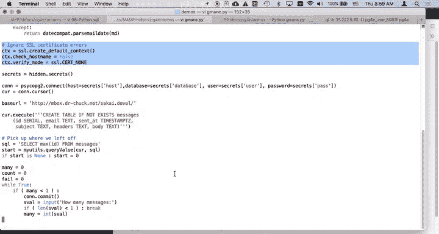

## 程序重启机制

该程序的一个重要特性是支持**可重启**。如果程序中途停止，再次运行时，它会自动查询数据库中已存在的最大邮件ID，然后从下一个ID开始获取，避免重复下载。

例如，如果数据库中已有400条记录，重启程序后，它会自动从ID 401开始获取新邮件。如果需要完全重新开始，则需要手动删除 `messages` 表。

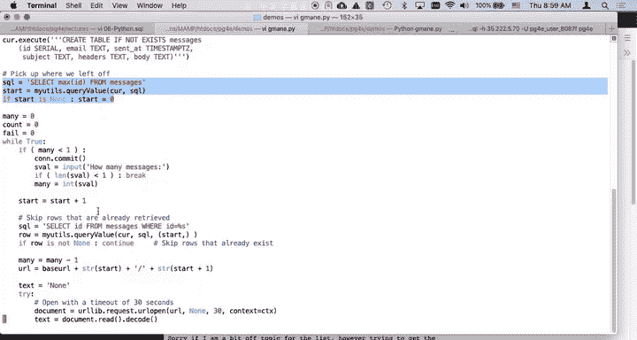

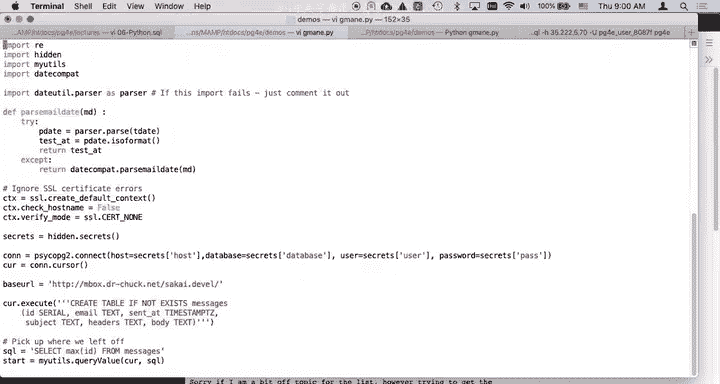

## 核心代码解析

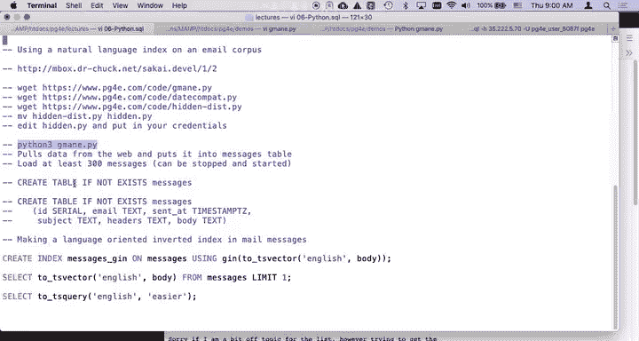

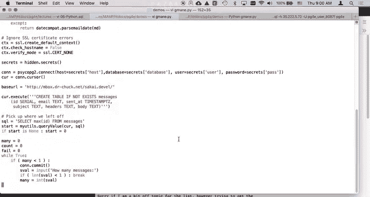

上一节我们介绍了程序的运行和重启机制，本节中我们来看看其核心代码结构，主要集中在 `gmane.py` 文件中。

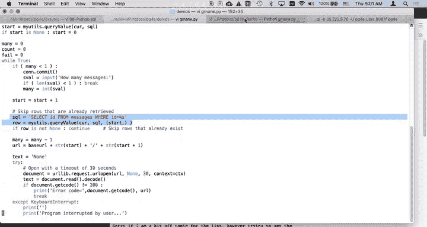

### 工具函数封装

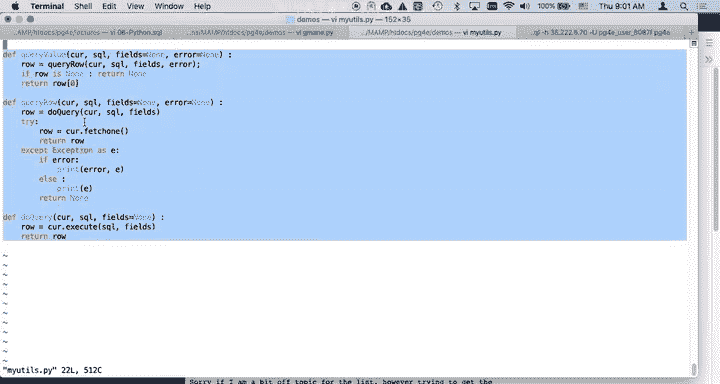

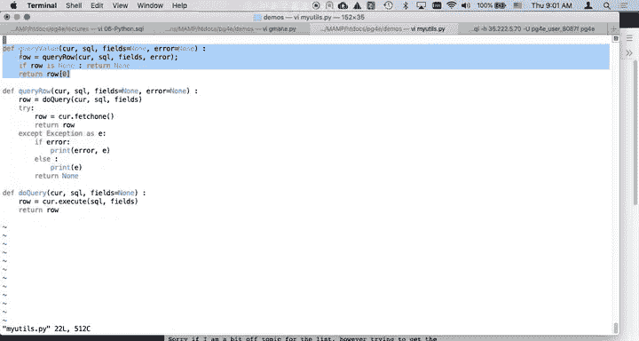

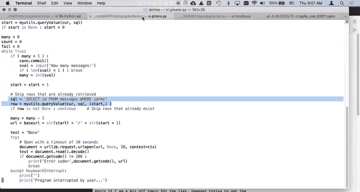

程序开头导入了自定义工具模块 `myutils`。这个模块封装了一些常用的数据库操作，例如执行查询并返回单个值，这简化了主程序中的代码。

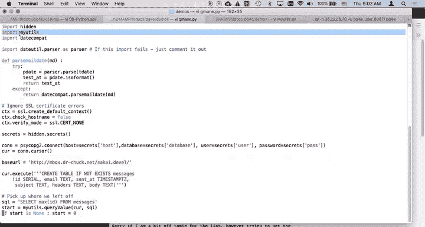

```python
# 示例：使用 myutils 查询单个值
count = myutils.query_value(conn, "SELECT COUNT(*) FROM messages")
```

### 主循环与错误处理

程序的主体是一个 `while` 循环，用于控制获取邮件的数量。代码包含了完善的错误处理机制：

1.  **网络请求超时**：使用 `urlopen` 时设置了30秒超时。
2.  **SSL证书异常**：通过创建自定义上下文 `ctx` 来忽略HTTPS证书错误，确保能从测试服务器稳定获取数据。
3.  **用户中断**：捕获 `KeyboardInterrupt` 异常（即 `Ctrl+C`），确保在退出前提交所有已完成的数据库操作。
4.  **通用异常**：捕获其他所有异常并打印错误信息，便于调试。

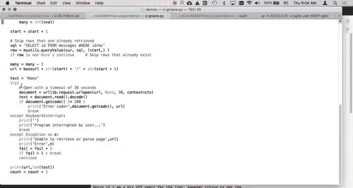

这些健壮性特性是代码在迭代开发中逐步完善的，初学者在编写自己的脚本时，也可以参考这种逐步增强错误处理的思路。

### 邮件数据解析

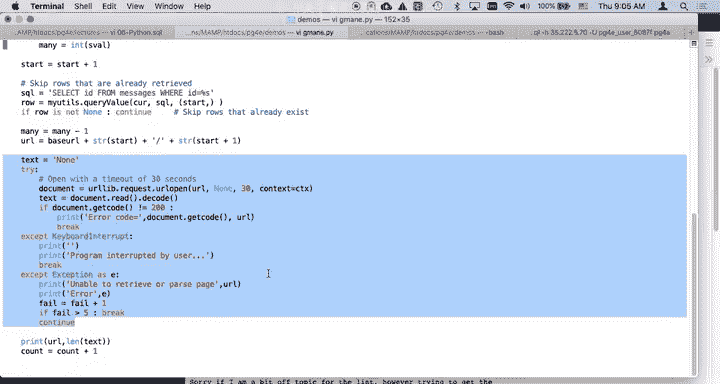

获取到邮件原始文本后，程序开始进行关键的解析工作。Mbox格式的邮件以 `From `（后面有一个空格）开头，作为分隔符。

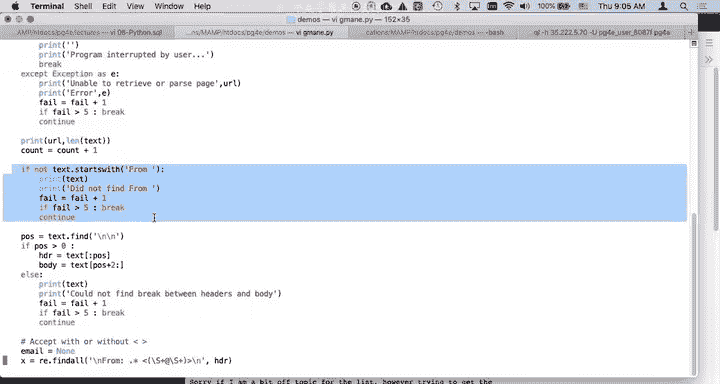

以下是解析步骤：

1.  **分割头部和正文**：查找第一个连续的两个换行符 `\n\n`。之前的部分是邮件头部（headers），之后的部分是邮件正文（body）。程序将分别存储它们。
2.  **提取发件人地址**：使用正则表达式从 `From:` 头部行中提取邮箱地址。地址可能被尖括号 `< >` 包围，代码会处理这两种情况。
3.  **解析日期**：这是最复杂的部分。程序查找 `Date:` 头部，并尝试使用Python内置的 `dateutil.parser` 库将其解析并转换为标准的ISO格式（如 `2023-10-27T10:30:00`），以便存入数据库的 `TIMESTAMP` 字段。相关逻辑封装在 `parsedate` 函数中。
4.  **提取主题**：从 `Subject:` 头部行提取邮件主题，并进行清理（如去除首尾空格、转换为小写）。

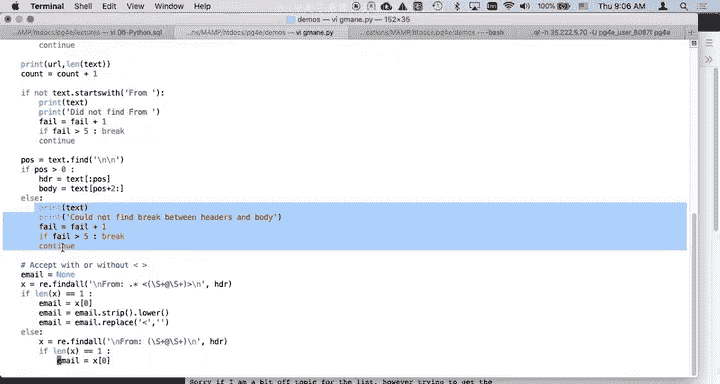

### 数据插入

解析出所有字段（ID、发件人、发送日期、主题、头部、正文）后，程序执行SQL插入语句：

```sql
INSERT INTO messages (id, sender, sent_at, subject, headers, body) VALUES (%s, %s, %s, %s, %s, %s)
```

程序使用参数化查询（`%s` 占位符）来防止SQL注入攻击，并安全地插入数据。

## 总结

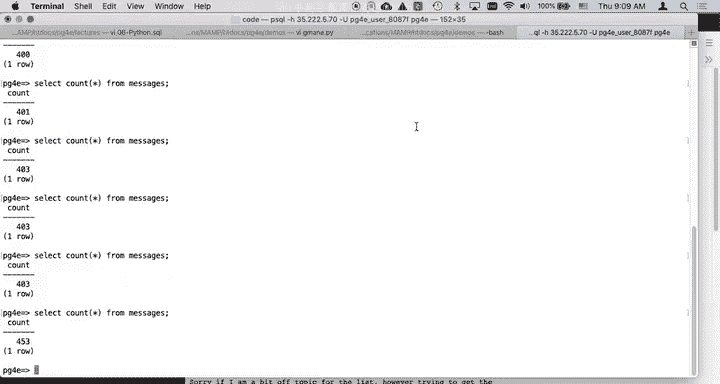

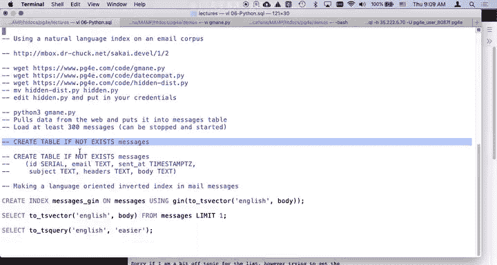

本节课我们一起学习了如何构建一个邮件归档系统的基础部分。我们分析了如何通过Python程序从远程服务器获取Mbox格式的邮件数据，进行必要的清洗和解析（特别是处理发件人地址和复杂日期格式），并将结构化后的数据分批次、可重启地插入到PostgreSQL数据库中。这个示例演示了在实际数据处理项目中，如何将外部数据源、业务逻辑（解析）和数据库持久化操作结合起来。在接下来的课程中，我们将基于这个邮件数据库，探索如何使用PostgreSQL的全文本搜索等高级功能。