# PostgreSQL for Everybody：21：邮件归档系统演示（第二部分）📧

## 概述
在本节课中，我们将继续演示如何处理电子邮件数据。我们将重点学习如何为全文搜索创建索引，理解词干提取过程，并比较不同类型的索引（如GIN和GiST）在性能和用途上的差异。

---

## 创建全文搜索索引
上一节我们运行程序并导入了463条邮件信息。本节中，我们将开始创建索引。创建索引有时需要一些时间，所以我们现在启动它。

我们使用以下SQL语句创建一个名为`message_gin`的GIN（通用倒排索引）索引：

```sql
CREATE INDEX message_gin ON messages USING gin(to_tsvector('english', body));
```

这个索引基于`body`字段，使用英语词典生成`tsvector`（全文搜索向量）。索引正在后台运行。

---

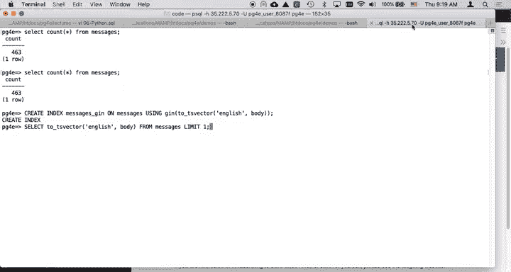

## 理解词干提取过程
为了理解索引是如何构建的，我们先来看看词干提取的效果。词干提取是将单词还原为其基本形式的过程。

以下是查看`tsvector`内容的查询：

```sql
SELECT to_tsvector('english', body) FROM messages LIMIT 1;
```

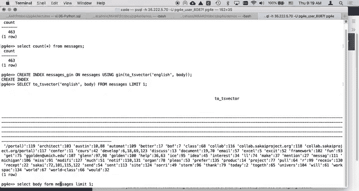

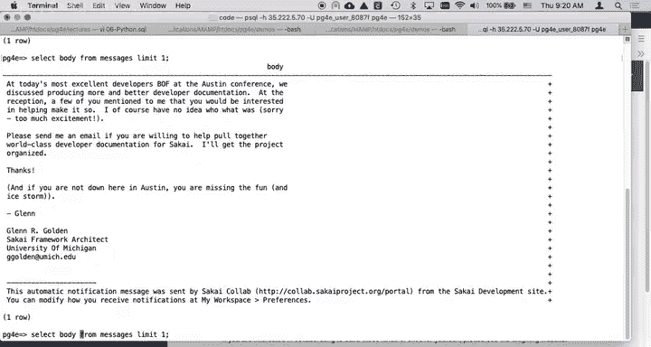

执行后，我们可以看到类似`notifications`变为`notif`，`organization`变为`organ`，`please`变为`pleas`，`product`变为`product`的结果。这表明索引是基于经过词干提取和简化后的单词集合构建的。

如果直接查看原始`body`内容，会发现其中包含大量标点符号和无关字符：

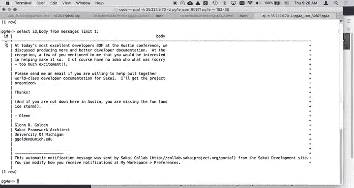

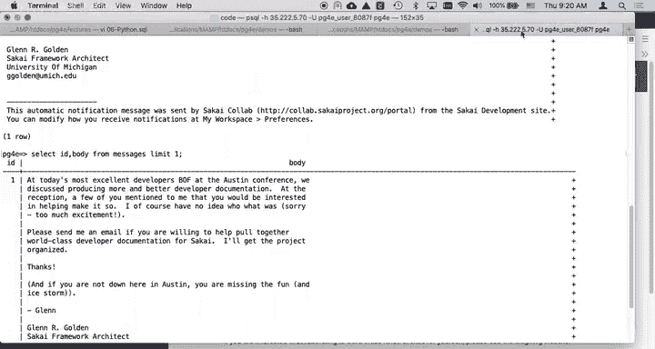

```sql
SELECT body FROM messages LIMIT 1;
```

而倒排索引（GIN）的原理是：对于`tsvector`中的每一个词干，都指向包含它的文档ID。例如，词干“golden”会指向包含它的消息ID。

---

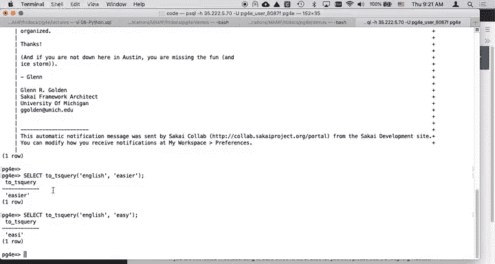

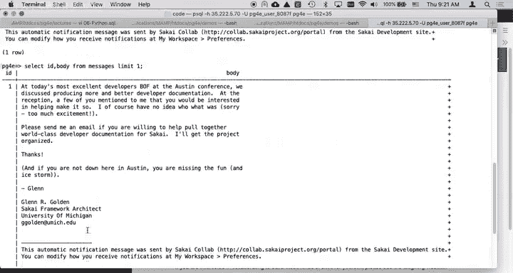

## 使用全文搜索查询
接下来，我们看看如何使用`tsquery`（全文搜索查询）进行搜索。`tsquery`会对查询词也进行词干提取，以确保与索引中的词干匹配。

例如，查询词“notifications”会被提取为“notif”：

```sql
SELECT to_tsquery('english', 'notifications');
```

我们可以使用`@@`操作符来检查一个`tsquery`是否匹配一个`tsvector`：

```sql
SELECT id, to_tsquery('english', 'neon') @@ to_tsvector('english', body) FROM messages LIMIT 10;
```

这个查询会检查“neon”是否出现在前10条消息的正文中，结果应该都是`false`。如果我们查询一个确定存在的词，比如“notifications”或“golden”，则会得到相应的`true`结果。

```sql
-- 查找包含“golden”的消息
SELECT id, to_tsquery('english', 'golden') @@ to_tsvector('english', body) FROM messages LIMIT 10;
```

---

## 增强数据：提取发件人信息
为了更方便地展示数据，我们将在`messages`表中添加一个`sender`列，并从`headers`字段中提取发件人姓名。

首先，添加新列：

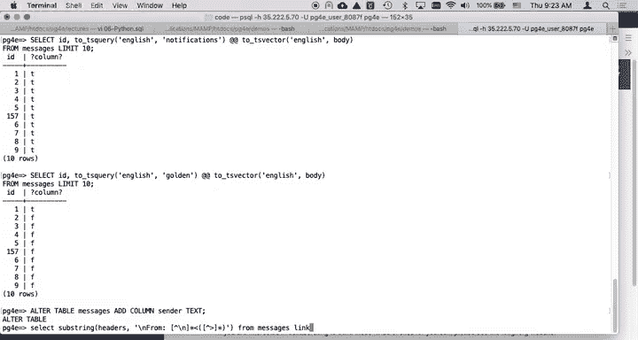

```sql
ALTER TABLE messages ADD COLUMN sender TEXT;
```

然后，使用`SUBSTRING`函数和正则表达式从`headers`中提取发件人信息，并更新新列：

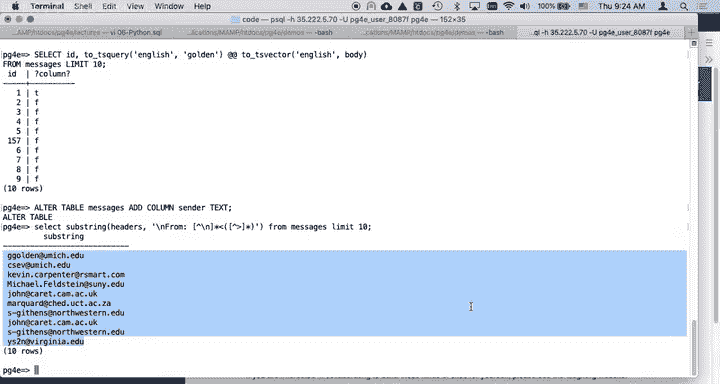

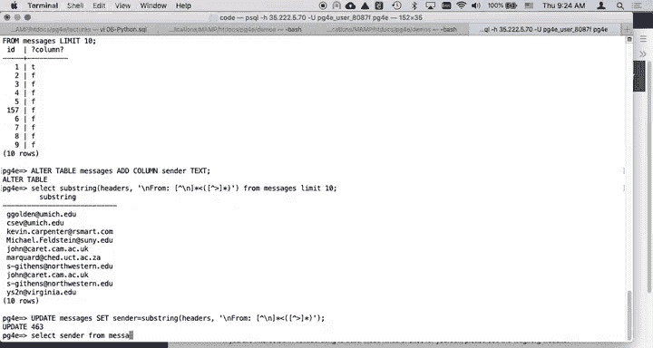

```sql
UPDATE messages SET sender = SUBSTRING(headers FROM 'From: ([^\n]+)');
```

现在，我们可以方便地查询邮件的主题和发件人：

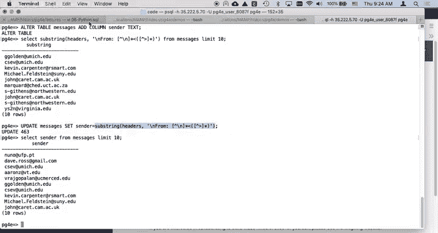

```sql
SELECT subject, sender FROM messages WHERE to_tsquery('english', 'Monday') @@ to_tsvector('english', body);
```

---

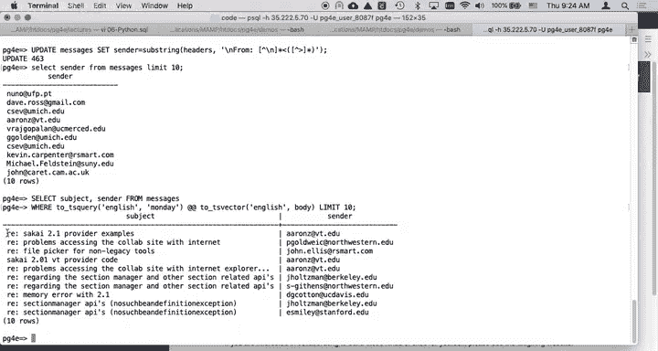

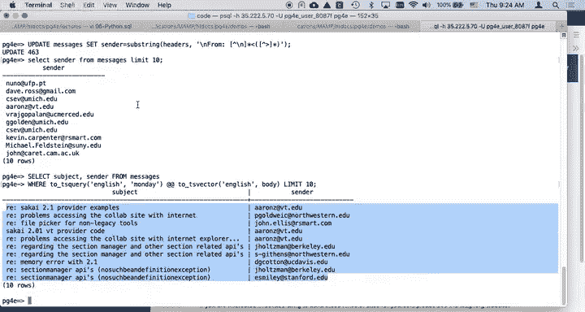

## 验证索引性能
我们可以使用`EXPLAIN ANALYZE`命令来查看查询是否使用了我们创建的索引。

对于英语全文搜索查询：

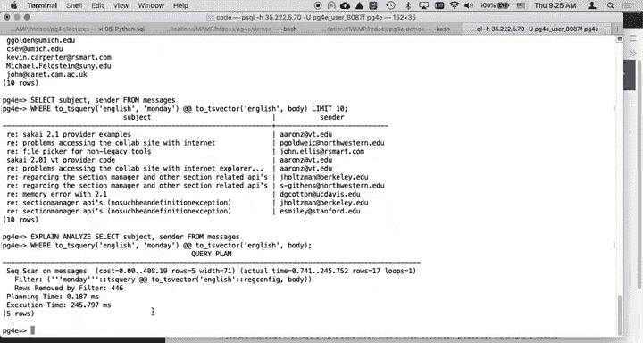

```sql
EXPLAIN ANALYZE SELECT * FROM messages WHERE to_tsquery('english', 'Monday') @@ to_tsvector('english', body);
```

如果索引创建成功，查询计划会显示使用了`message_gin`索引扫描，而不是顺序扫描，这大大提升了查询速度。

如果我们尝试用未创建索引的西班牙语词典进行查询：

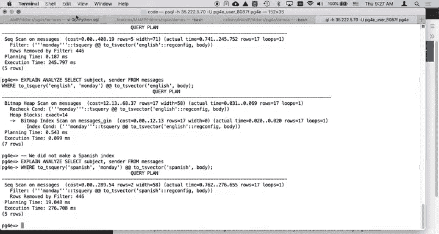

```sql
EXPLAIN ANALYZE SELECT * FROM messages WHERE to_tsquery('spanish', 'Monday') @@ to_tsvector('spanish', body);
```

查询仍然可以执行，但会进行顺序扫描，速度较慢。这说明索引的核心作用是提升查询性能，而不是实现功能。

---

## 比较GIN与GiST索引
最后，我们来比较一下GIN和GiST这两种全文搜索索引。它们功能相似，但在性能和维护成本上有所权衡。

首先，删除现有的GIN索引：

```sql
DROP INDEX message_gin;
```

然后，创建一个GiST索引：

```sql
CREATE INDEX message_gist ON messages USING gist(to_tsvector('english', body));
```

**GIN索引**通常更小，维护成本更低，因为它使用哈希结构，可能有一定程度的“有损”压缩。在查询时，它可能先获取稍多的行，但最终会返回精确匹配的结果。

**GiST索引**则是一种更通用的搜索树结构。两者最终都能正确完成查询，主要区别在于：
*   **索引大小**：GIN通常更小。
*   **插入/更新性能**：GIN的维护开销通常更低。
*   **查询性能**：根据数据和查询模式，两者各有优劣。

选择哪种索引，需要在插入性能、索引大小和查询速度之间做出权衡。

---

## 总结
本节课中我们一起学习了：
1.  如何为全文搜索创建GIN索引。
2.  理解了词干提取在构建索引和查询中的关键作用。
3.  学会了使用`@@`操作符进行全文搜索匹配。
4.  通过添加和填充`sender`列来增强数据可用性。
5.  使用`EXPLAIN ANALYZE`验证索引是否生效并提升性能。
6.  了解了GIN与GiST索引的基本原理和性能权衡。

在下一部分，我们将继续深入探讨邮件归档系统的更多功能。