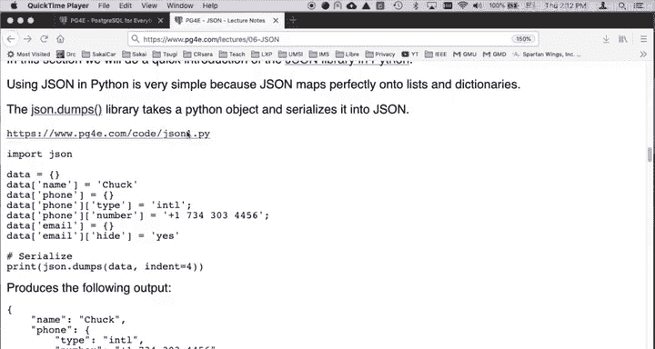
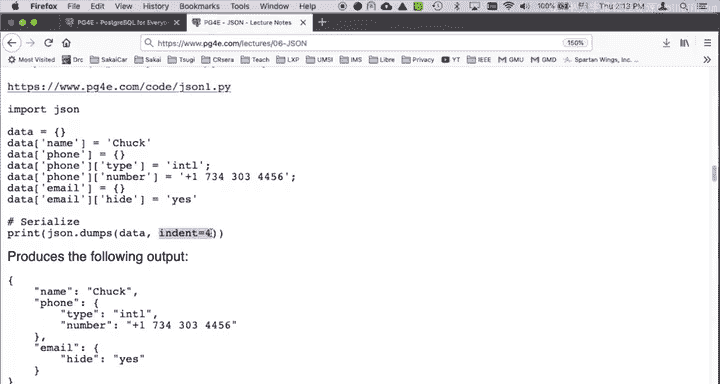
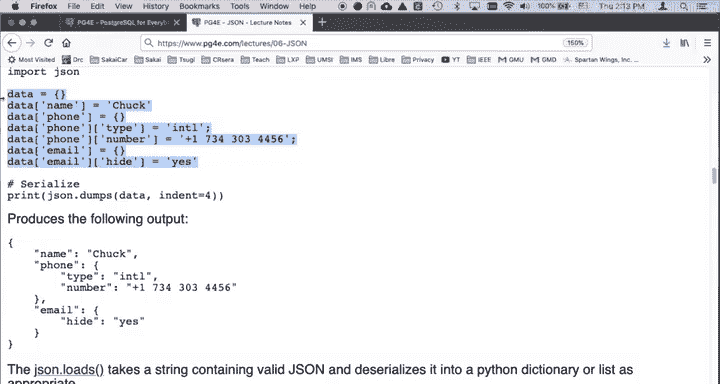
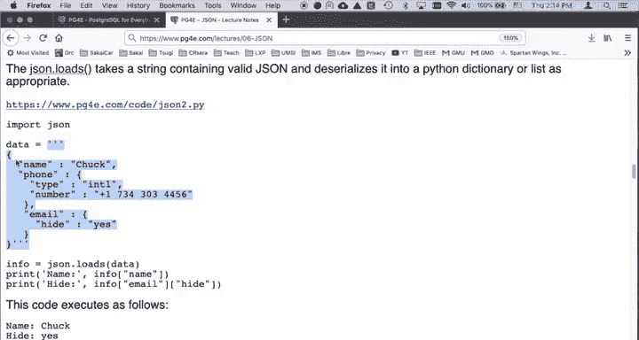
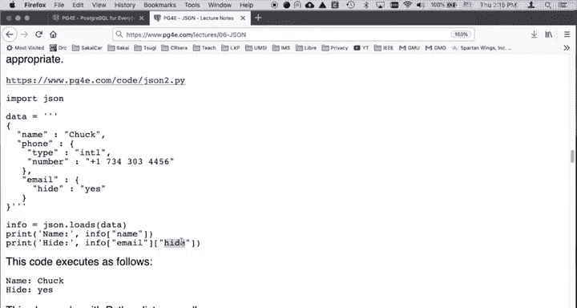
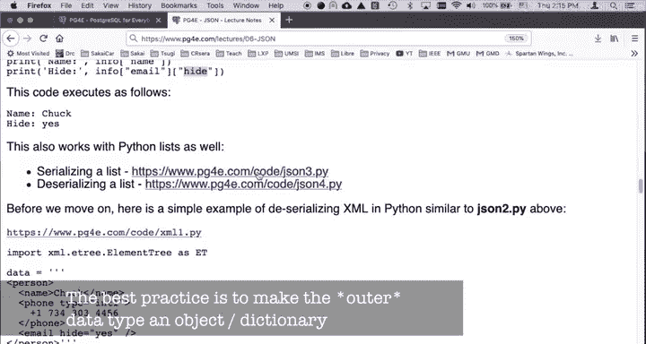
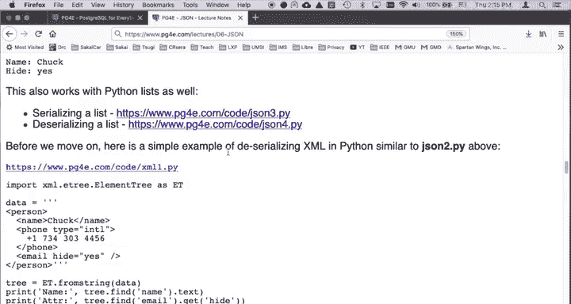
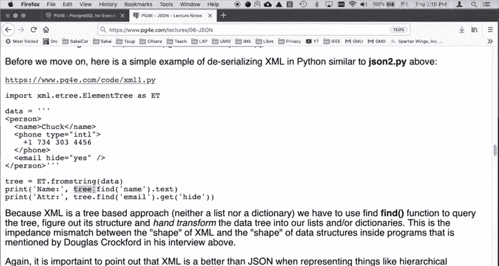
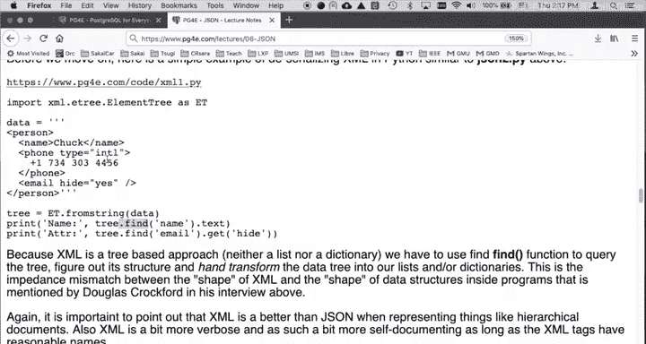

# 密歇根大学《给所有人的PostgreSQL课（数据库设计、SQL、JSON和NLP、ES）｜PostgreSQL for Everybody》中英字幕 - P92：28_Python与JSON集成应用.zh_en - GPT中英字幕课程资源 - BV1tj421U7GK

So now I want to talk a little bit about using JSON and Python we're really lucky in that sort of the JSON's been in Python for a long time and it has a really beautiful support for Python and Python has really beautiful support for JSON and。

The data models that are JSON are very similar to the data models in Python。

 other languages like say Java or PhHP， the mapping is fine。

 but it's not the Java one is probably the most difficult one because Java is a very highly structured highly typed Python is a less structured language because it uses lists and dictionaries over and over and over and that's pretty much what JSON does so we have a JSON library。

We've got a couple bits of sample code right here like www。 py for pgfr。com s codejsonN1。

pyy this little bit of code shows how you actually create an internal data structure and then serialize it。

 remember you got an internal data structure， you serialize it， you send it， you receive it。

 you decsseialalize it and you have a new internal I'll go internal data structure so I'll show you all those this JsonN1。

 py， we import the JsonN library。

And then we start making a dictionary variable named data， and we say data subname equals Chuck。

And then we say data subphone equals a new dictionary because we're going to put a dictionary inside of a dictionary and then we're going to say data subphone subtype equals intL data subphone sub numberumb equals a phone number then data subemail equals a dictionary and then data sube subhide so that's like a dictionary within a dictionary and a key within a key of a dictionary and then we're going to serialize it So dump S sends for dump this out as a string and the first parameter is in either a list or a dictionary best practice top levels to be a dictionary Indent equals4 as a pretty printing that says you know don't just run it out all one line because the computers wouldn't care if we're going to show it to humans put it out with an indentation and show with the matching you know do an indentation and make it look pretty so this produces the following output right we have an outer dictionary。

And then under the name， the key that's name， we got Chuck， under the key that's phone。

 we have another dictionary and that dictionary itself has type and number。

 and then email has a single value of height equals j。So that's as simple。

 you simply construct whatever data shape you want。

Inside Python of lists and dictionaries with whatever nesting you want and then you just say convert that to JSON and send it out so that's pretty beautiful so you send out the serialized data and then you receive it and then decsialize it and JSsonN library has a similarly simple low S and so this is from pPg4 e。

com/ code/ JsonN 2。pyy so we're going to import JSsonN now in this case instead of reading it from a network or opening a file or whatever I'm just going make a big long。

Triple quoted string of that exact same JSO as if we somehow received it。

 in this case I'm having Python beyond the both the sending and the receiving end of this。

But then data is a string。

And then I called JsonN。 load S。Pass the string data in now this could blow up if there's a syntax error because Jason has a syntax you can like if you have a single quote that's supposed to be a double quote that should have be you use a single quote instead of a double quote you can make so many mistakes in it and so this could blow up and so you might have to try put that in a try block。

 print out error message or whatever but when it's all said and done info this variable comes back and given that this outer thing is a curly brace。

 we get a Python dictionary and then we have dictionary subname we have dictionary subinfo sube subhiite。

So we can just look these things up and so it's really quite natural and quite nice。

 you just see this serialized nested structure， you desalize it。

 and then it's just an internal structure that's really easy for you to use。

You can also serialize lists the best practices to make objects， but there's JSON 3。pyy and JSON 4。

pyy that but and you can look at those， they look almost exactly the same as those other ones。

 we put a for loop in of course because it's a list。

Now， if we take a look at doing this in XmL with wwwpg4ee。com/code/xm1。pyy。

You would read some serialized XML data and there is a built-in library in Python to parse XM and so I say take a tree from the string and the key thing that's kind of weird about the XML is it can be nested infinitely deep right and again it's self-decrib which is quite nice。

 we know what a person is we know that you know things like that and so you call tree dot find and if you look at if you watch the Douglas Crockford interview he talks about how you end up with a tree that you then send queries to well that's what we're doing here。

 we're actually like querying the tree， the tree is not a natural internal Python data structure like a list or a dictionary。

 it's a object that we have to send queries to and those queries kind of work their way through et ce and the key is when you do JSON。

When you do JSON you get back a native Python dictionary or list and so that's again this is kind of why XML is not preferred when you're just sending lists and dictionaries back and forth between various languages now that does not to say that XML doesn't have its place I mean Microsoft Word has documents that are docX and that's an XML format and you have like chapters and sections and headers and this and paragraphs and subpargraphs and figures and that's all very structured data very hierarchical and so XML is a great format for that。

An XM and HTML is very similar and HTML is also a very hierarch Google document because it's trying to represent and markup text to produce a pretty looking document。

 so I don't want to beat up too much on XML I mean JSON is superior for those things where we're exchanging lists and dictionaries with different programming languages or across the network。

XML has its place as well， so next we'll do some demonstrations with some code that uses JSON。

