# 密歇根大学《给所有人的PostgreSQL课（数据库设计、SQL、JSON和NLP、ES）｜PostgreSQL for Everybody》中英字幕 - P94：30_音乐曲目JSON格式演示.zh_en - GPT中英字幕课程资源 - BV1tj421U7GK

Hello and welcome to another Postgress walkthrough in this situation we're going to start talking just about JSON B and Postgress。

 everything we've been doing is leading up to this and so we're going to take a look at my original from many years ago export of my my library in iTunes and I've converted it into JSON and so it's got curly braces and double quotes and colons and I've got one record per line in here that that's the format to do really simple imports for really simple JSON。

I'm going to go in and I'm going to drop this table if this is not going to exist。

 but it's not there。 So we're fine。 I'm going to drop the Jtrack table。

 Then I'm going to create the Jtrack table with a Id column and on a Json B body。 There we go。

 We're just like that body is Json B and B stands for better。

 but I like to think of it as binary because it's compressed and it's efficient and the indexes are like really intricate。

 It knows a lot。 It's a。

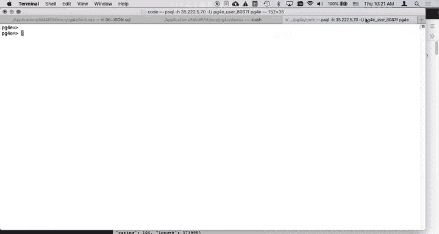

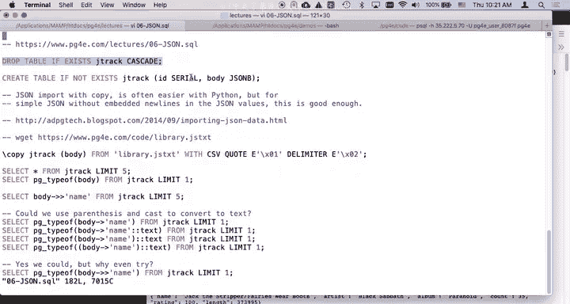

It's not just a big text field the old JSON was， but JSsonN V is not just a text field So the next thing we're going to do is we're going to copy down on a terminal in a terminal。

 this JS text file and that was not found but here we go。

 so if I take a look at this library do JS text file you see that it's got this JSON in it one per line。

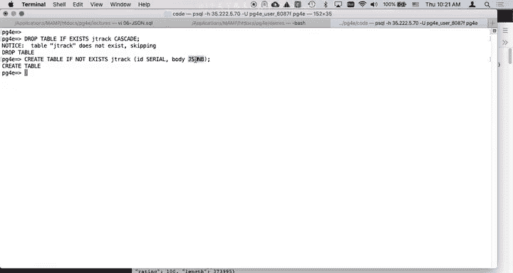

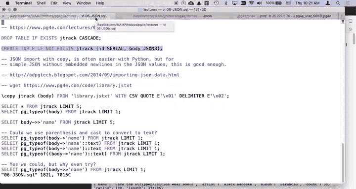

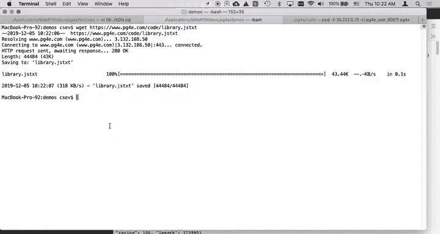

Now what we're going to do is we're going to pull this in with a slash copy command Now the copy command is only to this PGSQL。

 and so we're going to copy into the Jtrack table into the body。

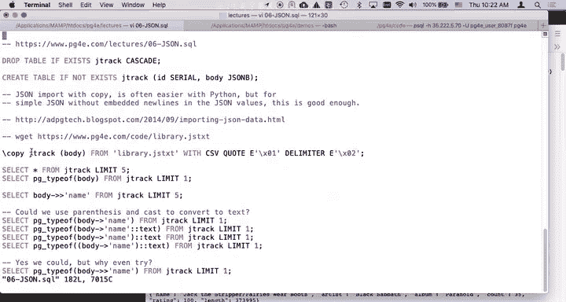

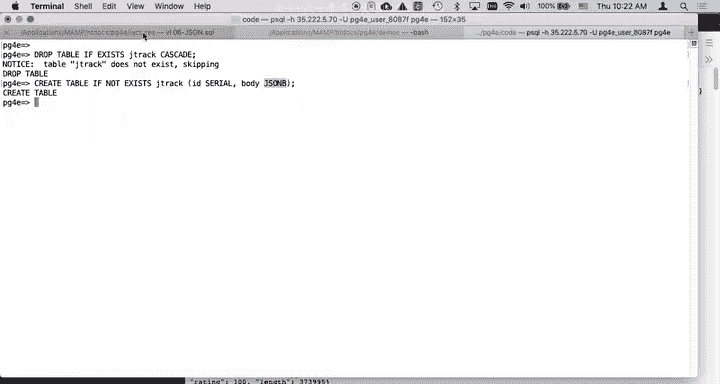

Into the body column from the file library。js text。As a CS SV now， it's not CS SV。

 where the quotes are a non printing， an irrelevant non printing character。

 and the delimiter is an irrelevant non printing character。 So E， X， O1 is actually a。

Is ASI number one and EX O2 is AS number two and neither of those characters are in because really the trick is we're only going to pull one column in and we want the whole line。

And we do not。 We want CSV processing， but them are breaking CS SV processing by telling it the quote is a thing that doesn't exist and the delimiter is a thing that doesn't exist。

 So dear C SV treat each line。

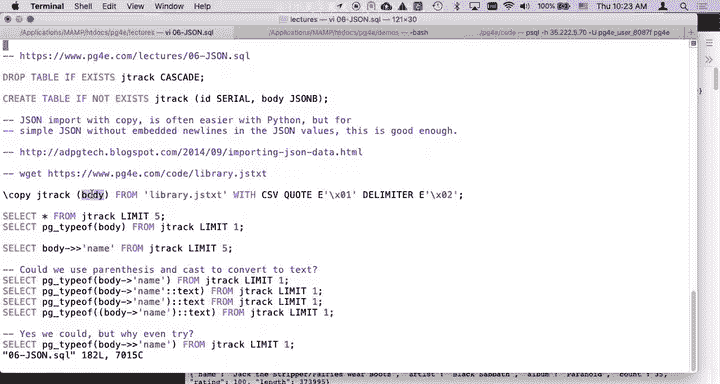

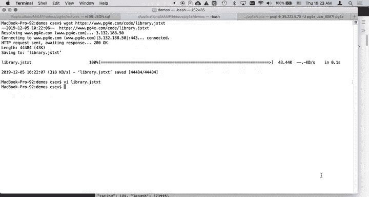

Treat each line as just a thing。 Don't parse it at all。

 And because we're only inserting one thing anyways。 I wish there was a way to just tell。

It's like it's lines， insert lines。 We've done this before in previous things。

 It's kind of like if Postgres would just let us say， insert this thing as lines。

 because often that's it。 And so we just inserted that so we can say， select count star from。

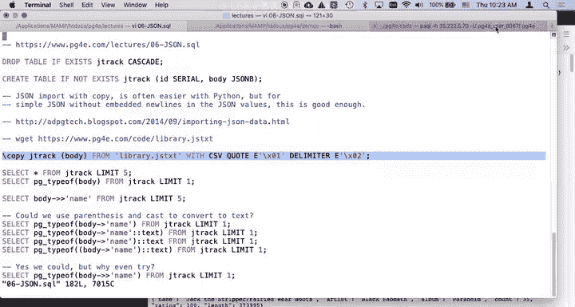

Jtrack。318 records， there was 318 lines in there， so there we go。

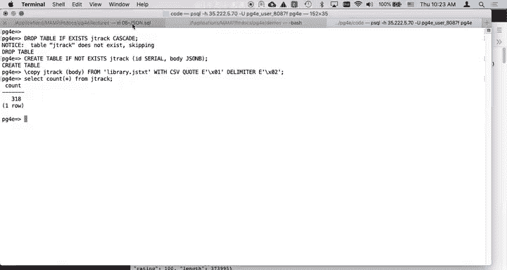

Okay， so let's take a look at what we've got。

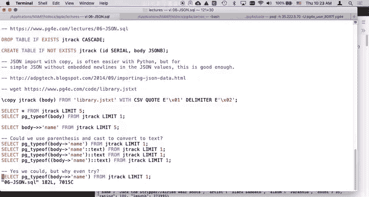

Let look at some selections。So we can see， we can pull this out when it shows us this stuff that just reconstitutes it。

 So this in a sense， is not that string that we put in。 it's been parsed。

 it's been stored and now it's reconstituted and we can kind of tell that it's a little bit different because we can say what kind of thing is this using the PG type of function。

 It is forgot the semie。 It's a JsonN B， right It's not really a text string。 and that's a string。

 It just happens to be showing it to us as a text representation of that data structure。

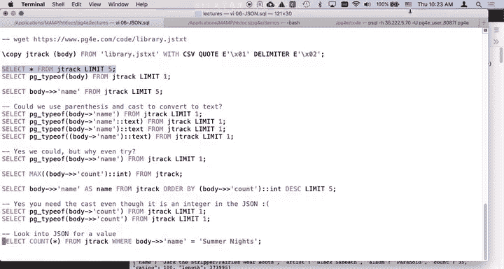

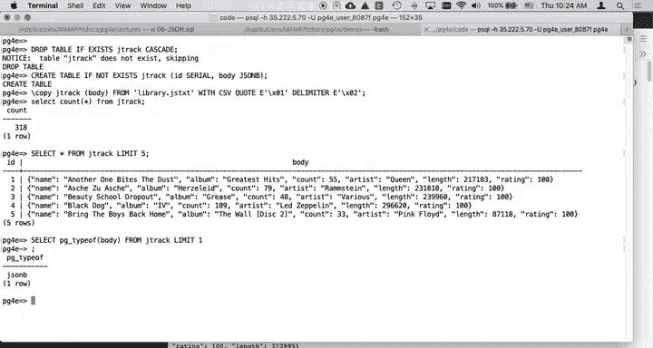

We can pull one thing out with this body dash arrow arrow greater than greater than the key thing to remember is the thing that comes after with all've got to have quotes because the keys are quotes in JSON and so we're going to pull that out now you can pull out one of we'll see a set you can pull out one or both this is the one you tend to want to use over and over and over again with two arrows because that says and convert it to a text field。

So that's the kind of select statement boom now we got that but we can see if you only have one arrow we can use type of body less than greater I mean dash greater than name and we'll see what comes back is an actually a JsonN B and so JON B are both documents and fragments of documents and so this body name is really a tiny little document。

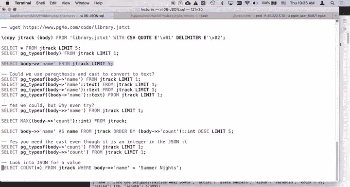

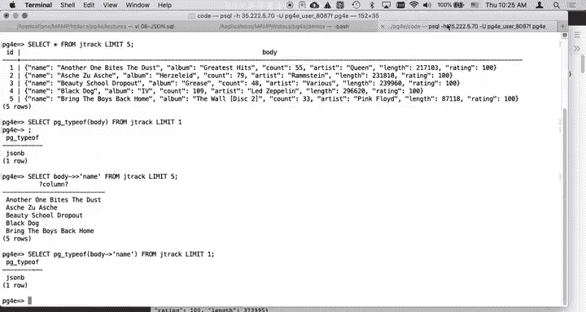

And then if we want to， we can convert this to text， but the problem is if we do it this way。

 you'll see it's not going to work。

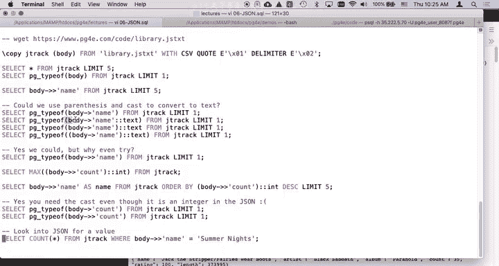

If we say body name colon colon text， we get a Json B。

 and that's because the association for the parentheses for the colon colon it's a higher precedence operator and so it happens before less the arrow operator happens。

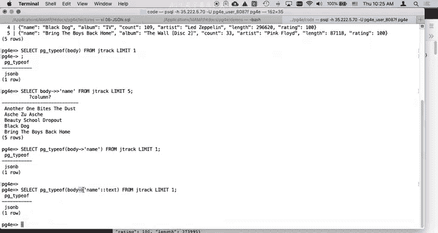

And so youve got to put parentheses around it。Um。Yeah， you got to put parentheses around it。

 I don' know。 This is this， oh， this one doesn't work either because we're going to do the type of。

 So if we do this parenthesesis， it's going to do this and then convert the result of this function。

 So that means that the function is going to be converted to text。

 So that's going to break just as bad。 It's still the word Json B。

 So it just means that you do sometimes have to add extra parentheses so that it actually pulls out the name and then converts the and that is a Json B object。

 and then we do a cast into text。 And that's really what you want。

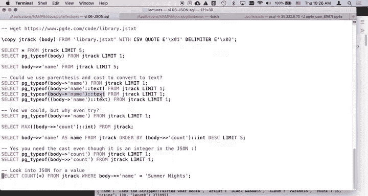

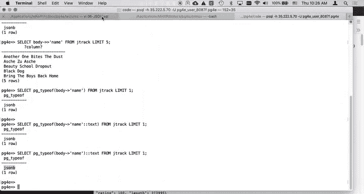

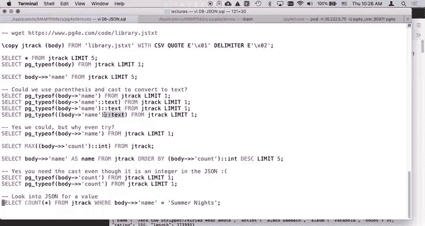

So we get the text， but why are we even doing that， Because if you just do double arrows。

 it says get it。

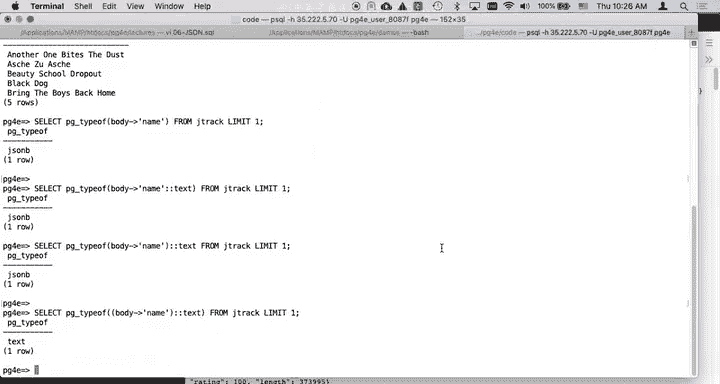

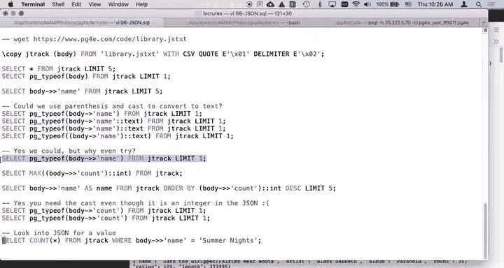

And turn it into text right and so that's really nice it just。

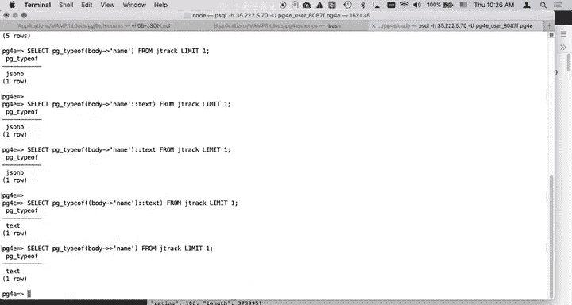

I like explaining in gory detail some of these syntaxes because we just throw them out there and we don't know why and so。

 So this is another example。 Select max of body count。 This is body double arrow count is a string。

 but then we're going convert it to integer。 now you got to be careful because the max will work without converting it into an integer。

 but it'll be a string max， which is like sorting， which means 99 is greater than 1000 because 9 is greater than1。

 So you got to convert when you're do a numeric things。

 you got to be careful to cast them to integers， say there we go。 So that actually gets the integer。

 If you take out the cast of the end。

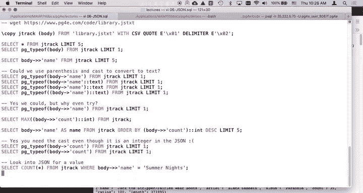

You will see that you'll get。93， which is nowhere near the numeric maximum， but it is that letter 9。

 that's like a letter might as well be Z for all we care。

 And so this means that body arrow arrow count is a string。

 so that's the max string from a collating perspective。

 from a sorting perspective from an order by perspective。

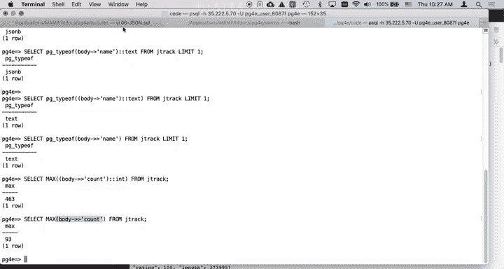

So。If we're going to order buy something， we're going to this body count cast as an integer。

 we'll do a select body name as name from Jtrack order by body count cast as an integer。

 and then we're going to descend at limit five so we can see my most five popular pieces of music that I played and that's because this is some really mellow music that I play my car all the time so it gets a really high play count。

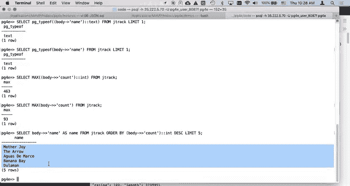

🤧嗯。And so even though count is an integer in JSON， you still need to pull it back that way because it comes back。

 this first one comes back， body arrow count comes back as a JSON object。

 and then body arrow arrow count comes back as a text。

So you still got to cast it because the double arrow makes it a text。

 you see that the single arrow makes a JsonN B fragment， and then the double arrow makes it a text。

 and then you have to say colon and colon int one more time。

And you got to get your parentheses right， so it just is a little bit tricky Okay。

 so let's take a look at a where clause。So we're going to count oots。

We're going to count the number of tracks that have a name of summer nights。

And because it's a body body arrow arrow name， equal summer nights。

 that says convert it to a text string for me， which again。

 most of the time you just use arrow arrow and we see that I have one track。We can we can also say。

We， this is a Json B operator。 So that that equal operator is a string operator。

 But the Json B operator at at greater than says， does this body contain this Json fragment， Now。

 it's going convert this。 There's an implied。 It's smart enough to， There's an implied colon。

 colon Json B on the end of this。 Let me actually go just put that in there。

It's kind of this is implied。Because that is a text string here。All， so that's implied。

Let's even put a parentheses in to make it super explicit for us。

So that but it doesn't need that because it knows that if it sees a string is one of the parameters of the at sign greater than to convert it to Json V。

 So this second version here with a parentheses and colon and colon and Json B is really just。

It's being explicit of something that's done implicitly right so these two things and we'll see when we start doing indexes that these two things give us the same thing。

 but this one is a string comparison and one is a Json comparison with the contains。

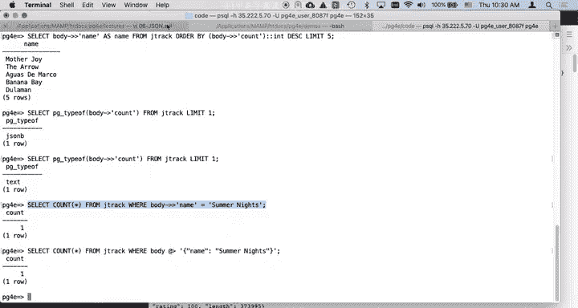

So then what we're going to do is we're going to show how to use this concatenation operator we've used this concatenation operator。

Incatenate strings， but now we're going to do is use it tocatenate JSON B。And so。

The body is a Json B， and we're going to add。Favorite equals yes。 now this is a string。

It's just a string And inside the string is JsonN。 and it's got to be syntactically correct。

 JO favorite and it's implied。 there's an implied conversion to JsonN B because it's being concatenated in。

 And again， the concatenation operator says， oh， if it's a string。

 I'll convert it to Json B if the left hand side is JsonN B。

And so that's going to work and so we're going to look up the body。

 we're going to look the count variable， convert it to an integer， if there's more than 200。

 we're going to go ahead and get that so。So this is basically going to update the body right。

 this is going to update the body， let's do this。First。And take a look at the。

Some of these things so here we are， so what we're doing is we're going to read and find the count and then we're going to add at the end a new the so that's what this update is going to do。

 So we where we take J on B it actually pulls it out of the database So of reconstitutes it adds this little thing to it and then stores it back and that's what an update does right it pulls something out of the database like update X equals x plus1 we've done that many times before。

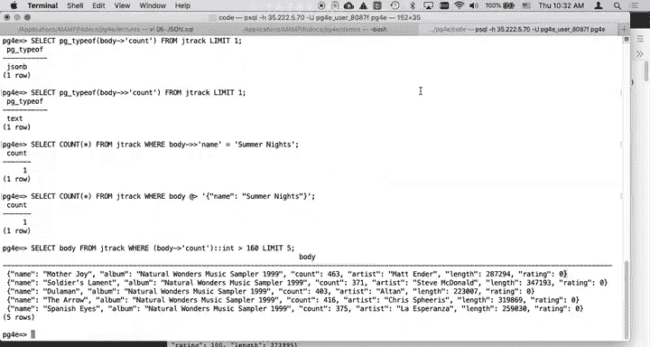

So it found 33 rows that the body count is greater than 200 and it added favor yes now if we run this。

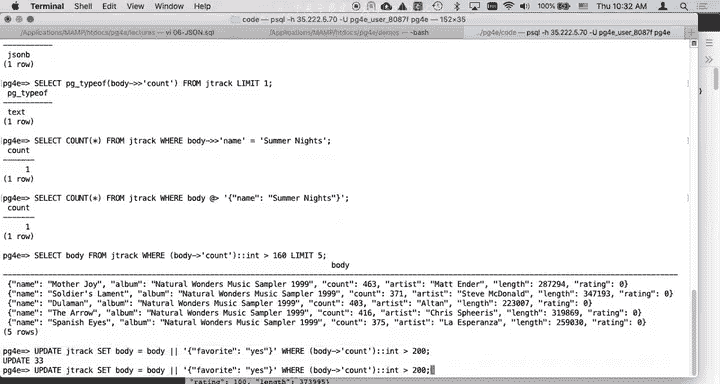

Greater than 160。We should see that some of these now have favorite yes。 Now， again。

 it's not a string。 It's it's it's Json B。 but and but not all of them， right。

 So this first one here， Winter Wonderland has a count of less than。200 and so it never got favorite。

So now what we have is we have some that had favorite。

 and we could also a Python program to tweak this JSON， the fact that we're just this is very simple。

 but I'm showing you how this concatenation operator works， right？

And so we see some with and without the favorite。 But then it gives us a wonderful time to play with this question mark operator。

 So select count from Jt where body question mark favorite。 That's just saying， show me。😊。

Select the things where the。Body has the tag favorite。 I mean， a key a favorite。 So that's。

 that's not saying a key value pair。 That's just a key。

So how many do I have that there's 33 that have favorites equals anything I'm not asking what it's equal to。

 I'm just saying is favorite in that JSson。And there's 33 of them。Okay。So。

Let's throw a large amount of cruud into our J track just to make sure the indexes work。

 so I'm going to put 4000 lines of unrelated JON B junk。We're going to select this parenthees is a。

A big this is a string concatenation， we're going to concatenate you know， some type。

Colon neon series 24 hours lemons number， colon。 that's a string。 That's just a string。

 This is a string concatenation， the vertical part here， and then generate series。

 if you recall from our previous lectures， creates a vertical replication of rows generating the number 100010011000 all the way up to 5000。

 then I'm concatenating with a closed curly rates。 And so that's going to。

 if you were to just look at this thing right here。Right that would just be look like JSsonN。

 It would be valid JsonN， I carefully constructed to be valid JsonN and then I take that concatenated string and then I cast it as JsonN B so that I match the type of body and so let's go ahead and insert all those insert 4000 more rows Sometimes you have to insert a bunch extra rows or your indexes just you'll do it explain analyze and you should use the index and it's like well there's like 12 rows。

 I might not use the index and I cannot for the life of me figure out how to convince。

Postgre either tell me I would have used the index if there were more rows or a little thing that says。

Pretend there's a lot of roses in because I'm really trying to debug my index so。

 but you see when you look online at blog posts and stuff。

You see that they just put a lot of rows in there and so you know you just got to figure out how to generate series and put some more rows in so we're going to make some indexes these indexes aren't there because I just built it。

 but we'll drop them anyways。嗯。So。Let's go ahead and create three indexes。 I'll create them。

 I'll fire them off， create them all。And then， we will see。Sometimes you got to wait。

 so I' we'll let Postgres in this tab grind away and make sure those indexes are ready so our explains start working。

I'm going to use three indexes。 One is a bee tree index。 And in that。

 my expression is to pull out and convert to a string。 The name key。 right， So pull out the name。

 not， not the fact that the name exists， but the fact that， you know。

 name equals the name of the track。 So like summer nights。

 So this be tree is going to hit that wear clause where body name equals summer nights。

 So that's a bee tree index。 And so this is more of a traditional old style index。

 but you gotta be trees want index。In a sense， a field。

 one string is what they want or a combination of strings， you can put more than one in there。

And so the key is is that this bee tree will hit body name equals summer nights。

 but in a query like body artist equals queen， that will not hit it because we did not。We did not。

We did not make an index on body artists。 We could make another index on body artists if we want。

 and then this would work。 Now， the key is the operators of the wear clauses are critical。

 And so the question mark and the at sign are the gin deal with the gin indexes。

 The equal sign is a string comparison it's really not in this respect， it's not at all。

A JsonN B operator。's the data stored in Json B， but wear clauses reading the Json B。

 pulling out the artist or name and then doing the string comparison。

 And so that's why it hits the B tree。 There's just no way that these last four would hit the Be tree。

 and there's no way that the first four would hit the gin because equal is not a gin operator。Okay。

 so that's the be treat so you can and this is。I should stop here and talk about like how gorgeously beautiful this is。

 You can dive， you can have a JsonN bee and you can dive in and you can make a beautiful Beare index。

 which makes you can put a logical key deep inside of JSON if that's what you want any it for all intents and purposes is going to be super fast as fast as even if you pulled that name out and made another column as you've seen we do in a couple other places。

 so that's like awesome so that easy and awesome you got to know how to construct your rare clauses to make use of that particular thing。

 but that's like any other query。Okay， so let's take a look at the gin one。

 So up create index Jtrack gin on Jt using g body。 Now we're going to do a gin of the whole body。

 Now， the default is。That what this is going to click is this is going to figure out whether or not this is going to remember the keys。

 not the key value pairs。Okay and so it'll click this body question mark favorite。

 which is like is that key there but then to get the things like name summer nights or artist queen or name Folom Pri blues and artist equals Johnny Ca which is what we're doing in these last three we're going to make another index that's asking for the path ops and so the difference between a gin on the body and a gin with Json V path objects on the path ops on the body is that it looks at key value pairs and is super fast now of course the Json V path ops is bigger and slower and harder to maintain and but it does hit on more of the wear clauses So these last the gin and the gin gin path ops。

Hit hit these the question mark operator and does the body body Json contain this little bit of Json。

 right， So let's just take a look at hopefully which of these things hit and which of these things don't。

 Now， you might think it'd be nice if because we've got。

We've got a gin with the JsonN path ops that it would figure out， oh。

 name equal summer Nights and in effect， convert that to this body at greater than name colon summer Nights。

 but it doesn't， but it could some future some future version of Postgress might decide to make the equal sign operator smarter when it's dealing with JsonN B。

 but who knows we don't we can't expect that。 So let's take a look at these one at a time。

See if our indexes are done。No， oh yeah， yeah， okay。I've freaked out because I saw a sequential scan。

 that's what you're supposed to do whenever you do and explain analyze。

But this is body artist I did not make， I made it on body name。

 and so that's supposed to be sequential。

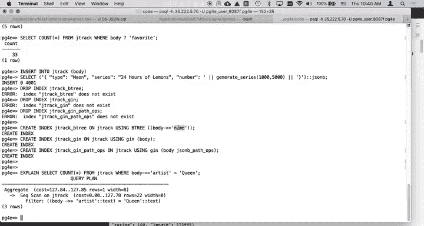

Now if we named summer nights。This is going to use the Bea tree index。 and there you go。

 it hit the Bea tree index because that is the thing that I made the Bea tree index on is body arrow arrow name。

 and so it hit just fine。 And again， I think of this as just as efficient as if I had made a column。

 right。

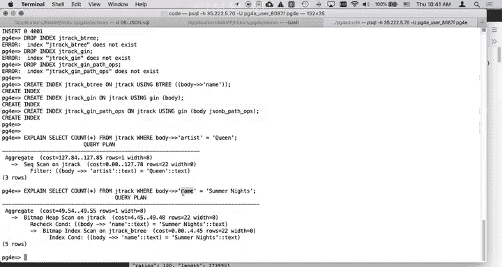

So if we ask look for the ones where the word favorite where there's a favorite key。

 not any particular key value pair， that's going to hit successfully hit the Jtrack gin because the gin says what keys are what and so that I don't know that I tend to feel like if I was doing this I can't figure out how often I'm going to want this unless I have some really diverse。

嗯。Documents that have widely differing syntax and I've got some kind of a thing where I just have an indicator that says you know blah。

 blah， blah equals blah， blah， blah， you know and I'm just like it's a marker which I kind of what this favorite yes is it's kind of like a marker so just the presence of it again the gin is faster。

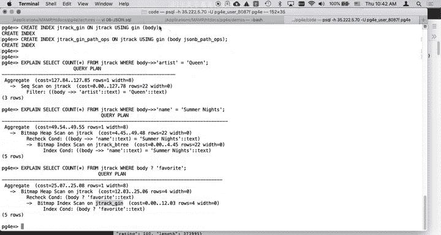

Then faster and smaller than the gin with with path ops。 Now we're going to have some fun。

 So now we're going to say go find me the name summer nights and we're going to be now we're going to be using the g path ops。

Right so we're doing name so does this body contain this little Json B fragment name summer nights and the answer is we'll find it and this is going to find it and that means that there's an index that's smart enough to look at nothing but this and pick the rows and then only retrieve those rows Now because we did it。

 it doesn't really care which of the keys we're looking at， we can say。

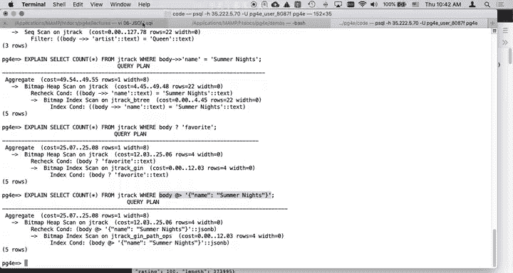

Artist queen because it's got that one， too， right？ So it did all of them。 Unlike the beere。

 where we picked which one it did， the gin path ops just pick them all， just all the combinations。

 And then we can say and read this one carefully。 Select count star from Jtrack where body contains name Folssome Prison Blue's artist Johnny Cash。

 This is like an and because we're saying， is this entire subset of Json name Folssome Prison Blue's artist Johnny Cash。

 I that contained within the body Json。😊，Got it， so that's like an and operation。あと。Okay。

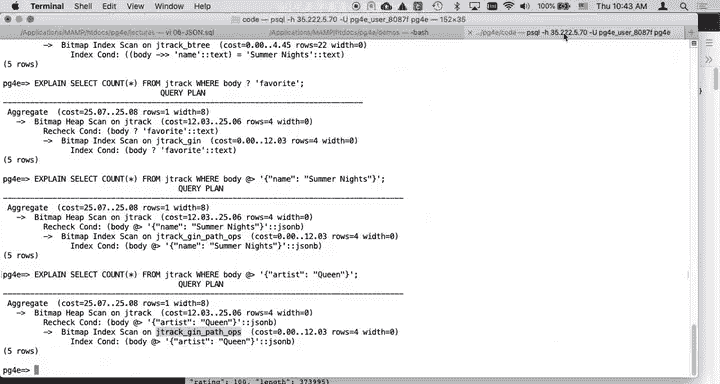

And that one hits the JSON path ops and it works just fine。

 So that's that is sort of really beautiful， really impressive。

 like most things in JSO and Postgress once you get down to doing the work the you know。

 you know what to do it it works out pretty cool and so this。This last little bit。啊。

We're going to do an update I just this is just kind of an advanced thing So so let's say we're going to take we want to add one to account right so we want to take this count somewhere here count 55 and we want to add one to that It is an integer and it knows it's an integer but we got to get stuff a little tricky and this kind of gets you to the point where you you have to construct this stuff and it takes a while to figure out that's why when I figure this out I write it down so。

So let's start by saying select body count Jtrack。Plus one because that we would like to be able to do that because it's an integer。

 right， And Hey give me this thing as an integer。 That would thatd be my instinct。

 I'd like to be able to use that syntax。 And the answer is， sorry。

 you have given me a Json B and an integer。 and I'm not going to allow you to add those things together。

 So that's where you gotta cast it。 So cast the body count， cast Col and call int。

 Now we can actually calculate。The updated。So now it was 55 and now it's 56。

 let's just select it so you can see what it is。

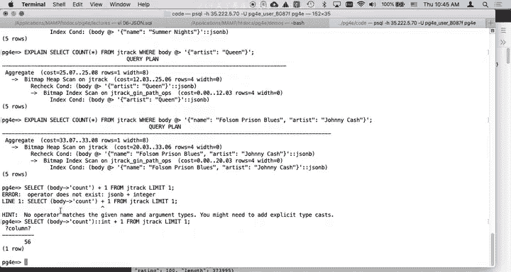

Without the plus one， so it was 55。 And so now if we add one to it。

 cast it to an integer and add one to it， we're going to get 56。

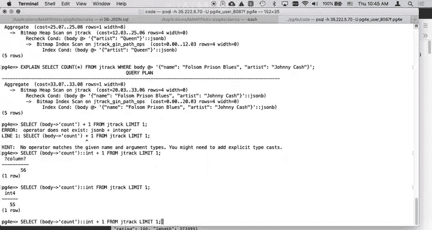

So。So we can you know do a select here。And add one to it for the summer nights and we're going to add one so we can also take take the plus one away and we see what the old one was。

So we can put a wear clauses on here and that's really just putting a wear clause of 35 going up to 36。

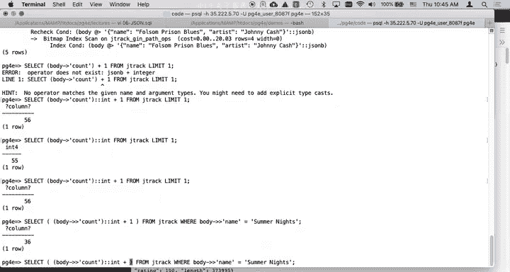

Now， this is the mess。This part here is the mess。 Update Jt set body equals。JON B set。

 so what this is doing is it's actually， I would love for this to be some kind of concatenation or something little prettier。

 but they put this into a function。And so what it does is it takes the old JsonN B。

 and it takes a path， which means go find the count thing that's a really weird syntax。

 but it's the right syntax and then。Take the body count。Convert it to an integer。Add one to it。

Then convert it to text。And then convert it to Jsonbi。I don't like this syntax。

 I think there's a more elegant way to do it and perhaps in a future version of Postgres。

 they will make this more elegant。 And then I can throw wear clauses on this。

 So update Jtrack set body equals So this is retrieving the entire body tweaking it with this function and then storing it Now the see that the hard part is really retrieving and then storing this new data。

 So it's not all that bad it's just I don't like the syntax of it。 It's a little bit hard。

 I have it here in case you want to do it in the future for me I would be like， no。

 I think I'll just make count， I'll just pull count into its own column and then mess with it there okay。

So now that we're all done with this， I'm just going to clean things up I like to。

Drop my tables and so I'll drop table JTrack cascade because I'm using a Postgress server that has a limited amount of memory。

 so I hope that this sort of walkthrough of the general use of JSON B has been useful to you how the operators work。

 how the casting works， etc。

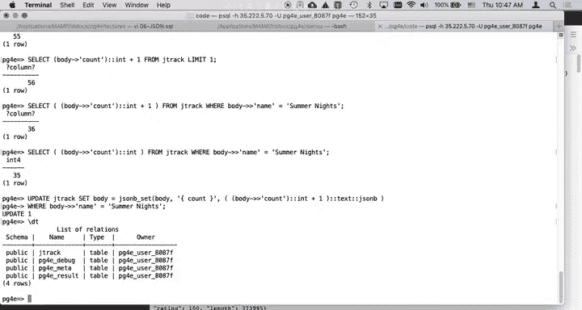

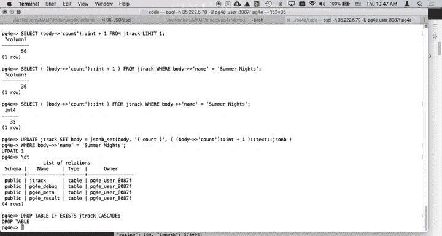