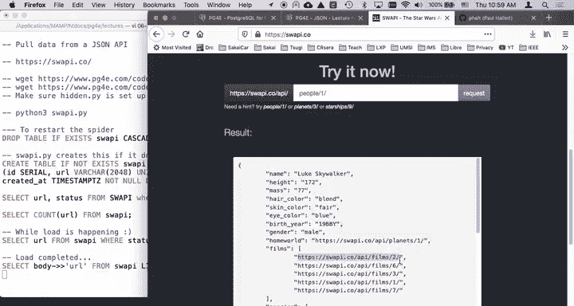
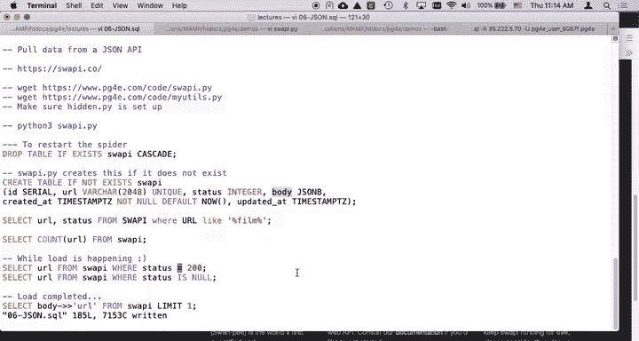

# 密歇根大学《给所有人的PostgreSQL课（数据库设计、SQL、JSON和NLP、ES）｜PostgreSQL for Everybody》中英字幕 - P96：32_星球大战API接口演示（第一部分）.zh_en - GPT中英字幕课程资源 - BV1tj421U7GK

Hello and welcome to another demonstration walkthrough for Postgress。

So the one we're working on right now is talking about loading JSON from an API。

 we're going to do a bit of spidering， we're going to create a little table and we're going to have a series of URLls and this is going to be done Sp style the data we're going to pull is a thing called the Star Wars API and it's a restbased API that returns JSON and one of the things we're going to do is we're going to spider in a way like a Google web search does in that we are going to actually read the documents and then in documents there are more URLs that we're going to parse out film species of vehicles。

 but then if you go to like species。

And let's go to films。If you go to F six， so we' are going to parse this。

 then we're going to spider it and we'll go to film six and then you look at film six and there's a bunch of people in it。

So what we're going to do is we're going to keep reading these until we have in effect。

 read all the data， we're going to use the stuff inside the data to guide our future searching。Okay。

 so we'll talk about all of that stuff this is free and open it's really cool， it has a rate limit。

 I hope we don't hit the rate limit， so let's take a look。You need to get the code for pgfree。

com/code/spiswAPpi Star Wars API， we're going to load that down and I hope by now you have myutTs。

pyy from a previous example and hidden Pi is already set up。Okay。😊。

And let's go ahead and drop the swapppy table in our PSQL。 It didn't exist， so it didn't matter。

 and swapppy is going to create this。 So so let's go ahead and start another browser here。

And I'm going to start running Python3 os。Python 3， Python 3， swapppy dot P Y。

And so now what's happened is。It's actually got it started by， so if we go look in here。

 let's take a look at oh。Let's find a select， select。一会然哦。More status 9 equal200。

 That'll get us what we want。You can always run the select because。So。F， select URL。From sppy。

So these are URLs to do， so let's do URL comma status。Yeah。

 I probably should say where status is not equal to 200， I should say status is nu。

 it might be a better。Now that gives us sort of where status is null when you put that back into my SQL code。

Yeah。And the ones that are 200 are the ones that I've retrieved。Let's make that be an equal 200。

 and it is null。So 200 is the HTP code， so if you look here we've got serial ID。

 we got the URL to retrieve that's unique， you have the status which is the HTB status， 200 is good。

 we're going to leave status empty， then we've got a JNB body and then we got a couple of timests。

And so what the program does to get itself started is it inserts some known URLs， films one species。

 one and people one， and then。Let's take a look at it。Srpppy dopy。So。

By now I hope you know what secrets work and how cursors work。🤧嗯。😊，Some print statements。

 I use the MySQL， my u do querys to kind of make it a little less whatever。嗯。

So we're going to do is going to check to see if there are URLs in the table and if we got no URLs。

 then we are going to insert film sub1， species sub1。 It's just a little insert using。喂。

That's the string substitution using F strings。Where it basically takes this。

It reads the variable OBj and replaces that。 looks a little bit like ajango template。

 which is kind of cool。 And so that's what inserted all of these records that we already see。

 That code is said there were because it created it and it didn't find it。

 So it just inserted these things。 And there's this cool little status function that I've got that I call a couple times that know it checks to see how many we've got。

 how many were the status as nu， how many were the status is 200。

 which is successful And then how many that have added error Now if all goes well。

 we shouldn't have an error。 But if you hit a rate limit or the network masses up。

 you will start seeing errors in here， you'll see the status having like 404s or 500s or something right。

200 is good。Right， and so。It's going to ask us how many we， we got a total of three。

 We' got three left to do。 That's because these don't have not been retrieved yet。

 How many good ones did we get and how many error ones did we get。

 That's just all select statements reading from it。 So now we're going to do is we are going to。

Ask how many documents， right？We've got some accumulation variables， how many documents do you want。

 so we're going to look for a URL from it where the status is not and only grab one。

Query value is like pull read a row， run the select statement， read the row。

 pull the zeroth element out of the row， or none， and if URLLs none were done or unknown retrieve documents。

Now we're going to start reading it。Actually， let me go ahead and start this thing。 And let me do。

 let me do five documents。 Is that going to work。 Yeah， now'll see， it takes a while， actually。

 because one of the things going on right here is it's adding。

 it's finding and adding more links to the database。 So just we retrieve five documents。

 But if I do a select。Count star from。Swappy。We got 45 rows and most of them。Are unretrieved。

 so it retrieved three documents。One document got two new ones， three documents， got 34 new ones。

 they're adding these up， right？And so this is a cu。 You can think of this。 Now。

 this is a restable process。 It's a spider。 And so if I like get out of this， it said， well。

 we've loaded five documents。 we have 40 to do 5 are good。 and we're starting over。

 So now I can start over。And it says， oh， I know based on reading the database what I've got to do。

 so let's do 25 documents。Now this is a slower process。

 and so this is why it's important for this to be reable so far the API is going well and it's not causing problems。

 so we'll just kind of let that crank along while I talk a little bit more about the code。All right。

 so you can select count。So we got 50 in there， 51。

So there's a lot of we're gaining URLs as we're doing this oh and then it committed。

 so we're going to have probably a bunch more。So we got 25 documents loaded。

 let's just load 100 more。And go talk。Go load， go little Python program， go go。 Okay。

 so let's take a look。 some of this you've seen in the G main example。

U we are we're using the request library this time， we're going to grab the text and the status code。

And then we're going to do an update。 we're going the key is to set the status also so that we don't double retrieve。

 Now hopefully this is a 200。 but if it's an error， we're going to actually have that in there。

 put the body in and set the updated a equals now where URL equals percent S。

 What we're seeing here is123% Ss which means we need a three tuple when we run the query So we're going to run the query with the SQL and send in our variables。

 status text and the URL and that does the insert and I just update my aggregation variables and like before I make it so I can hit controlr C at various places。

 any other kind of exception I just dump a whole bunch of debug stuff out and away we go。

And so then each time through， oh that's what we're seeing the count where the status is null。

 this is a pretty chatty API， pretty chatty thing， and so I'm going to select count where it's null and then I'm going to print what status was what URL I got and how many I have left to do so this is the to do list it sort of grows。

 you'll see that the to do list kind of grows and then it sort of shrinks。Shrink， shrink， shrink。

 shrink， shrink， it's shrinking， and it might grow again。 We're starting to run out of things to do。

 so let's go do another100 documents and see what we're done。 Look。

 there was only so many documents soll it doesn't run forever。

 which is good because we don't want to rate limit to poor API。Okay。So。The next thing we do。

Here's a to do list is I'm going to take the return body and I'm going to do a Json operation in Python。

 I'm going to load Json from a string which parsees it。

 This is going to blow up I probably I you to put a tricept around here when I write these things。

 I tend not to put the tricept until it starts blowing up because then I'm ready to debug it like this API would be blowing up。

But it's giving me back good JON， so I haven't written the code to deal with if the API gives me bad JSON because it's kind of hard to test so yeah。

 whatever， okay。So then what I'm going to do is I'm going to look through all the linked data。

 Now this is what I was showing you before when you look at one of these things I'm going to look through films。

 species， vehicles， this is a nested loop so I'm going to look through all of the vehicles。

 all the starships you'll notice that this is all in the form of URLs so I'm look at films species。

 vehicles Starships and characters maybe they're not there so I'm going to pull out of the parsed jascript because the parse JavaScriptscript in this case is really just a Python dictionary this becomes a Python dictionary named Luke Skywalker films is a Python dictionary films keys in that dictionary that points to a list so I'm going to grab this list。

At the end of films， and that's what I'm getting here and that's what I'm calling stuff。

Now I'm checking to make sure that stuff is a list object because if it's not a list object。

 I'm just going skip it， I don't know what。 I'm incapable of handling。

 This is like a guardian pattern or I'm only really capable of handling lists so I don't want this next line to blow up so I'm just like this this next line would blow up unless it's a list so just guardian it so that I don't at least I don't blow up。

 Some might put an error message in here or something， but I'm just like。

 I think the data is pretty clean if the day started getting yucky。

 I'd start putting air messages in there。Then what we're going to do is I'm just going to loop through that list。

 It's pretty simple， right， Got a list， go through all these things。

 and I'm going to insert into it with just the nothing but the URL， but on conflict。URL do nothing。

 So what I'm just saying here is if it's already there and theres a unique clause， right。

 theres a unique clause somewhere up here， there is a unique clause URLs v chart  2048， unique。

So that basically is going to trigger this on conflict of the URL field don't insert so that's just say no you can also do on conflict update。

 but we don't care about that All we're doing is adding to our to do list in this case and if it's already been done。

 I don't care so do nothing。Again， we have 1% S in this SQL。

 and so we have a one tuple apphey item comma parenthesy， and then I'm going to commit。

And that's probably why this runs so slowly is because I got that commit inside this for loop。

So Im every insert that I'm doing here is committing。So I probably wouldn't be well served。谢。

I would be well served。To bring this commit， so when you download this。

I get writing some spaces at the end of。 So when you do this。

 it'll run faster because this query is going to insert。

 but basically I'm only going to commit once per retrieval。 Okay。

 I was committing everything I was inserting。 So that meant that every time this number went up。

It was running to commit。 So I didn't have to commit quite so often。 Oh， it's finished。

 So it loaded 207 documents， loaded 202 in that particular run。 Tle was 207。 they're all good。

 there was no errors。 So we're done So we've got everything here and you should see it the same as well。

 And because I just fix this little thing， it's a choice whether you commit every time if it's going to blow up。

 So maybe you do want to commit every time。 but I think committing right here after you've gone through the if the Json's working and you've gone through it。

 these inserts aren't going to blow up。 So you might as well kind of cue them up and sort of blastom in a batch to the。

To the server。And then basically every 25th record， I'm going to run a commit。Actually， I couldes。

Take this commit out because I'm kind of already doing that every 25th record I'm going to run to commit。

 I'm going to wait for a second and then sleep mostly so I could hit the control see if it's blowing up。

And at the end， I do a summary， and I close the database connection summary again is the thing that puts out this little cute line right there。

 just helps me know what the heck's going on。 And so the darn thing has done。

 And so I have now crawled it right， So this is a crawling thing where it starts with a couple URLs。

 but retrieves the stuff Look at what's in those URLs and then adds to the to do list unless I've already seen it。

 So I'm only going to hit everyone once。 I'm careful about that right I only hit it once。

 So for example， now， if I look at。Some of these things。URL comm status。Well， there's none of those。

Let's just do limit one。Lit。5。So URL comma status， so you can kind of see that over time。

The successful， you got a status 200， which for us inside this database means that I got a successful retrieval of this particular URL and the。

I can now say URL status， and I'll say Json B， and it'll just be ugly at that point。

Because JO B is really big， actually it' body。It's gigantic， so URL status， there's a URL。

 there's the status in here is like a whole bunch of JsonN B。

NowYou also note that the JO and it's like。Yeah， the JsonN B is not the exact same format as the JSON that came back。

 which has a bunch of pretty spaces in it， And that's because the JSON B in the database is parsed and compressed。

 right， So this is a reconstitution of the internal data structure that Postgres has stored。Okay。

 so we now have all this stuff done and so let's let's come back in a second part and play with it now that it's all loaded。

