# PostgreSQL for Everybody：P97：星球大战API接口演示（第二部分）🎬

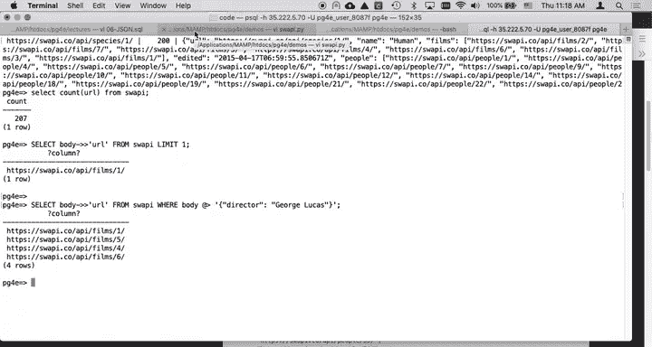

在本节课中，我们将继续探索星球大战API数据的处理。我们将学习如何为JSONB数据创建索引以优化查询性能，以及如何通过修改JSONB结构来增强数据的可查询性。

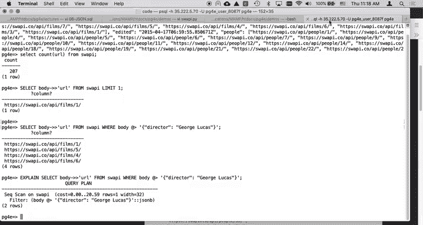

---

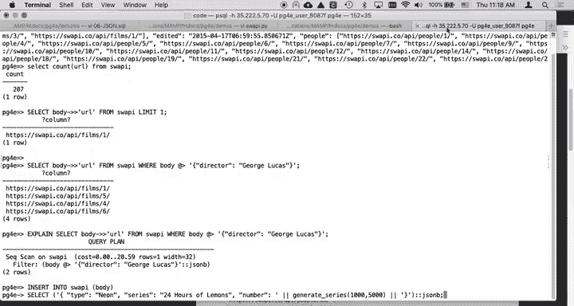

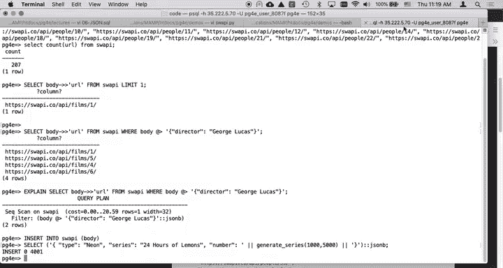

## 数据准备与查询

上一节我们介绍了如何加载星球大战API的数据。现在，所有数据都已加载完毕。

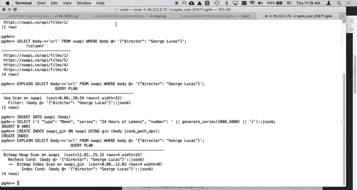

我们可以通过以下SQL语句确认数据总量：
```sql
SELECT COUNT(url) FROM swapi;
```
执行结果显示，我们已成功加载 **207** 份文档。

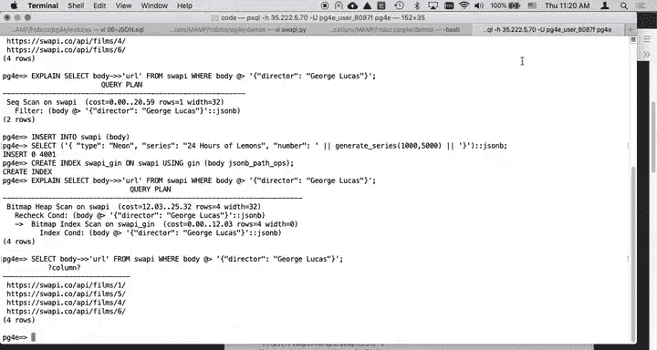

接下来，我们可以开始查询数据。例如，查找包含导演“George Lucas”的文档：
```sql
SELECT body->>'url' FROM swapi WHERE body::jsonb @> '{"director": "George Lucas"}'::jsonb;
```
目前，这个查询会进行全表扫描（Sequential Scan），因为我们尚未为`body`字段创建任何索引。

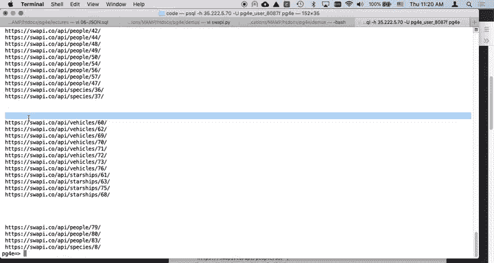

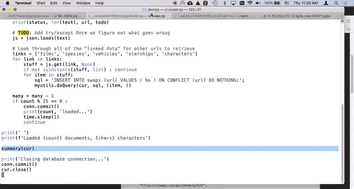

---

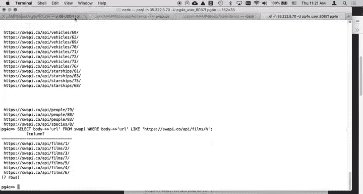

## 创建GIN索引

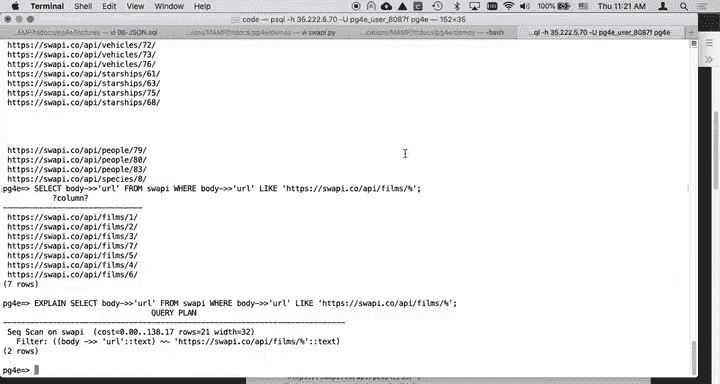

为了提升JSONB字段的查询性能，我们可以为其创建GIN（通用倒排索引）索引。

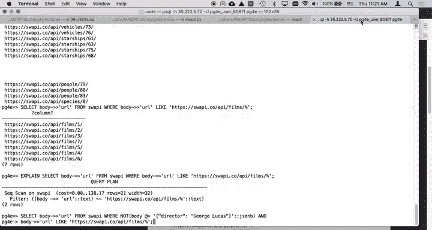

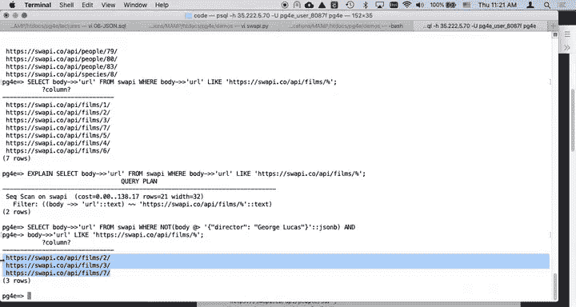

首先，我们插入4000条无意义的测试数据，以模拟一个更大的数据集：
```sql
-- 此处为模拟插入大量数据的示意代码
INSERT INTO swapi (body) SELECT '{"test": "data"}'::jsonb FROM generate_series(1, 4000);
```

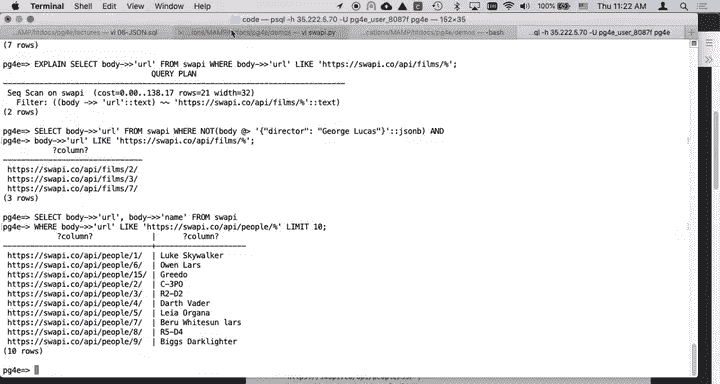

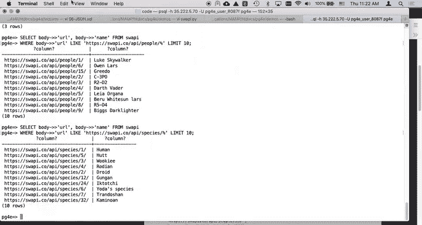

现在，为`body`字段创建GIN索引。我们使用`jsonb_path_ops`操作符类，它针对`@>`（包含）操作进行了优化。
```sql
CREATE INDEX swapi_gin_idx ON swapi USING gin (body jsonb_path_ops);
```
创建索引可能需要一些时间，具体取决于数据量的大小。

索引创建完成后，再次执行之前的查询，并使用`EXPLAIN`命令查看执行计划：
```sql
EXPLAIN SELECT body->>'url' FROM swapi WHERE body::jsonb @> '{"director": "George Lucas"}'::jsonb;
```
此时，查询优化器应该会使用我们新建的GIN索引，而不是进行全表扫描。

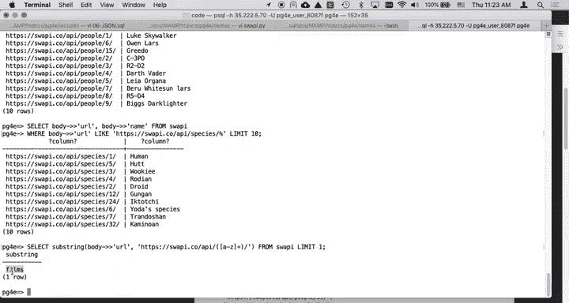

---

## 增强数据结构

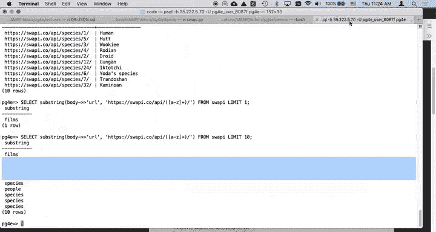

当前数据中的URL字段（如`https://swapi.co/api/films/1/`）隐含了资源类型（如`films`）。为了更方便地按类型查询，我们可以将这个类型信息提取出来，作为一个新的JSON键值对添加到`body`字段中。

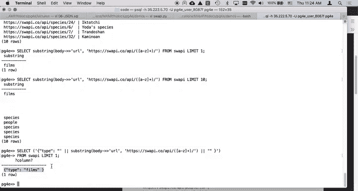

以下是实现步骤：

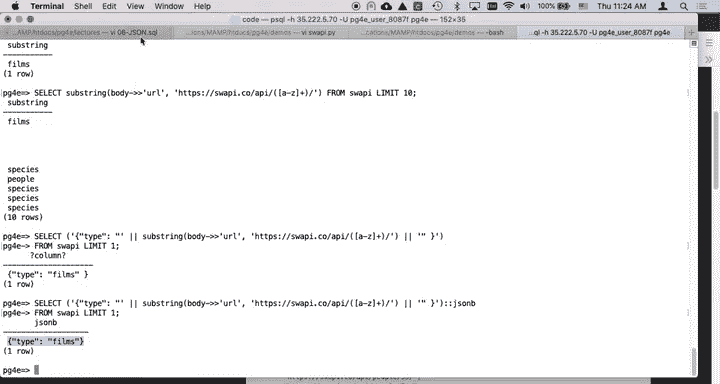

1.  **使用正则表达式提取类型**：
    我们可以从URL中提取`films`、`species`等类型关键词。
    ```sql
    SELECT substring(url FROM 'https://swapi.co/api/([a-z]+)/') AS type FROM swapi LIMIT 10;
    ```

2.  **构建包含类型的新JSON对象**：
    我们需要构造一个形如`{"type": "films"}`的JSON字符串，并将其转换为`jsonb`类型。
    ```sql
    SELECT '{"type": "films"}'::jsonb;
    ```

3.  **将新字段合并到现有数据中**：
    使用`||`操作符将新的JSONB对象合并到每一行的`body`字段中。
    ```sql
    -- 首先查看合并后的效果
    SELECT body || ('{"type": "' || substring(body->>'url' FROM 'https://swapi.co/api/([a-z]+)/') || '"}')::jsonb
    FROM swapi
    LIMIT 1;
    ```

4.  **执行更新操作**：
    确认无误后，执行UPDATE语句，为所有记录添加`type`字段。
    ```sql
    UPDATE swapi
    SET body = body || ('{"type": "' || substring(body->>'url' FROM 'https://swapi.co/api/([a-z]+)/') || '"}')::jsonb;
    ```
    此操作更新了所有记录。GIN索引会在后台自动更新以包含这个新字段。

---

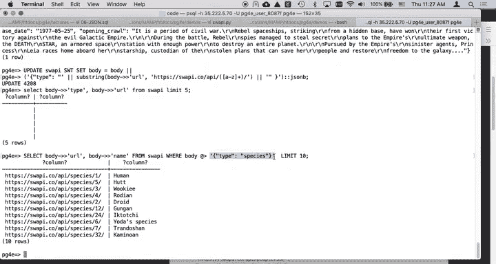

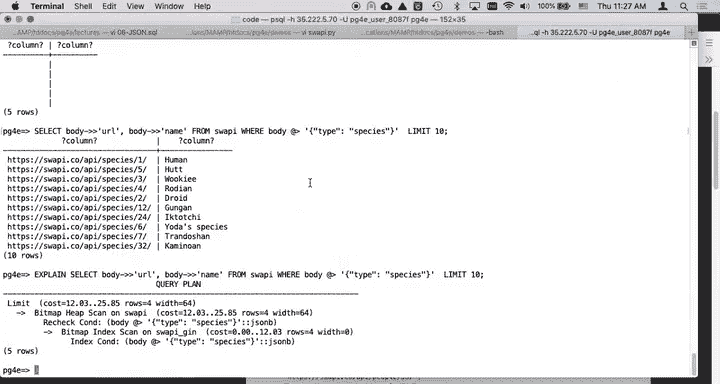

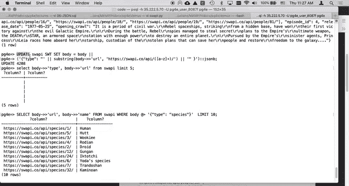

## 利用新字段进行查询

现在，我们可以利用新增的`type`字段进行更高效的查询。

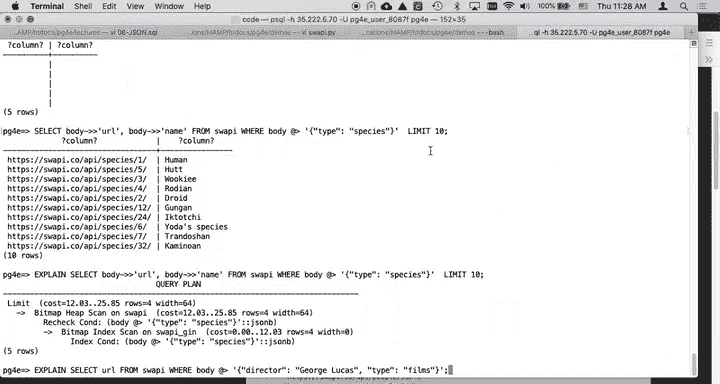

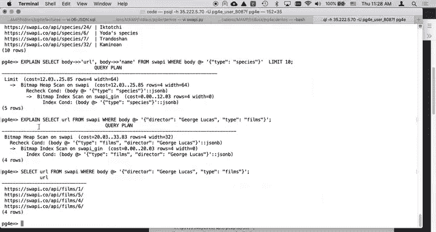

例如，查找所有“物种”（species）类型的资源：
```sql
SELECT body->>'url' FROM swapi WHERE body @> '{"type": "species"}'::jsonb;
```

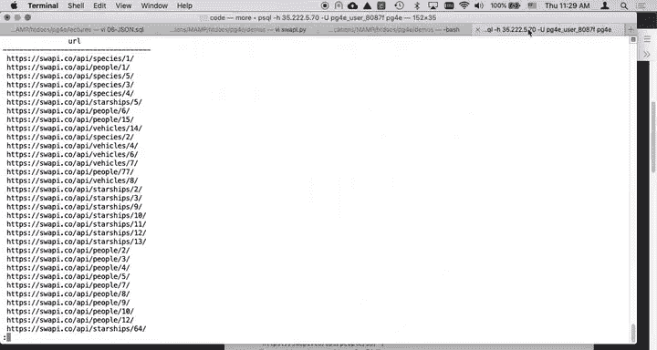

更复杂的例子：找出所有**电影（films）**中，**导演不是George Lucas**的影片。
```sql
SELECT body->>'url'
FROM swapi
WHERE body @> '{"type": "films"}'::jsonb
  AND NOT (body @> '{"director": "George Lucas"}'::jsonb);
```
使用`EXPLAIN`分析此查询，可以看到优化器成功地使用了我们创建的GIN索引，避免了全表扫描。查询结果会返回星球大战系列中非乔治·卢卡斯执导的三部电影。

---

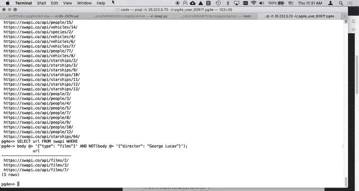

## 总结

本节课中我们一起学习了：
1.  **创建GIN索引**：为JSONB列创建`jsonb_path_ops` GIN索引，可以极大优化使用`@>`操作符的包含性查询。
2.  **动态增强JSON结构**：通过SQL字符串操作和`||`合并运算符，我们可以从现有数据（如URL）中提取信息，并将其作为新的键值对添加到JSONB文档中，从而使数据更易于查询。
3.  **执行高效的复合查询**：结合新增的字段和索引，我们可以构建复杂且高效的查询条件，数据库能够利用索引快速返回结果。

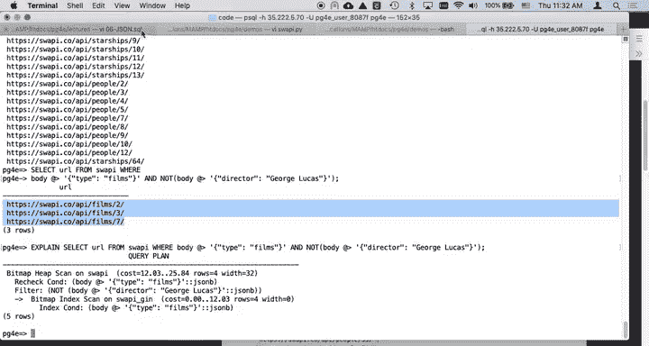

通过本演示，你掌握了在PostgreSQL中灵活处理和查询JSONB数据的关键技巧，包括性能优化和数据结构化增强。