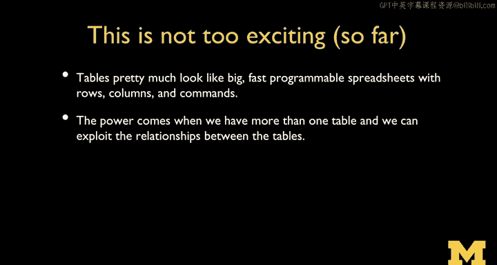

# PostgreSQL 课程：P9：PostgreSQL 表操作实践 📝


在本节课中，我们将学习如何使用 SQL 命令对数据库表中的数据进行操作。我们将涵盖数据的插入、删除、更新和查询，这些是 SQL 的核心操作，通常被称为 CRUD（创建、读取、更新、删除）。理解这些基本命令是掌握数据库管理的关键。

---

## 插入数据：INSERT 命令

上一节我们介绍了如何创建表结构，本节中我们来看看如何向表中添加数据。使用 `INSERT` 命令可以向表中插入新的记录。

以下是 `INSERT` 命令的基本语法：

```sql
INSERT INTO table_name (column1, column2, ...)
VALUES (value1, value2, ...);
```

*   `INSERT INTO` 是关键字，后面跟着表名。
*   括号内是需要插入数据的列名列表。
*   `VALUES` 关键字后，是与之对应的值列表，顺序和数量必须与列名列表完全一致。
*   每个完整的 SQL 语句以分号 `;` 结尾。

---

## 删除数据：DELETE 命令

现在我们已经知道如何添加数据，接下来看看如何删除数据。`DELETE` 命令用于从表中移除记录。

以下是 `DELETE` 命令的基本语法：

```sql
DELETE FROM table_name
WHERE condition;
```

*   `DELETE FROM` 是关键字，后面跟着要操作的表名。
*   `WHERE` 子句至关重要，它指定了删除哪些记录的条件。如果没有 `WHERE` 子句，将删除表中的所有行。
*   SQL 不是过程化语言，`DELETE` 命令内部隐含了一个循环。`WHERE` 子句的作用类似于循环中的 `if` 语句，它告诉数据库：“遍历所有行，只删除那些满足条件的行”。
*   在实际的数据库系统中，删除操作通常通过复杂的内部结构（如索引）高效完成，而不是物理地读取和重写整个表。

---

## 更新数据：UPDATE 命令

学会了插入和删除，我们来看看如何修改已有的数据。`UPDATE` 命令用于修改表中现有的记录。

以下是 `UPDATE` 命令的基本语法：

```sql
UPDATE table_name
SET column1 = value1, column2 = value2, ...
WHERE condition;
```

*   `UPDATE` 是关键字，后面跟着要更新的表名。
*   `SET` 子句指定要修改的列及其新值，多个列用逗号分隔。
*   和 `DELETE` 一样，`UPDATE` 也隐含了一个循环，因此 **必须使用 `WHERE` 子句** 来限定更新的范围，否则将更新表中的所有行。
*   如果 `WHERE` 条件匹配到多条记录，那么所有这些记录都会被更新。命令执行后会返回受影响的行数。

---

## 查询数据：SELECT 命令

在掌握了数据修改操作后，我们来看看如何从表中检索数据。`SELECT` 命令用于从数据库表中查询数据，这可能是你最常用的命令。

以下是 `SELECT` 命令的基本语法：

```sql
SELECT column1, column2, ...
FROM table_name
WHERE condition;
```

*   `SELECT` 后指定要检索的列名，使用 `*` 表示选择所有列。
*   `FROM` 指定要从哪个表查询。
*   `WHERE` 子句用于过滤结果，只返回满足条件的行。`SELECT` 命令同样隐含了对所有行的遍历，`WHERE` 子句用于缩小这个范围。
*   数据库会使用索引等机制来优化查询，避免全表扫描，从而快速返回结果。

---

### 排序结果：ORDER BY

查询结果默认是无序的。为了以特定顺序查看数据，可以使用 `ORDER BY` 子句。

```sql
SELECT * FROM users ORDER BY email;
```
默认是升序 (`ASC`)。要降序排列，可以添加 `DESC` 关键字：
```sql
SELECT * FROM users ORDER BY email DESC;
```

---

### 使用通配符：LIKE

有时我们需要进行模糊查询。`LIKE` 操作符配合通配符 `%`（代表任意字符序列）可以实现这一功能。

```sql
SELECT * FROM users WHERE name LIKE ‘%e%’;
```
这条语句会查找 `name` 列中包含字母 “e” 的所有记录。
> **注意**：以 `%` 开头的模糊查询通常无法有效利用普通索引，可能导致“全表扫描”，即数据库需要检查每一行数据，在数据量大时会影响性能。以特定前缀开头的查询（如 `‘abc%’`）则可能利用索引。

---

### 分页查询：LIMIT 和 OFFSET

当结果集很大时，我们通常需要分页显示。`LIMIT` 和 `OFFSET` 子句用于此目的。

```sql
SELECT * FROM users LIMIT 25 OFFSET 0; -- 获取第1-25行
SELECT * FROM users LIMIT 25 OFFSET 25; -- 获取第26-50行
```

*   `LIMIT` 指定返回的最大行数。
*   `OFFSET` 指定在开始返回行之前跳过的行数。**偏移量从0开始**，因此 `OFFSET 1` 会跳过第一行，从第二行开始返回。
*   在数据库层面进行分页比在应用程序中获取所有数据后再截取要高效得多。

---

### 聚合函数：COUNT

我们经常需要知道表中符合某些条件的记录有多少条，而不是获取记录本身。这时可以使用 `COUNT` 聚合函数。

```sql
SELECT COUNT(*) FROM users;
SELECT COUNT(*) FROM users WHERE email LIKE ‘%@example.com’;
```

*   `COUNT(*)` 计算表中的行数。
*   数据库通常能非常高效地完成计数操作，因为它可能直接从内部元数据中获取总数，或者利用索引进行快速统计，这比检索所有行数据要节省资源。



---

## 总结与展望

本节课中我们一起学习了 PostgreSQL 表的核心操作：插入 (`INSERT`)、删除 (`DELETE`)、更新 (`UPDATE`) 和查询 (`SELECT`) 数据。我们还探讨了如何对结果排序 (`ORDER BY`)、进行模糊匹配 (`LIKE`)、实现分页 (`LIMIT/OFFSET`) 以及计数 (`COUNT`)。这些命令构成了 SQL 语言的基础，其设计精妙之处在于用声明式语法隐藏了底层数据存储和检索的复杂性，让我们能够专注于“要什么”，而不是“怎么做”。


然而，目前我们只操作了单个表。数据库的强大之处在于表与表之间的关系。在接下来的课程中，我们将探讨 PostgreSQL 支持的各种数据类型，这是为表设计结构 (`SCHEMA`) 时的基础，也是我们将来连接多表、建立关系的前提。