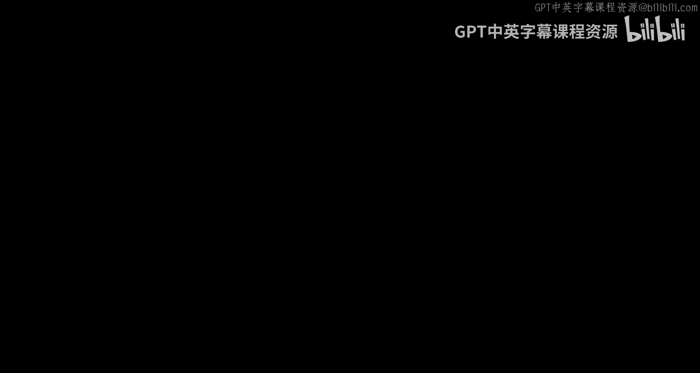

# 002：欢迎学习专项课程第一门课 🎉

你好，欢迎来到本课程。我是查尔斯·塞弗伦斯，你的讲师。

这是本专项课程的第一门课。关于课程内容的安排，我曾有过一些考量。最终这门课的体量稍长，我们原本可能希望是五周课程，但我找不到合适的地方将其拆分为两门课。因此，这是一门内容充实的课程。如果你完成了这门课，你将掌握我们所需的核心基础知识。

在本课程中，我们将涵盖超文本标记语言（HTML）、层叠样式表（CSS）、超文本传输协议（HTTP）和PHP。我希望你已经对CSS有初步了解。本课程的目标并非教你如何成为一名网页设计师，去展示所有这些技术的外观效果；我们更希望你成为一名“网络技师”，因为我们将在后端投入更多精力，学习如何创建应用程序，而非如何构建一个外观精美的应用程序。

如果你想学习如何构建美观、响应式且易于访问的应用程序，那是网页设计的范畴，由我的同事科琳·范·伦特教授的《面向所有人的网页设计》课程会涉及。从技术上讲，你可以按任意顺序学习这两个专项课程。你可以先学习本课程的技术原理，再学习如何让应用变得美观；或者先学习设计，再学习技术原理。我个人认为，最佳路径是先学习网页设计，再学习本应用开发课程，这也是我和科琳规划这两个专项课程的初衷。但你可以自由选择学习顺序。

如果你先学习了本课程，请记住，我们不会教你如何让事物变得美观，那属于另一个完整的专项课程。如果在学习过程中遇到问题，可以在论坛中向我们提问，教学团队会提供帮助。教学团队可以查看你的提交内容并给予指导。如果需要联系我，最佳方式是通过Twitter，只需提及 `@DrChuck`，通常我在地球上的某个地方，几分钟内就能看到消息。例如，如果有人说“作业4出问题了”，我会很快得知。

再次欢迎你加入本课程，祝你好运，期待在课程结束时看到你圆满完成所有学习任务。