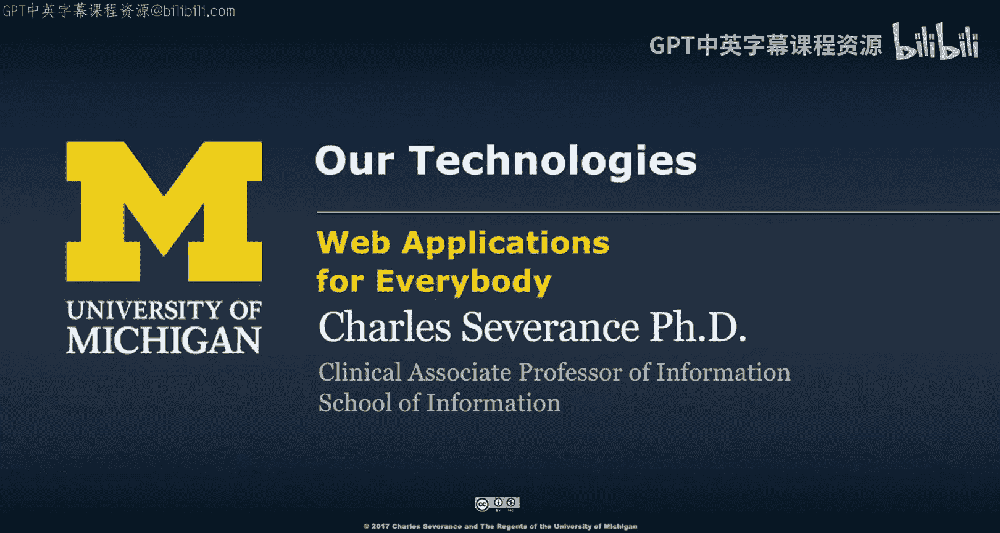
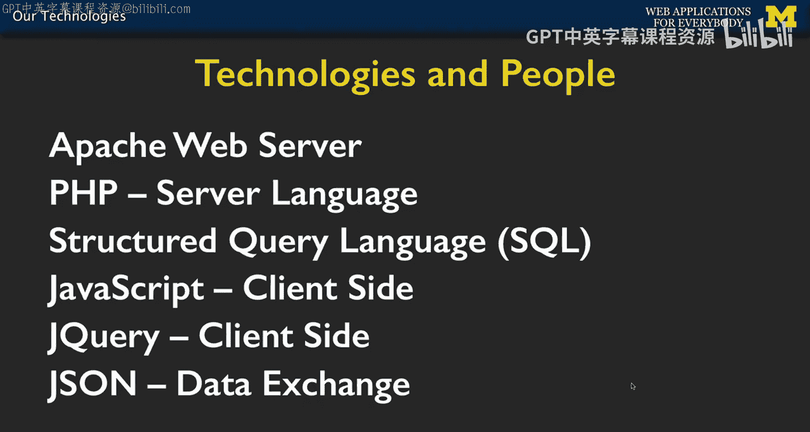
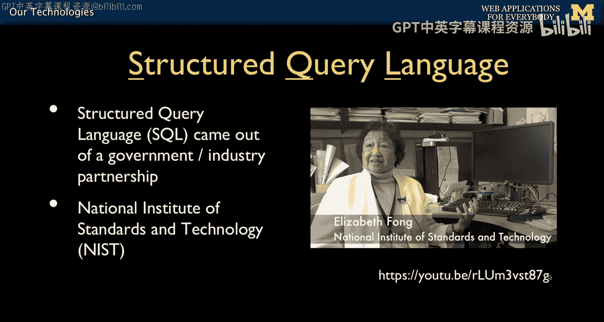
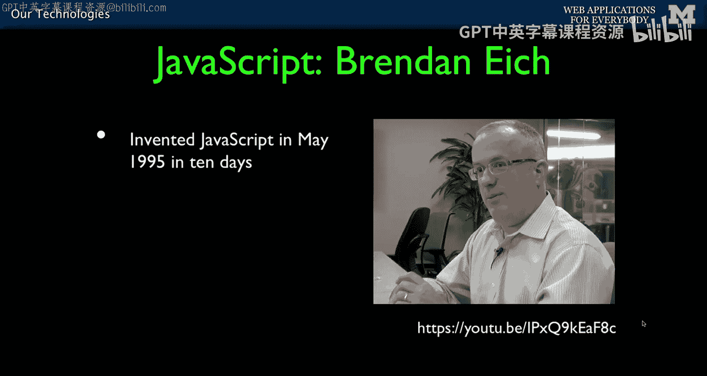
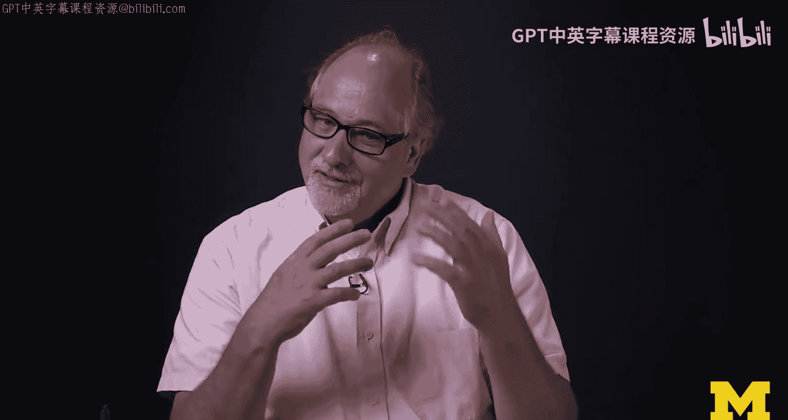
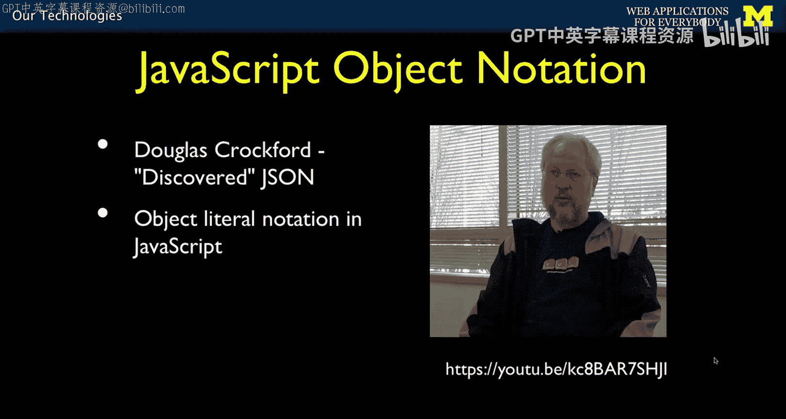

# 003：我们的技术栈 🛠️

在本节课中，我们将一起了解构建现代Web应用程序所需的核心技术栈。我们将探讨Apache、PHP、SQL、JavaScript、jQuery和JSON这些关键技术，并了解它们背后的创造者与设计理念。理解这些技术的历史和设计哲学，有助于我们更好地使用它们。

## 概述

我们将从Web服务器开始，逐步深入到服务器端编程、数据库交互、客户端脚本以及数据交换格式。每一部分都由人创造，充满了特定的设计选择和权衡。

## Apache Web服务器 🌐

上一节我们介绍了课程的整体目标，本节中我们来看看整个技术栈的基础——Web服务器。

Apache Web服务器是我们所有工作的基石。它是一个开源项目，起源于1992-1994年间美国国家超级计算应用中心（NCSA）的Mosaic项目。Mosaic不仅是一个浏览器（客户端），其HTTPD（超文本传输协议守护进程）组件后来演变成了Apache Web服务器。当NCSA的Mosaic项目停滞时，其代码被开源，并由包括Brian Behlendorf在内的一群开发者接手维护。“Apache”这个名字的一种解释是“一个非常补丁的服务器”，因为它被不断地修补和改进。这最终催生了Apache开源基金会，而Apache服务器是其第一个产品。

Apache使用C语言编写。C语言是一种底层且功能强大的编程语言，诞生于1972年，它支撑着我们使用的许多技术。

以下是关于C语言及其影响的一些背景：
*   C语言被用于编写Unix、Linux，甚至Python解释器本身。
*   在C语言出现之前（20世纪50-70年代），计算机主要被视为快速计算器，编程语言如Fortran也侧重于此。
*   随着计算机被用于电子邮件、社交网络等文本处理任务，出现了一批专注于文本处理的语言。
*   C语言是第一个在文本处理、数值计算、运行速度以及编写系统程序方面都表现出色的语言。
*   它的语法简洁，使用花括号`{}`定义代码块，`for`循环的语法结构为 `for (初始化; 条件; 递增) { ... }`。
*   许多后来的系统级编程语言都深受C语言影响，包括Java、C++、Objective-C、C#等。JavaScript的语法也借鉴了C。

## PHP：服务器端脚本语言 🐘

在了解了作为基础的Web服务器和C语言后，我们来看看将在服务器端使用的PHP语言。

PHP是一种与HTML页面混合的模板化编程语言。它的模式是HTML、代码、HTML、代码交替出现。这使得在网页中动态地添加小型计算或代码片段变得非常容易。网页的一部分来自包含`print`语句的运行代码，另一部分则直接来自静态HTML。

PHP由Rasmus Lerdorf创建，如今由成千上万的开发者作为一个大型开源项目维护。Rasmus并非科班出身的计算机科学家，他更关注实用性和易用性，而非构建世界上最完美的编程语言。PHP诞生于上世纪90年代中期，至今已有约20年历史。随着时间的推移，PHP（特别是PHP5和PHP7）已经变得更加优雅。其核心设计理念是让Web应用开发者能够尽快地投入生产。Rasmus在90年代中期因为用C语言编写所有网页而感到非常困难，从而催生了PHP。

PHP本身用C语言编写，其设计灵感大量来源于C，同时也从Perl（另一种早期脚本语言）汲取了养分，可能也受到Python的一些影响。

## SQL：数据库查询语言 🗃️

现在，我们有了处理逻辑的服务器（Apache）和编写逻辑的语言（PHP）。接下来，我们需要一种与数据库对话的方式来存储和检索数据，这就是SQL。

SQL是一门优美而强大的语言。它将一个极其复杂的问题——如何优化地在计算机内存和磁盘上存储数据，并使可能同时被访问的数据彼此靠近——进行了完美的抽象。数据库本身（处理连接、插入、选择、更新、删除）非常复杂，但其复杂性通过SQL被优雅地封装起来。我们只需声明“我想做这个”，数据库就会神奇地完成。

SQL的诞生故事与其他语言不同。在20世纪60年代，IBM、Oracle、Sybase等数据库厂商各自为政，拥有不同的数据库实现和查询语言。后来，美国国家标准与技术研究院（NIST）介入，要求行业共同制定一个标准的数据库查询语言，于是SQL应运而生。Elizabeth Fong在NIST参与了这一过程。SQL作为一个抽象层，并非直接实现任何厂商的数据库，而是提供了一种与任何数据库对话的优美方式。

## JavaScript：客户端脚本语言 ⚡

处理完服务器端的事务后，我们将进入浏览器（客户端）的世界，这就需要JavaScript。

JavaScript是一种类C的编程语言（使用花括号等语法），但其早期设计目标是在网页浏览器内部运行。因此，它预定义了如`document`和`window`这样的对象，使其能够操作浏览器页面。你可以想象成JavaScript在页面背后“悄悄”修改内容，这些变化通过**文档对象模型**（DOM）或`window`对象呈现出来。例如，页面上弹出新窗口或出现小红点，通常都是JavaScript的功劳。

JavaScript由Brendan Eich在1995年发明，当时他在Mozilla基金会，参与Netscape项目。Brendan是一位物理学家，他视JavaScript为在紧迫时间内，秘密构建他心目中人类有史以来最优雅编程语言的机会。他借鉴了Java的类C语法，并融入了许多他欣赏的其他语言的优点，创造出了JavaScript。正因为其优雅和强大，JavaScript日益流行，甚至通过Node.js等框架被用于服务器端开发。

## jQuery：DOM操作库 🎯

我们已经有了强大的JavaScript，但它在操作浏览器时曾面临一个挑战：浏览器兼容性。

JavaScript语言本身很快被标准化，但**文档对象模型**（DOM）——即JavaScript用来改变浏览器内容的部分——却未统一。Internet Explorer、Chrome、Firefox等浏览器对DOM的实现各不相同。jQuery就是由John Resig构建的一个**可移植性层**，它提供了一种优雅且跨浏览器的方式来操作DOM。如今，许多人甚至认为jQuery就是JavaScript，因为它提供了更简洁、更好的方式来处理浏览器交互，能显著缩短客户端代码。

## JSON：数据交换格式 📦

最后，当我们的浏览器端代码和服务器端代码都变得足够智能时，它们需要在用户无感知的情况下进行通信。这就需要一种数据交换格式。

**JSON**（JavaScript对象表示法）就是这种格式。例如，页面背后的代码可以自动向服务器询问是否有新消息，而服务器返回的新消息就采用JSON格式。Douglas Crockford并不自称JSON的发明者，而是“发现者”，因为JSON本质上源于JavaScript语言的一部分。他提取了JavaScript中的对象表示法，将其确立为一种协议，现在已被广泛用于各种数据交换场景。

## 总结

本节课中，我们一起学习了构建Web应用的全栈技术：从基础的Apache Web服务器，到服务器端的PHP编程语言，再到与数据库交互的SQL语言。接着，我们探索了浏览器端的JavaScript及其辅助库jQuery，最后了解了用于前后端数据通信的JSON格式。

更重要的是，我们了解到所有这些技术都是由人创造的，是许多人协作、权衡和选择的产物。它们并非完美无缺的魔法，而是体现了创造者的理念和当时的实际需求。理解这一点，能帮助我们在未来无论是使用Node.js、Ruby on Rails还是其他任何技术时，都能保持清晰的视角：技术是工具，由人创造，也由人使用和改进。