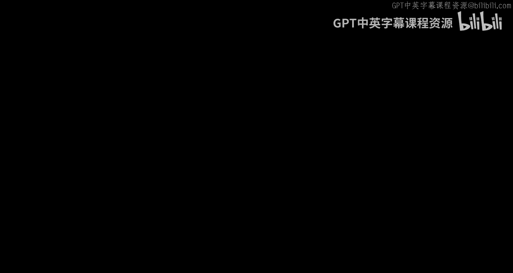
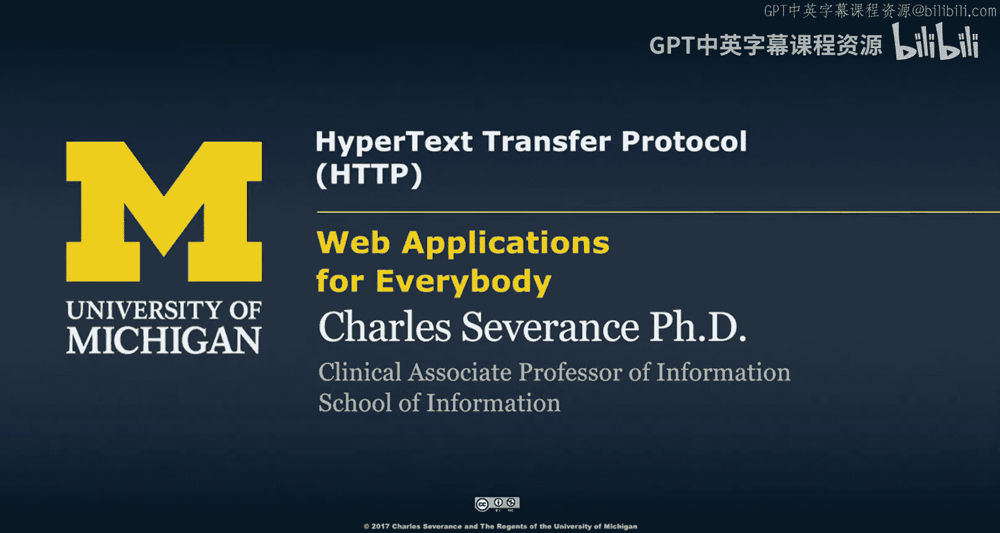
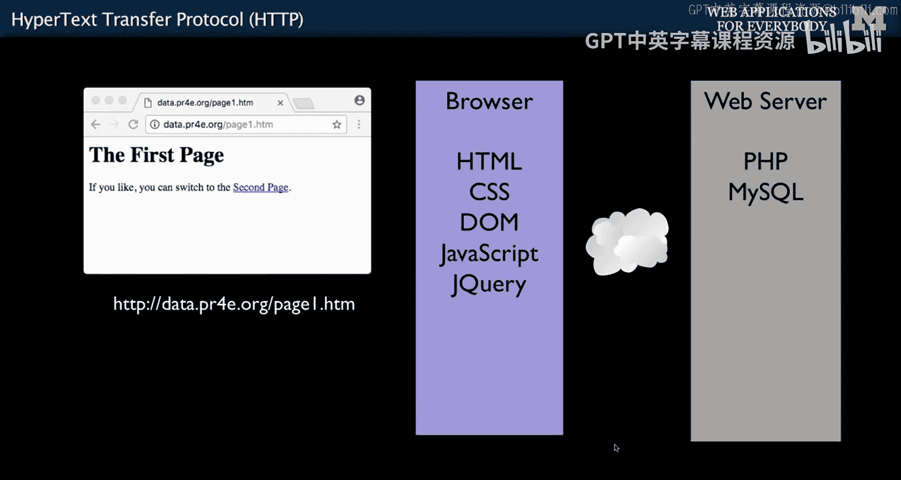
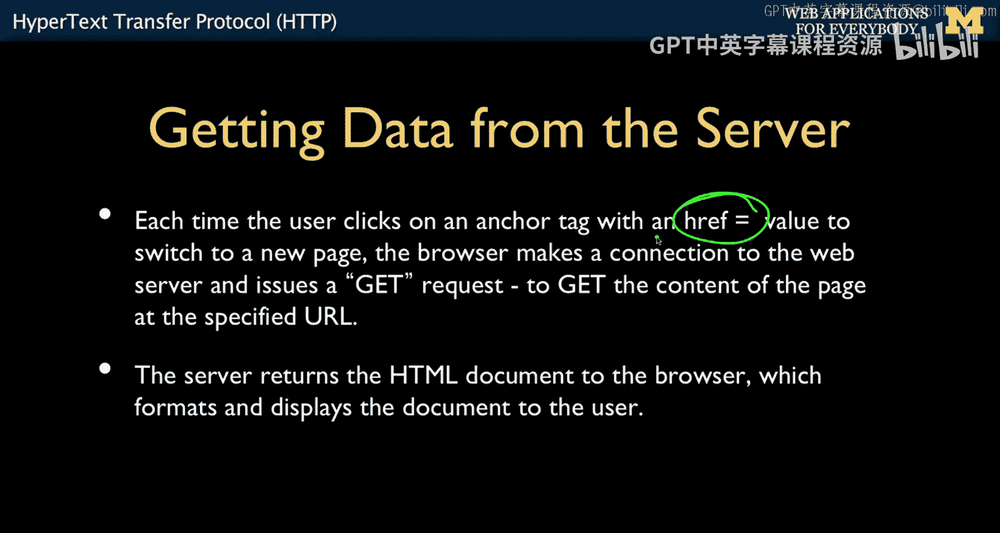
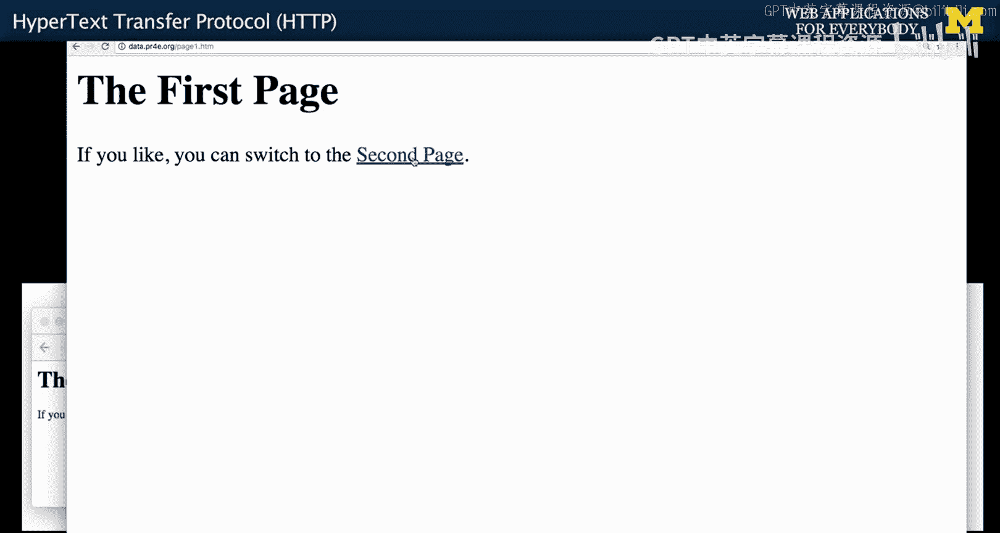
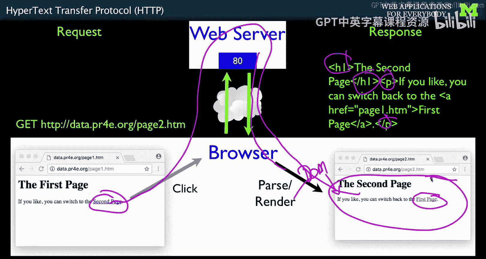
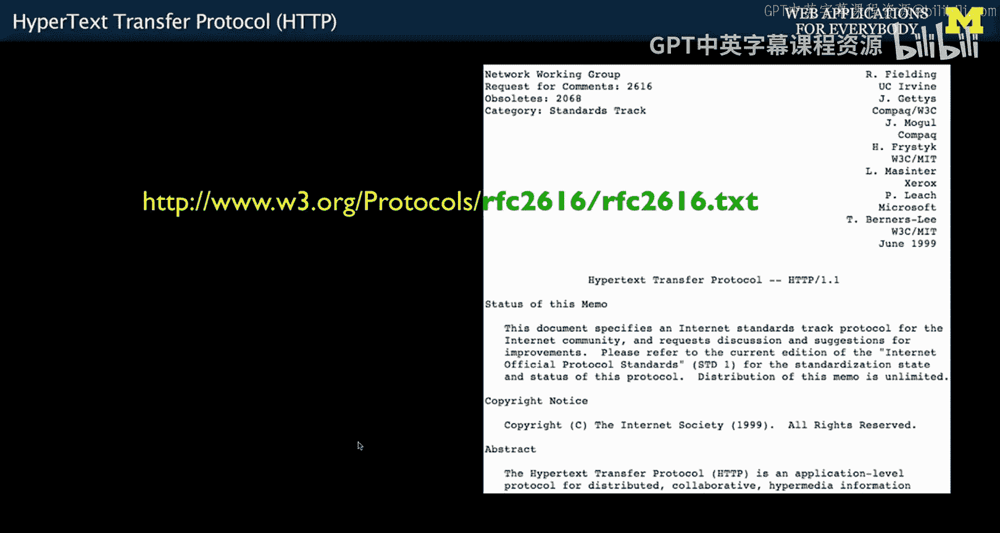
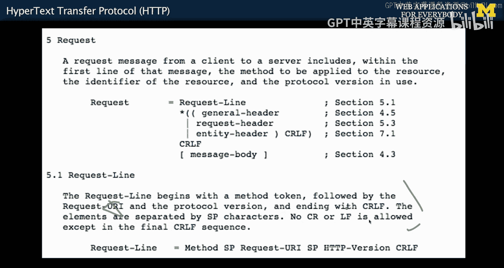

# 004：超文本传输协议(HTTP) 🧩

在本节课中，我们将学习Web应用程序的核心通信机制——超文本传输协议（HTTP）。我们将了解浏览器与服务器之间如何通过请求和响应来交换信息，并理解URL、HTTP请求格式等基本概念。这些知识是理解后续所有Web技术的基础。

## 浏览器与服务器：多层架构

现在我们来讨论网页是如何构建的。你可能会问，为什么要了解这些细节？

部分原因是我希望你能真正理解Web应用程序的工作原理。因为Web应用程序，以及许多移动应用程序，都是由多个层次的组件协同工作的。在浏览器端，你有浏览器本身；在服务器端，你有服务器和数据库服务器。我希望你能理解，当你编写代码时，你正在与这个多层系统中的哪个部分打交道。

浏览器是运行在你的硬盘（或手机等设备）上的软件。我们将要学习的浏览器端技术包括HTML和CSS。稍后我们还会学习文档对象模型（DOM），它是JavaScript操作HTML元素、改变文字内容的方式。JQuery则让这些操作变得更加简单。

因此，我们将在浏览器端学习许多技术。同样，在服务器端我们也将学习许多技术：我们将学习PHP，以便在服务器端编写代码；我们将学习SQL，以便在数据库中查找数据并将其取出并发送回浏览器。

我们还将学习**请求-响应周期**。这是指浏览器与服务器进行通信，我们在服务器端编写代码来响应请求，以及数据来回传输的过程。这个过程的核心就是**HTTP**（超文本传输协议）。此外，**JSON**也是我们来回传输数据时将要使用的一部分。

在本课程中，我必须从一个起点开始。这个起点就是让你理解浏览器端和服务器端之间发生了什么，因为这是两者之间的基本分界点。我们将简要讨论超文本传输协议，但更重要的是，我希望你认识到，在这些应用程序中，不同的代码片段和技术正在被使用。

## HTTP协议：简单而优雅的基石 🌐

HTTP是占主导地位的应用层协议。它由蒂姆·伯纳斯-李和罗伯特·卡里奥于1989-1990年发明万维网时创造。当然，在HTTP之前还有其他协议，如用于文件传输的FTP、Telnet、用于简单邮件传输的SMTP。这些协议都已发展成熟。

但蒂姆·伯纳斯-李和罗伯特·卡里奥想要一个简单的协议，主要是因为他们并非协议开发者，他们只是想构建一个能显示页面并允许人们编辑这些页面的应用程序。因此，他们构建了尽可能简单的协议。这些协议来回通信。在HTTP中，它建立一个连接，请求一个文档，然后收到一个文档作为回应，这确实非常简单。我不确定它是否被设计成简单的，但结果是，我们能够在这个简单协议之上构建像Web服务这样的东西，以及其他只是在其基础上略有变化的协议。

因此，我们使用的大多数新协议，基本上都是在HTTP之上采用不同约定的协议。它的优雅之处在于其简洁性，也是我们能够“破解”它的唯一原因，因为它足够简单。过去我也能“破解”邮件协议，但后来安全措施使其变得难以使用。

HTTP的另一个核心贡献，同样来自蒂姆和罗伯特在20世纪90年代初期的构想，是**统一资源定位符**的概念。现在你会在各种地方看到它，比如宣传册上写着“http://bla.bla.bla”，你一看就知道那是什么。你把它输入浏览器，就能获取一个文档或一组文档。

但实际上，这些统一资源定位符背后是有科学依据的。在万维网出现之前，你必须知道要连接到哪个主机、使用什么协议、向该主机发送什么命令集，以及你可能想从该主机检索什么内容。URL只是提出了一种约定，然后将这些东西连接在一起。

所以，`http://` 是协议。协议不止这一种。`server.com` 是你与之通信的服务器。在云端，有许许多多的服务器。哪个服务器拥有这个文档？我们用什么协议与之通信？在服务器内部，还有文件。因此，服务器内的这个文档路径告诉我们将要查看什么。

当然，实际情况比这更复杂。你可以在URL末尾添加参数，也可以添加所谓的锚点。所以有很多东西，比如 `?x=2`。但URL的基本思想就是：如何获取、去哪里获取、获取什么，所有这些都连接成一个长字符串。

其理念是，只要我们有一个这样的URL，并在浏览器中输入它，我们就能获取到它。另一种方式不是直接在浏览器中输入URL，而是在HTML中嵌入所谓的**锚标签**，即可点击的链接。这些链接内部有一个 `href`（超文本引用）属性。我们将在下一节HTTP课程中讨论这个。`href` 属性表示：当有人点击此链接时，丢弃当前页面并跳转到另一个页面。这就是它的超文本特性：你点击一个链接，然后跳转到下一个链接。因此，链接会变成一个GET请求，该请求检索一个页面，返回新的HTML，然后显示在我们的浏览器中。

## 实践：超文本导航 🔗

我们要做的第一件事是输入一个URL。如果你输入 `data.pr4e.org/page1.htm` 然后按回车，你就发出了一个GET请求。如果我在这里查看源代码（你可能需要开启开发者模式或类似功能才能看到“查看页面源代码”），我们可以看到页面源代码。你会看到这种标记语言，这就是HTML。我们稍后会详细讨论它。这里有一个锚标签，表示当点击“第二页”时，去获取这个URL。所以我们当前在 `page1.htm`，而链接指向 `page2.htm`。

如果我点击它，几乎是瞬间就跳转了。但我们实际上已经跳转到了另一个页面，并且那个页面上有一个链接可以返回第一页，如此反复。这就是基本的超文本导航。我们的浏览器正在执行操作：看到这些点击，然后执行某些操作，获取不同的页面。

当然，实际情况远比这复杂，我们稍后会看到。但我想非常仔细地看一下这个简单超文本导航过程中发生的具体步骤。

## 深入请求-响应周期 🔄

我们在浏览器中输入了URL，按下了回车键，这触发了一个GET请求。现在我们看到了这个页面。页面中有一个锚标签，它是一个超文本引用。在早期，所有链接都是蓝色并带有下划线，因为人们需要提示才能知道哪里可以点击。我们现在已经习惯了浏览网页，以至于觉得超文本是理所当然的。你会点击所有看起来可以点击的东西。在过去，我们用蓝色文字和下划线来表示“点击这里”。

当你点击这个链接时，你的浏览器（一个运行在你电脑上的软件）会执行操作。这个白色的大框代表你的电脑，无论是手机还是其他设备。浏览器是一个软件应用程序，如Chrome、Firefox、Internet Explorer（现在叫Edge）、Safari、Opera等。有很多浏览器。这些是你的客户端，用于浏览网页。浏览器是一个应用程序，是向你展示这个页面的东西。

当你点击链接时，你电脑上的浏览器会说：“哦，有人点击了一个链接。”然后它会去查找你想要哪个链接。当它知道你请求的是哪个链接后，它会通过解析该链接来建立连接。它通过一个叫做**端口80**的端口（Web服务器通常监听的端口）连接到正确的Web服务器。然后它发送一个请求，发送一小行文本，看起来就像这样：`GET /page2.htm HTTP/1.0`。这整行文字表示：“这就是我想要的文档。”

然后，在这个Web服务器上（通过互联网），服务器要么生成响应，要么从磁盘读取响应，然后返回响应。响应本身是**HTML**格式，就像我在“查看源代码”中展示给你的那样，这些是标签：`<html>` 标签、`<head>` 标签、`<body>` 标签。然后这里有一个超文本引用，它将“第二页”变成了一个链接（在截图中显示为紫色，因为我之前点击过它）。

当这个HTML返回时，你的浏览器会解析它，然后渲染它。中间有一个**文档对象模型**，浏览器解析HTML后构建DOM，然后呈现为页面。但基本思想就是：点击 -> 请求 -> 页面被获取 -> 响应 -> 解析 -> 显示 -> 你得到新页面。然后又是：点击 -> 请求 -> 响应。到我们学完时，情况会复杂得多，可能会有许多请求-响应周期，但这就是基本的请求-响应周期。

## 互联网标准：开放的基石 📜

这一切都由互联网标准管理，这些标准源于非常开放和开源的文化。它们由一个名为**互联网工程任务组**的团体制定，该团体早于我们所说的现代互联网（80年代中期），IETF甚至可以追溯到70年代一个更早的网络ARPANET。

他们提出了IETF和这些标准的概念。这些标准是开放的、免费的、无阻碍的，意味着任何人都可以阅读它们，并实现符合这些标准的东西，从而构建自己的Web浏览器或Web服务器。当然，现在这些东西都已经存在，我们直接下载使用即可。但管理我们所有代码互操作性的协议，正是这些IETF标准。

还有其他标准来源，比如万维网联盟负责HTML、CSS等标准，但协议类的东西主要通过IETF。

有趣的是，这些标准文件被称为**RFC**，代表“请求评论”。这是一种书呆子式的工程学承认：没有标准是完美的。即使它们已经完成并且有10年、15年甚至更久的历史（比如从1981年到2017年，现在可能30多年了），它们仍然可能需要改进。所以，即使它已经30多岁了，它仍然在“等待评论”。如果你有评论，如果你发现了问题，或者有更好的构建方法，工程师们希望听到你的意见。所以，RFC是这些互联网标准一个有趣且具有讽刺意味的命名惯例。

如果你去查阅，会发现有许多标准管理着HTTP。你可以去阅读它们，翻页、翻页、再翻页，然后很快你就会意识到你并不想自己写一个浏览器，你更愿意使用一个现成的浏览器。但最终，你会翻到很后面的一页，上面基本上说明了如何发出一个请求。

## HTTP请求格式 📝

如果你继续看下去，它会告诉你，你应该把**方法**放在前面，后面跟着**URI**，然后是**协议版本**，最后以回车换行符结束。这里就是这么说的：方法标记（在我们的例子中是GET），后面跟着URL，以回车换行符结束，等等。

所以，如果你读得足够久，最终就能看到我们应该如何做。基于这个规范，接下来我将向你展示如何手动“破解”一个HTTP请求。

## 总结

本节课中，我们一起学习了Web通信的基础——HTTP协议。我们了解了浏览器与服务器之间的请求-响应周期，认识了URL的结构和作用，并知道了互联网标准（如RFC）如何规范这些交互。理解这些基本概念，是后续学习HTML、CSS、JavaScript、PHP和SQL等具体技术，并构建完整Web应用程序的关键第一步。