# 005：请求响应周期 🔄


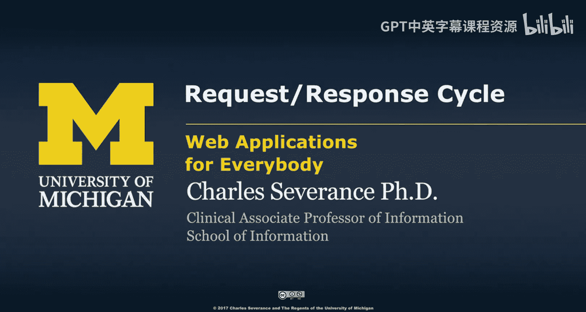

在本节课中，我们将深入探讨HTTP请求如何工作。我们将学习如何手动模拟一个HTTP请求，并了解浏览器开发者工具如何帮助我们查看和分析请求与响应的细节。

## 手动模拟HTTP请求

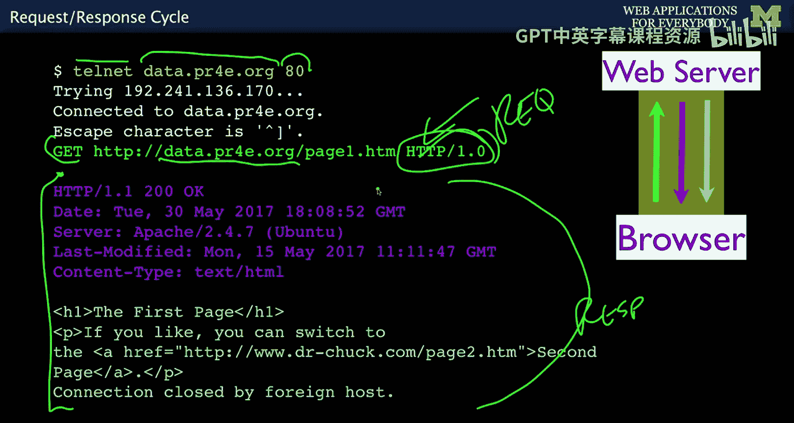

上一节我们介绍了HTTP的基本概念，本节中我们来看看如何通过命令行工具手动发送一个HTTP请求。

我们将使用一个名为`Telnet`的命令行工具。它允许我们连接到服务器的特定端口（如Web服务器常用的80端口）并直接发送HTTP命令。

以下是使用Telnet发送HTTP 1.0 GET请求的基本步骤：

1.  打开终端或命令行工具。
2.  输入命令连接到目标服务器的80端口。
3.  手动输入HTTP请求行和头部，然后发送。

具体命令格式如下：
```bash
telnet data.pr4e.org 80
GET /page1.htm HTTP/1.0
```
输入完请求后，需要按两次回车键（一次结束请求行，一次发送空行表示请求头结束）。服务器随后会返回响应。

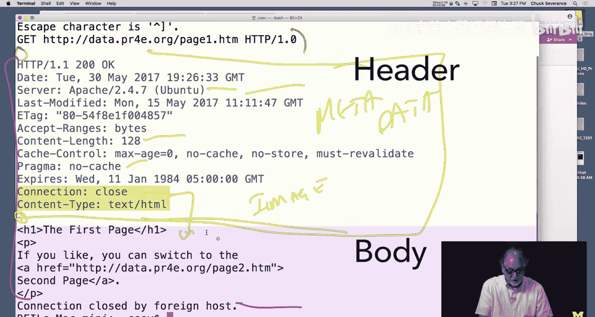

## 理解HTTP响应

服务器返回的响应可以分为两部分：**响应头**和**响应体**。它们由一个空行分隔。

响应头包含元数据，例如：
*   `Content-Type`：告诉浏览器返回内容的类型（如`text/html`或`image/jpeg`）。
*   `Content-Length`：内容的大小。
*   `Last-Modified`：文件最后修改日期。
*   状态码：如`200 OK`表示成功，`404 Not Found`表示未找到资源。

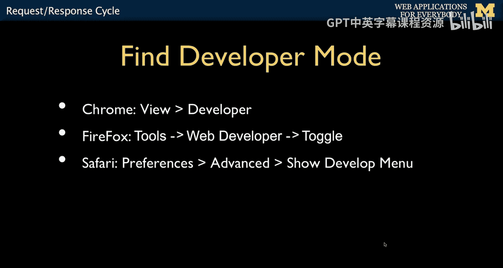

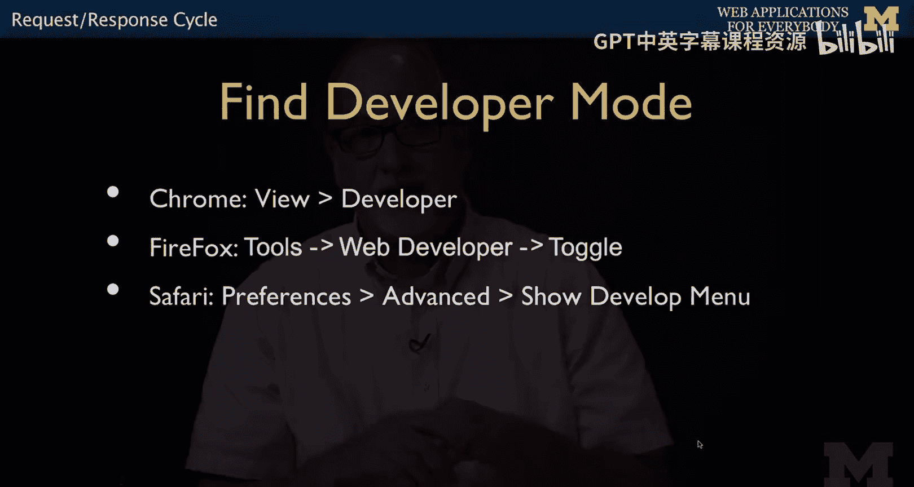

响应体则是请求的实际内容，例如HTML代码或图片数据。

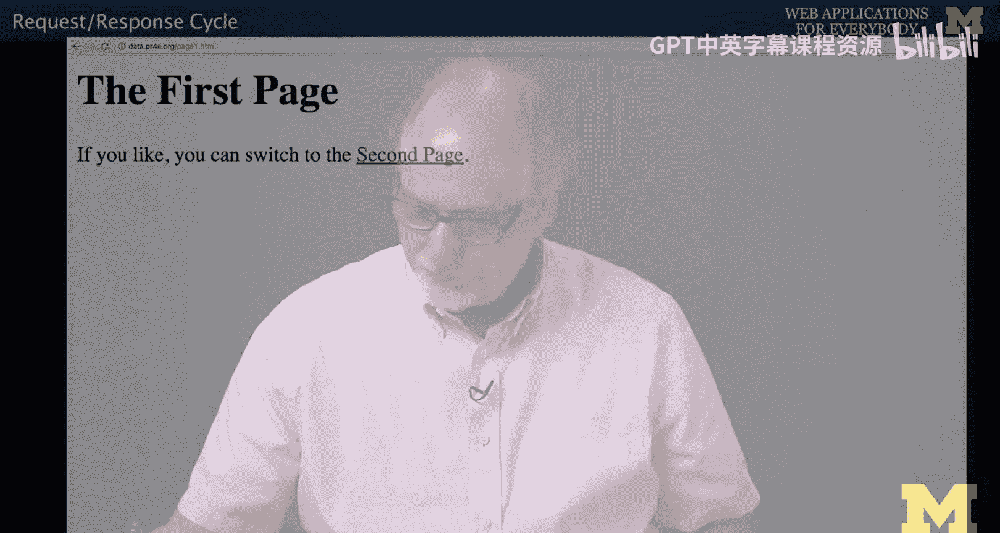

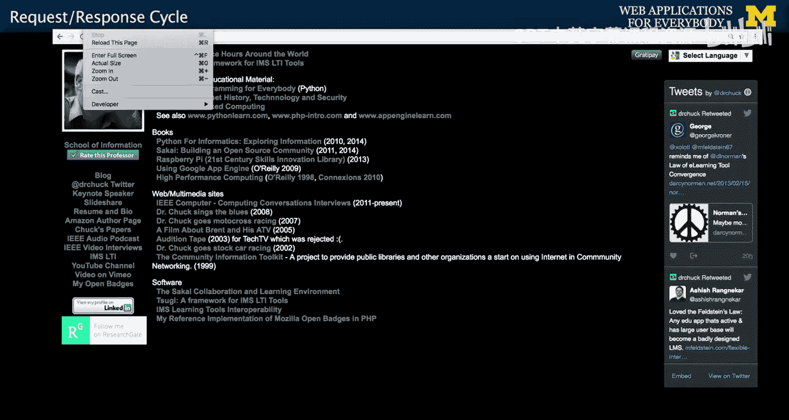

## 使用浏览器开发者工具

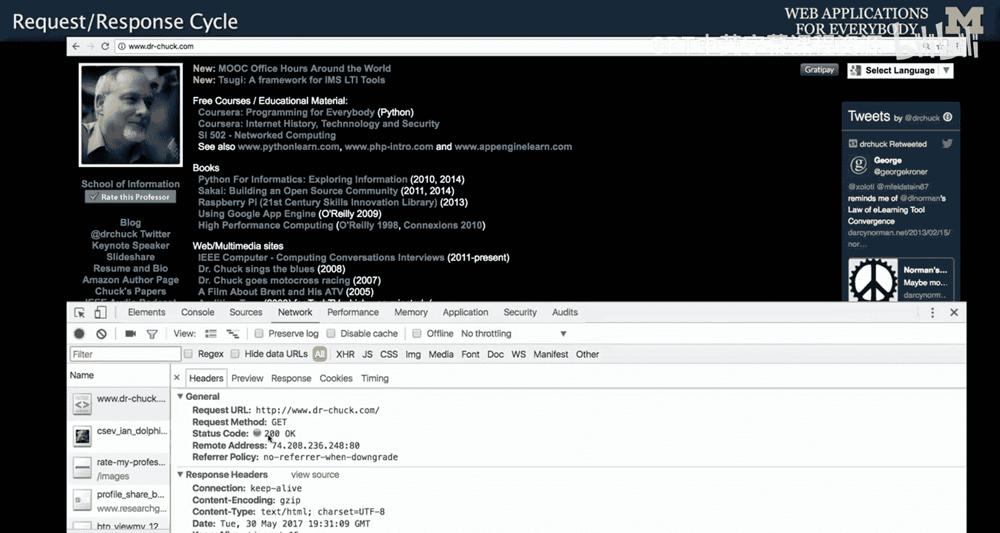

虽然手动发送请求有助于理解原理，但在实际开发中，我们使用浏览器的开发者工具来调试和分析网络请求。

以下是查看网络请求的步骤：

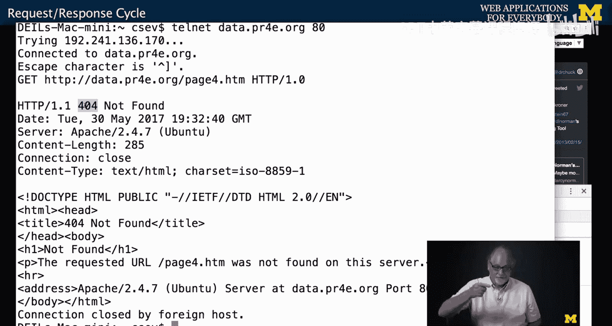

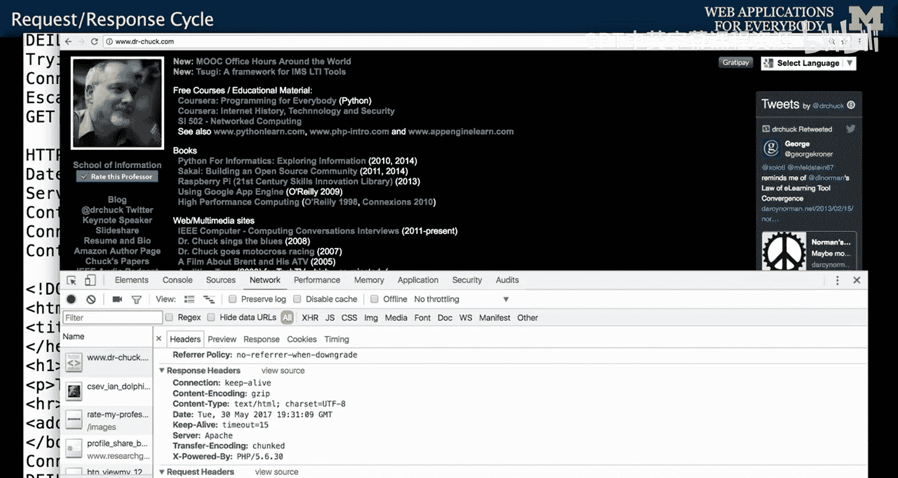

1.  在浏览器中打开任意网页（例如 `www.drchuck.com`）。
2.  打开开发者工具（通常通过右键点击页面并选择“检查”，或按F12键）。
3.  切换到 **“网络”** 标签页。
4.  刷新页面，工具将记录页面加载过程中发生的所有网络请求。

通过开发者工具，你可以看到：

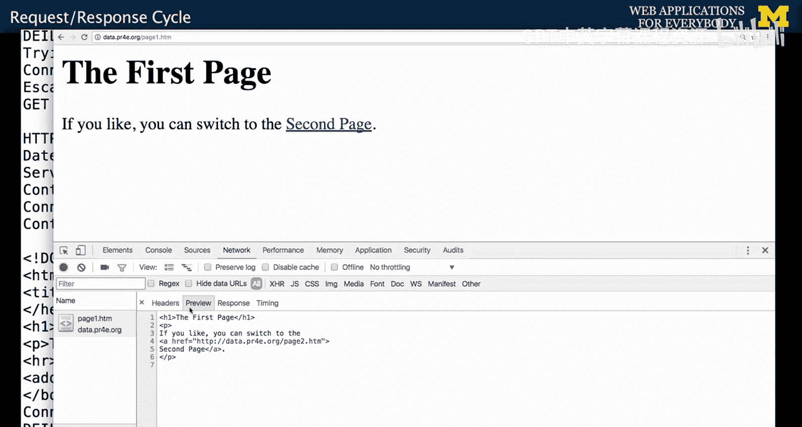

*   每个请求的详细信息（方法、URL、状态码）。
*   请求头和响应头的内容。
*   请求的响应时间线。
*   对于复杂页面，浏览器会发起多个请求来获取HTML、CSS、JavaScript和图片等资源。

## Web应用架构回顾

理解请求响应周期是理解整个Web应用架构的关键。一个典型的Web应用包含三层：

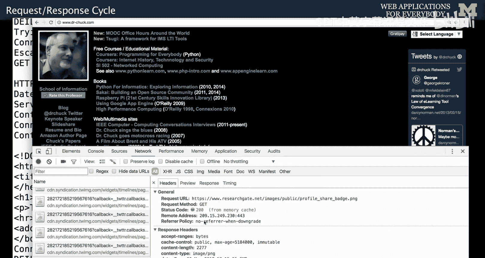

1.  **浏览器**：负责发送HTTP请求，接收响应，并渲染内容（HTML, CSS, JavaScript）。
2.  **Web服务器**：接收HTTP请求，处理业务逻辑（可能使用PHP等语言），并生成响应。
3.  **数据库服务器**：存储应用数据，Web服务器通过SQL查询与之交互。

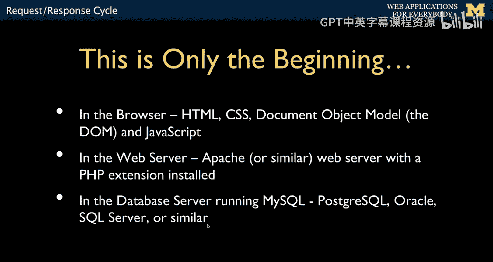

HTTP协议是连接浏览器和Web服务器的桥梁。开发者工具主要帮助我们观察和分析**浏览器与Web服务器之间**的通信。

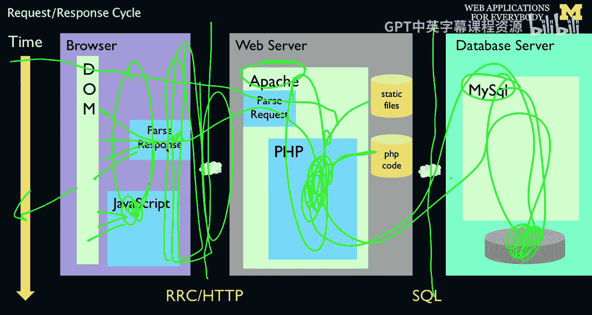

## 总结

本节课中我们一起学习了HTTP请求响应周期的核心机制。我们通过手动使用Telnet工具发送请求，直观地看到了请求和响应的原始格式。接着，我们介绍了如何使用浏览器内置的开发者工具来更方便地监控和调试网络活动，这是Web开发中诊断问题的必备技能。最后，我们回顾了浏览器、Web服务器和数据库服务器协同工作的三层架构，明确了HTTP在其中扮演的角色。掌握这些基础知识，将为后续学习更复杂的Web技术打下坚实的基础。