# 008：超文本标记语言(HTML) 🏗️

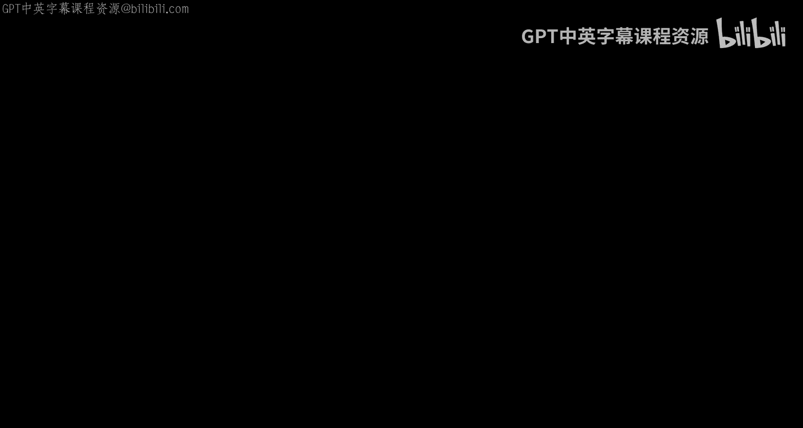

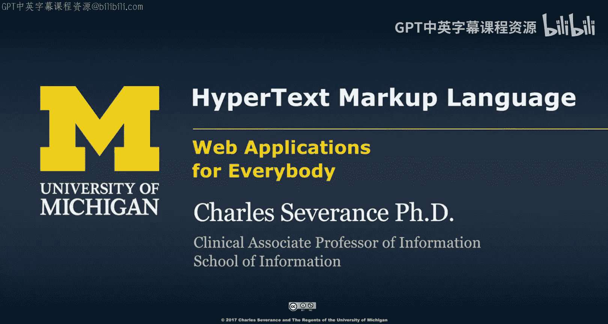

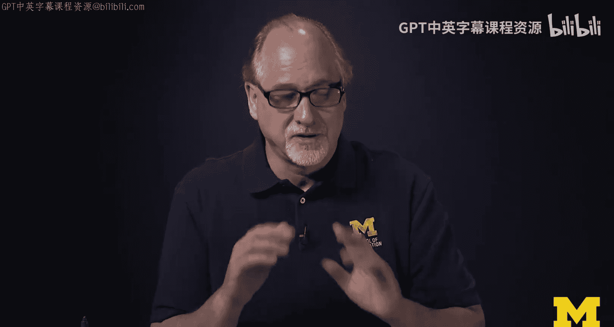

在本节课中，我们将要学习超文本标记语言（HTML）的基础知识。我们的目标不是让你成为世界顶尖的网页设计师或前端专家，而是为你提供足够的HTML知识，以便你能顺利完成本课程后续的学习。本课程的核心主题是：给你一些HTML，然后我们将探索如何用更酷的方法生成更多的HTML。

## 概述：Web应用架构与HTML的角色

在深入HTML细节之前，我们首先需要将所学内容置于正确的上下文中。一个典型的Web应用涉及三个主要软件组件和两个网络连接。

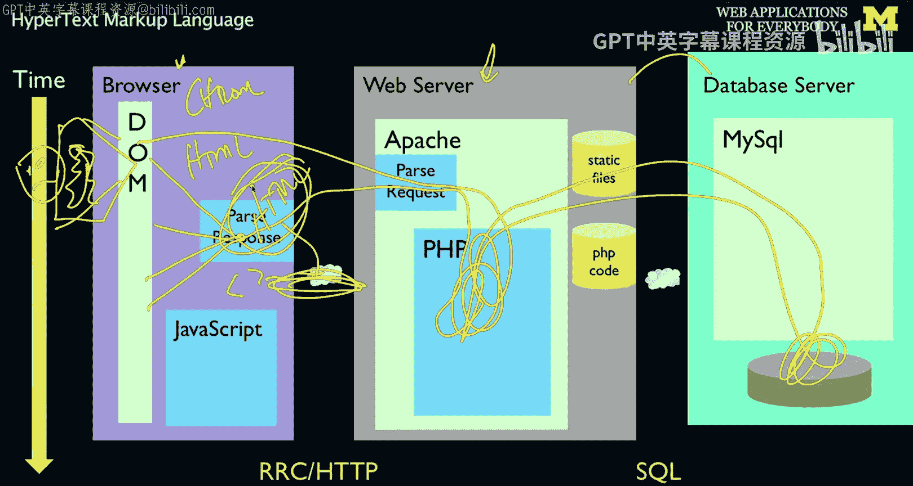

*   **浏览器**：运行在你的电脑上，例如Chrome。
*   **Web服务器**：运行在网络另一端，例如Apache服务器，我们将在此运行PHP等程序。
*   **数据库**：通常是第三台硬件设备，例如MySQL。

当你向服务器发起请求时，服务器可能会处理一些逻辑（如运行PHP），并从数据库读取数据，最终将结果返回给你的浏览器。这个返回结果的格式就是**HTML**。浏览器会解析HTML，识别其中的 `<` 和 `>` 等标签，最终在屏幕上渲染出你看到的图像和布局。因此，HTTP是用于获取文档的协议，而HTML则是这些文档的格式。HTML是浏览器层面的技术，它决定了我们如何在浏览器中创建和呈现网页的外观与感觉。

## HTML的本质：一种可查看的标记语言 📝

HTML是一种标记文本的方式。它的核心思想类似于文字处理软件中的“显示代码”功能，用于标注哪些文本是**粗体**，哪些是*斜体*，哪些是普通文本。HTML的巧妙之处在于，它采用了一种你可以直接查看的格式。与某些二进制格式（如旧的.doc文件）不同，HTML的内部表示形式就是纯文本，但其中包含了赋予文本含义的“标签”。

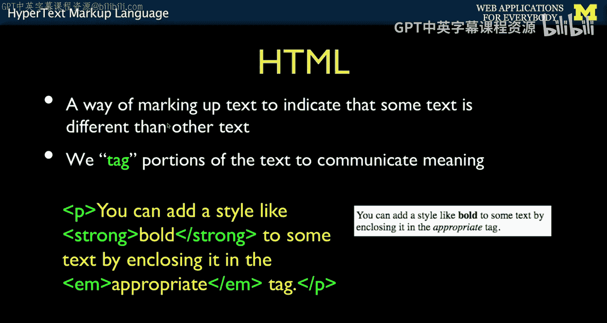

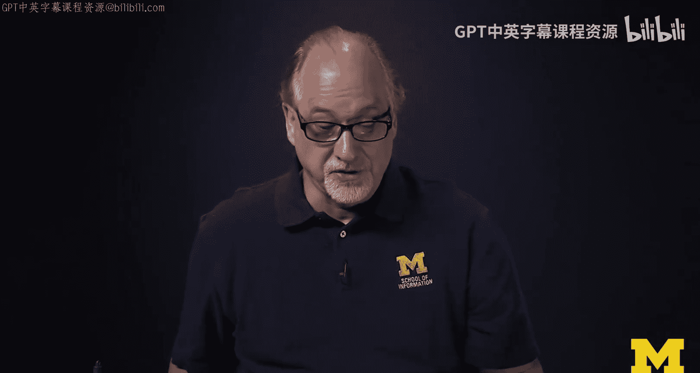

标签使用尖括号 `<` 和 `>` 来定义。例如：
*   `
` 表示一个段落的开始，`
` 表示段落的结束。
*   `<strong>` 表示开始加粗文本，`</strong>` 表示结束加粗。

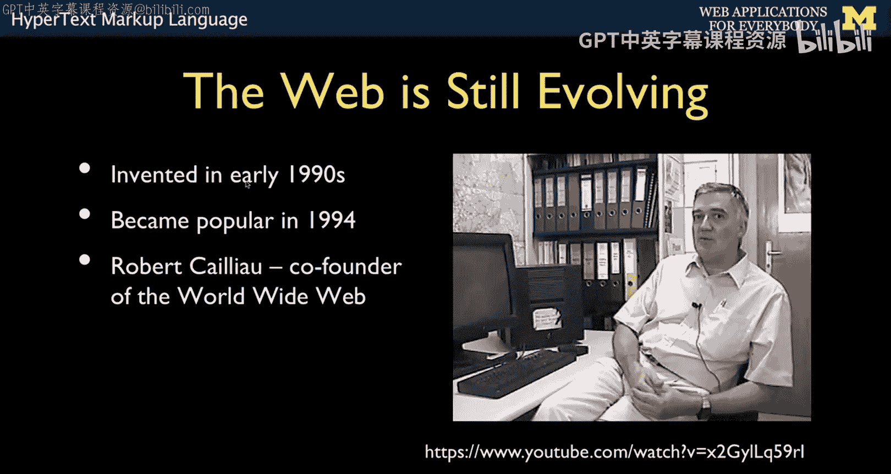

这些标签为文本赋予了结构和样式上的含义。HTML是一种用户可查看的标记格式，类似的格式还有XML（例如现代的.docx文件就基于XML）。

## HTML的起源与演变 🕰️

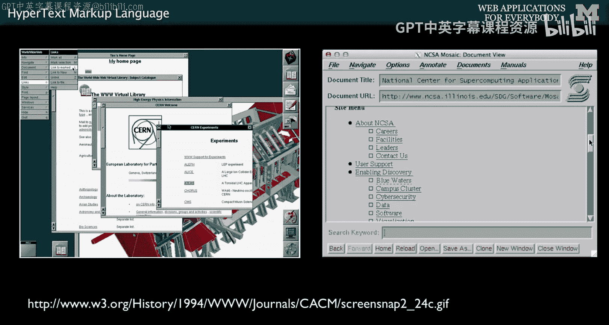

理解HTML为何是现在这个样子，有助于我们更好地掌握它。万维网始于20世纪90年代初，并在1994年开始流行。它的发明者蒂姆·伯纳斯-李和罗伯特·卡里奥最初只是一个小团队，他们需要构建简单、实用的工具。我们得益于他们工程师式的简洁设计，才有了今天丰富多彩的网络世界。在核心层面，它依然是简单而优美的。

值得注意的是，1990年发明的Web与今天的Web大不相同。最初的Web主要用于严肃的文档和学术交流，并非为了娱乐、观看视频或消费信息。HTML最初只是一个“实干家”，用于展示设计文档和图片。点击一个链接就能跳转到另一个页面，这在当时就足以让人们感到兴奋。那些带下划线的蓝色链接仿佛在说“点我，点我”，这在1996年看来就是未来。

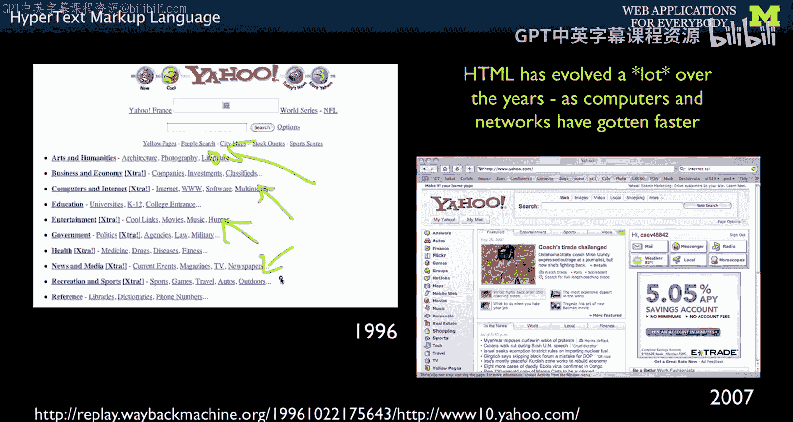

然而，随着更多非技术用户使用网络，网页需要变得更美观。于是，Web技术不断演进。如今，网页已成为强大的商业引擎。像雅虎这样的公司甚至会精确计算页面中白色边框的像素数，通过细微调整来测试用户是否更喜欢某个版本，从而优化出令人愉悦的用户界面。这与早期“链接能用就很棒”的理念形成了鲜明对比。层叠样式表（CSS）在实现这种美观性方面扮演了重要角色，我们将在后续课程中讨论。

## 从宽容到规范：HTML标准的建立 📜

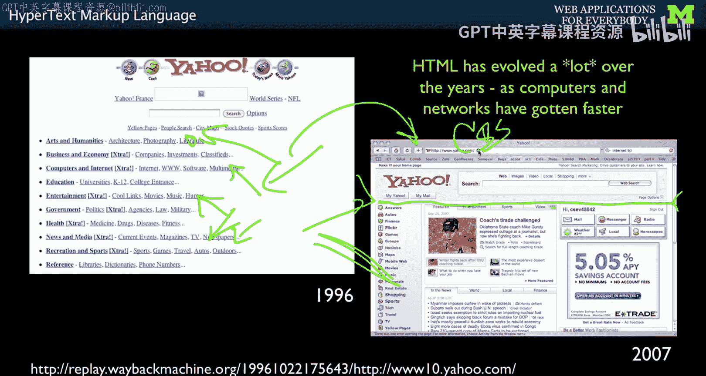

在“美好的旧时光”里，HTML非常宽容。标签可以不闭合，可以使用大写字母，属性可以不加双引号，列表项末尾可以不加 `</li>`。浏览器为了友好显示，会尽力修复这些错误，而不是直接报错。

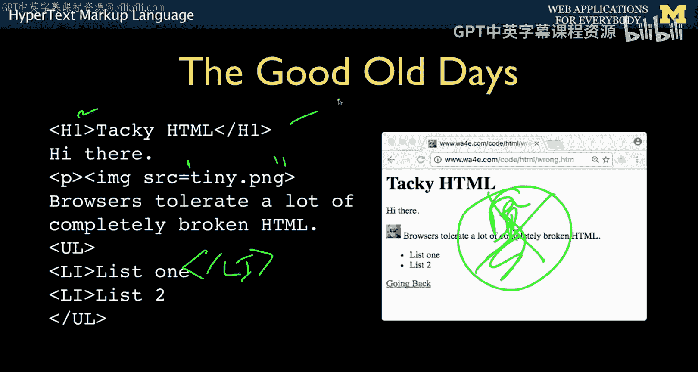

但随着Web在1994-1996年间日益成为商业和生产力的引擎，建立标准变得至关重要。蒂姆·伯纳斯-李从欧洲核子研究中心（CERN）转到了麻省理工学院（MIT），并成立了万维网联盟（W3C）。HTML从一个由工程师为解决特定问题而创建的工具，演变为支撑未来产业的基础技术。从此，HTML开始被系统性地修订，变得更加专业和清晰。

以下是HTML的主要版本演进：
*   HTML 1.0
*   HTML 2.0
*   HTML 3.0（存在时间较短）
*   HTML 4.0（存在了很长时间）
*   **HTML5**（我们当前使用的版本）

W3C制定了HTML应遵循的规则，例如：
*   标签必须使用小写字母。
*   所有标签必须有开始和结束（对于非空元素）。
*   属性值必须用双引号括起来。

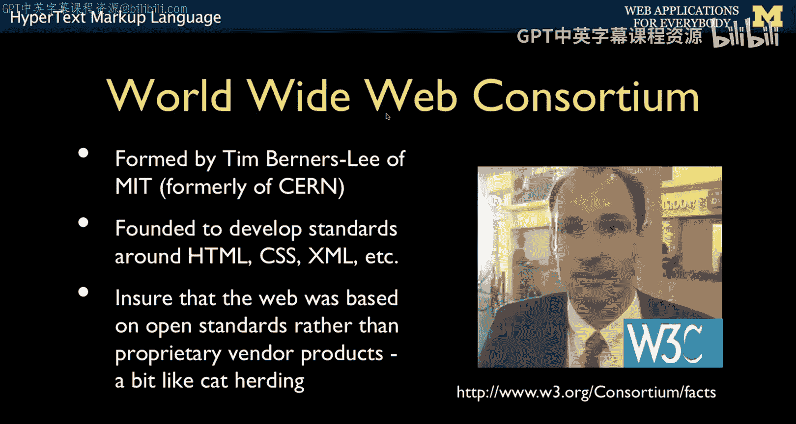

尽管现代浏览器仍然对许多错误保持一定的容忍度，但遵循这些标准能让代码更清晰、更易于维护。正是W3C的工作奠定了我们今天在Web上所做一切的基础，使得网络既强大又美观，同时核心部分依然足够简单易懂。

## 总结

本节课我们一起学习了HTML的基础知识。我们了解了HTML在Web应用架构中的角色，它是一种用于标记文本结构样式的可查看格式。我们回顾了HTML从早期简单、宽容的规范，演变为如今由W3C制定的严谨标准（HTML5）的历程。掌握这些基础知识，将帮助我们更好地理解后续课程中如何动态生成和处理HTML。

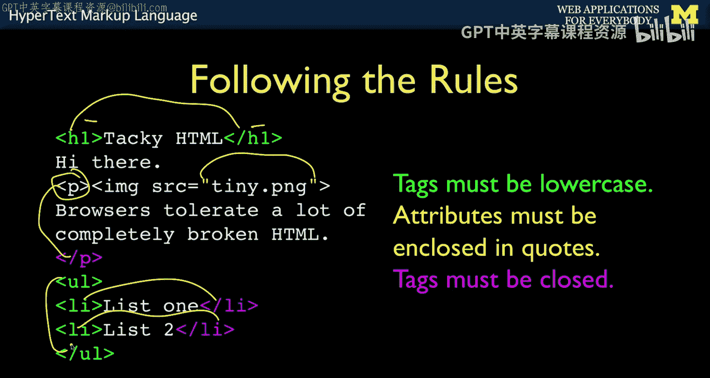

接下来，我们将更详细地探讨HTML文档是如何组织起来的。