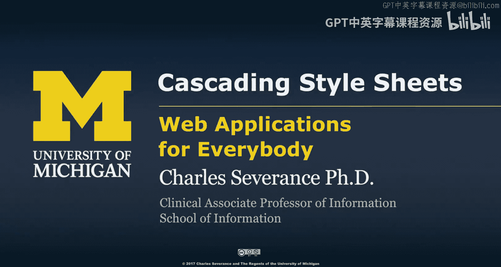
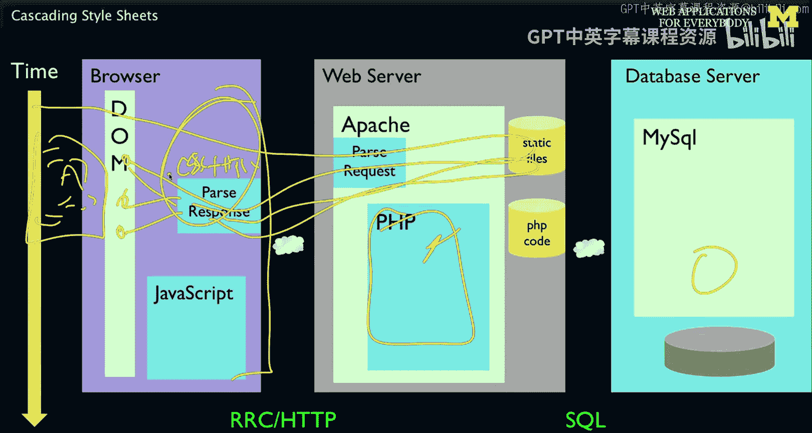
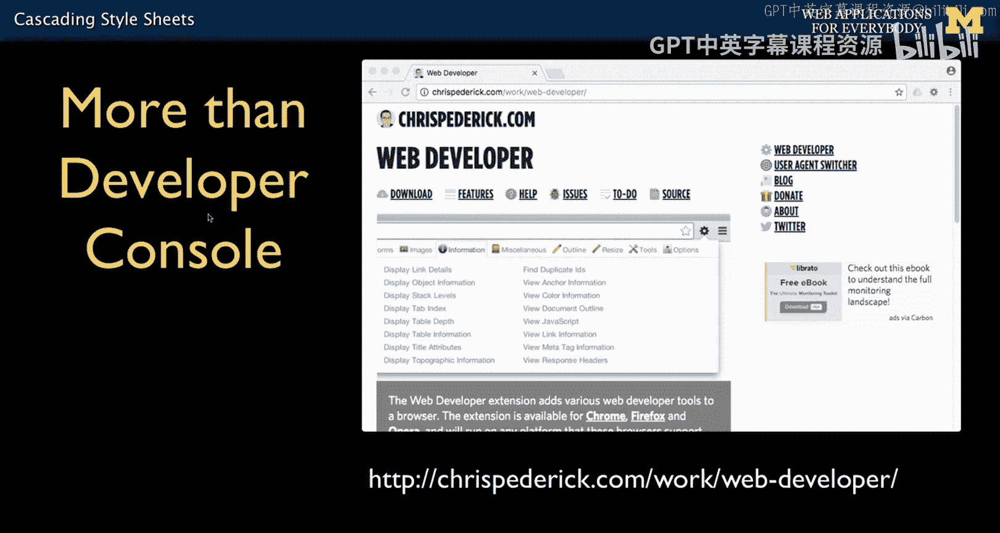
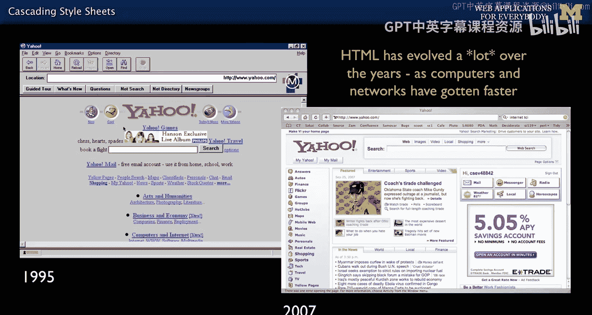
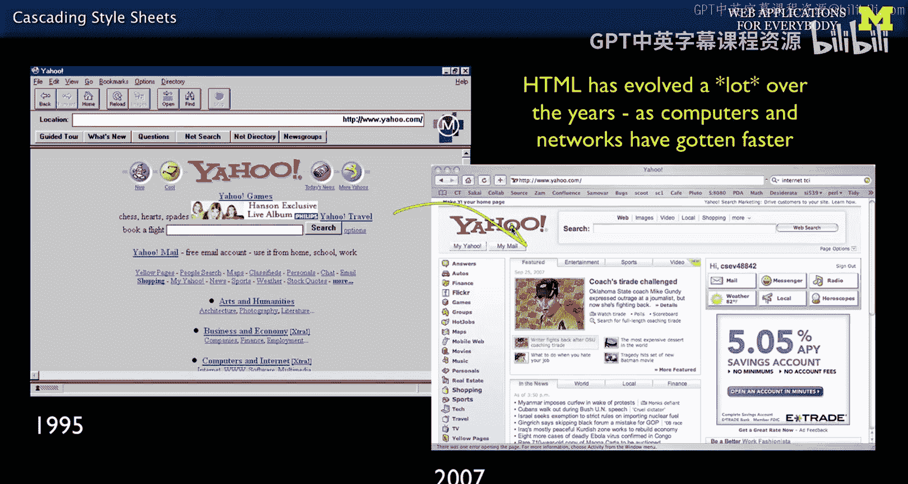
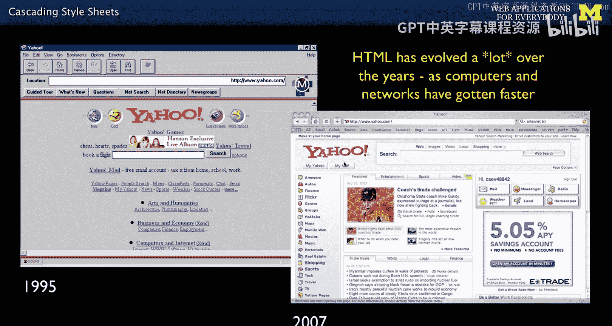
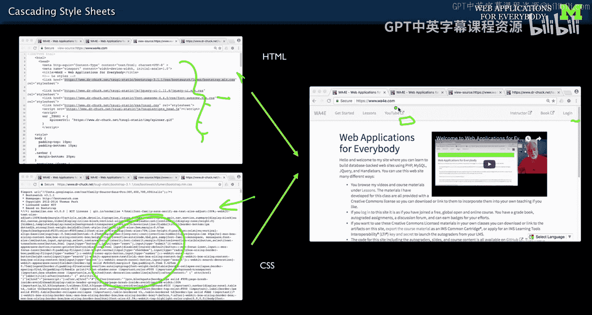
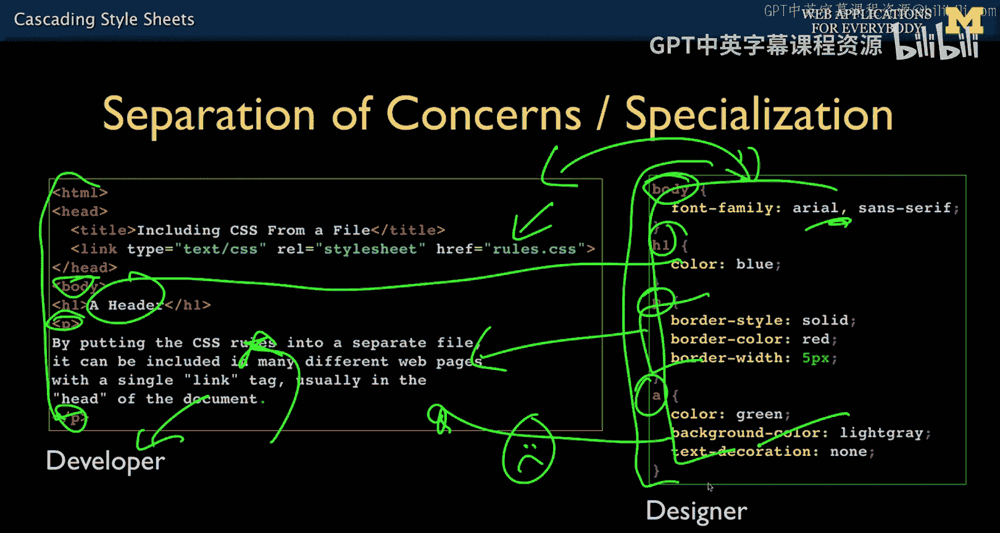
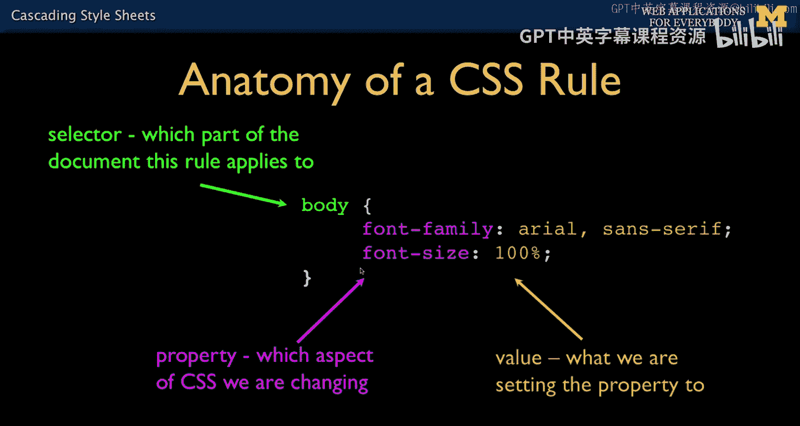
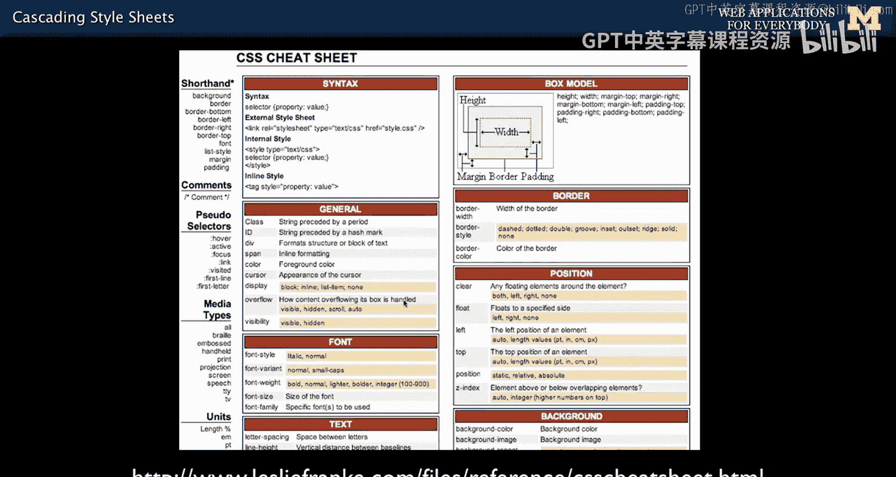

# 012：层叠样式表(CSS) 🎨




在本节课中，我们将要学习层叠样式表（CSS）的基础知识。CSS是用于控制网页外观和布局的语言。我们的目标不是让你成为顶尖的平面设计师，而是让你掌握足够的CSS知识，能够进行基本的样式调整，使后端开发出的网页看起来不至于太糟糕。这对于实现“关注点分离”的理念至关重要，它允许后端开发者和前端设计师各司其职。

## 网页如何工作 🌐


上一节我们介绍了HTML，本节中我们来看看CSS如何与HTML协同工作。

当你在浏览器中点击一个链接时，浏览器会向服务器请求一个HTML文件。服务器返回HTML文件后，浏览器开始解析它并构建文档对象模型（DOM）。在解析过程中，如果HTML文件里引用了CSS文件，浏览器会暂停解析，去获取这个CSS文件。CSS文件加载后，其中的规则会应用到DOM元素上，最终，HTML和CSS共同决定了你在屏幕上看到的每一个像素的精确布局。

目前，我们主要关注浏览器如何渲染内容。很快，我们将学习如何编写代码并与数据库交互。但现阶段，我们讨论的是浏览器端，因此很多示例代码甚至不需要运行在Web服务器上，因为我们还没有涉及动态内容。



## 开发者工具 🔧

如果你使用Firefox浏览器，有一款插件可能对你非常有用。当然，你可能也用Chrome。有些开发者同时使用Firefox和Chrome，因为Firefox的Web开发者工具（注意，这不同于开发者控制台）提供了一些非常酷的功能，能让你很好地调试CSS。你可以去Firefox安装这个工具来使用它。它和普通的Web开发者控制台不同，更侧重于CSS和其他设计方面的调试。






## 从朴素到精美：CSS的作用 ✨


我之前说过，HTML非常古老，已经有超过20年的历史。它最初以灰色背景、蓝色带下划线的链接为特征，我们当时能有一个列表就很开心了。在上一讲的HTML中，我们介绍了`<ul>`列表标签、`<a>`锚点标签、``图片标签等。

而现在，我们拥有了精美、商业化、以用户为导向、能创造收入的用户界面外观和体验。CSS正是实现这种精美外观的技术。正如我所说，我不会教你如何精通CSS，但我会告诉你它的重要性。

如果你访问我的网站“web applications for everybody .com”，并使用Web开发者插件关闭CSS，你会看到导航栏脱离了样式之后的样子。关闭CSS是我最喜欢做的事情之一。这样做时，你应该看到的是**语义化标记**——即没有CSS时，你的标记结构依然清晰、有意义。




以下是关闭CSS后你可能会看到的内容：
*   你会看到链接，以及一个链接列表。
*   这个链接列表实际上就是网页上那个漂亮的导航栏。
*   旁边可能还有另一个列表。

对于视觉无障碍人士来说，这就是他们“看到”你网站的方式。他们看不到那些漂亮的阴影和渐变效果。因此，将视觉元素与语义元素分离非常重要。这不仅是为了方便视觉障碍人士，也为我们开发者自己着想。我们希望保持HTML结构尽可能简洁优美，然后让优秀的平面设计师来创造美丽的外观。

作为后端程序员，我们必须确保网页看起来不至于太差。看看我所有的网站，你就能明显看出我更偏向于后端开发。我使用Bootstrap和一些简单的CSS，让网站不至于难看，但也谈不上精美。我的目标是构建真正优美的标记结构，然后配上足够的CSS让它不至于丢人，最后再由比我更有才华的人把它变得真正漂亮。

## CSS与HTML的协作 🤝

最终，你拥有HTML文件，它会加载CSS等资源。在CSS文件中，包含了大量高度详细的标记性指令，比如某个灰色条的宽度、某个部分使用的字体、各元素之间的间距等等。



你可以这样理解：浏览器加载HTML，加载CSS，然后将两者结合起来，逐像素地生成视觉上精美的外观。但保持你的HTML在技术或语义上的优美同样重要。

## 后端与前端的桥梁 🌉



我们再次回到后端和略微涉及前端的开发者角色，这也是本课程的目标。我们将生成一些HTML，并尽可能使其结构简单。我们会引入一些CSS，由它来告诉浏览器如何渲染这些元素。

在CSS中，规则是这样工作的：例如，你看到`body`标签，我就定义`body`标签应该发生什么；你看到`p`段落标签，我就定义所有`p`标签应该发生什么；你看到`h1`标题标签，我就定义它应该是蓝色的。这是两个独立的文件。

我编写代码，构建一个勉强能用的CSS来应付日常开发，然后可以把这部分工作交给别人。他们可以只编辑CSS文件，不断刷新页面，让网页变得越来越漂亮。这允许开发者与设计师分工协作。当然，有时你既是开发者也是设计师。但它确实允许有才华的开发者专注于构建逻辑，而有才华的设计师专注于让开发者的作品看起来更出色。

## CSS语法基础 📝



CSS的语法与HTML、PHP和JavaScript都不同。HTML和CSS确实是编程语言，但它们不是过程式编程语言。HTML是一种声明式语言，你只需声明“这是一个段落”，浏览器会自己解决如何显示它。CSS也是如此，它是一种声明式语言。

这意味着你不写循环，没有变量，不控制逻辑步骤。你只是声明所有你希望发生的事情，它们基本上会同时生效。这就是CSS编程语言的语法，尽管它和任何过程式编程语言都大不相同。顺便说一句，很多人喜欢这种非过程式编程。

CSS的语法相当简单优雅，很多人甚至不用上课就能学会。其基本结构如下：


```css
selector {
    property: value;
    another-property: another-value;
}
```

*   **选择器**：最简单的选择器就是标签名，比如`body`。
*   **声明块**：由一对花括号 `{}` 包裹。
*   **属性与值**：在花括号内，是一系列`属性: 值;`的声明。例如，`font-family`是一个属性，我们将其值设置为`Arial`。如果`Arial`字体不可用，则使用通用的`sans-serif`字体。`font-family`属性允许你按优先级降序列出一系列字体选项，用逗号分隔。每个声明以分号结束。

在花括号内可以有多个这样的声明。这就是基本的CSS语法。在之前的幻灯片中，你可能看到所有代码挤在一起，实际上CSS中的空白字符（空格、换行）不影响解析，但为了人类阅读方便，我们通常会进行缩进，这在认知上非常重要。

所以，规则分为两部分：规则应用的对象（选择器），以及一系列键值对（属性:值）。我们需要查阅资料来学习每个属性的作用和用法。网络是学习CSS的绝佳资源。例如，你可以搜索“CSS透明度属性是什么？”，然后会找到一个小示例，你可以复制粘贴。我们通过复制粘贴和Stack Overflow这样的网站来学习。Stack Overflow上有成千上万个关于“如何给按钮添加2像素边框”的答案。

## 学习资源与总结 📚



你可能需要为自己准备一份速查表。我并不擅长记忆CSS属性——也许因为我是后端程序员，而非前端。我知道一些东西，比如`margin`（外边距）、`padding`（内边距）、`strong`、`bold`、`em`（强调）和`a`（锚点）标签等，但我经常需要查阅资料。随着使用CSS越来越多，我有所进步，但像`padding`和`margin`如何工作这类细节，你可能在一段时间内都需要速查表的帮助。

接下来，我们将讨论一些具体的CSS属性，但请理解，这绝不是CSS的全部。在接下来的课程中，我们会涵盖其中一部分。




本节课中我们一起学习了CSS的基本概念、它在网页渲染中的作用、与HTML的协作方式、基础的语法结构，以及作为后端开发者掌握基础CSS技能的重要性。记住，我们的目标是能够创建结构良好（语义化）的HTML，并应用足够的CSS使其外观得体，为后续可能的设计美化工作打下坚实基础。