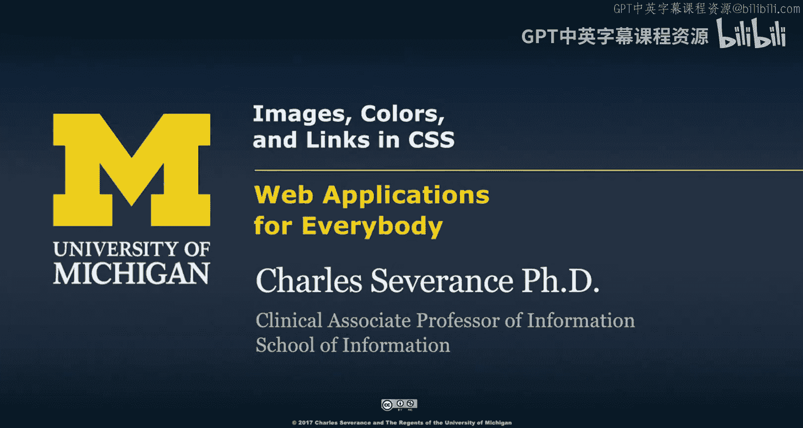
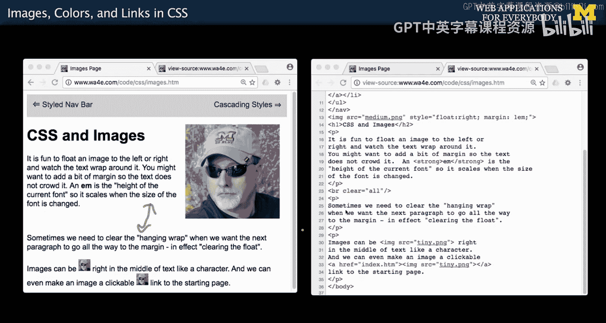
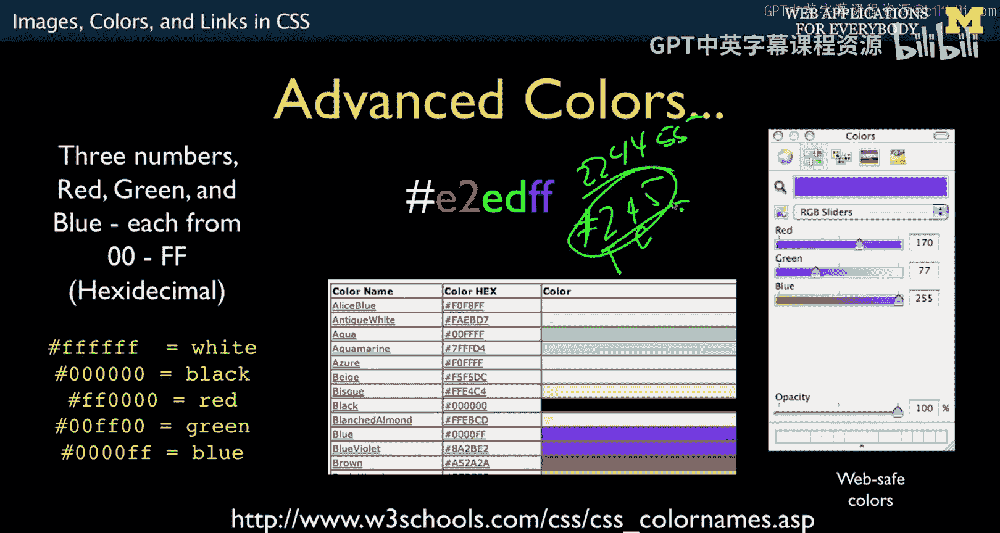
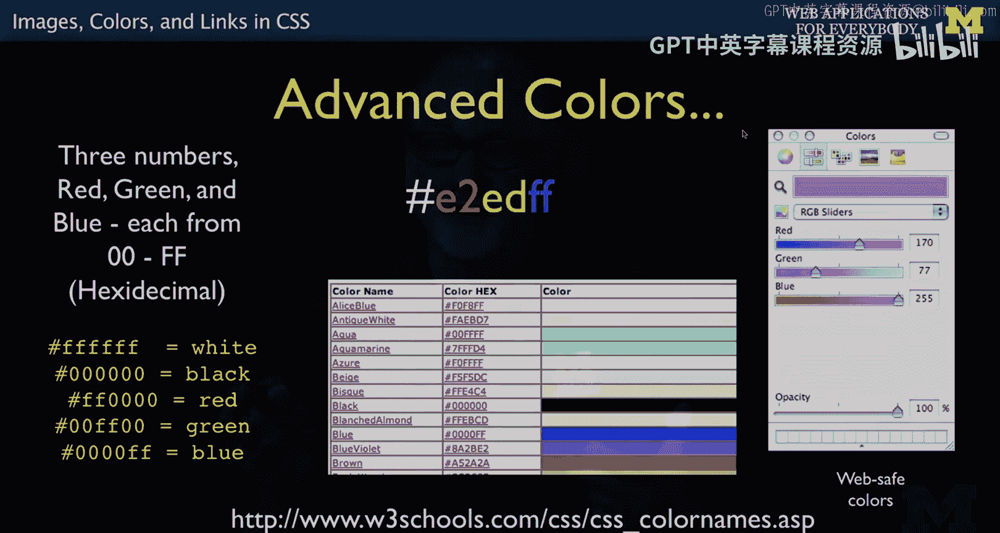
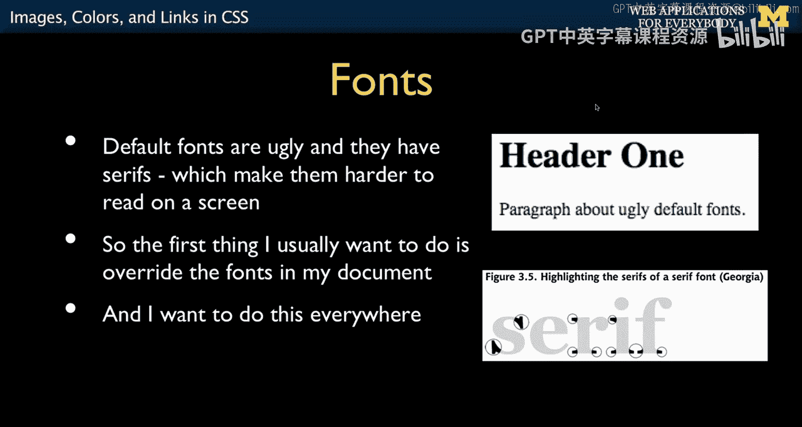
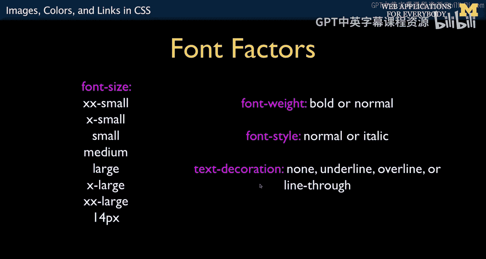
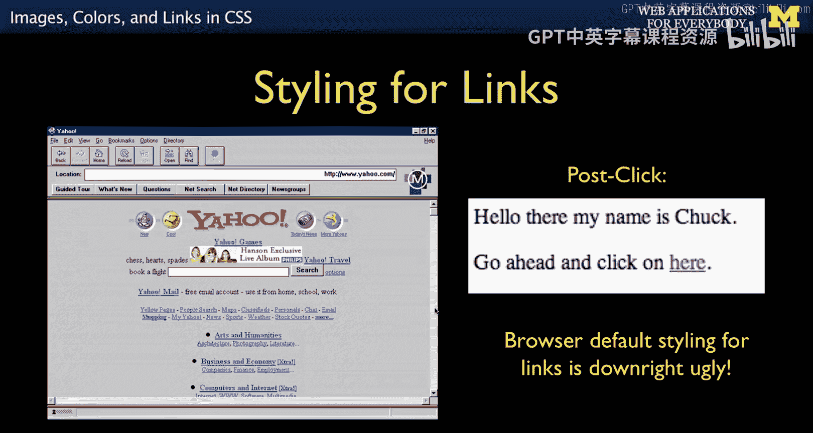
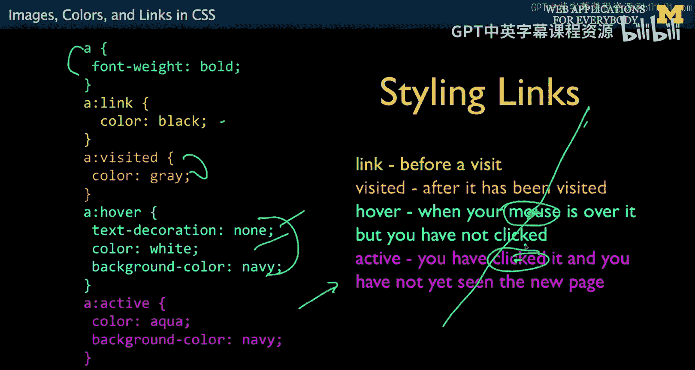
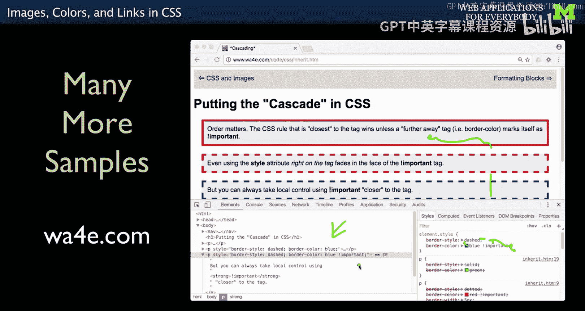

# 015：CSS中的图像、颜色与链接 🎨




在本节课中，我们将学习如何使用CSS来美化网页中的图像、设置颜色与字体，并掌握链接的样式控制。这些是构建视觉吸引力强、用户体验良好的网页的基础技能。

## 图像浮动与环绕


上一节我们介绍了CSS的基本布局概念，本节中我们来看看如何让图像与文本和谐共存。网页早期最吸引人的特性之一，就是能够实现文本环绕图像的效果。这通过CSS的 `float` 属性实现。

以下是如何让一张图片浮动到右侧，并使文本环绕其周围的代码示例：

```css
img {
    float: right;
    margin: 1em;
}
```

*   **`float: right;`**：这条规则将图像从正常的文档流中“提升”出来，并将其浮动到其容器的右侧边缘。后续的文本内容会将其作为对齐边界，从而实现环绕效果。
*   **`margin: 1em;`**：这条规则为图像四周添加了 `1em` 的外边距，以防止文本紧贴图像，创造舒适的视觉间距。

这里引入了一个重要的CSS单位：**`em`**。`1em` 等于当前字体中字母“M”的宽度。它是一个相对单位，会随着页面缩放或字体大小改变而相应变化，这使得布局更具响应性和适应性。



有时，你需要强制后续内容在浮动元素下方开始新行，这时可以使用 `clear` 属性。

```html
<br clear="all">
```


`clear="all"` 属性（或CSS中的 `clear: both;`）会清除所有浮动，强制其后的元素（如下一段落）从左侧边界开始，即使这会在上方留下一些空白区域。

## 颜色的设置

颜色是网页设计中的核心元素。CSS提供了多种方式来指定颜色。

首先，有一些内置的颜色名称，如 `aqua`、`black`、`blue`、`red` 等。虽然这些颜色可能不够精美，但对于开发者调试样式（例如临时设置 `background-color: red;` 来高亮某个元素）非常有用。

更常用和强大的是使用十六进制代码来定义颜色。



```css
color: #ff0000; /* 纯红色 */
background-color: #00ff00; /* 纯绿色 */
```






十六进制颜色代码以 `#` 开头，格式为 `#RRGGBB`。
*   `RR`、`GG`、`BB` 分别代表红、绿、蓝三个颜色通道。
*   每个通道的值范围是 `00` 到 `FF`（十六进制），对应十进制的 0 到 255。
*   通过混合不同强度的红、绿、蓝光，可以创造出数百万种颜色。

例如，`#ff0000` 表示红色通道最大（`ff`），绿色和蓝色通道为0，因此是纯红色。这类似于图形软件中的RGB滑块。

还有一种简写形式是三位十六进制代码 `#RGB`，它相当于将每位重复一次，即 `#RGB` 等于 `#RRGGBB`。例如，`#f00` 等同于 `#ff0000`。


## 字体与文本样式

默认的网页字体（如Times New Roman）可能显得过于传统。CSS的 `font-family` 属性允许我们指定更符合现代审美的字体。

```css
body {
    font-family: "Trebuchet MS", Helvetica, Arial, sans-serif;
}
```

`font-family` 的值是一个**字体栈**，即按优先级排列的字体名称列表。浏览器会从左到右尝试使用列表中的字体，如果用户系统上没有第一种字体，则尝试下一种。通常，最后会指定一个通用字体族（如 `sans-serif`、`serif`、`monospace`）作为兜底方案，确保至少有一种可用字体。

以下是其他常用的文本样式属性：

```css
p {
    font-size: 16px; /* 字体大小，也可用em、rem等单位 */
    font-weight: bold; /* 字体粗细：normal 或 bold */
    font-style: italic; /* 字体样式：normal 或 italic */
    text-decoration: underline; /* 文本装饰：none, underline, overline, line-through */
}
```
*   `font-weight` 和 `font-style` 是独立的属性，可以组合使用，例如同时设置 `bold` 和 `italic`。
*   关于 `font-size`：使用像素(`px`)是直接的方式，但现代浏览器在用户缩放页面时通常会智能地缩放以`px`定义的字体大小，以提升可访问性。相对单位如 `em`、`rem` 是更灵活的选择。



## 链接的样式控制




超链接是网页的基石。CSS允许我们根据链接的不同状态来设置样式，从而提升用户的交互体验。

链接有以下几种主要状态，可以使用**伪类选择器**来分别定义样式：

```css
/* 默认/未访问的链接 */
a:link {
    color: blue;
    text-decoration: underline;
}

/* 已访问的链接 */
a:visited {
    color: purple;
}



/* 鼠标悬停在链接上时 */
a:hover {
    color: red;
    background-color: yellow;
    text-decoration: none;
}

/* 链接被点击的瞬间（到新页面加载前） */
a:active {
    color: green;
}
```


以下是各状态的作用：
*   **`:link`**：定义尚未被用户访问过的链接的样式。
*   **`:visited`**：定义已被访问过的链接的样式。
*   **`:hover`**：当鼠标指针悬停在链接上时生效。常用来提供视觉反馈，例如改变颜色或背景。
*   **`:active`**：在链接被点击（鼠标按下但未释放）的瞬间生效。由于这个过程通常非常短暂，此状态使用较少。

这种基于状态的样式设计，能够有效引导用户注意力，并让导航操作更加直观和吸引人，这在像谷歌搜索结果页这样的链接列表中效果显著。



## 总结


本节课中我们一起学习了CSS中几个美化网页内容的关键技术。我们掌握了如何使用 `float` 属性实现图像的文字环绕效果，并了解了 `em` 这个相对单位。我们学习了通过颜色名称和十六进制代码来设置颜色。我们还探讨了如何通过 `font-family` 字体栈来指定字体，并控制字体大小、粗细等样式。最后，我们深入了解了如何使用伪类选择器（`:link`、`:visited`、`:hover`、`:active`）为超链接的不同交互状态设置样式，从而大大增强用户的浏览体验。结合这些技能，你已经可以为网页添加丰富的视觉层次和交互反馈了。