# 019：在Windows 10上安装MAMP与编写第一个PHP程序 🛠️

在本节课中，我们将学习如何在Windows 10系统上安装MAMP集成开发环境，并使用Atom文本编辑器编写并运行第一个PHP程序。课程将涵盖从软件下载、安装配置到编写、调试代码的完整流程。

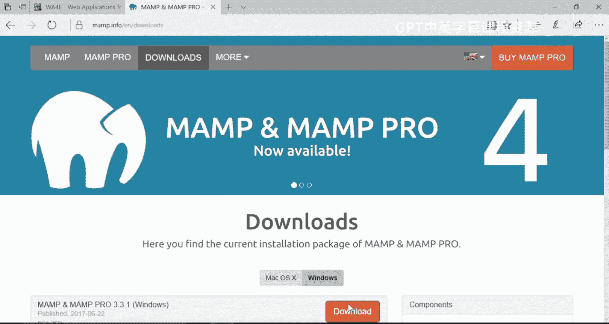

## 安装MAMP


上一节我们介绍了课程目标，本节中我们来看看如何下载并安装MAMP。

首先，访问MAMP官方网站并下载适用于Windows的安装程序。下载完成后，运行安装程序。


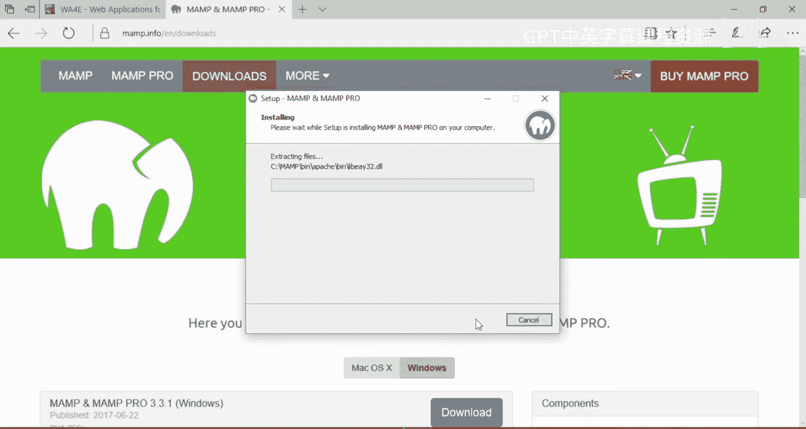


安装程序启动后，选择安装语言为“English”，然后点击“Next”。


在安装选项中，取消勾选“安装MAMP Pro”的复选框，仅安装免费的MAMP版本。接着，接受许可协议。


选择MAMP的安装目录，建议使用默认路径。然后继续点击“Next”完成后续安装步骤。


安装完成后，运行MAMP应用程序。


## 配置MAMP服务器

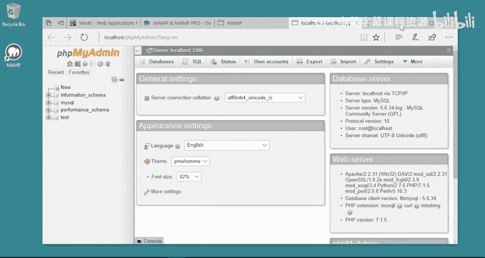


上一节我们完成了MAMP的安装，本节中我们来看看如何启动和配置服务器。

启动MAMP后，桌面上会出现其快捷方式。首次运行时，系统可能会弹出防火墙警告。

以下是需要允许的访问权限：
*   允许Apache HTTP服务器通过防火墙。
*   允许MySQL数据库服务器通过防火墙。

这两个权限非常重要，以确保Web服务器和数据库能正常通信。配置完成后，服务器应成功启动。

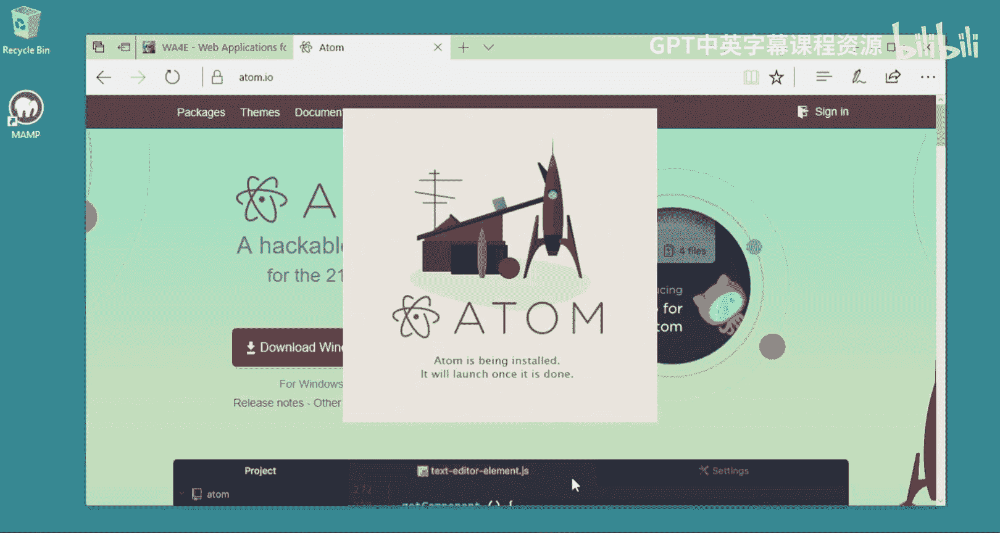

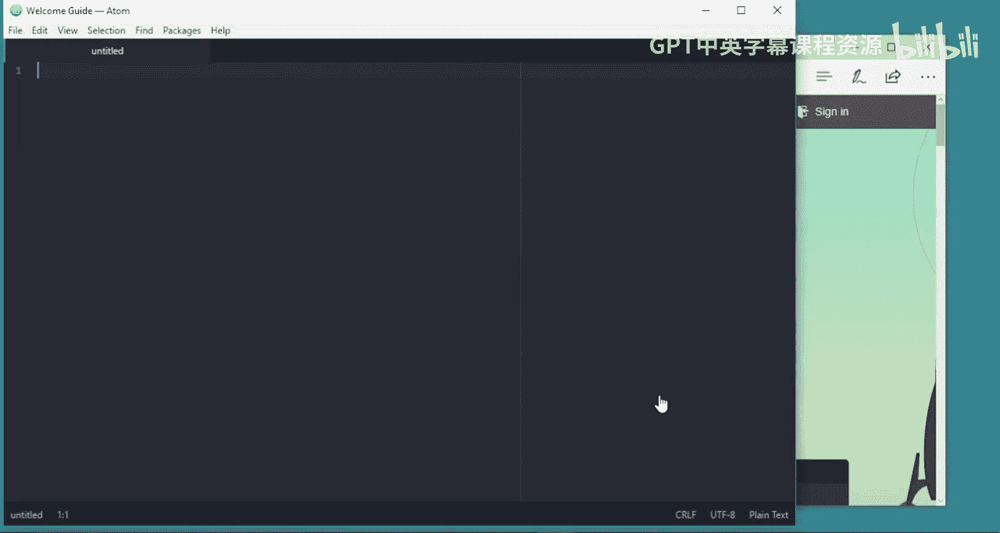

此时，可以打开MAMP的“Start Page”起始页。在起始页中，可以查看PHP信息或打开phpMyAdmin。


如果phpMyAdmin能够正常加载并显示类似界面，则表明MAMP已成功安装并运行。


## 安装Atom文本编辑器

上一节我们配置好了服务器环境，本节中我们来看看如何安装代码编辑器。

欢迎回到课程。现在我们将安装Atom文本编辑器。你可以选择任何喜欢的文本编辑器，推荐Atom是因为它跨平台且功能强大。请勿使用记事本或Word，因为它们会破坏代码文件结构。我们需要一个具备语法高亮等功能的专业文本编辑器。

下载Atom安装程序并运行。


按照安装向导的提示完成Atom的安装。


## 编写第一个PHP程序

上一节我们准备好了所有工具，本节中我们来看看如何创建并运行第一个PHP脚本。

现在我们将编写第一个PHP应用程序。请同时启动MAMP和Atom。

在MAMP中，需要启动Apache服务器和MySQL数据库服务器。


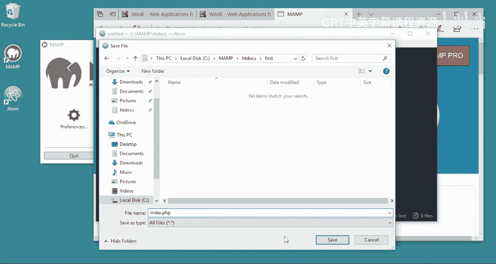

然后，打开MAMP的起始页，这里包含有用的信息，例如PHP配置详情。运行phpMyAdmin以确认数据库服务正常。


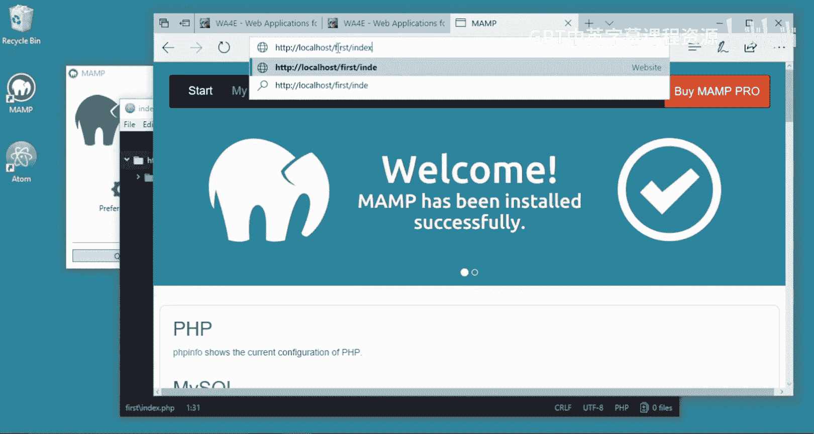

如果phpMyAdmin能正常显示，说明所有服务运行良好。

接下来开始编写代码。在Atom中，创建一个新文件。

输入以下HTML代码：
```html
<h1>Hello from a web page</h1>
```
现在保存这个文件。需要将其保存到MAMP的网站根目录下。

该目录路径通常为：`C:\MAMP\htdocs\`。你可以在此目录下创建文件夹来组织项目。

创建一个名为`first`的新文件夹。


将文件以`index.php`为名保存到`first`文件夹中。`index.php`是一个特殊文件名，当浏览器访问目录时，默认会打开此文件。


保存后，Atom会为代码提供语法高亮。

现在，打开浏览器，访问以下地址来运行这个文件：
```
http://localhost/first/index.php
```


你会看到网页显示了“Hello from a web page”。目前这只是一个纯HTML页面。

## 在PHP中嵌入代码

上一节我们创建了一个纯HTML文件，本节中我们来看看如何在其中执行PHP代码。

到目前为止，我们还没有运行任何PHP代码。现在让我们添加一些PHP代码。

PHP代码需要包裹在特定的标签内。在`index.php`文件中，添加以下代码：
```php
<?php
echo "Hi there.\n";
?>
```
保存文件，然后在浏览器中刷新页面。


页面上会显示“Hi there”。这段文本是由PHP的`echo`语句输出的。

我们可以在PHP代码中混合HTML。例如：
```php
<p>
<?php
echo "Hi there";
?>
</p>
```
保存并刷新后，输出结果会嵌入到段落标签中。

在PHP代码块中，服务器会执行其中的逻辑，并将结果输出到网页上。例如，我们可以进行计算：
```php
<?php
$x = 6 * 7;
echo "The answer is " . $x;
?>
```
保存并刷新页面，浏览器将显示计算结果。


所有在PHP代码块中`echo`或打印的内容，都会成为最终生成的网页的一部分。你可以将文件和文件夹放在`htdocs`目录下，然后通过浏览器访问来执行它们。

## 启用PHP错误显示

上一节我们编写了能正常工作的代码，本节中我们来看看如何处理代码错误，这是一个非常重要的开发配置。

我们刚刚完成了第一个Web应用程序。现在，让我们故意在代码中制造一个语法错误，例如删除一行代码末尾的分号。

保存文件并在浏览器中刷新。


此时，页面可能只显示一个不明确的错误（如HTTP 500错误），而没有具体的错误信息。这对于调试代码非常不利。

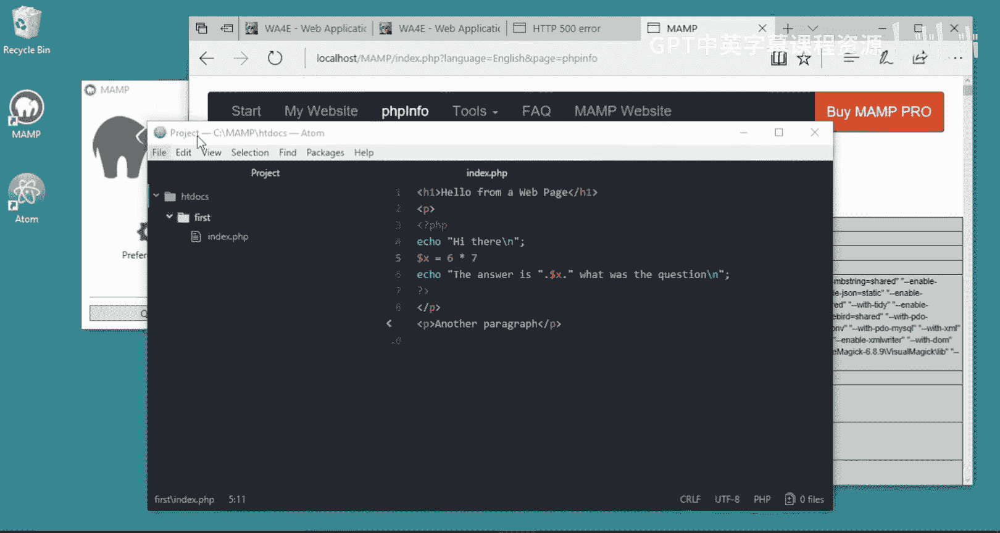

默认情况下，MAMP安装后关闭了在网页上显示错误的功能。这对生产环境是安全的，但对开发者不友好。我们需要启用它。

打开MAMP起始页，点击“PHPInfo”链接。


在PHPInfo页面中，找到“Loaded Configuration File”这一行。它显示了当前加载的PHP配置文件路径，例如：`C:\MAMP\conf\php7.1.5\php.ini`。请记下你的PHP版本号。


用Atom或其他文本编辑器打开这个`php.ini`配置文件。

在文件中搜索`display_errors`设置项。

找到以下两行：
```
display_errors = Off
display_startup_errors = Off
```
将它们修改为：
```
display_errors = On
display_startup_errors = On
```
修改后保存文件。


由于修改了服务器核心配置，需要重启MAMP服务才能使更改生效。在MAMP界面中停止Apache和MySQL服务器，然后再次启动它们。


服务器启动后，再次在浏览器中刷新那个包含错误的页面。


现在，页面上会显示详细的错误信息，例如：“Parse error: syntax error, unexpected ‘echo’ (T_ECHO) in C:\MAMP\htdocs\first\index.php on line 6”。这明确指出了错误位置和类型。

根据错误提示，回到代码中，在第6行补上缺失的分号。


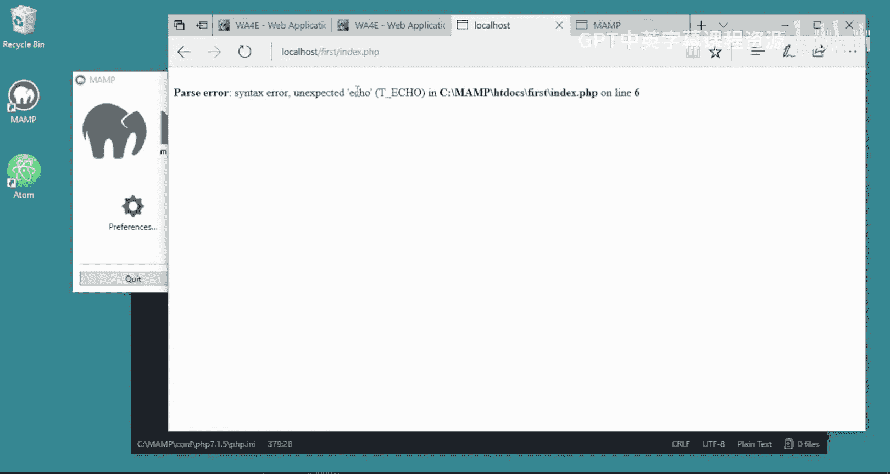

保存文件并再次刷新浏览器，页面应该能正常显示了。


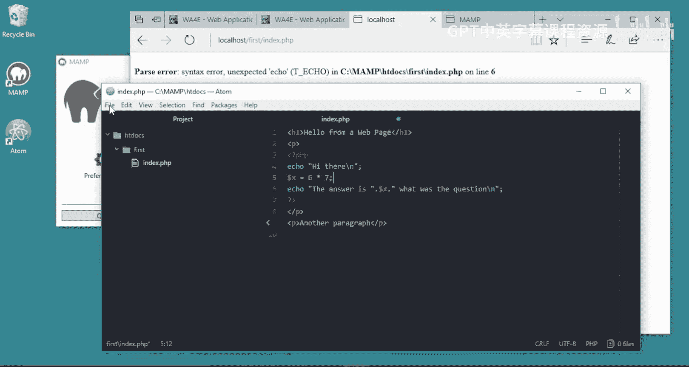

请务必在开发早期完成此项设置。如果关闭错误显示，你在调试代码时将浪费大量时间。开启错误显示能让你在犯错时立刻获得反馈，是保持开发效率的关键。

---

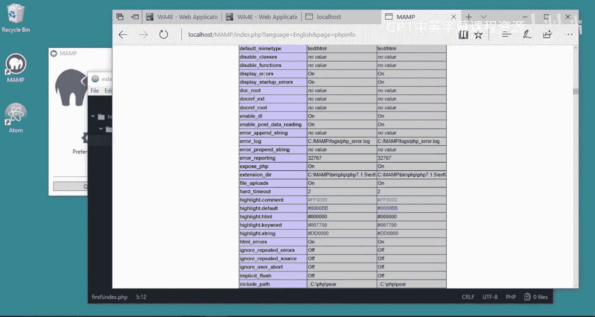

本节课中我们一起学习了在Windows 10上安装和配置MAMP开发环境，安装了Atom编辑器，创建并运行了第一个PHP程序，并学会了如何启用PHP错误显示功能以方便调试。这些是开始PHP Web开发的基础步骤。