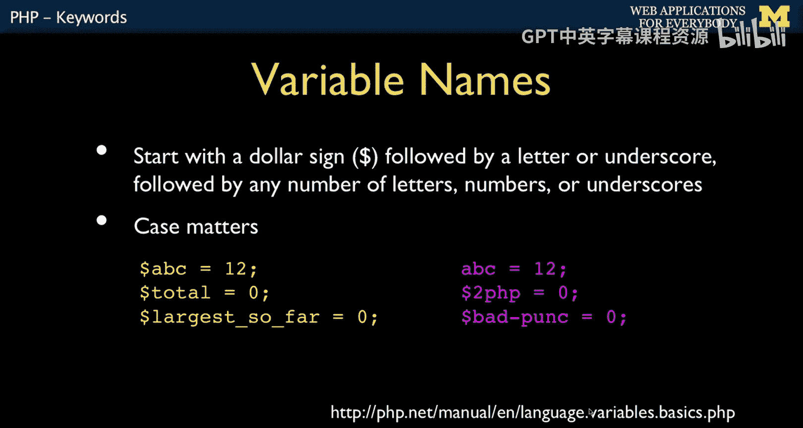
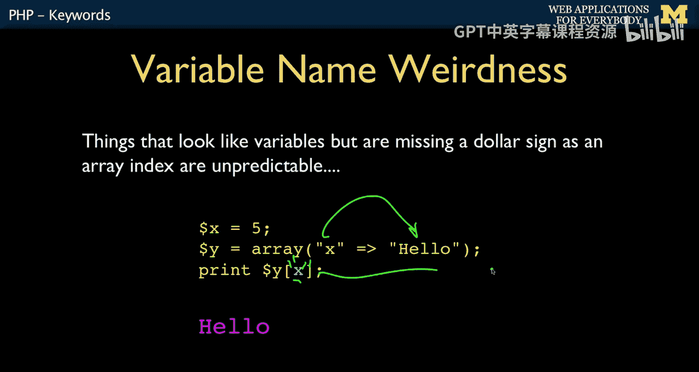
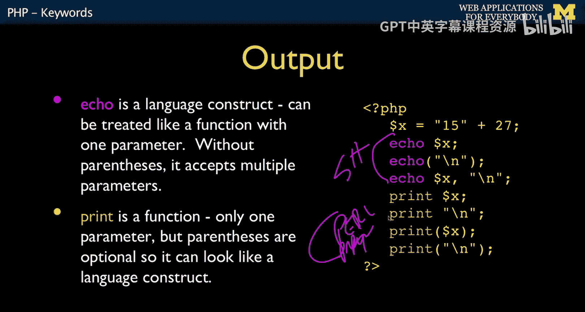

# 025：PHP关键字与基础语法 🗝️


在本节课中，我们将要学习PHP语言中的一些基础但至关重要的概念，包括关键字、变量命名规则、字符串的用法以及注释和输出语句。理解这些内容是编写正确PHP代码的第一步。

## 关键字与保留字

任何编程语言的一个重要组成部分都是关键字和保留字。这些是您不能用于其他用途的词语。这意味着如果您使用诸如 `class`、`clone`、`do` 或 `else` 这样的词，PHP会将其理解为具有特定含义的指令，而不会将其视为变量名等。您必须避免使用这些保留字。有时，错误地使用它们可能会导致语法错误。





以下是PHP中的部分关键字示例：
*   `class`
*   `clone`
*   `do`
*   `else`
*   `case`
*   `as`

## 变量命名规则

上一节我们介绍了关键字，本节中我们来看看PHP中变量的独特之处。PHP最奇怪的特点之一是所有变量都以美元符号 `$` 开头。这可以追溯到Perl语言。美元符号后必须紧跟一个字母或下划线，之后则可以包含字母、数字和下划线。

变量命名的基本规则可以用以下公式描述：
`$[a-zA-Z_][a-zA-Z0-9_]*`



我们通常避免使用下划线，除非是内部使用的变量。例如，在构建库时，如果有一个不希望外部直接使用的变量，可能会在其前面加上下划线，以减少命名冲突的可能性。


关于变量，一个需要特别注意的问题是：如果遗漏了美元符号，它可能不会立即导致语法错误，但会引发难以调试的问题。例如，`x`（没有`$`）可能被PHP解释为一个预定义的常量，其值可能被视为0，并产生非致命错误。而在赋值语句的左侧遗漏`$`则会导致解析错误。因此，务必养成正确书写变量名的习惯。

## 字符串处理

字符串在PHP中的处理方式与其他一些编程语言有所不同。PHP的字符串功能非常强大。

您可以使用单引号或双引号来定义字符串，它们的功能略有不同。反斜杠 `\` 被用作转义字符。

以下是字符串的主要特性：

*   **双引号字符串**：被认为是“智能字符串”。变量在其中会被展开（替换为变量的值），并且转义序列（如 `\n` 表示换行）会生效。字符串可以跨越多行，这非常方便。
    ```php
    $expand = 12;
    echo "Value is $expand"; // 输出：Value is 12
    echo "Line 1\nLine 2"; // 输出两行
    ```

*   **单引号字符串**：被认为是“非智能字符串”。变量**不会**被展开，大多数转义序列（除了 `\\` 和 `\'`）也**不会**被解释。`\n` 会直接作为两个字符输出。但单引号字符串中可以直接包含双引号。
    ```php
    echo 'Value is $expand'; // 输出：Value is $expand
    echo 'Line 1\nLine 2'; // 输出：Line 1\nLine 2
    echo 'She said "Hello"'; // 输出：She said "Hello"
    ```

*   **字符串连接**：PHP使用点号 `.` 作为字符串连接运算符，这与许多使用加号 `+` 进行字符串连接的语言不同。
    ```php
    $str1 = "Hello";
    $str2 = "World";
    echo $str1 . " " . $str2; // 输出：Hello World
    ```

## 注释与输出

注释在PHP中非常灵活，它支持多种风格的注释，这方便了来自不同编程背景的开发者。

以下是PHP支持的注释方式：

*   **C++风格**：`// 这是一行注释`
*   **Shell/Perl风格**：`# 这是一行注释`
*   **C风格多行注释**：`/* 这是多行注释 */`

对于输出，PHP提供了多种方式，体现了其“有多种方法可以完成同一件事”的哲学。

主要的输出语句是 `echo` 和 `print`：
*   **`echo`**：是一个语言结构，可以接受多个参数，参数之间用逗号分隔，输出时直接连接而不添加空格。
    ```php
    $x = "Hello";
    echo $x, " World"; // 输出：HelloWorld
    ```
*   **`print`**：本质上是一个函数，但括号可以省略。它只能接受一个参数。`echo` 和 `print` 的功能几乎相同，主要区别在于 `echo` 可以输出多个值。

## 总结




本节课中我们一起学习了PHP的基础语法要素。我们了解了必须避开的**关键字**，掌握了以美元符号 `$` 开头的**变量命名规则**。我们深入探讨了**单引号**和**双引号字符串**在变量展开和转义字符处理上的重要区别，以及使用点号 `.` 进行字符串连接。最后，我们认识了PHP灵活的**注释风格**和用于输出内容的 `echo` 与 `print` 语句。理解这些基础概念是后续学习PHP运算符、表达式和更复杂功能的关键。