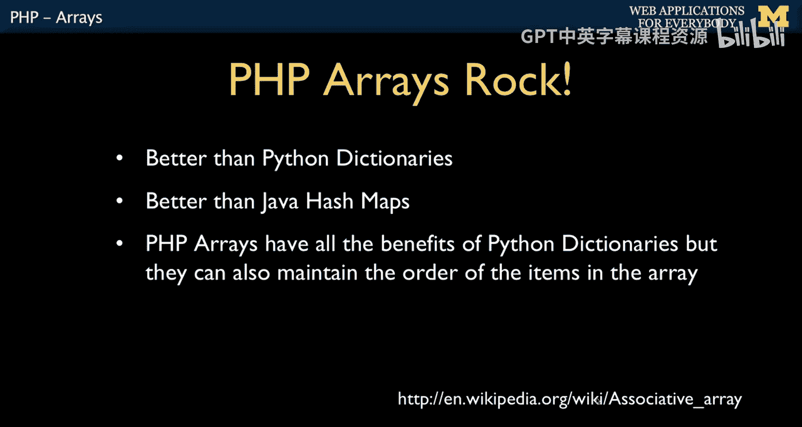
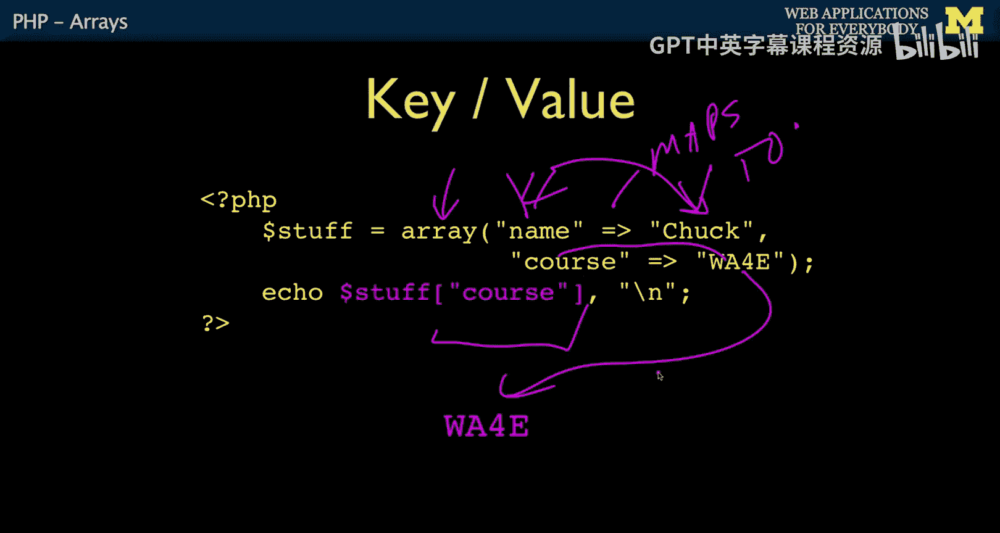
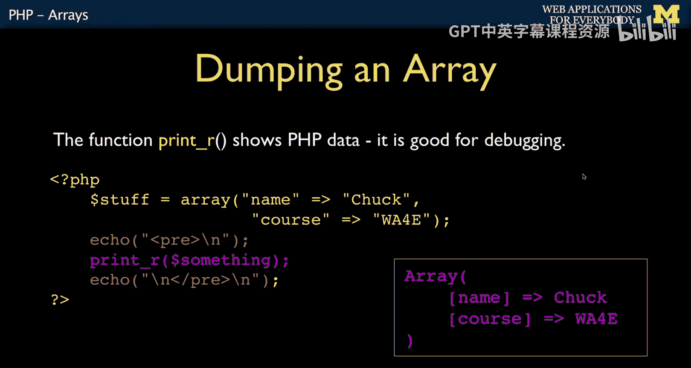
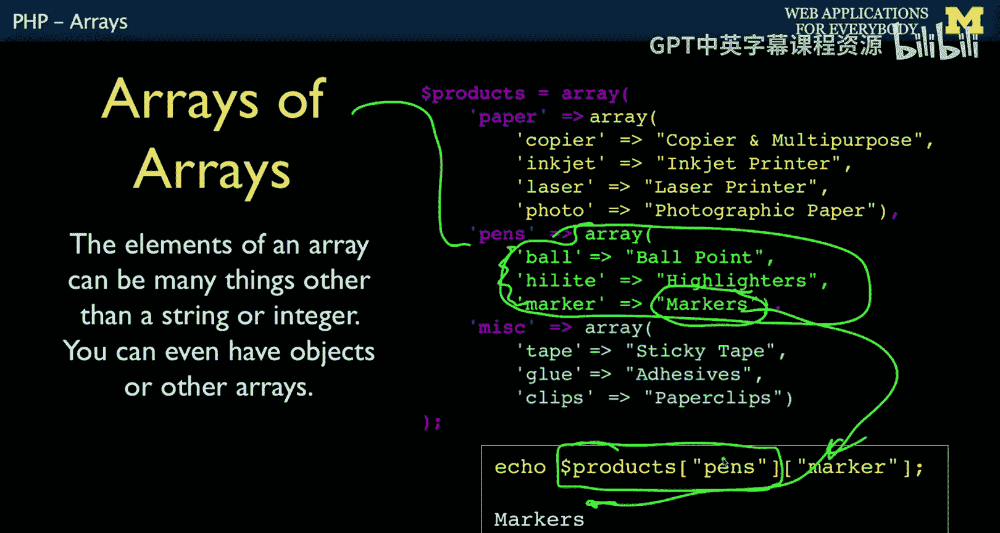

# 030：PHP数组 🧮


在本节课中，我们将要学习PHP中一个非常强大且受欢迎的特性：数组。我们将了解什么是数组，如何创建和使用它们，以及如何利用它们来构建和管理数据。

---



## 什么是PHP数组？🤔

上一节我们介绍了课程背景，本节中我们来看看PHP数组的核心概念。

PHP数组非常出色。它们的设计灵感来源于Perl语言，被称为“关联数组”。Perl语言就有关联数组。

程序员需要编写算法，即一系列代码和步骤，以及处理数据。我们通过逻辑和创建的数据来解决问题。数据结构决定了数据的组织形式。在C语言中，有`struct`（结构体）来组织数据；在C++和Java中，有对象（Objects）。这些都是通过复杂语法来定义数据形状的方式，例如定义一个包含姓名和电话号码的人。

而PHP的关联数组采用**键值对**的形式。你可以直接说：这个人有名字、姓氏和电话号码，然后就完成了。这使得程序员无需学习大量额外语法，就能轻松创建数据结构，甚至可能意识不到自己在使用数据结构。Python中的字典（Dictionaries）非常受欢迎，是Python最受欢迎的特性之一。Java有哈希映射（Hash Maps），Windows有属性包（Property Bags）。它们都是关联数组或键值对的一种形式。

当我从PHP转向Python时，我最怀念的就是PHP数组，因为我希望数据能保持顺序。PHP数组是我最喜欢的关联数组实现。

在PHP中，数组可以是类似列表的形式，即通过数字索引的线性列表；也可以是键值对的形式，例如 `first_name => Chuck`， `last_name => Severance`， `phone_number => 555-1234`。PHP还有二维数组，但实际上它们是“数组的数组”。我们稍后会简单讨论，但不会深入。

---

## 创建和使用数组 🛠️

上一节我们了解了数组的概念，本节中我们来看看如何具体创建和使用数组。

### 创建线性列表数组


你可以创建一个线性列表式的数组。以下代码演示了如何创建：

```php
$stuff = array("Hello", "world");
echo $stuff[1]; // 输出 "world"
```

这段代码使用`array()`构造函数创建了一个包含两个元素的数组。与大多数编程语言一样，第一个元素的索引是`0`。我们使用下标（索引）运算符`[]`来访问数组中的元素。`$stuff[1]`访问的是数组中的第二个元素，因此会输出“world”。除非特别指定，PHP会默认将这些元素放在索引`0`和`1`的位置。

### 创建键值对数组

然而，人们真正喜爱的是键值对数组。其语法如下：

```php
$stuff = array("name" => "Chuck", "course" => "SI664");
echo $stuff["course"]; // 输出 "SI664"
```

我这样理解：键`name`映射到值`Chuck`。这里`"name"`是键，`"Chuck"`是值。同样，键`"course"`映射到值`"SI664"`。然后，你可以再次使用索引运算符`[]`，通过键`"course"`来查找对应的值，结果会输出“Web Applications for Everybody”。

我非常喜欢这种形式。它允许我们在没有过多思考的情况下构建数据结构。当然，后期当你使用对象或其他更复杂的结构时，可能不希望数据结构过于依赖数组，但这在初期是完全可以的。

---




## 打印和查看数组内容 📄

当我们开始构建数据形状（即数据结构）时，需要几种方式来打印它们的内容。作为程序员，你决定使用`name`或`course`这样的键名。久而久之，你就形成了自己的数据形状。这是一个非常简单的形状，因此你需要一种方法来打印它。

以下是打印数组的几种方法：

### 使用 `print_r()` 函数

`print_r()`函数可以遍历数组并打印出键和值。它会按照键值对的格式输出。

```php
echo "<pre>\n";
print_r($stuff);
echo "\n</pre>\n";
```

我在这里添加了HTML的`<pre>`标签，是为了防止换行符被打乱，从而更清晰地看到打印的实际格式。`print_r()`会遍历数组，打印出键和值。你会注意到，输出的顺序与我放入数组时的顺序是一致的，这是我喜欢它的一个原因。`print_r`中的“R”我认为代表“递归”（Recursive），这意味着如果数组内嵌套了数组，它会一层层深入打印出来。虽然这个例子很简单，但你可以打印出复杂得多的结构，有时你甚至会得到非常复杂的嵌套结构。

### 使用 `var_dump()` 函数

另一个更详细、更明确地显示数据类型的函数是`var_dump()`。我认为它更底层，输出不那么美观，但更明确。



```php
var_dump($stuff);
```

这段代码会输出类似这样的内容：`$stuff`是一个包含2个元素的数组。第一个元素：键`name`映射到一个5个字符的字符串值`Chuck`；第二个元素：键`course`映射到一个字符串值`SI664`。它只是更详细一些。当我需要深入调试时，我倾向于使用`var_dump()`，因为`print_r()`虽然让输出更美观，但有时会丢失一些细节。

`var_dump()`的一个优点是它可以打印出`false`（布尔假值）。例如：

```php
$thing = false;
print_r($thing); // 输出为空，什么也不显示
var_dump($thing); // 输出 `bool(false)`
```

使用`print_r()`打印`false`时，屏幕上什么都没有，这可能会让人误以为代码没有执行。但使用`var_dump()`，它会明确显示这是一个布尔类型的`false`值。这样设计肯定有原因，但对于调试打印来说，`print_r()`的方式不太方便。

---


## 数组的构造与循环 🔄

上一节我们学习了如何查看数组，本节中我们来看看如何动态构建数组以及如何遍历它们。

### 动态构建数组

你可以用几种不同的方式构造数组。可以从一个空数组开始，然后向末尾添加元素。

```php
$stuff = array();
$stuff[] = "Hello";
$stuff[] = "World";
```

这段代码先创建了一个空数组`$stuff`，然后使用`$stuff[]`语法向数组末尾添加了两个元素。PHP会自动为它们分配整数索引位置，即`0`和`1`，从而形成一个线性列表。

对于键值对数组，你也可以这样做：

```php
$stuff = array();
$stuff["name"] = "Chuck";
$stuff["course"] = "WA4E";
```

这段代码创建了一个空数组，然后分别为键`"name"`和`"course"`赋值。顺序？是的，顺序会保持不变。

### 遍历键值对数组

以下是遍历键值对数组的方法：

```php
foreach($stuff as $k => $v) {
    echo "Key=", $k, " Val=", $v, "\n";
}
```

这是一个`foreach`循环结构，语法上有些不同。第一个参数是数组`$stuff`，然后是关键字`as`，接着可以有两个迭代变量：一个用于键（`$k`），一个用于值（`$v`）。我这样理解：对于`$stuff`中的每一对，将键映射到值。`=>`符号就像一个箭头，我认为这正是语言设计者的意图。这个循环运行时，`$k`会遍历所有键，`$v`会遍历所有值。每次循环迭代，它们都会同时前进。我认为这是一个非常优雅的语法。

### 遍历线性数组

如果你有一个线性数组，也可以获取键和值。在这种情况下，键就是`0`和`1`。

```php
foreach($stuff as $k => $v) {
    echo "Key=", $k, " Val=", $v, "\n";
}
```

对于线性数组，你还可以使用计数循环（`for`循环），但需要确保它是一个格式良好的线性数组。

```php
for($i = 0; $i < count($stuff); $i++) {
    echo "I=", $i, " Val=", $stuff[$i], "\n";
}
```

`count()`函数返回数组中元素的数量。在这个例子中，结果是`2`。循环条件`$i < count($stuff)`意味着`$i`将是`0`和`1`。`$stuff[2]`是无效的，因为数组只有索引`0`和`1`。然后`$i++`使索引递增。这是一个会运行两次的计数循环。就语法而言，对于这种遍历，我更想使用`foreach`循环。但有时你可能确实需要计数循环，因为你需要索引变量`$i`来做一些其他操作。在循环内部，通过`$stuff[$i]`来引用数组元素。

---

## 多维数组简介 📊

最后，我们简要讨论一下二维数组。它们并非真正的“二维数组”，而是嵌套数组，或者说递归嵌套数组。

你可以在一个数组内再放入一个数组。

```php
$products = array(
    'paper' => array(
        'copier' => "Copier & Multipurpose",
        'inkjet' => "Inkjet Printer",
        'laser' => "Laser Printer",
        'photo' => "Photographic Paper"),
    'pens' => array(...),
    'misc' => array(...)
);

echo $products['paper']['copier']; // 输出 "Copier & Multipurpose"
```

`$products`是外层数组。这个外层数组包含三个东西：`‘paper’`、`‘pens’`、`‘misc’`。注意，逗号是外层数组的一部分，所以外层数组有三个元素。

你可以这样理解：`$products[‘paper’]`会进入外层数组，获取`‘paper’`对应的值（即一个内层数组）。然后，`[‘copier’]`在这个内层数组中查找键`‘copier’`对应的值，最终取出`“Copier & Multipurpose”`。

所以，这并不是真正的二维数组，而是“数组中的数组”。通常，你不会经常手动构建这种结构，但当你从数据库获取数据、从网络读取JSON并解析时，可能会得到这种嵌套结构。然后你需要弄清楚如何深入挖掘和访问其中的数据。

---



## 总结 📝

本节课中我们一起学习了PHP数组。我们了解到PHP数组可以是数字索引的线性列表，也可以是强大的键值对（关联数组）。我们学习了如何使用`array()`构造函数或`[]`语法来创建数组，如何使用`print_r()`和`var_dump()`来调试和查看数组内容。我们还掌握了使用`foreach`循环遍历数组（包括键值对），并简要了解了嵌套数组（多维数组）的概念。数组是PHP中组织和管理数据的基石，掌握它们对Web开发至关重要。


接下来，我们将讨论一系列帮助我們构建、搜索和处理数组的函数。