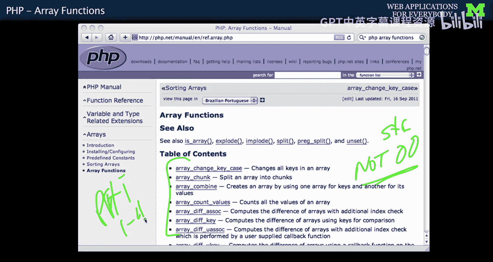
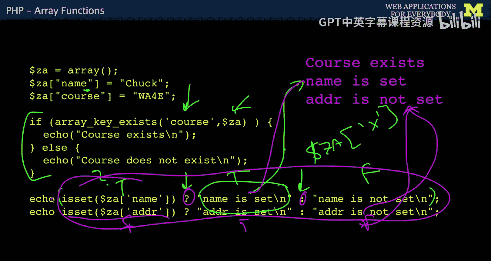
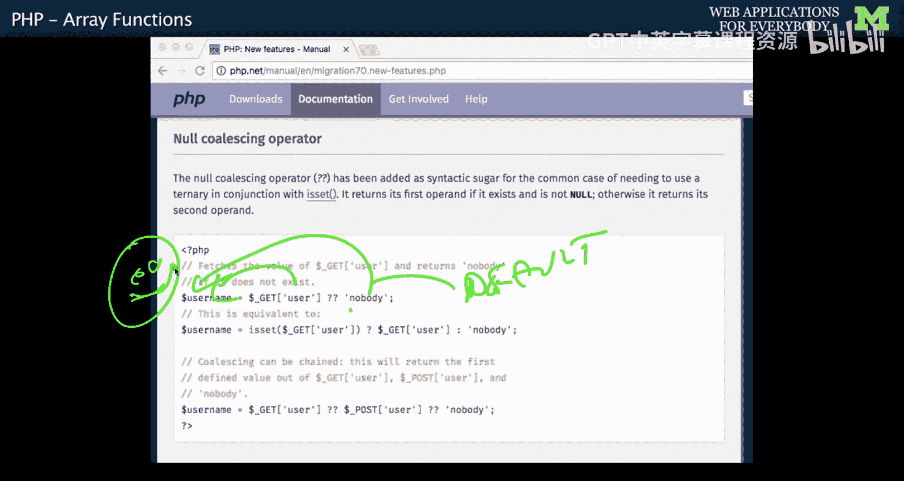
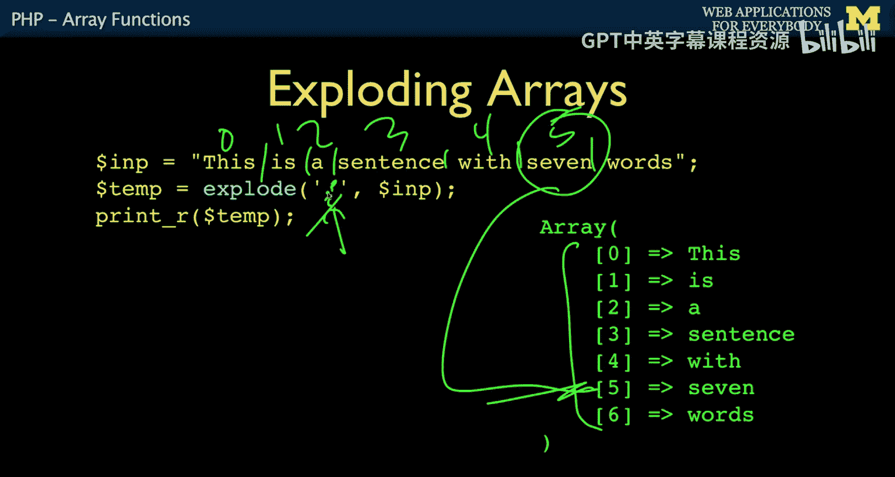

# 031：PHP数组函数 📚


在本节课中，我们将学习PHP中一系列强大的数组函数。这些函数是PHP早期非面向对象编程风格的产物，它们以`array_`为前缀，用于对数组进行各种操作，例如检查键是否存在、排序、计数和拆分字符串等。掌握这些函数对于高效处理数据至关重要。




## 数组函数概述

上一节我们介绍了PHP数组的基本概念。本节中，我们来看看PHP提供的一系列内置数组函数。由于PHP最初并非面向对象语言，它通过全局命名空间中的函数来组织功能。数组函数均以`array_`开头，字符串函数则以`str_`开头。我们通过将数组作为参数传递给这些函数来进行操作。

## 检查数组键是否存在


在处理数组时，经常需要检查某个键是否存在。直接访问不存在的键会导致非致命错误，因此我们需要安全的方法进行检查。

以下是两种检查键是否存在的常用方法：

*   **`array_key_exists()`函数**：这是一种更清晰的方法。其语法为 `array_key_exists($key, $array)`，如果键存在则返回`true`，否则返回`false`。
*   **`isset()`函数**：这是更简洁、更常用的方法。其语法为 `isset($array[$key])`，同样返回布尔值。

两种方法都不会引发错误。而直接使用 `$array['nonexistent_key']` 则会触发非致命错误。

## 使用三元运算符进行条件赋值

在实际编码中，我们经常需要根据键是否存在来赋值。在PHP 5及更早版本中，通常使用三元运算符来实现。

```php
// 语法：条件 ? 值1 : 值2
// 如果条件为真，返回‘值1’；否则返回‘值2’
echo isset($za['name']) ? 'name is set' : 'name not set';
```

这段代码检查`$za`数组中是否存在`'name'`键。如果存在，则输出`'name is set'`；否则输出`'name not set'`。这是PHP 5时代兼容性代码中非常常见的模式。

## PHP 7的空合并运算符

PHP 7引入了一个更优雅的运算符来处理这类情况，即空合并运算符`??`。




```php
// 语法：$value = $array['key'] ?? ‘默认值’;
// 如果‘key’存在且不为null，则取其值；否则使用‘默认值’
$username = $_GET['user'] ?? ‘nobody’;
```

这个运算符同样会抑制访问不存在的键时产生的非致命错误。它更简洁，是PHP 7及更高版本的推荐做法。但为了保持与旧版本PHP的兼容性，了解三元运算符的写法仍然很重要。

## 数组信息函数



除了检查键，我们还需要获取数组的基本信息。

*   **`count()`函数**：用于计算数组中元素的数量。公式为 `$num_elements = count($array);`。
*   **`is_array()`函数**：用于判断一个变量是否为数组。这在编写接收“混合类型”参数（可能是字符串或字符串数组）的函数时非常有用。

## 数组排序函数

PHP数组会保持元素的插入顺序。PHP提供了多种排序函数来改变这个顺序。

以下是几个核心的排序函数：

*   **`sort()`函数**：对数组按值进行排序，但会重新分配数字索引（丢弃原有关联键）。适用于索引数组。
*   **`asort()`函数**（“awesome sort”）：对数组按值进行排序，并保持键与值的关联。适用于关联数组。
*   **`ksort()`函数**：对数组按键名进行排序。

选择哪种排序方式取决于你的需求：`asort()`常用于按值排序且需保留键的情况；`ksort()`则在你需要按键名浏览或查找时很有用。

## 字符串拆分为数组

另一个常见的编程任务是将字符串拆分为数组。PHP使用`explode()`函数实现此功能。

```php
// 语法：$array = explode(分隔符, 字符串);
$temp = explode(' ', 'This is a sentence with seven words');
// $temp 现在是一个数组：['This', 'is', 'a', 'sentence', 'with', 'seven', 'words']
echo $temp[6]; // 输出：words
```

`explode()`函数的第一个参数是分隔符（如空格、逗号、冒号等），第二个参数是要拆分的字符串。它返回一个由分割后的子串组成的数组，是解析数据的强大工具。

## 总结与展望

本节课中我们一起学习了PHP的核心数组函数。我们了解了如何安全地检查数组键是否存在（使用`isset()`或`array_key_exists()`），以及如何使用三元运算符和PHP 7的空合并运算符进行条件赋值。我们还学习了获取数组信息的`count()`和`is_array()`函数，对数组进行排序的`sort()`、`asort()`和`ksort()`函数，以及将字符串拆分为数组的`explode()`函数。




这些函数是构建PHP程序的基础，能够帮助你高效地处理和操作数据。下一节，我们将探讨数组如何与Web开发中的请求-响应周期协同工作。