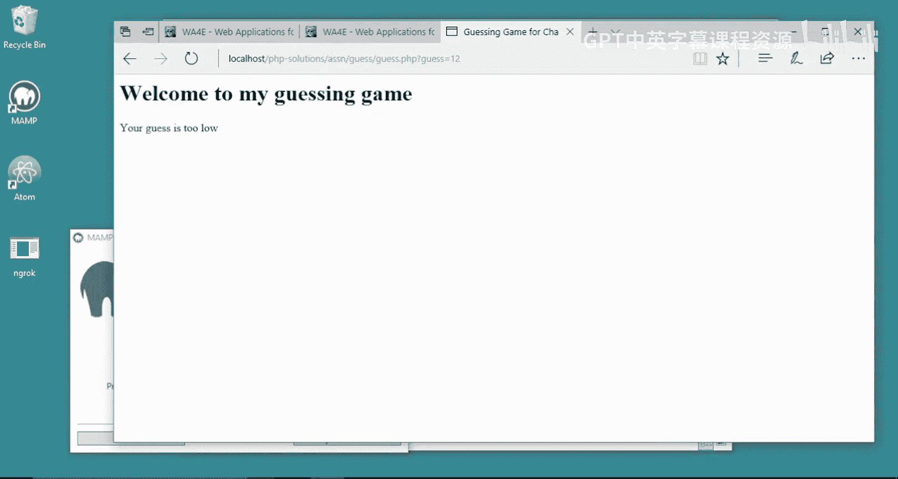
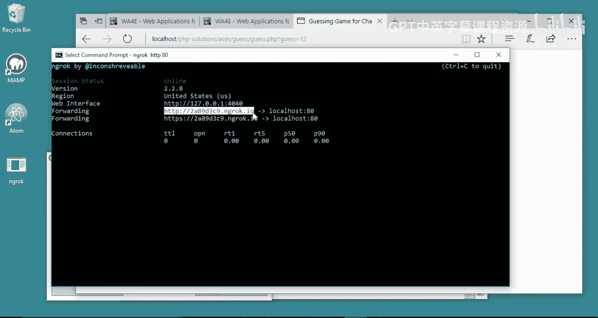
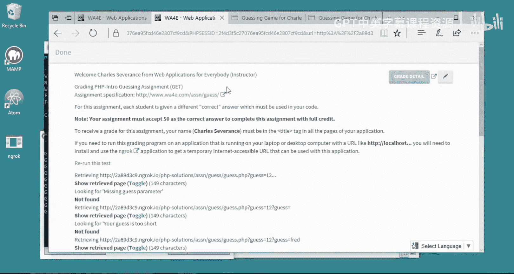
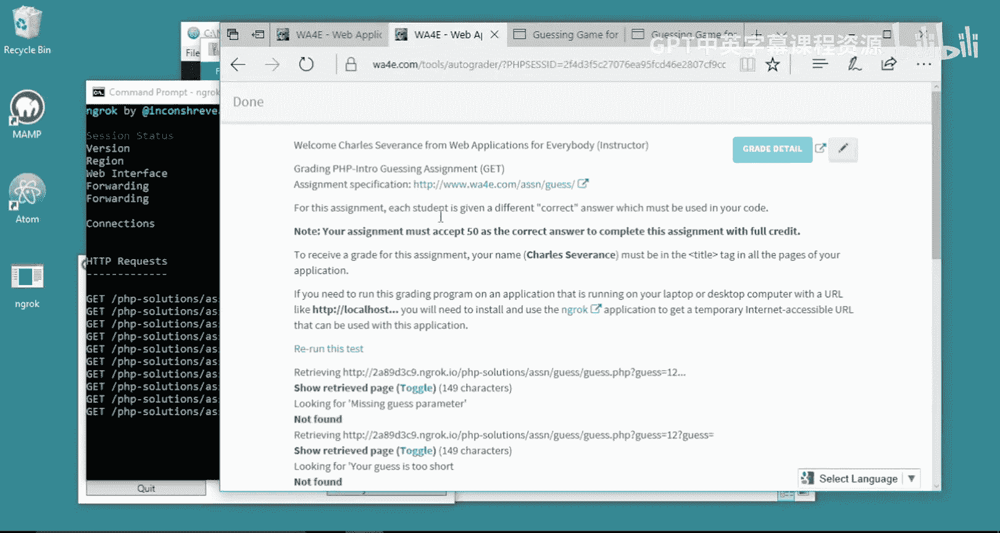

# 033：在Windows系统中使用Ngrok连接自动评分器 🖥️

在本节课中，我们将学习如何使用Ngrok工具，将运行在你本地计算机上的Web应用程序临时暴露到公网，以便完成需要与远程自动评分器交互的作业。

## 概述

当你完成一个Web应用程序作业后，代码通常运行在你的本地计算机上，地址类似于 `localhost`。然而，自动评分器位于互联网上，无法直接访问你本地的 `localhost` 地址。为了解决这个问题，我们需要使用Ngrok。Ngrok能为你本地运行的服务器创建一个临时的、可公开访问的网址，让自动评分器能够与你的应用程序进行通信。

## 下载与安装Ngrok

首先，你需要下载Ngrok软件。我们将以Windows系统为例进行演示。

1.  访问Ngrok官方网站（ngrok.com）。
2.  下载适用于Windows系统的版本。
3.  下载完成后，打开压缩包，将 `ngrok.exe` 文件解压到一个方便的位置，例如桌面。这样便于在命令行中调用。

## 运行本地服务器与Ngrok

上一节我们准备好了Ngrok工具，本节中我们来看看如何启动它并与你的本地服务器配合工作。



假设你的Web应用程序（例如一个PHP项目）已经在本地运行，默认端口是80。你需要在命令行中导航到存放 `ngrok.exe` 的目录，然后执行启动命令。

以下是启动Ngrok并映射到本地80端口的命令：
```bash
ngrok http 80
```
执行该命令后，Ngrok会启动并在命令行窗口中显示信息。其中最重要的信息是它为你分配的临时公共网址，格式类似于 `https://xxxx-xx-xx-xx-xx.ngrok.io`。



这个网址现在指向了你本地 `localhost:80` 上运行的服务。

## 提交作业到自动评分器

现在，你获得了一个可以公开访问的临时地址。接下来，你需要将这个地址提交给自动评分器。


1.  复制Ngrok提供的临时公共网址（例如 `https://xxxx-xx-xx-xx-xx.ngrok.io`）。
2.  打开你的应用程序的特定页面，例如 `guessinggame.php?guess=12`。
3.  将页面的完整路径拼接到Ngrok网址后面，形成完整的可访问URL，例如：
    ```
    https://xxxx-xx-xx-xx-xx.ngrok.io/guessinggame.php?guess=12
    ```
4.  将这个完整的URL复制下来。
5.  进入课程作业的自动评分器页面，将复制的URL粘贴到指定的提交框中并运行评分。



当自动评分器工作时，你可以在运行 `ngrok` 的命令行窗口中看到请求和响应的日志记录，这表明自动评分器正在通过Ngrok创建的安全隧道与你的本地应用程序成功通信。


## 完成后的操作

作业提交并评分完成后，你应该断开Ngrok连接以关闭对本地服务的公开访问。

在运行 `ngrok` 的命令行窗口中，按下 `Ctrl + C` 组合键即可停止Ngrok服务。服务停止后，之前分配的临时网址将立即失效，外部（包括自动评分器）无法再访问你的本地应用。



需要注意的是，每次重新启动Ngrok，它都会生成一个全新的临时网址。因此，每次提交作业前，如果重启了Ngrok，都需要使用最新的网址来构建提交给评分器的URL。

## 总结


本节课中我们一起学习了如何使用Ngrok工具解决本地开发环境与远程自动评分器之间的连接问题。核心步骤包括：下载Ngrok、在命令行中启动它并映射到本地服务器端口、使用生成的临时公共网址构建完整的应用程序访问链接，最后将该链接提交给自动评分器。完成评分后，记得停止Ngrok服务以保障本地环境的安全。掌握这个流程，你就能顺利提交那些需要与在线自动评分器交互的Web应用作业了。