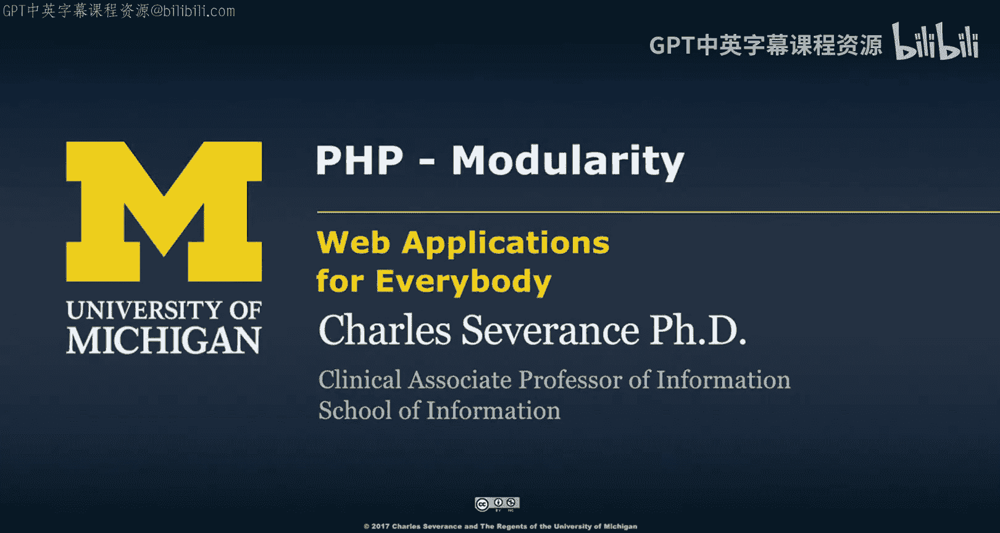
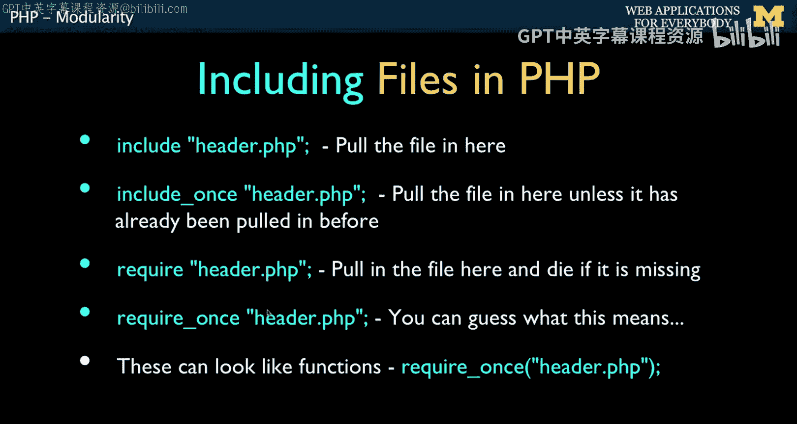
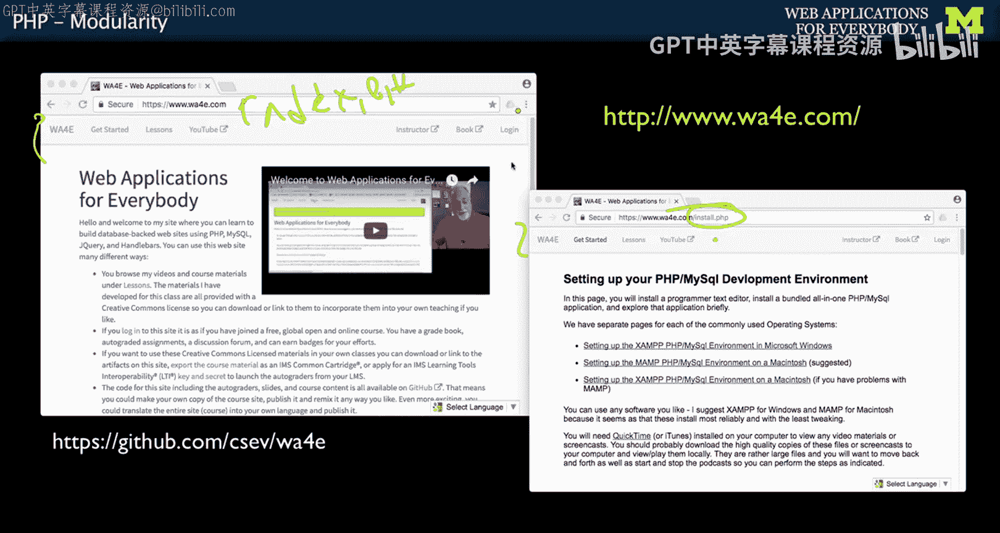
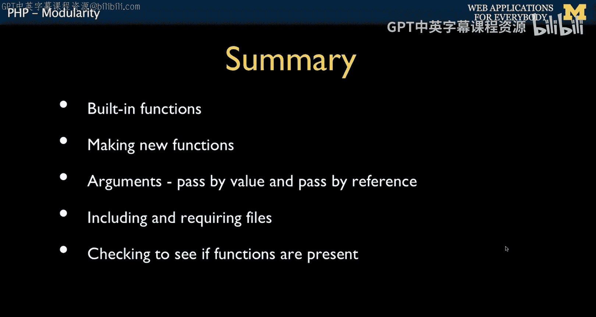

# 038：PHP模块化 📦




在本节课中，我们将学习PHP中的模块化概念，特别是如何通过包含和重用多个文件来组织代码，避免重复，并构建结构更清晰的Web应用程序。

---

## 概述


之前我们讨论了函数，这是一种重用代码的方式。现在，我们将从文件的角度来探讨模块化。到目前为止，我们主要处理单个PHP文件。但在实际项目中，我们常常希望将功能分散到多个文件中，并在需要时重复引入它们。PHP为此提供了 `include` 和 `require` 等指令。

---

## 包含文件：`include` 与 `require`

PHP提供了两种主要方式来引入外部文件：`include` 和 `require`。它们的核心区别在于处理错误的方式。

*   **`include`**：查找并引入指定文件。如果文件不存在，会产生一个警告（**非致命错误**），但脚本会继续执行。
*   **`require`**：查找并引入指定文件。如果文件不存在，会产生一个致命错误，脚本会停止执行。

为了确保关键文件（如数据库配置或核心函数库）的缺失不会导致后续代码在错误状态下运行，**通常建议使用 `require`**。

---



## 避免重复引入：`require_once`

在复杂的项目中，多个文件可能都需要引入同一个公共文件（例如一个工具函数库）。如果使用普通的 `require`，可能会导致同一个文件被多次引入，可能引发函数重复定义等错误。

为了解决这个问题，PHP提供了 `require_once` 指令。它的作用是：**无论代码中请求引入该文件多少次，只要它已经被成功引入过一次，就不会再次引入**。这极大地简化了代码管理，无需手动编写条件判断来检查文件是否已包含。

**核心指令对比：**
```php
include 'file.php';       // 引入文件，失败则警告
require 'file.php';       // 引入文件，失败则致命错误
require_once 'file.php';  // 仅引入一次文件，失败则致命错误
```



---

## 实践应用：构建可重用的页面部件

`require` 和 `require_once` 最常见的用途是创建可在多个页面中重复使用的页面部件，例如页头、导航栏和页脚。

假设我们有一个网站，其主导航菜单需要在首页 (`index.php`) 和另一个页面 (`install.php`) 上显示。我们不希望在每个页面的HTML中重复编写相同的导航菜单代码。

**解决方案如下：**

1.  将导航菜单的HTML代码单独保存到一个文件，例如 `nav.php`。
2.  同样，将页面的头部信息（如 `<head>` 标签内容）保存到 `top.php`，将页脚内容保存到 `foot.php`。
3.  在每个页面文件中，使用 `require` 引入这些公共部件。

以下是 `index.php` 文件结构的示例：

```php
<?php
    require(‘top.php’);    // 引入页面头部
    require(‘nav.php’);    // 引入导航栏
?>
<!-- 页面独有的主体内容放在这里 -->
<div>
    <p>这是首页的特定内容。</p>
</div>
<?php
    require(‘foot.php’);   // 引入页脚
?>
```

而 `install.php` 文件的结构将非常相似：

```php
<?php
    require(‘top.php’);    // 引入相同的页面头部
    require(‘nav.php’);    // 引入相同的导航栏
?>
<!-- 另一个页面的独有内容 -->
<div>
    <iframe src="some_content.html"></iframe>
</div>
<?php
    require(‘foot.php’);   // 引入相同的页脚
?>
```

通过这种方式，我们实现了：
*   **一致性**：所有页面共享相同的页头、导航和页脚，确保网站风格统一。
*   **可维护性**：如需修改导航菜单，只需编辑 `nav.php` 一个文件，所有引用它的页面都会自动更新。
*   **不重复自己（DRY原则）**：代码被封装一次，然后多处复用。

模块化的本质就是**捕获一次逻辑或表现层代码，然后反复使用它**。

---

## 总结




在本节课中，我们一起学习了PHP模块化的关键知识。我们首先回顾了通过内置函数和自定义函数实现代码复用的通用模块化思想。接着，我们重点探讨了基于文件的模块化，详细比较了 `include`、`require` 和 `require_once` 指令的区别与适用场景。最后，我们通过一个构建可重用页面部件（页头、导航、页脚）的实践例子，展示了如何将页面分解为多个文件，从而遵循DRY原则，创建出更易于维护的Web应用程序结构。掌握这些技巧，将帮助你编写出结构更清晰、更专业的PHP代码。