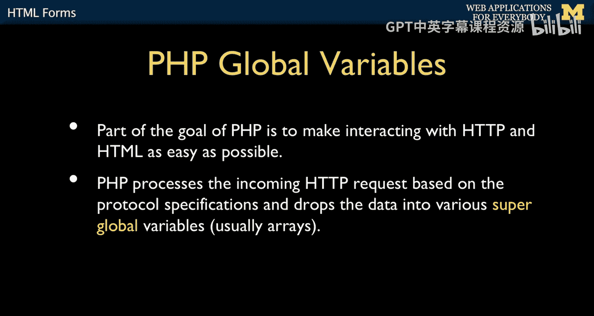
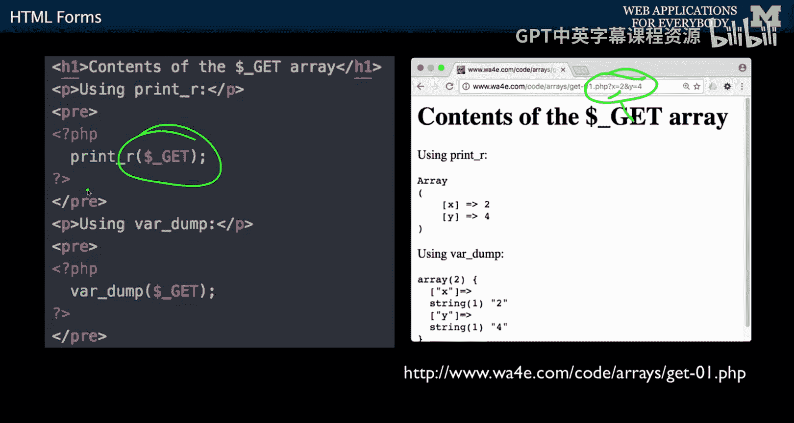
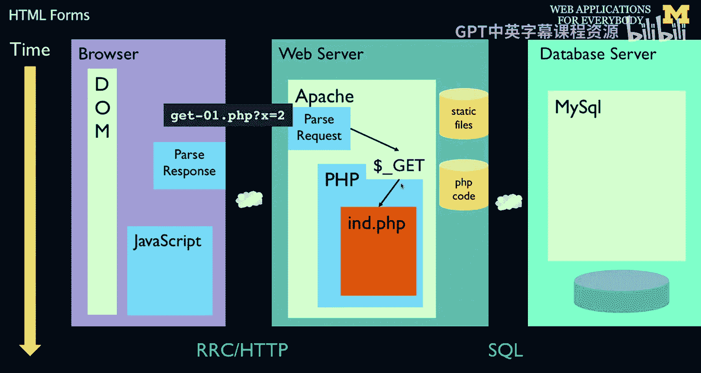
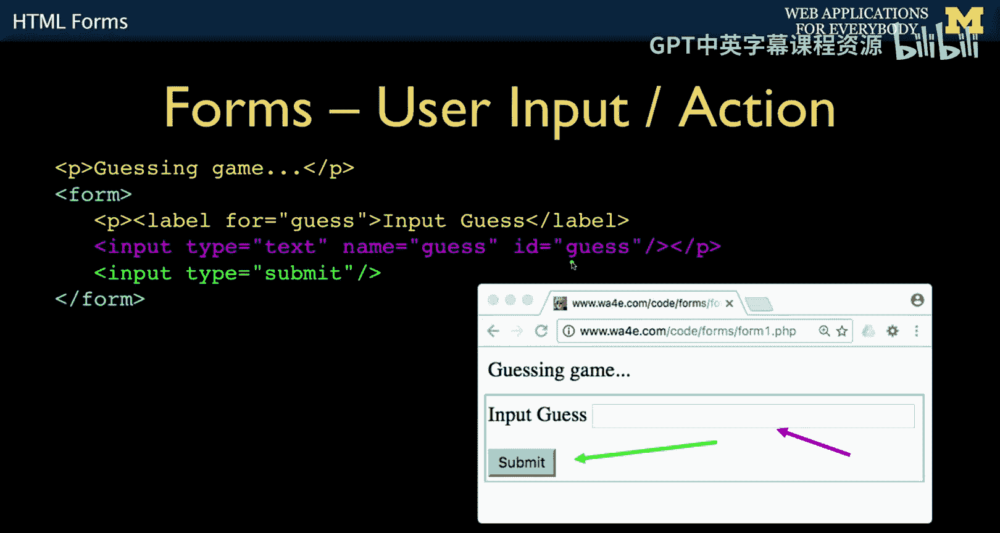
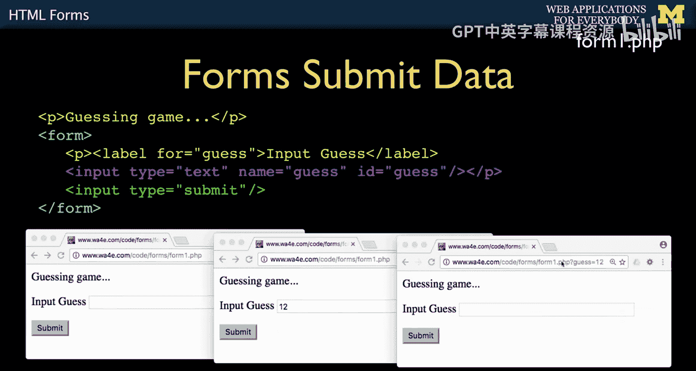
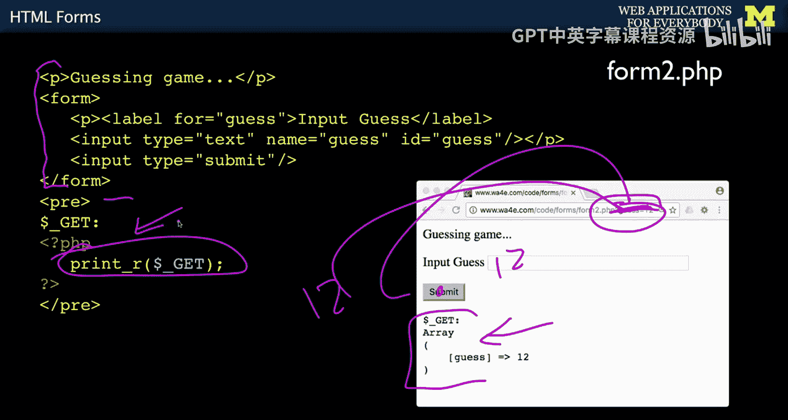

# 040：HTML表单 📝


在本节课中，我们将要学习HTML表单。表单是Web应用程序中用户输入数据的主要方式，它允许用户通过填写文本框、选择选项等方式与服务器进行交互。我们将探讨表单的基本结构、如何将数据发送到服务器，以及PHP如何处理这些数据。

---

上一节我们介绍了PHP中的函数和超全局变量，本节中我们来看看如何利用HTML表单来收集用户输入，并通过HTTP协议将这些数据传递给PHP程序进行处理。

表单提供了一种比直接在URL后附加参数更便捷的数据输入方式。其基本思想是创建一个包含输入字段的页面，用户填写后提交，数据会被发送到服务器。



## 表单的基本结构



一个简单的HTML表单包含以下核心元素：一个`<form>`标签用于包裹所有输入元素，若干个`<input>`标签用于定义不同类型的输入字段，以及一个提交按钮。

以下是创建一个简单猜数字表单的HTML代码示例：





```html
<p>Please enter your guess:</p>
<form>
    <input type="text" name="guess" size="5" />
    <input type="submit" />
</form>
```

*   `<form>` 标签定义了一个表单区域，其中的所有输入字段将被作为一个整体提交。
*   `<input type="text">` 创建了一个文本输入框。`name="guess"`属性至关重要，它定义了提交到服务器时该数据的键名。
*   `<input type="submit">` 创建了一个提交按钮。点击它，浏览器会收集表单内所有数据并发送到服务器。

当用户输入“12”并点击提交后，浏览器会构造一个类似`?guess=12`的请求发送给服务器。

## PHP如何接收表单数据


PHP通过超全局变量（如`$_GET`和`$_POST`）来接收表单提交的数据。当表单使用`GET`方法（默认方法）提交时，数据会附加在URL之后，PHP会自动将其解析并存入`$_GET`数组中。

以下代码演示了如何接收并显示`guess`参数：

```php
<p>Your guess was:</p>
<pre>
<?php
    print_r($_GET);
?>
</pre>
```

*   当页面首次加载时，`$_GET`数组是空的。
*   当用户提交表单后，页面重新加载，此时`$_GET[‘guess’]`将包含用户输入的值（例如“12”）。
*   开发者可以通过检查`$_GET`或`$_POST`数组中是否存在某个键，来判断用户是否提交了数据。

## GET与POST方法



表单数据可以通过`GET`或`POST`方法提交，这两种方法在`<form>`标签的`method`属性中指定。

*   **GET方法**：数据以查询字符串的形式附加在URL之后（例如 `?guess=12`）。它适用于获取数据、搜索等非敏感操作，因为数据在地址栏可见。
*   **POST方法**：数据包含在HTTP请求的正文中发送，不会显示在URL里。它更适合提交敏感信息（如密码）或大量数据。

在PHP中，使用`POST`方法提交的数据通过`$_POST`超全局数组来访问。

---




本节课中我们一起学习了HTML表单的基础知识。我们了解了表单如何作为用户与服务器交互的桥梁，其基本结构包括`<form>`、`<input>`和提交按钮。我们还回顾了PHP如何通过`$_GET`和`$_POST`超全局变量来接收和处理表单提交的数据。理解表单是构建交互式Web应用的关键一步。下一节，我们将深入探讨表单的其他输入类型和更复杂的数据提交方式。