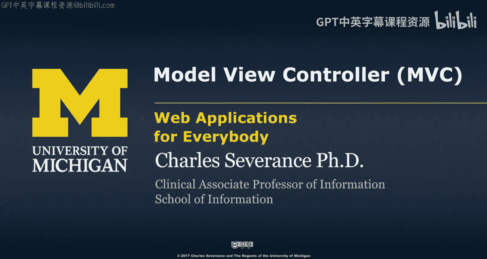
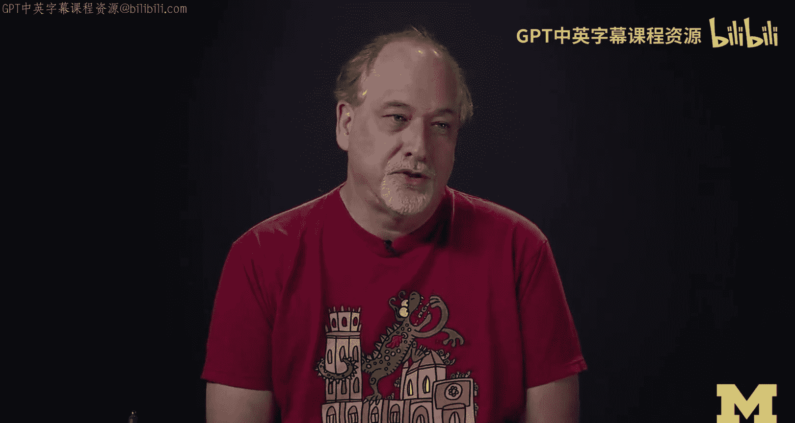
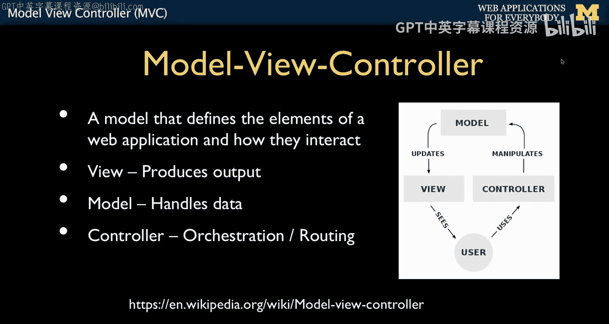
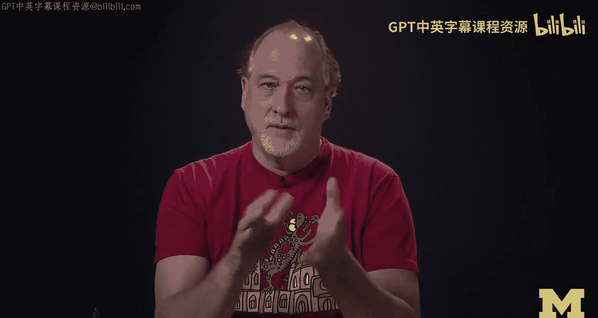
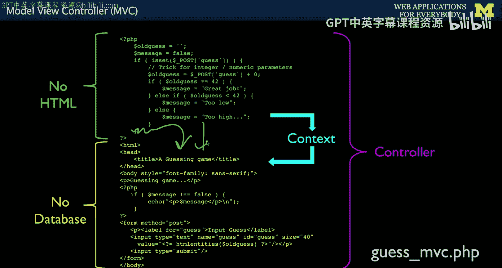
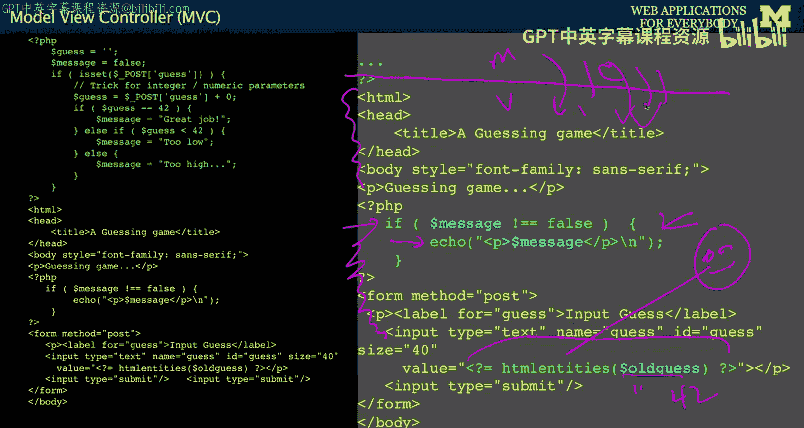
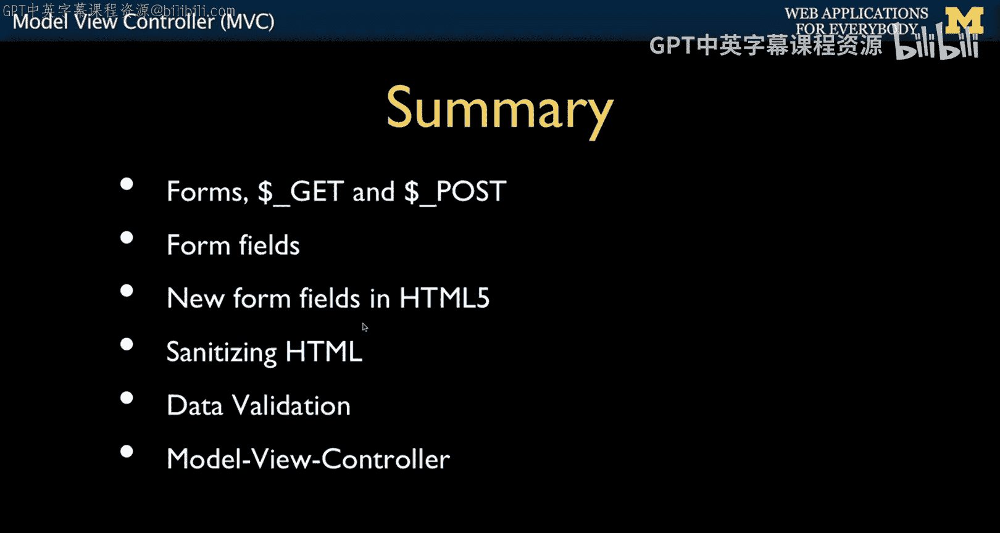
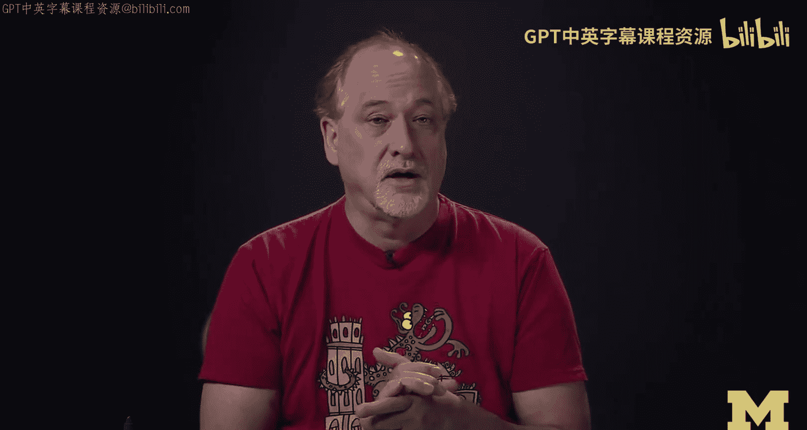

# 049：模型-视图-控制器（MVC）模式 🧩




在本节课中，我们将学习一个重要的编程模式——模型-视图-控制器（MVC）。这个模式是Web应用开发中的核心概念，能帮助我们更好地组织代码结构，分离数据处理、业务逻辑和用户界面。

## 概述



模型-视图-控制器（MVC）是一种将应用程序分解为三个核心组件的设计模式。它有助于清晰地分离数据管理、用户界面和业务逻辑，使代码更易于维护和理解。我们将探讨MVC的基本概念，并通过一个简单的PHP示例来展示如何应用这一模式。



## 什么是MVC？

MVC代表模型（Model）、视图（View）和控制器（Controller）。这个模式的核心思想是将请求-响应周期分解为三个基本操作。

*   **模型（Model）**：负责管理应用程序的数据和业务逻辑。它直接与数据库交互，处理数据的创建、读取、更新和删除（CRUD）操作。
*   **视图（View）**：负责呈现数据给用户。它生成用户看到的HTML界面，并根据从控制器接收的数据动态更新内容。
*   **控制器（Controller）**：作为模型和视图之间的协调者。它接收用户输入（如表单提交），决定调用哪些模型方法处理数据，并选择相应的视图来展示结果。

一个典型的流程是：用户请求进入**控制器**，控制器调用**模型**处理数据，模型更新后，控制器将处理结果（称为**上下文**）传递给**视图**，视图最终生成HTML返回给用户。



## 如何在代码中实现MVC？

MVC有多种实现方式，不同的框架（如CakePHP、Angular、React、Symfony）对其解释和应用各不相同。在本课程中，我们将学习一种简单直观的实现方式，它虽然将所有代码放在一个文件中，但严格遵循MVC的职责分离原则。

以下是实现的基本结构：

```php
<?php
// ---------- 模型（Model）部分 ----------
// 此部分处理所有数据逻辑，无任何HTML输出
$oldguess = '';
$message = false;

if (isset($_POST['guess'])) {
    // 处理用户提交的猜测数据
    $oldguess = $_POST['guess'] + 0;
    if ($oldguess == 42) {
        $message = "恭喜你，猜对了！";
    } elseif ($oldguess < 42) {
        $message = "猜的数字太小了。";
    } else {
        $message = "猜的数字太大了。";
    }
}
// ---------- 模型部分结束 ----------
?>
<!DOCTYPE html>
<!-- ---------- 视图（View）部分 ---------- -->
<html>
<head><title>猜数字游戏</title></head>
<body>
<?php
// 视图根据上下文（$message, $oldguess）动态生成内容
if ($message !== false) {
    echo "<p>$message</p>\n";
}
?>
<p>请猜一个数字：</p>
<form method="post">
    <p><input type="text" name="guess" value="<?= htmlentities($oldguess) ?>"/></p>
    <p><input type="submit"/></p>
</form>
</body>
</html>
<!-- ---------- 视图部分结束 ---------- -->
```

### 代码结构解析

1.  **模型部分（顶部）**：负责所有数据处理。它检查是否有来自表单的POST数据（`$_POST`），进行验证和逻辑判断（如比较数字），并设置将传递给视图的变量（`$message`, `$oldguess`）。**关键原则是：此部分不生成任何HTML输出。**



2.  **视图部分（底部）**：负责所有HTML输出。它接收从模型部分传递过来的变量（即**上下文**），并使用它们来动态构建页面。例如，它根据`$message`的值决定是否显示提示信息，并使用`htmlentities()`函数安全地回显用户上次的猜测值（`$oldguess`），以防止HTML注入攻击。**关键原则是：此部分不直接与数据库交互。**

3.  **控制器逻辑**：在上面的简单示例中，控制器逻辑隐含在模型部分的`if (isset($_POST[‘guess’]))`判断中。它决定了何时处理输入数据（POST请求时），以及处理完成后，流程自然“落入”视图部分进行展示。在更复杂的应用中，控制器可能会决定加载不同的模型或视图文件。

### 请求流程详解

*   **首次加载（GET请求）**：用户首次访问页面，没有POST数据。模型部分的`isset($_POST[‘guess’])`为`false`，因此跳过数据处理逻辑。变量`$message`保持为`false`，`$oldguess`为空字符串。程序直接进入视图部分，显示一个空的表单。
*   **提交表单（POST请求）**：用户输入数字并提交表单。浏览器发送POST请求，数据包含在`$_POST[‘guess’]`中。此时模型部分的`isset($_POST[‘guess’])`为`true`，执行数据处理逻辑，根据猜测值设置`$message`和`$oldguess`。然后程序进入视图部分，视图使用新的上下文变量来显示提示信息和回填用户上次的输入。

## 遵循MVC的规则

为了保持代码的清晰，建议遵循以下简单规则：
*   在**模型部分**（文件顶部），只进行数据处理和业务逻辑，**不要生成任何HTML**。
*   在**视图部分**（文件底部），只进行数据展示，**不要执行数据库查询或复杂的业务逻辑**。所有需要展示的数据都应作为变量（上下文）从模型部分传递过来。

这种分离是一种编程纪律。它使得代码更易于阅读、调试和测试，尤其是在项目变得复杂时。



## 总结

本节课我们一起学习了模型-视图-控制器（MVC）模式。我们了解了MVC的三个核心组件：**模型**管理数据，**视图**负责显示，**控制器**协调两者。我们通过一个猜数字游戏的PHP示例，演示了如何在一个文件中应用MVC原则来组织代码，将数据处理（模型）与HTML输出（视图）清晰分离，并由隐含的控制器逻辑驱动流程。





我们还回顾了之前课程的知识，包括使用`$_GET`和`$_POST`超全局变量处理表单数据，进行输入验证，以及使用`htmlentities()`函数对输出进行转义以防止安全漏洞。MVC是一种强大的组织模式，虽然存在多种实现方式，但掌握其核心思想将为学习更复杂的Web开发框架打下坚实的基础。