# 052：在Macintosh上安装MAMP 🍎

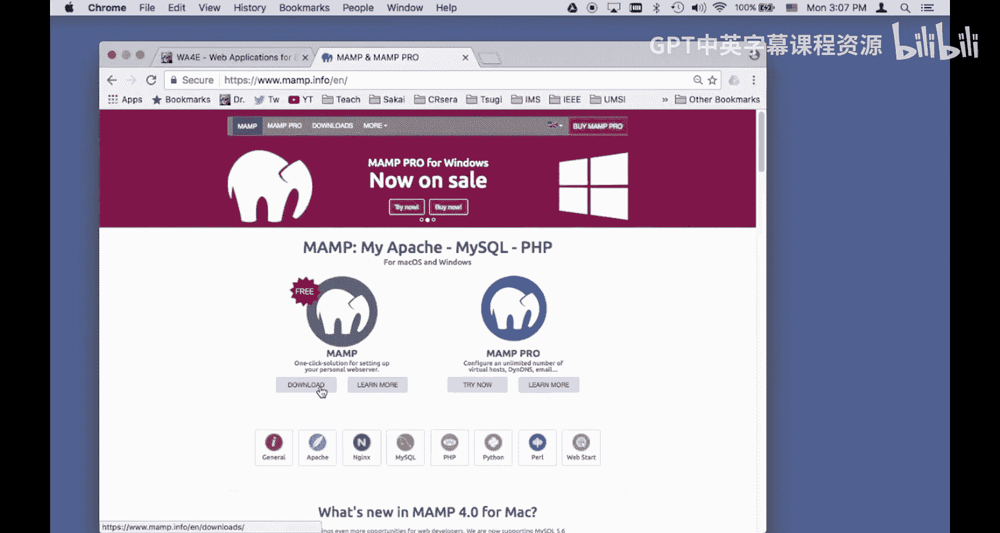

在本节课中，我们将学习如何在Macintosh电脑上安装MAMP软件。MAMP是一个集成了Apache服务器、MySQL数据库和PHP的本地开发环境，是进行Web应用程序开发的重要工具。我们将从下载安装开始，到配置PHP设置，最后创建一个简单的PHP页面来验证安装是否成功。

## 下载与安装MAMP

首先，我们需要从MAMP的官方网站下载安装程序。访问 `mamp.info` 即可找到下载链接。

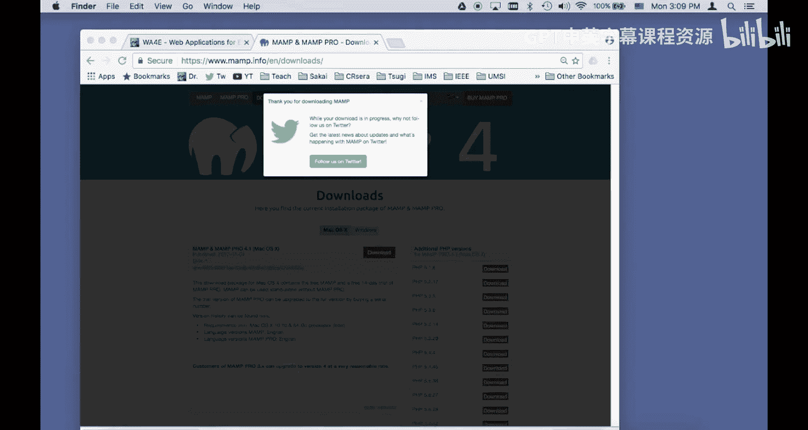

下载完成后，文件通常会保存在“下载”文件夹中。找到名为 `MAMP_Pro_4.0.1.pkg`（版本号可能不同）的安装包，双击开始安装。

在安装过程中，接受所有默认设置即可。安装程序会自动完成所有必要的步骤。

## 启动与验证MAMP

安装完成后，打开“访达”，进入“应用程序”文件夹，可以找到名为 `MAMP` 的应用程序。

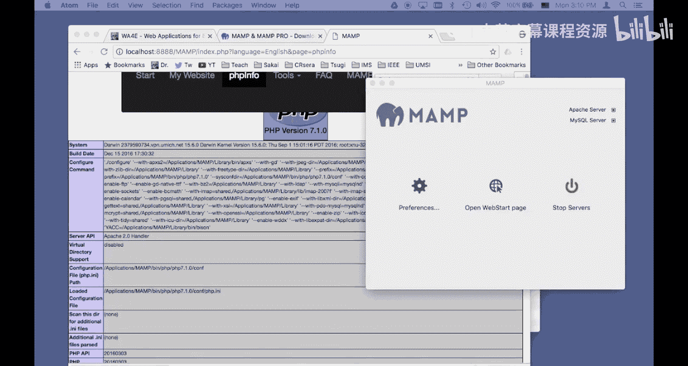

双击启动MAMP。MAMP控制面板会随之打开，面板上会显示服务器的状态信息，例如PHP版本和配置文件位置。一个绿色的圆点表示服务器正在运行。

此时，在浏览器中访问 `http://localhost:8888`，可以打开MAMP的欢迎页面。点击页面上的“PHP信息”链接，可以查看当前PHP的详细配置。

## 配置PHP开发设置

默认情况下，MAMP的PHP配置可能不会在页面上显示错误信息，这对于开发调试很不方便。我们需要修改PHP配置文件来开启错误显示。

以下是需要修改的配置项：
*   **`display_errors`**： 设置为 `On`，以在页面上显示运行时错误。
*   **`display_startup_errors`**： 设置为 `On`，以显示PHP启动时的错误。

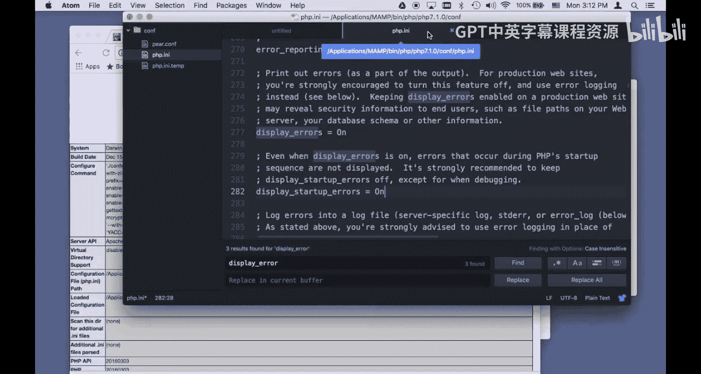

**注意**：这些设置仅适用于本地开发环境。在生产环境中，必须将其关闭，以避免泄露敏感信息。

具体操作步骤如下：
1.  在MAMP控制面板中，点击“停止服务器”。
2.  使用文本编辑器（如TextEdit）打开PHP配置文件。文件路径通常为：`/Applications/MAMP/bin/php/php[版本号]/conf/php.ini`。
3.  在文件中搜索 `display_errors` 和 `display_startup_errors`，将其值从 `Off` 改为 `On`。
4.  保存文件。
5.  返回MAMP控制面板，点击“启动服务器”。

再次访问“PHP信息”页面，搜索“display_errors”，确认其值已变为 `On`，即表示配置成功。

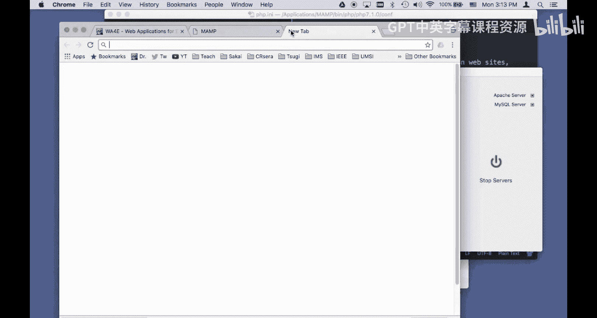

## 创建第一个PHP页面

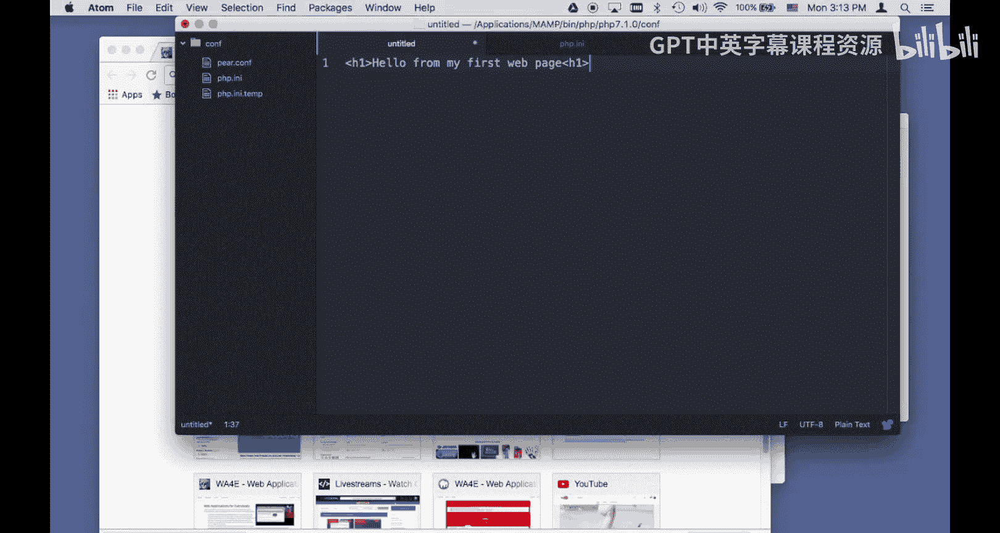

现在，我们来创建一个简单的PHP页面，以测试开发环境是否工作正常。

首先，找到MAMP的网站根目录。默认路径是：`/Applications/MAMP/htdocs/`。所有需要通过本地服务器访问的网页文件都应放在此目录或其子目录下。

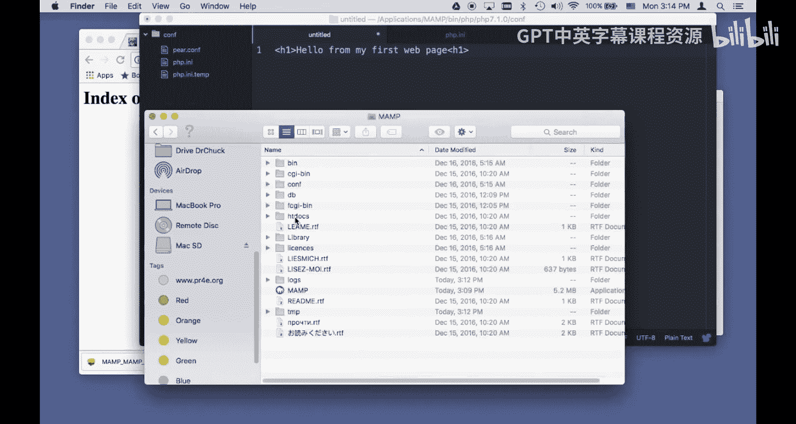

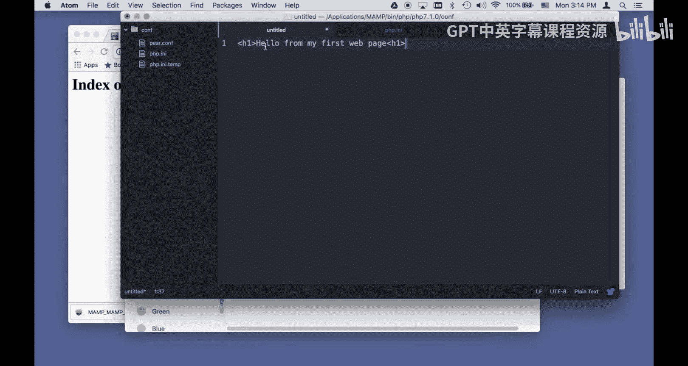

接下来，我们创建一个测试文件：
1.  在 `htdocs` 目录下，新建一个名为 `first` 的文件夹。
2.  在该文件夹内，创建一个名为 `index.php` 的文件。
3.  用文本编辑器打开 `index.php`，输入以下代码：

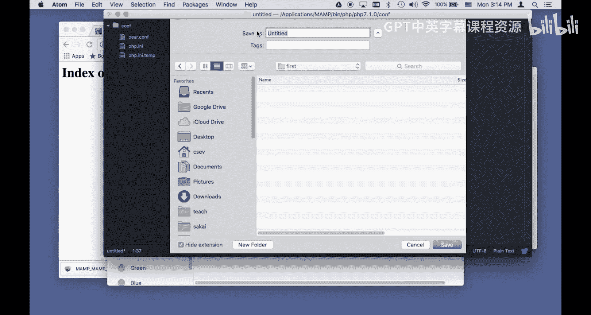

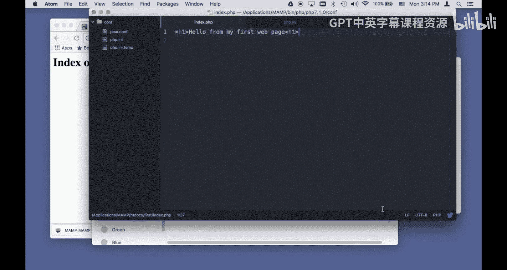

```php
<?php
echo "Hello from my first web page.";
?>
```

保存文件后，在浏览器中访问 `http://localhost:8888/first/`。服务器会自动寻找并执行 `index.php` 文件，你将在页面上看到输出的文字：“Hello from my first web page.”

## 总结

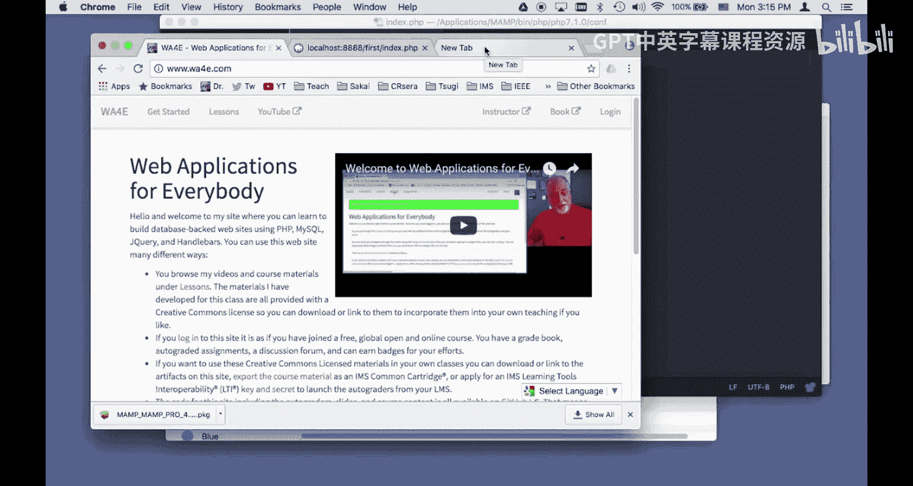


本节课中，我们一起学习了在Macintosh上搭建PHP本地开发环境的完整流程。我们完成了MAMP软件的下载与安装，学会了如何启动服务器并修改关键的PHP配置（开启错误显示），最后通过创建一个简单的 `index.php` 文件验证了环境配置成功。现在，你已经拥有了一个功能完备的本地Web开发环境，可以开始进行PHP编程了。