# 053：在Windows 10上安装MAMP与编写第一个PHP程序 🚀

在本节课中，我们将学习如何在Windows 10系统上安装MAMP集成开发环境，并编写和运行你的第一个PHP程序。整个过程包括下载、安装、配置MAMP，以及使用文本编辑器Atom创建并调试一个简单的PHP网页。


## 下载与安装MAMP

首先，我们需要下载MAMP的Windows版本。访问官方网站，选择Windows版本进行下载。

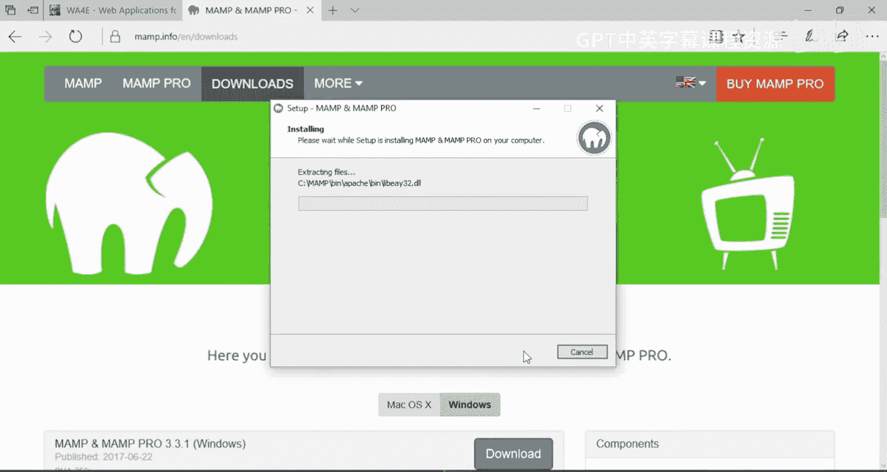

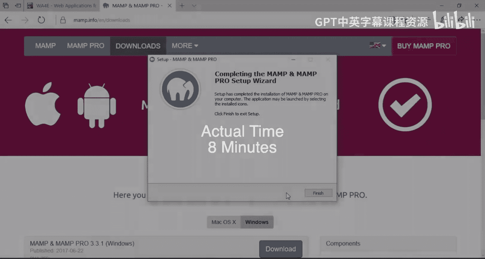

下载完成后，运行安装程序。在安装过程中，请按照以下步骤操作：

1.  选择安装语言为“English”。
2.  在安装选项界面，取消勾选“MAMP PRO”的付费版本，仅安装基础版本。
3.  阅读并接受软件许可协议。
4.  使用默认的安装路径（例如 `C:\MAMP`）。
5.  完成安装向导，并启动MAMP应用程序。

安装过程中，系统可能会弹出Windows防火墙警告。这是正常现象，因为MAMP需要与网络通信。

以下是关键步骤的图示：


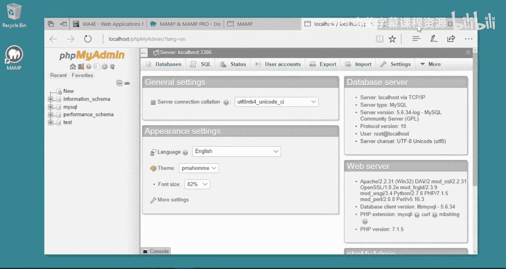

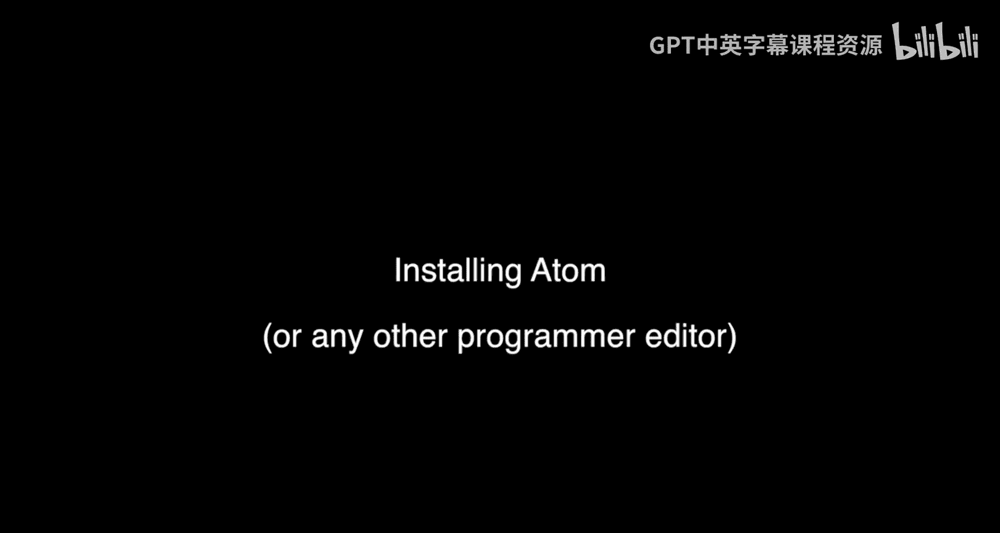

## 启动与验证MAMP服务

成功安装后，桌面上会出现MAMP的快捷方式。启动MAMP，其主控制面板将显示Apache和MySQL服务器的状态。

为了确保所有功能正常工作，我们需要启动这两项服务，并允许它们通过防火墙。

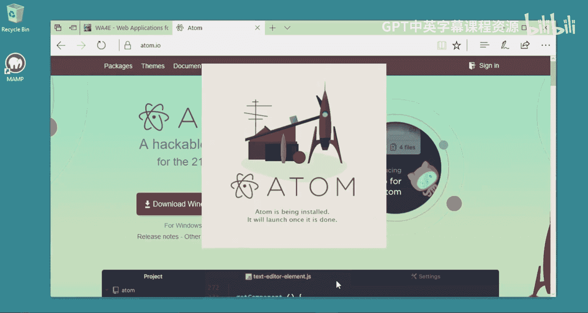

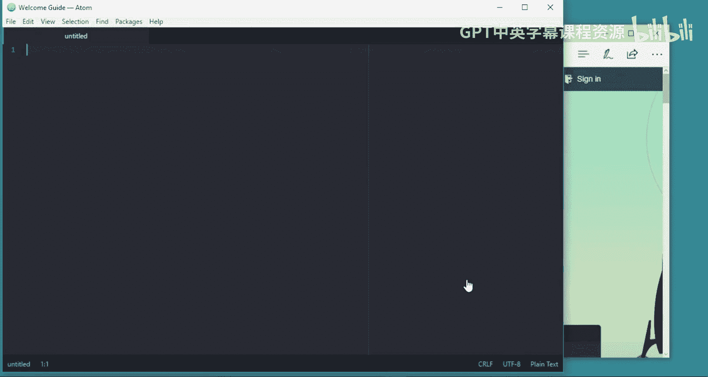

1.  在MAMP控制面板中，点击“Start Servers”按钮，启动Apache和MySQL服务器。
2.  当Windows防火墙提示时，务必为Apache和MySQL都选择“允许访问”，这是服务器能正常通信的关键。

服务启动后，点击“Open Start Page”按钮，将在浏览器中打开MAMP的本地欢迎页面。这个页面包含了许多有用信息。

为了验证PHP和MySQL已正确安装并运行，请执行以下操作：

1.  在MAMP欢迎页面上，点击“phpMyAdmin”链接。
2.  如果phpMyAdmin管理界面能够正常加载并显示数据库信息，如下图所示，则说明你的MAMP环境已成功安装并配置完毕。


## 安装文本编辑器Atom

上一节我们成功搭建了PHP运行环境，本节中我们来看看如何准备代码编写工具。虽然你可以使用任何文本编辑器，但我们推荐使用Atom，因为它跨平台（Windows、Mac、Linux）且功能强大，支持语法高亮等对编程至关重要的特性。请避免使用记事本(Notepad)或Word，它们可能会破坏代码文件的格式。

从Atom官网下载Windows安装程序并运行。按照安装向导的提示完成安装即可。

以下是安装过程的图示：


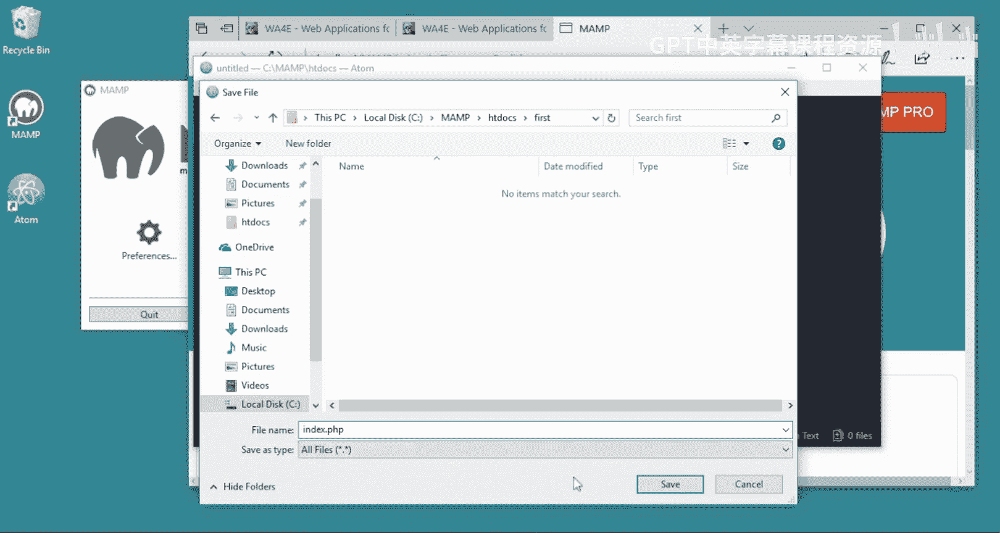

## 编写第一个PHP程序

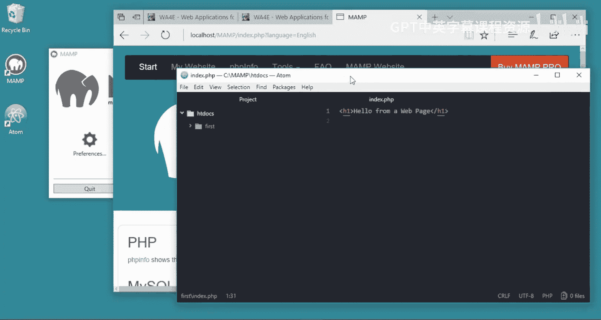

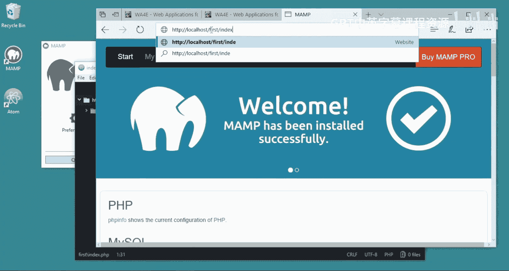

现在，我们将结合MAMP和Atom，创建第一个PHP应用程序。

首先，确保MAMP中的Apache和MySQL服务器已经启动。然后，在Atom中新建一个文件。

我们将编写一个简单的PHP页面。在Atom的新文件中，输入以下代码：

```php
<h1>Hello from a web page</h1>
<?php
echo "Hi there\n";
?>
<p>Some HTML</p>
```

接下来，我们需要将这个文件保存到MAMP的网站根目录，这样Apache服务器才能找到并执行它。

1.  在Atom中，点击“File” -> “Save”。
2.  在保存对话框中，导航到MAMP的 `htdocs` 目录。通常路径是 `C:\MAMP\htdocs`。
3.  在 `htdocs` 目录下，创建一个新文件夹，命名为 `first`。
4.  将文件保存到这个 `first` 文件夹中，并命名为 `index.php`。`index.php` 是一个特殊名称，当浏览器访问一个目录时，服务器默认会寻找并打开这个文件。

保存后，Atom会自动为PHP代码进行语法高亮。

现在，打开你的网页浏览器，在地址栏输入以下URL来访问我们刚创建的程序：
`http://localhost/first/index.php`

如果一切正常，你将看到一个网页，显示“Hello from a web page”的标题，以及由PHP代码输出的“Hi there”文本。

以下是代码和浏览器结果的图示：


## 理解PHP代码执行

让我们深入理解一下刚才的程序是如何工作的。在 `index.php` 文件中，我们混合了HTML和PHP代码。

*   普通的HTML标签（如 `<h1>`、`<p>`）会被服务器直接发送到浏览器渲染。
*   当服务器遇到 `<?php` 和 `?>` 标签时，它会切换到PHP解释器模式，执行其中的代码。
*   在PHP代码块中，`echo` 语句用于向网页输出内容。例如，`echo "Hi there\n";` 会将字符串“Hi there”插入到网页中该代码所在的位置。

你可以把PHP代码块想象成一个“内容生成器”。服务器执行代码，将所有 `echo` 输出的结果组合起来，替换掉原来的 `<?php ... ?>` 块，最终生成一个完整的HTML页面发送给浏览器。

我们可以添加更多逻辑。修改你的 `index.php` 文件，加入变量和计算：

```php
<h1>Hello from a web page</h1>
<?php
echo "Hi there\n";
$x = 6 * 7;
echo "The answer is " . $x;
?>
<p>Some HTML</p>
```
保存文件并刷新浏览器，你将看到输出结果中包含了计算出的答案“The answer is 42”。

## 配置PHP错误显示

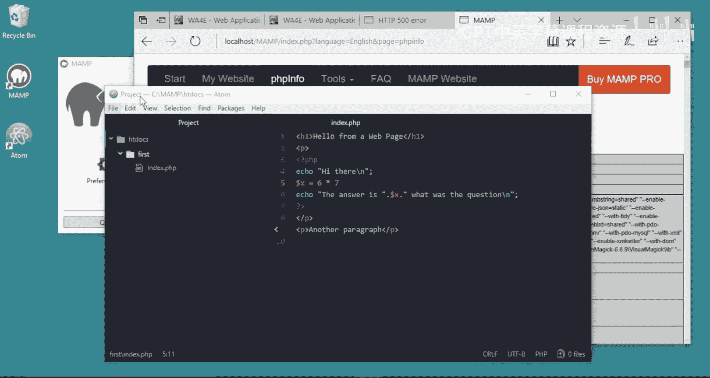

在开发过程中，犯错是不可避免的。一个友好的开发环境应该能清晰地告诉我们错误在哪里。然而，出于安全考虑，MAMP默认关闭了在网页上直接显示PHP错误的功能。这会导致我们在代码出错时，只看到一个笼统的“500服务器错误”，而不知道具体原因。

为了获得详细的错误信息，我们需要修改PHP的配置文件。

以下是配置步骤：

1.  在MAMP欢迎页面，点击“PHPInfo”链接。
2.  在打开的PHP信息页面中，找到“Loaded Configuration File”这一行。它显示了当前使用的PHP配置文件的路径，例如 `C:\MAMP\bin\php\php7.1.5\php.ini`。请记下你的PHP版本号（如7.1.5）。
3.  使用Atom或任何文本编辑器打开这个 `php.ini` 文件。
4.  在文件中搜索 `display_errors` 设置。
5.  找到 `display_errors = Off` 这一行，将其改为 `display_errors = On`。
6.  同时，确保 `display_startup_errors` 也设置为 `On`。
7.  保存 `php.ini` 文件。

**重要提示**：修改PHP配置文件后，必须重启Apache服务器才能使更改生效。在MAMP控制面板中，先点击“Stop Servers”，然后再点击“Start Servers”。

重启完成后，刷新PHPInfo页面，确认 `display_errors` 和 `display_startup_errors` 的状态已变为“On”。

现在，让我们故意在代码中制造一个语法错误（例如删除一行代码末尾的分号），然后刷新浏览器页面。此时，你将看到一个详细的错误信息，明确指出错误发生在哪个文件的哪一行，以及错误类型是什么（例如“Parse error: syntax error...”）。

根据这个明确的提示，你可以快速定位并修复代码中的错误。修复后（重新加上分号），刷新页面，程序就会恢复正常运行。

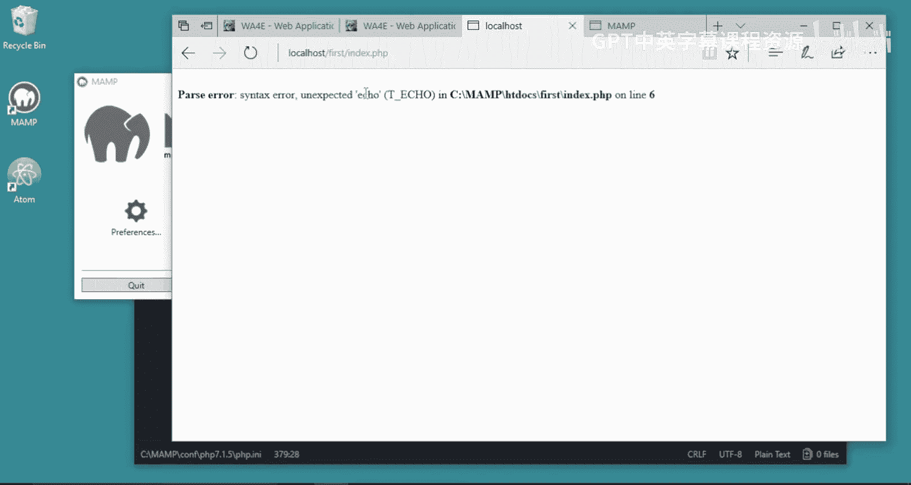

养成在开发初期就开启错误显示的习惯，可以为你节省大量调试时间。

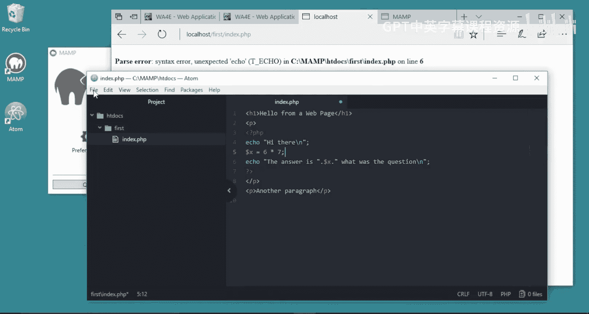

以下是查找配置文件和开启错误显示的图示：


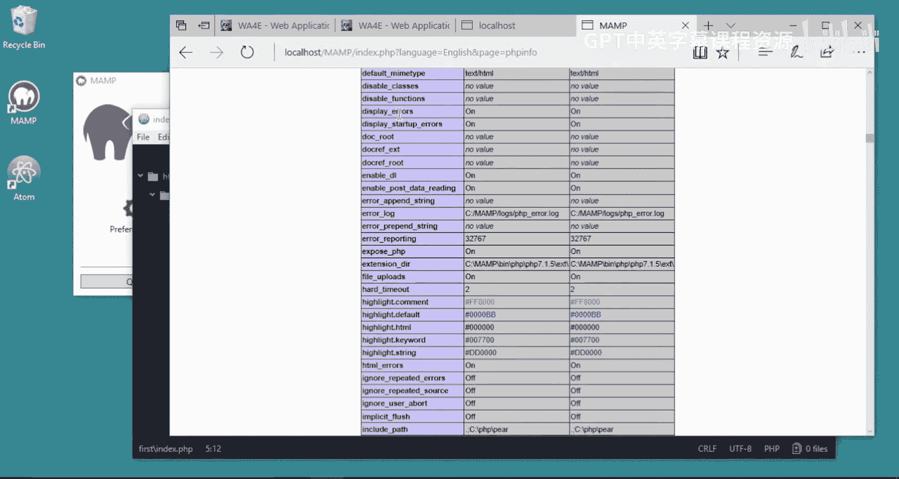

## 课程总结


本节课中我们一起学习了Web应用开发环境的搭建与初体验。我们完成了在Windows 10上安装MAMP集成环境，验证了Apache、PHP和MySQL服务的正常运行。随后，我们安装了Atom代码编辑器，并在MAMP的 `htdocs` 目录下创建了第一个PHP程序，理解了HTML与PHP代码混合执行的基本原理。最后，我们完成了开发中至关重要的一步：配置PHP以在浏览器中显示详细错误信息，这为后续的高效调试打下了坚实基础。现在，你的本地开发环境已经准备就绪，可以开始探索更复杂的Web应用程序开发了。