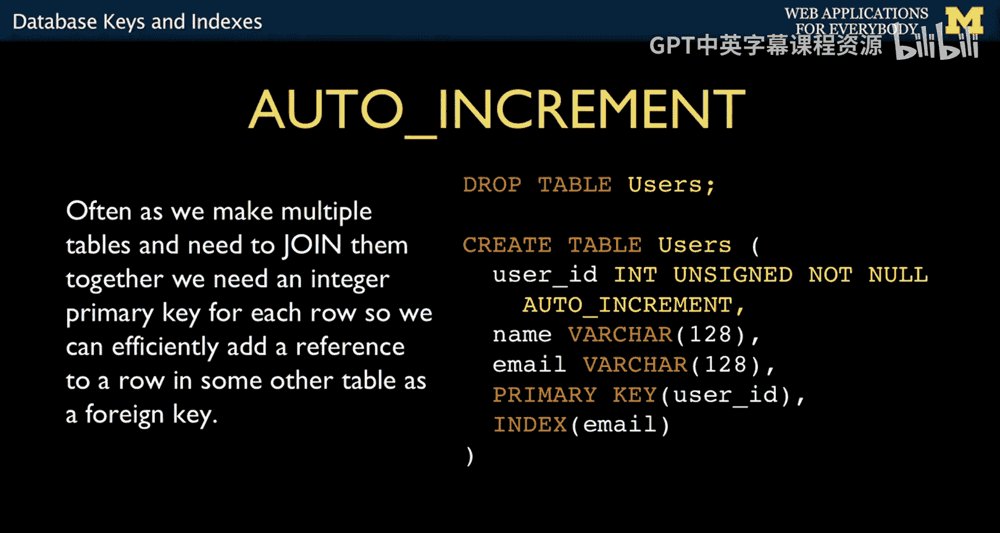
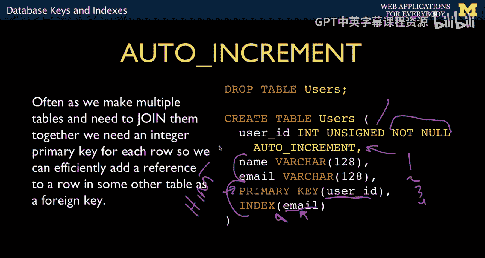
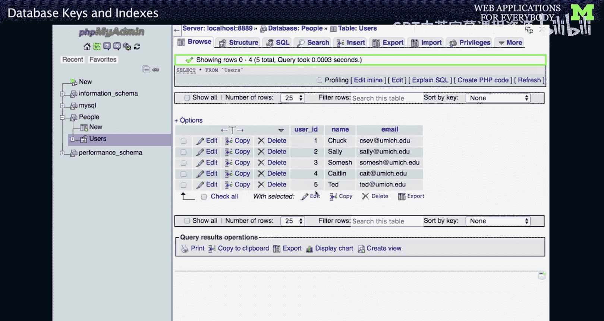
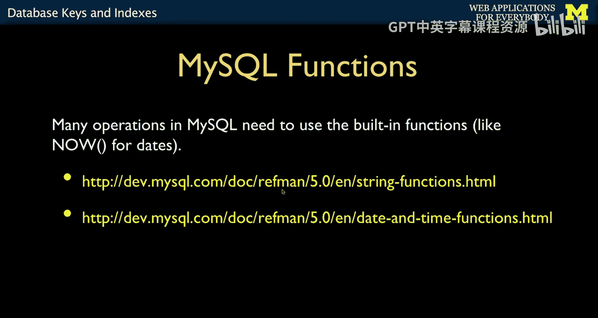
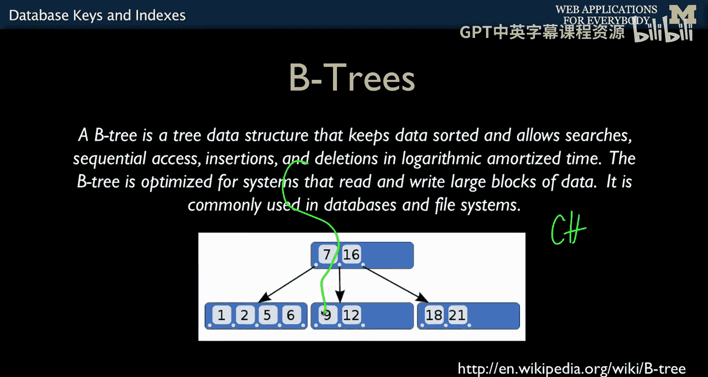
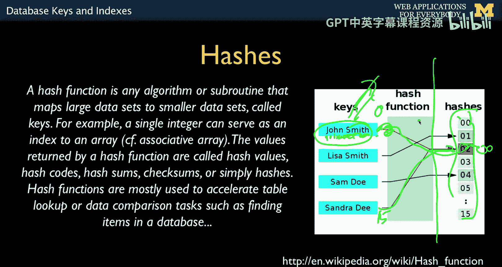
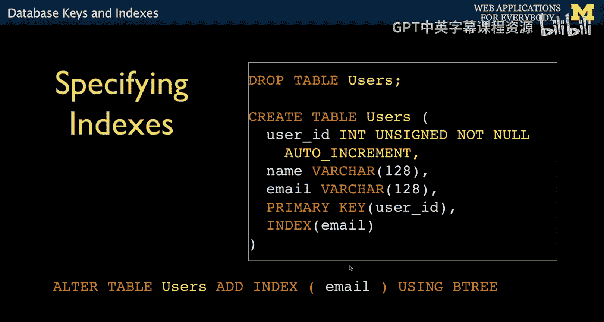

# 059：数据库键与索引 🔑


在本节课中，我们将要学习数据库设计中两个至关重要的概念：键（Keys）和索引（Indexes）。我们将了解如何通过定义主键、外键以及创建索引来优化数据的存储和查询效率，为后续学习多表连接打下基础。

## 定义列与使用意图




上一节我们讨论了如何定义列的数据类型（如整数、字符、图像等）。本节中，我们来看看如何进一步描述这些列的用途，而不仅仅是它们存储什么内容。

创建表和定义列的过程，实际上是在告诉数据库我们打算如何使用这些数据。现在，我们将对此进行更详细的说明。

## 主键与自动递增

以下是一个创建新用户表的SQL语句示例。我们首先关注 `user_id` 列。

```sql
CREATE TABLE users (
    user_id INT UNSIGNED NOT NULL AUTO_INCREMENT,
    name VARCHAR(128),
    email VARCHAR(128),
    PRIMARY KEY (user_id),
    INDEX (email)
);
```

在后续课程中，当我们需要连接两个表时，会用到一种机制：用一个表中的某一行指向另一个表中的特定行。例如，表A有第1、2、3、4行，表B中的一行可能需要指向表A的第4行。我们通过在表B中存入数字“4”来实现。这涉及到主键和外键的概念，我们稍后会详细讨论。

这种机制的核心是：我们希望在向表中插入行时，只需使用某个数字作为标识，而不必关心这个数字具体是什么。实际上，我们可以让数据库自动生成这个数字。这正是 `AUTO_INCREMENT` 的作用。



`AUTO_INCREMENT` 是一种告诉数据库的方法：我们将创建一个整数列，如果我们不提供值，请自动为我们生成。让我们分析 `user_id` 列的定义：
*   `INT` 是 `INTEGER` 的缩写，表示整数。
*   `UNSIGNED` 表示只允许正数。
*   `NOT NULL` 表示该列是必填项。
*   `AUTO_INCREMENT` 表示如果我们不提供值，请自动生成。其生成方式是从1开始递增（1, 2, 3, 4...）。当我们插入一行时，数据库会处理这一切，它会知道“下一个是5”。这样，我们的程序就不需要自己跟踪这些数字。


`name` 和 `email` 字段被定义为 `VARCHAR(128)`，这与我们之前定义列的方式相同。

## 索引：数据的快捷方式

接下来，我们要通过两条语句告诉数据库一些关于数据以及我们将如何使用它们的信息。这涉及到之前提到的“索引”——它们就像是磁盘上不同位置的快捷方式。

*   `PRIMARY KEY (user_id)`：我们声明 `user_id` 列将作为主键使用。这意味着我们会频繁使用它进行查询，数据库需要能够非常快速地查找它。因此，数据库会在磁盘上额外存储一些“面包屑”（索引结构），以便实现超快速访问。`user_id` 是一个数字，我们希望为其建立一个非常高效的索引，以实现快速查找。
*   `INDEX (email)`：这个索引声明表示，我们将会大量使用 `WHERE` 子句通过 `email` 进行查询（例如 `WHERE email = '...'`），甚至可能使用 `LIKE` 子句，或者经常按 `email` 排序。这个声明并不改变我们存储的数据内容，而是改变了我们对数据的使用预期。

这些声明既是规则（例如，主键必须是唯一的），也是给数据库的提示。例如，`INDEX (email)` 是在说：“嘿，数据库，虽然我们现在只是存储数据，但以后我会经常通过电子邮件地址来查询这张表。如果你要创建索引，请为 `email` 列创建一个。我现在只是给你一个提示，我们以后会大量使用带 `email` 的 `WHERE` 子句进行字符串查找，所以请提高效率。” 但你并没有明确告诉数据库具体要做什么，只是给出了使用意图的提示。




## 自动递增的实际效果

现在让我们执行这个 `CREATE TABLE` 语句来创建表。创建成功后，其结构与其他表类似，但我们注意到 `user_id` 旁边有一个小钥匙图标，这表示它是主键，并且数据库知道它是自动递增的。




如果我们现在执行插入操作，会看到自动递增的效果。以下是插入语句：

```sql
INSERT INTO users (name, email) VALUES ('Chuck', 'csev@umich.edu');
INSERT INTO users (name, email) VALUES ('Sally', 'sally@umich.edu');
INSERT INTO users (name, email) VALUES ('Somesh', 'somesh@umich.edu');
INSERT INTO users (name, email) VALUES ('Caitlin', 'cait@umich.edu');
```

请注意，在这些插入语句中，我没有指定 `user_id` 的值。这就是自动递增的作用：如果我不指定，数据库会自动为我提供。同时，它必须保证唯一性。执行后查看数据，数据库自动为我们分配了 `user_id` 值（1, 2, 3, 4）。稍后在使用PHP时，我们可以获取这个自动生成的数字。当我们在课程第二部分讨论多表连接时，这个功能将变得至关重要。目前，自动递增只是一种自动设置列值的方式。

数据库还有许多内置函数，例如我们之前提到的 `NOW()`。你不需要在PHP中知道具体日期，只需在插入时对 `DATETIME` 类型的字段使用 `NOW()` 即可。还有很多很酷的字符串函数等。除了 `NOW()`，我不会教太多这些函数，因为你可以在Stack Overflow等地方轻松找到，例如搜索“MySQL函数获取字符串前三个字符”，然后复制粘贴即可。

## 深入理解索引

正如我提到的，索引非常重要。如果你没有为某列创建索引，然后基于该列进行查询，数据库可能不得不扫描整个表。如果表中有数十万条记录，这会非常慢。

索引本质上是一个目录或快捷方式。数据存储在磁盘的不同位置，读取时需要等待磁盘转动。而索引是一小块数据，它指向各个记录的位置。读取索引（数据量较小）后，数据库可以直接跳转到目标记录（例如第4条），而不必顺序读取第1、2、3条。这是一种极大的简化，实际上有大量关于如何优化索引的博士论文，涉及单磁盘、多磁盘、SSD等各种场景。数据库工作的美妙之处在于，成千上万的计算机科学博士论文致力于让这些软件变得更快，而你只需要说 `SELECT`，一切就都工作了。

主要有几种不同类型的索引：哈希（Hash）索引和树（Tree）索引，后者通常指B树（B-Tree）。
*   **哈希索引** 通常用于主键的精确匹配查找。
*   **B树索引** 适用于排序和前缀匹配（例如查找以“CH”开头的名字）。

在我之前展示的例子中，我甚至没有指定索引类型。主键索引（在整数字段上）占用空间小，用于精确匹配且不允许重复，查找速度极快。而为 `email` 列创建的索引，无论是哈希还是B树，都适用于前缀查找，其中B树最适合前缀查找。很多人建议甚至不要指定使用哈希还是B树，让数据库根据数据自动调整。

## B树索引的工作原理

让我们换个方式理解索引。假设数据分散存储在磁盘各处，顺序扫描可能需要很长时间。你可以创建一个索引，它是一小块数据，包含指向实际数据记录的指针。这样你就可以跳过大量数据，直接访问目标。

这是一种简化的B树示意图。数据块基本上是有序的。索引中存储了一些关键值和指向其他数据块的指针。例如，所有小于7的值存储在A块，7到16之间的值在B块，大于16的在C块。如果要查找9，数据库先读取索引，发现9在7到16之间，于是读取B块，然后在B块中找到9。这只需要三次读取，而不是顺序扫描可能需要的很多次。

当你向这样的结构中插入数据时（比如插入4），数据库需要将其放入正确的块（A块）。如果A块满了，它可能会进行“分裂”（Split），将A块分成两部分，并更新索引中的指针。虽然你不需要了解这些具体细节（这是计算机科学家解决的问题），但你需要知道B树适用于需要排序和前缀匹配的数据，尤其是字符串。



## 哈希索引的工作原理

哈希索引理解起来稍微复杂一些。它使用一种称为哈希函数的巧妙数学计算。Python中字典的快速查找正是基于此。

哈希函数根据查找键（如电子邮件地址或姓名）执行一个简单计算，生成一个数字（例如0到15之间）。根据这个计算结果，数据被存储到对应的“槽”（Slot）中。这个过程不需要访问磁盘，只需计算哈希函数，然后直接定位。哈希的问题在于，不同的键可能计算出相同的哈希值（哈希冲突），这时就需要处理溢出或重新组织。但重组之后，查找会非常快，因为计算哈希后只需很少的磁盘读取。

## 索引的创建与调整



哈希和B树是两种不同的索引类型。正如我们开始时看到的，我们可以在创建表时指定希望在哪些列上建立什么类型的索引。这只是一个提示，并不改变你使用的SQL语法。

在我们的例子中，我们暗示 `user_id` 上将建立一个基于整数的、超快的哈希类索引，而 `email` 上将建立一个基于字符串的、用于排序和前缀查找的B树类索引。

最酷的是，如果你忘记添加这些索引，后来发现应用程序运行缓慢，你随时可以使用SQL命令来后期添加索引。甚至有些工具可以监控你的数据库，并建议“你可能应该在 `email` 列上加一个B树索引”。正如我提到的，有些同事建议永远不要指定索引类型，让数据库自己决定最佳方案。关于使用B树还是哈希，如果是字符串你可能想要B树，否则可能想要哈希。但你也可以让数据库决定。我们真正要表达的是：“我将会频繁使用 `WHERE` 子句通过这个 `email` 列进行查找，所以，数据库先生，请尽可能高效地存储它。”

## 总结



本节课中我们一起快速浏览了SQL的一个重要部分。我们学习了如何设置数据的结构、定义数据规则，并给出如何使用数据的提示。创建、读取、更新和删除（CRUD）操作并不难。


接下来，我们将讨论如何创建多个表并将它们连接起来。这将是实现真正性能提升的关键。目前，我们找到了存储数据的规范方式，虽然索引很酷，但连接（Joins）才是真正强大的功能，我们将在下一节讨论它。