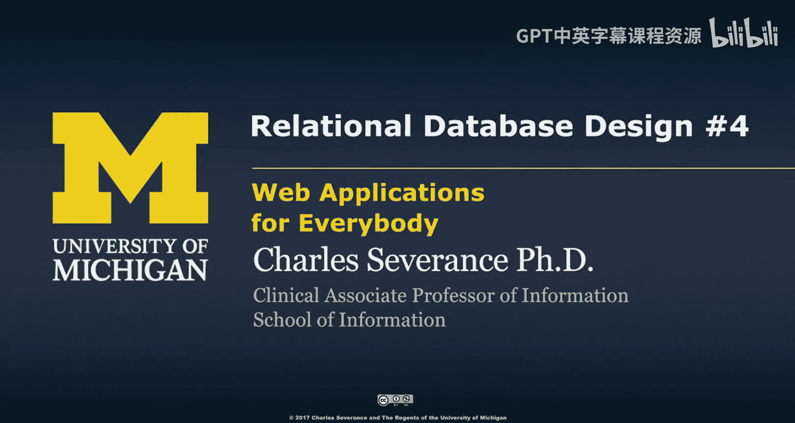
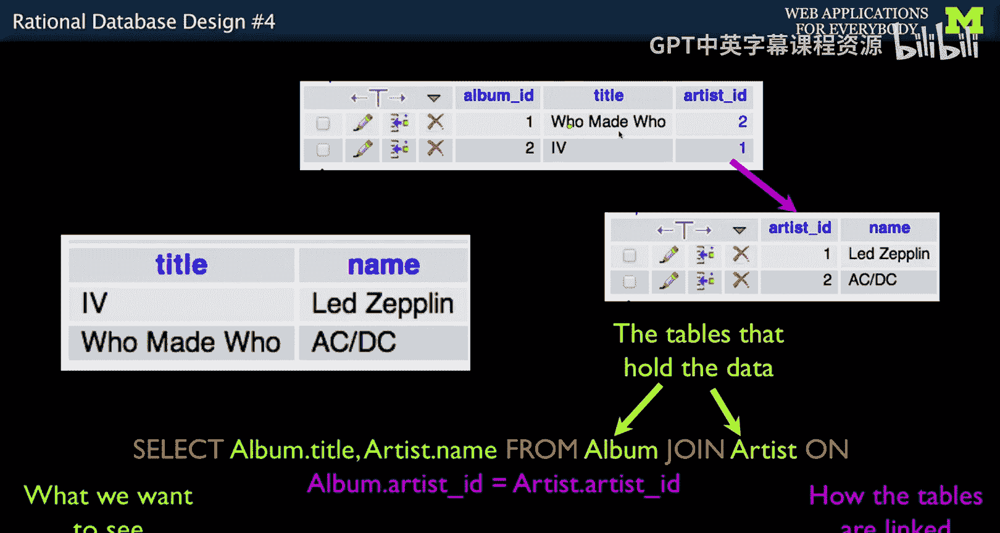
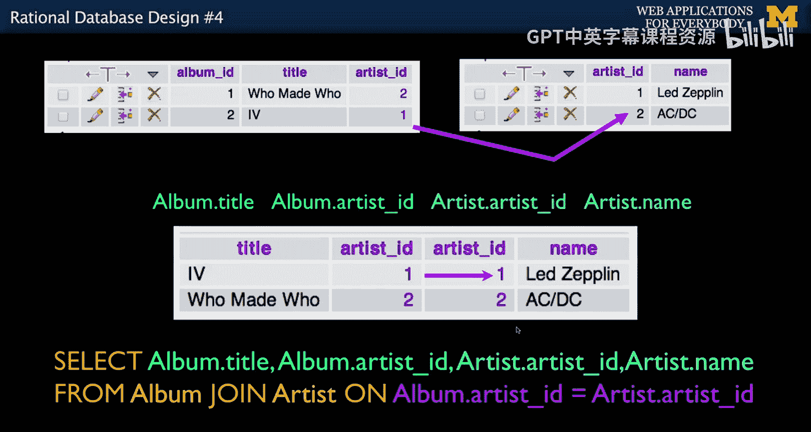
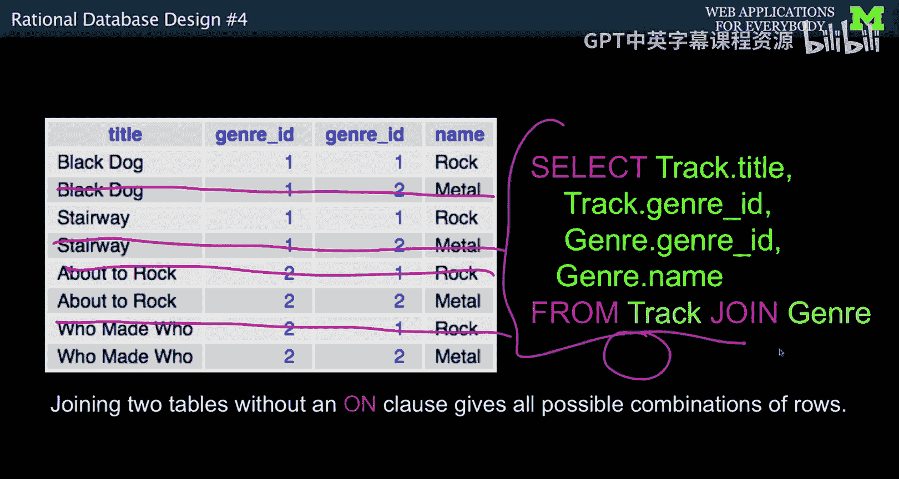
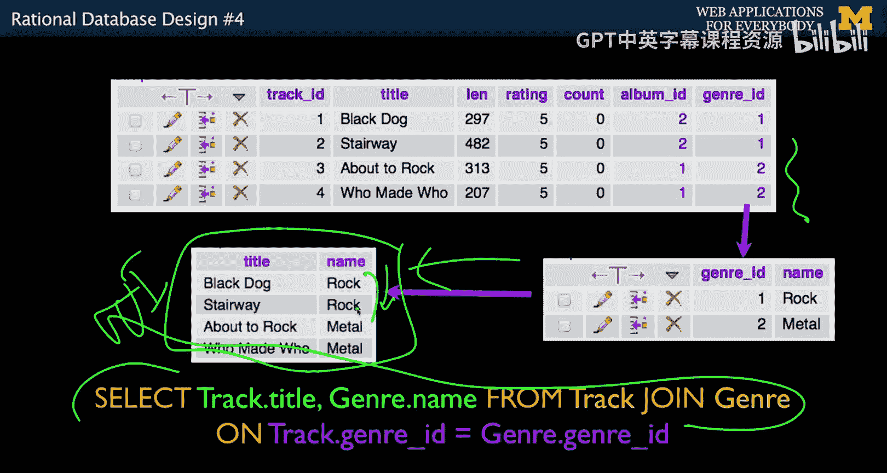
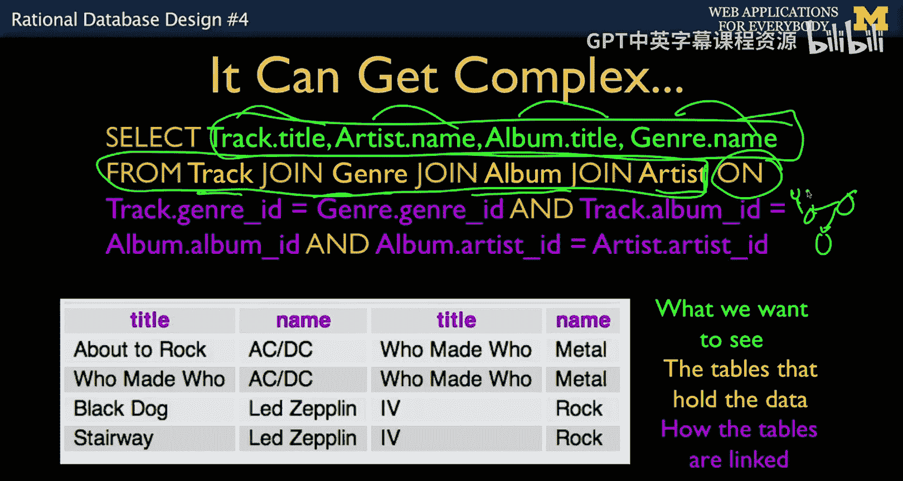
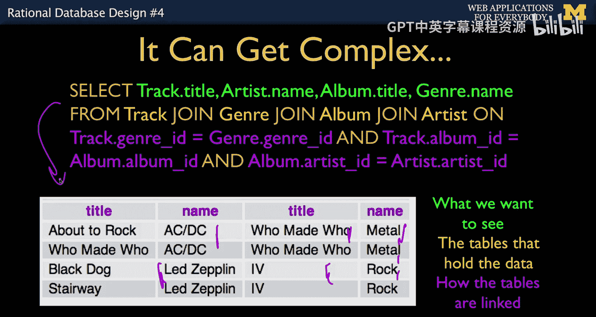
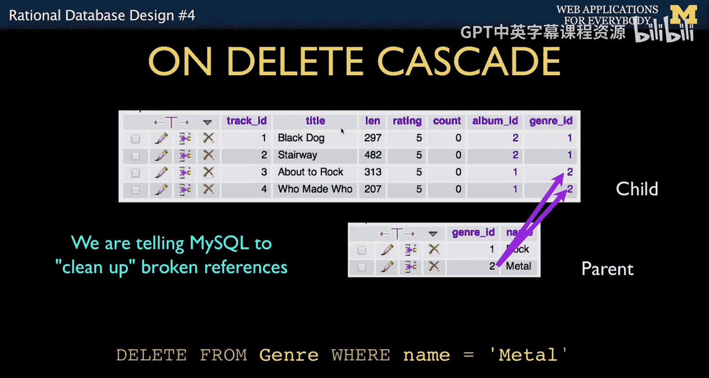
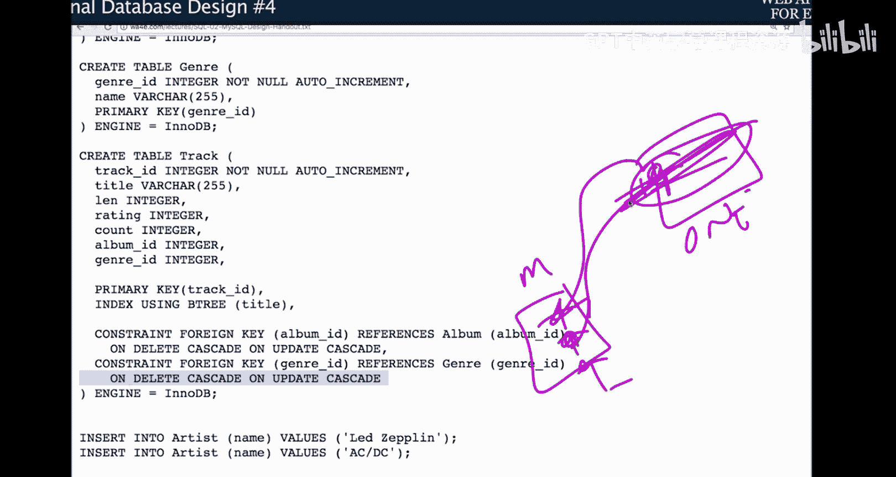
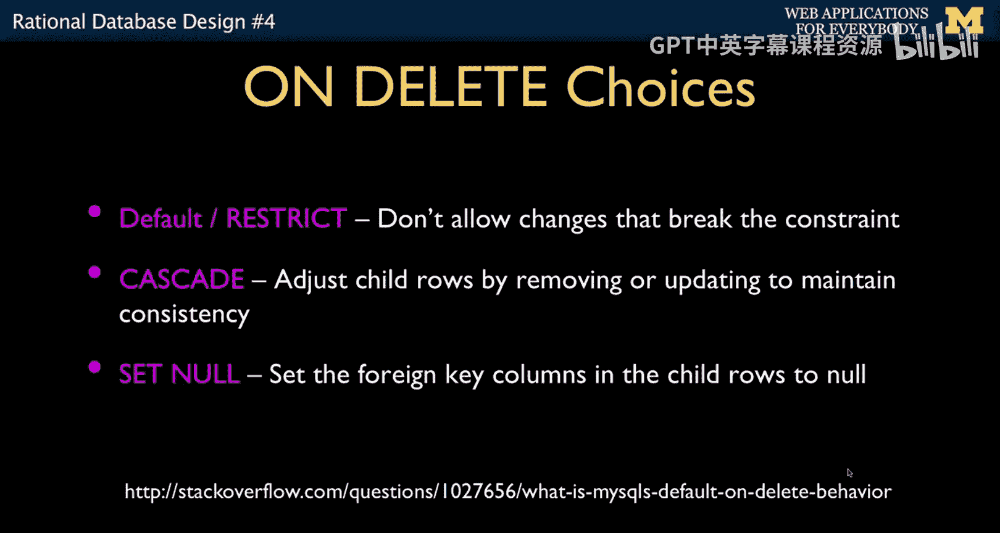

# 065：关系型数据库设计4





## 概述

在本节课中，我们将学习如何将分散在多个表中的数据重新组合起来，以呈现给用户。我们将重点介绍SQL中的**JOIN**操作，它允许我们从多个表中同时提取数据，并根据外键关系将它们连接起来。我们还将探讨`ON DELETE CASCADE`等约束的作用，并简要介绍多对多关系。

我们已经成功地将所有数据拆分到不同的表中，并使用主键和外键在数据库层面建立了连接。然而，我们不能直接让用户界面设计师去查看这些包含外键ID的新表结构。用户需要看到的是直观、有意义的数据，而不是内部ID。因此，我们的任务是将这些分散的数据重新组合起来。

## 使用JOIN操作重建数据

上一节我们介绍了如何通过规范化将数据拆分到多个表中。本节中，我们来看看如何通过SQL的**JOIN**操作，将这些数据高效地重新组合，以满足用户界面的需求。

JOIN操作允许我们从多个表中同时提取数据，并将它们组合在一起。`ON`子句则指定了连接这些表的规则，即哪些行应该被关联起来。这非常简单：JOIN指定了涉及的表，而ON子句指定了连接的规则。

以下是一个基础的JOIN示例。假设我们有一个`album`表和一个`artist`表，我们想显示专辑标题和对应的艺术家姓名，而不是内部的ID数字。我们需要做的就是“跟随”表之间的链接，这正是JOIN操作能为我们完成的。

以下是实现此功能的SQL语句：

```sql
SELECT album.title, artist.name
FROM album
JOIN artist
ON album.artist_id = artist.artist_id;
```




我们来分解这个语句：
*   `SELECT album.title, artist.name`：这是我们想要显示的列。由于涉及多个表，我们使用`表名.列名`的格式来明确指定。
*   `FROM album`：指定查询的起始表。
*   `JOIN artist`：表示我们要将`album`表与`artist`表连接起来，从两个表中获取数据的超集。
*   `ON album.artist_id = artist.artist_id`：这是连接规则。它指定只有当`album`表中的`artist_id`列（外键）等于`artist`表中的`artist_id`列（主键）时，才将两表的行连接起来。`ON`子句的作用就是过滤掉所有不匹配的行组合。

通过这个查询，我们就从一个内部高效、可扩展的数据模型，转换成了用户期望看到的界面：显示了专辑名和对应的艺术家名。我们的任务就是重建所有这些数据关系。

## 深入理解JOIN与ON子句

为了更好地理解JOIN和ON子句的工作原理，我们可以将其想象为两个步骤。



首先，JOIN操作会创建一个临时的“超长”元数据行，它包含两个表中所有行的**所有可能组合**。例如，如果`track`表有4行，`genre`表有2行，在没有ON子句的情况下，JOIN会产生 `4 * 2 = 8` 行结果。

其次，`ON`子句的作用就是从这个所有组合的集合中，**过滤掉**那些不满足连接条件的行。它只保留那些外键与主键匹配的行。在上面的例子中，ON子句会将8行结果过滤到只剩下实际匹配的2行。

因此，ON子句至关重要，它确保我们只得到有意义的、相关联的数据，而不是所有可能的随机组合。虽然数据库知道我们定义了外键关系，但在SQL中，我们仍然需要显式地使用`ON`子句来告诉它如何进行连接。

当我们添加了正确的ON子句后，查询结果就只显示匹配的行，去除了中间不相关的组合。这时，我们可能会再次看到字符串数据的“垂直重复”，例如同一个艺术家的名字出现在多张专辑旁边。**关键点在于**：这种重复只出现在查询输出的**临时结果集**中，而**不是**存储在数据库里的。数据库在需要时动态构建这个结果，它不浪费存储空间，却能以用户期望的格式快速呈现数据。



## 连接多个表

JOIN操作可以扩展到连接多个表。只要命名规范清晰，这个过程并不复杂。



为了重建我们最初想要的完整视图（例如显示音轨标题、艺术家名、专辑名和流派名），我们需要跨越四个表进行连接。以下是相应的SQL语句：

```sql
SELECT track.title, artist.name, album.title, genre.name
FROM track
JOIN genre ON track.genre_id = genre.genre_id
JOIN album ON track.album_id = album.album_id
JOIN artist ON album.artist_id = artist.artist_id;
```

这个查询的逻辑如下：
*   我们有四个表（`track`, `genre`, `album`, `artist`），它们之间存在三个关系（箭头）。
*   因此，我们需要三个`JOIN`（连接四个表）和三个`ON`子句（对应三个关系）。
*   每个`ON`子句都简单地描述了表之间的关系：`track.genre_id = genre.genre_id`（外键等于主键），以此类推。

每个条件都只是我们捕获表间关系的一种方式，当我们需要匹配的数据时，就沿着这些关系“走”到其他表。编写这样的查询并不困难。我们通常在phpMyAdmin等工具中键入它，可能会犯语法错误，但最终会得到正确的结果。同样，输出中的“垂直重复”是临时的，不占用数据库的存储空间，但却为用户提供了他们想要的信息。



## 回顾与性能考量




让我们回顾一下整个历程。一周前，我们从用户界面中发现了数据重复的问题。于是，我们创建了四个相互关联的表，设计了包含约束的`CREATE`语句，并开始插入数据，用数字ID来维护关系。然后，我们学习了使用**JOIN**操作将所有数据重新组合起来。我们起点是分散的数据，终点是整合的视图。

你可能会问，既然最终呈现给用户的数据看起来和最初差不多，为什么不直接用一个Google文档或简单的表来存储？答案是：**速度**和**规模**。

当前示例使用极少量的数据，所以一切看起来都很简单。但在真实的Web应用程序中，性能至关重要。如果你的应用成功了，用户量会增长。一个设计糟糕、存在大量数据冗余的数据库，在数据量变大时会变得极其缓慢。因此，我们进行所有这些规范化、拆分和连接操作，核心原因就是为了保证应用的**速度和性能**，使其能够处理大规模数据。


## 补充知识：ON DELETE CASCADE



现在，让我们补充一个之前未详细讨论的话题：`ON DELETE CASCADE`（级联删除）。

还记得在创建外键约束时，我们有时会添加`ON DELETE CASCADE`或`ON UPDATE CASCADE`吗？这就像是在告诉数据库：在这个表中，我们有一行指向另一个表中的某一行。问题是，如果被指向的那一行（父行）发生了变化或被删除了，该怎么办？

具体来说，假设我们有一个“父表”（如`artist`）和一个“子表”（如`album`），子表通过外键引用父表。这种关系是“多对一”的（多个专辑属于一个艺术家）。如果我们删除了父表中的某个艺术家行，那么引用它的所有子行（专辑）应该如何处理？

`ON DELETE CASCADE`的作用是：**如果父行被删除，数据库会自动且立即地删除所有引用它的子行**。这样做是为了维护数据库的**参照完整性**。这很方便，因为你只需删除父项，所有依赖它的子项就会自动消失。



当然，你也可以选择其他行为：
*   `RESTRICT`（或`NO ACTION`）：默认行为。如果存在子行引用，则阻止删除父行。
*   `SET NULL`：删除父行后，将所有引用它的子行的外键字段设置为`NULL`（空值）。

作为程序员，你可以根据业务逻辑来选择。通过在`CREATE TABLE`语句中定义这些约束，你是在告知数据库引擎你的意图：“我希望你自动为我执行这个操作”。数据库会处理复杂的实现细节，你只需声明你想要什么。

## 总结



本节课中，我们一起学习了关系型数据库设计的核心环节——数据的重组与呈现。
1.  我们掌握了**SQL JOIN操作**，它能够根据外键关系，高效地从多个关联表中提取和组合数据。
2.  我们理解了`ON`子句的关键作用，它通过指定连接条件（通常是外键等于主键），过滤出有意义的数据行。
3.  我们看到了JOIN产生的数据重复是临时的、不存储的，从而在保证数据库高效规范化的同时，满足了用户界面的需求。
4.  我们探讨了`ON DELETE CASCADE`等外键约束，它们能自动维护数据的一致性，简化了我们的删除逻辑。
5.  我们认识到，进行所有这些复杂的表拆分和连接操作，最终目的是为了支撑Web应用在**大规模数据**下的**速度和性能**。


到目前为止，我们处理的主要是“一对多”关系。在接下来的课程中，我们将探讨另一种重要的表连接方式：**多对多关系**。