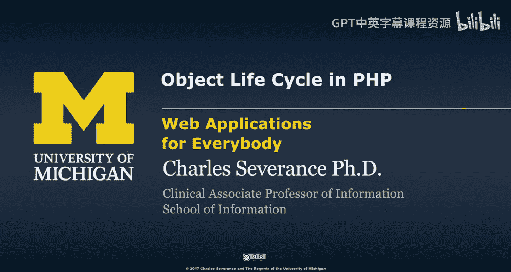
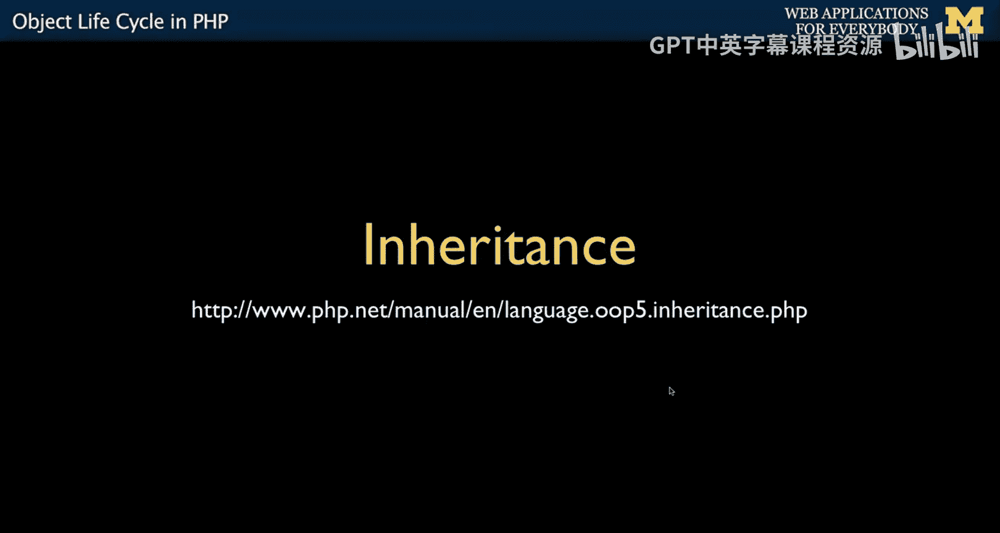

# 074：PHP中的对象生命周期 🧬




在本节课中，我们将要学习PHP中对象的生命周期。我们将了解对象从定义模板、创建初始化到最终销毁的完整过程，并重点学习两个特殊的方法：构造函数和析构函数。理解这些概念对于构建结构良好、资源管理得当的Web应用程序至关重要。

---

上一节我们探讨了PHP对象模型的优势，特别是在处理会话等Web应用常见场景时。本节中，我们来看看对象生命周期中的经典概念：模板定义、对象的创建与初始化，以及对象的销毁。

## 构造函数与析构函数 🏗️

在PHP中，对象生命周期由几个关键方法控制。作为对象的构建者，你可以定义在对象设置时和销毁时被自动调用的代码。构造函数用于在对象创建时将其数据设置到正确的状态，而析构函数则用于在对象销毁时执行清理工作，尽管后者使用频率较低。

构造函数的主要作用是在对象启动时设置一些主要的实例变量，确保它们拥有正确的初始值。有时，这些变量可能是非公开的，构造函数可以确保它们在对象首次创建时被正确设置。

以下是构造函数和析构函数的一个简单示例：

```php
class PartyAnimal {
    function __construct() {
        echo "正在构造\n";
    }
    function __destruct() {
        echo "正在析构\n";
    }
}

echo "1\n";
$x = new PartyAnimal();
echo "2\n";
$y = new PartyAnimal();
echo "3\n";
```

运行这段代码时，顺序如下：
1.  打印 “1”。
2.  创建 `$x` 对象，触发其构造函数，打印 “正在构造”。
3.  打印 “2”。
4.  创建 `$y` 对象，触发其构造函数，打印 “正在构造”。
5.  打印 “3”。
6.  程序执行完毕。在请求-响应周期结束时，PHP会进行垃圾回收，销毁 `$x` 和 `$y` 对象。在销毁每个对象前，会自动调用其析构函数，因此会依次打印 “正在析构” 和 “正在析构”。

在PHP中，析构函数的调用比其他一些语言更可预测，因为PHP明确知道一个HTTP请求何时结束。

---

## 实例与构造函数参数 🎯

每个类可以创建多个实例，每个实例都拥有自己独立的变量。构造函数的一个常见用途是通过传入参数来个性化每个实例。

让我们通过一个“问候语翻译器”的例子来看看如何向构造函数传递参数：

```php
class Hello {
    private $lang; // 实例变量

    function __construct($language) {
        $this->lang = $language; // 用传入的参数初始化实例变量
    }

    function greet() {
        if ($this->lang == 'fr') return 'Bonjour';
        if ($this->lang == 'es') return 'Hola';
        return 'Hello';
    }
}

$hi = new Hello('es'); // 创建对象，构造函数将 'es' 存入 $this->lang
echo $hi->greet(); // 输出: Hola
```

在上述代码中：
*   创建 `$hi` 对象时，我们传入了参数 `'es'`。
*   PHP构建对象，然后调用构造函数 `__construct('es')`。
*   构造函数将传入的 `$language` 参数值（‘es’）赋值给该实例的私有变量 `$this->lang`。
*   之后，当我们调用 `$hi->greet()` 方法时，该方法内部检查 `$this->lang` 的值，因为它是 ‘es’，所以返回 “Hola”。

通过构造函数传递参数，我们可以定制每个对象的行为，使其在创建时就具备独特的初始状态。

---

## 总结 📝

本节课中我们一起学习了PHP对象的生命周期。我们了解到，对象从基于类模板创建开始，会通过 **`__construct()`** 方法进行初始化，你可以利用它来设置实例的初始状态。在对象的使命完成、程序运行结束时，PHP会通过 **`__destruct()`** 方法通知对象进行清理。我们还实践了如何向构造函数传递参数，从而在创建时为每个对象实例赋予独特的属性。理解创建与销毁的时机，是有效管理对象和资源的关键。



下一节，我们将讨论**继承**，学习如何让一个新对象获取并扩展另一个对象的能力。