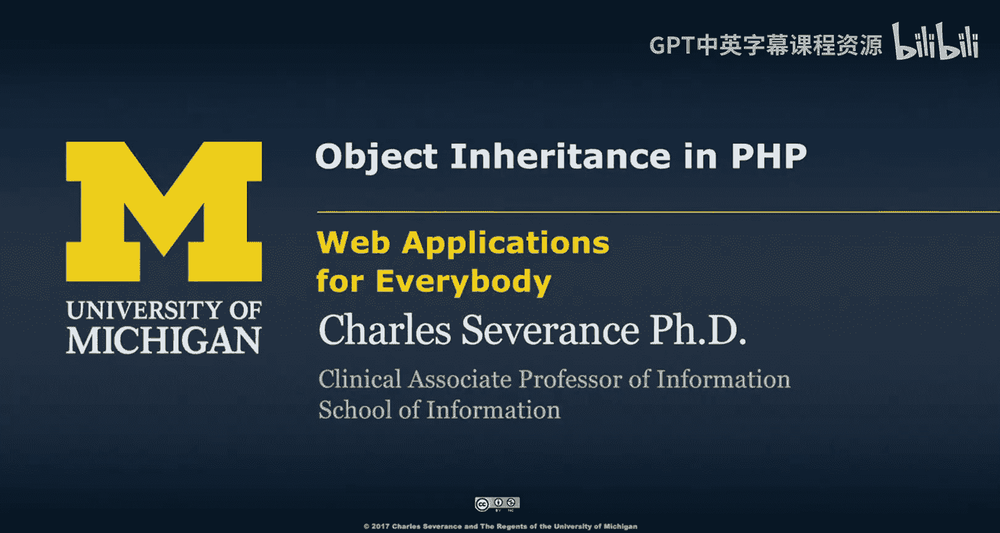
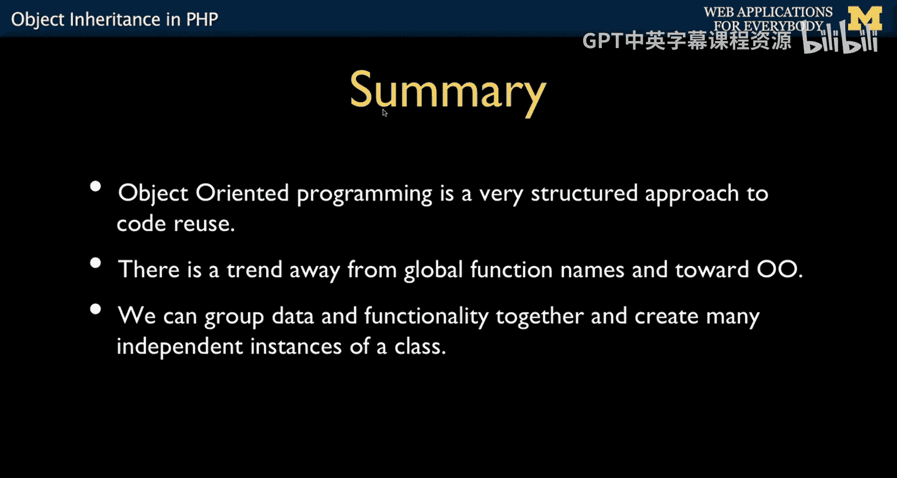

# 075：PHP中的对象继承




在本节课中，我们将要学习PHP中面向对象编程的一个核心概念：继承。我们将探讨什么是继承、如何通过`extends`关键字实现它，以及类成员的可见性（`public`、`protected`、`private`）。最后，我们还会了解一种动态创建对象的特殊方式。

---

## 🧬 什么是继承？

上一节我们介绍了类和对象的基本概念，本节中我们来看看继承。继承是面向对象编程中的一个基本概念，它允许我们创建一个新类（子类）来继承另一个类（父类）的属性和方法。在PHP中，继承是一种强大的机制，它能帮助我们避免代码重复，并最终形成类的层次结构。

继承也被称为“子类化”。你可以将其理解为父类与子类的关系，或者基类与扩展类的关系。这些概念的本质是相同的：一个类是原始模板，另一个类则是扩展了功能的副本。

在PHP中，我们使用 `extends` 关键字来实现继承。

---

## 🔧 继承的实现

以下是继承的一个简单示例。我们首先有一个之前用过的 `Hello` 类。

```php
class Hello {
    public $lang;
    function __construct($lang) {
        $this->lang = $lang;
    }
    function greet() {
        if ($this->lang == 'fr') return 'Bonjour';
        if ($this->lang == 'es') return 'Hola';
        return 'Hello';
    }
}
```

现在，如果我们想创建一个新的 `Social` 类来扩展 `Hello` 类的功能，可以这样做：

```php
class Social extends Hello {
    function bye() {
        if ($this->lang == 'fr') return 'Au revoir';
        if ($this->lang == 'es') return 'Adios';
        return 'Goodbye';
    }
}
```

`extends Hello` 这行代码意味着：将 `Hello` 类中的所有内容（属性和方法）都“拉入” `Social` 类中。因此，`Social` 类并非从零开始，它已经拥有了 `$lang` 属性、`__construct` 构造函数和 `greet` 方法。然后，我们在其中添加了新的 `bye` 方法。

现在，我们有了两个模板：`Hello` 模板和 `Social` 模板。我们可以这样使用：

```php
$obj = new Social('es');
echo $obj->greet(); // 输出：Hola
echo $obj->bye();   // 输出：Adios
```

当我们创建 `Social` 对象并传入 `'es'` 时，会调用从父类继承来的构造函数。我们可以调用继承来的 `greet` 方法，也可以调用子类独有的 `bye` 方法。这是一种复用类功能、避免重复编写代码的有效方式。

父类通常被称为基类，子类则被称为扩展类或派生类。

---

## 🛡️ 类成员的可见性

到目前为止，我们一直在类内部和外部自由地访问属性和方法。这是因为我们默认将它们标记为了 `public`。现在，我们来详细了解一下类成员的可见性。

可见性关键字用于控制类中属性和方法的访问权限，其核心目的是向外部世界隐藏类的内部复杂性。以下是三个关键字：

*   **`public`（公共）**：可以在类内部、外部以及任何派生类中访问。
*   **`protected`（受保护）**：可以在类内部及其派生类中访问，但不能从类外部直接访问。
*   **`private`（私有）**：只能在定义它的类内部访问，不能在派生类或类外部访问。

以下是它们的工作原理总结：

| 可见性 | 类内部 | 派生类内部 | 类外部 |
| :--- | :---: | :---: | :---: |
| **`public`** | ✅ | ✅ | ✅ |
| **`protected`** | ✅ | ✅ | ❌ |
| **`private`** | ✅ | ❌ | ❌ |

设置可见性的原因在于，有时你希望某些变量或方法仅供类内部使用，不希望外部代码直接修改，以保持内部状态的一致性。`private` 就划定了这样一条明确的界限。如果你不介意外部访问，则可以将其设为 `public`。

---

### 可见性示例

以下是一个展示可见性如何工作的简单示例：

```php
class MyClass {
    public $public = 'Public';
    protected $protected = 'Protected';
    private $private = 'Private';

    function printHello() {
        echo $this->public;    // 可以
        echo $this->protected; // 可以
        echo $this->private;   // 可以
    }
}

$obj = new MyClass();
echo $obj->public; // 可以
// echo $obj->protected; // 致命错误
// echo $obj->private;   // 致命错误
$obj->printHello(); // 输出 Public, Protected, Private
```

在类外部，我们只能访问 `public` 成员。`protected` 和 `private` 成员无法从类外部直接访问。

现在，我们创建一个派生类：

```php
class MyClass2 extends MyClass {
    function printFromChild() {
        echo $this->public;    // 可以
        echo $this->protected; // 可以
        // echo $this->private; // 致命错误
    }
}

$obj2 = new MyClass2();
$obj2->printFromChild(); // 可以访问 public 和 protected
```

在派生类内部，可以访问从父类继承来的 `public` 和 `protected` 成员，但不能访问 `private` 成员。

---

## 🎭 动态创建对象（`stdClass`）

最后，我想向你展示一种有时会遇到的特殊编码方式。有些程序员并不总是使用 `class` 关键字预先定义类，而是希望在运行时动态地创建对象并为其添加属性。

PHP 提供了一个内置的通用空类 `stdClass`。你可以像下面这样使用它：

```php
$player = new stdClass();
$player->name = 'Charles';
$player->score = 100;
$player->score++;
print_r($player);
```

这段代码创建了一个 `stdClass` 对象，然后动态地为它添加了 `name` 和 `score` 属性。由于我们是在类外部添加属性，它们本质上就是 `public` 的。

然而，一种更优雅的方式是预先定义一个类作为模板：

```php
class Player {
    public $name;
    public $score;
}

$player = new Player();
$player->name = 'Charles';
$player->score = 100;
$player->score++;
print_r($player);
```

这样，`Player` 类明确地定义了一个玩家应该具有 `name` 和 `score` 属性。当你看到 `stdClass` 这种用法时，不必感到困惑。这是一种早期常见的、将对象当作一种更“漂亮”的关联数组来使用的模式。

---

## 📚 总结

本节课中我们一起学习了PHP中对象继承的核心知识。

我们首先了解了**继承**的概念及其通过 `extends` 关键字实现的方式，它帮助我们构建类层次结构并避免代码重复。

接着，我们深入探讨了类成员的**三种可见性**：`public`、`protected` 和 `private`，理解了它们如何控制对属性和方法的访问权限，从而实现封装。

最后，我们简要介绍了使用 `stdClass` **动态创建对象**的方法，并对比了其与正规定义类模板的区别。




面向对象编程的理解和应用需要循序渐进。希望本节课的内容能为你将来解决更复杂的问题、更深入地使用OOP打下良好的基础。在接下来的课程中，我们将继续探索更多面向对象编程的实用特性。