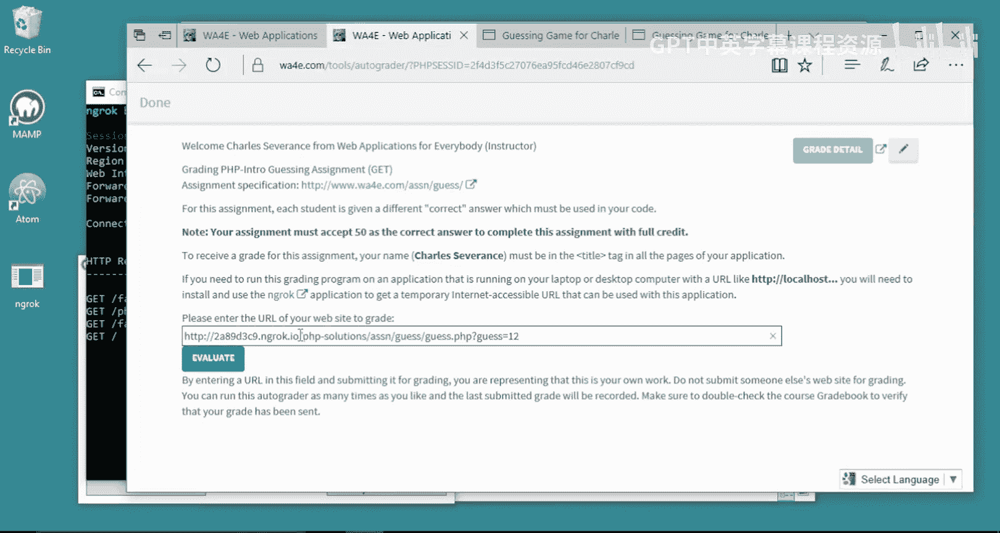
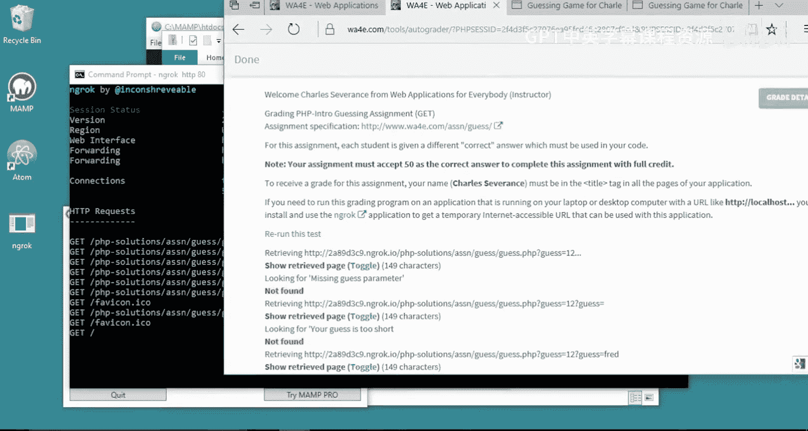
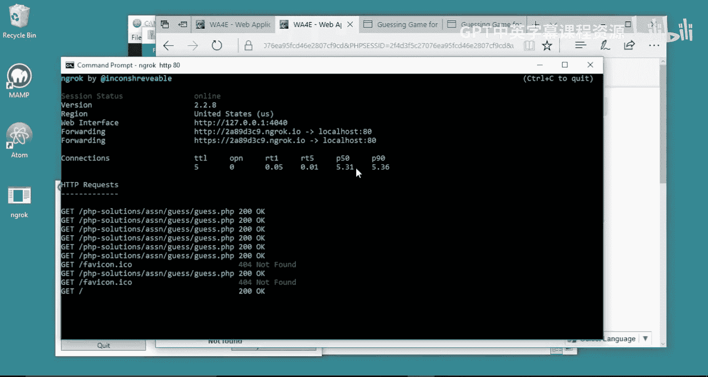
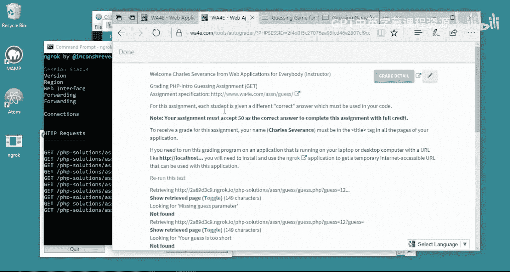
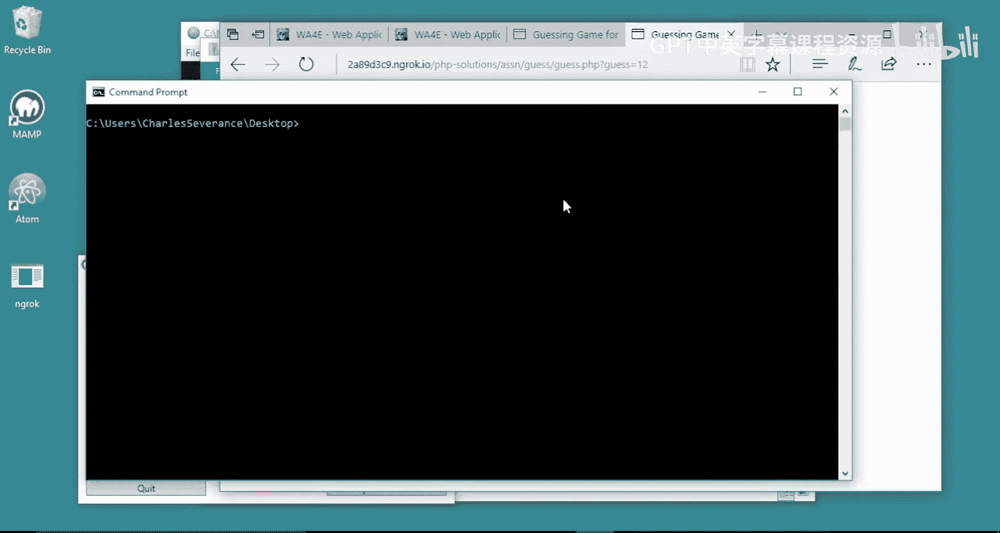

# 079：Windows系统使用Ngrok连接自动评分器 🖥️

在本节课中，我们将学习如何使用Ngrok工具，将运行在你本地计算机上的Web应用程序临时暴露到公网，以便完成需要与远程自动评分器交互的作业。

## 概述

当你完成一个Web应用程序作业后，代码通常运行在你的本地计算机上，地址类似于 `localhost`。然而，远程的自动评分器无法直接访问你本地的 `localhost` 地址，因为它被防火墙隔离在互联网之外。为了解决这个问题，我们需要使用Ngrok。Ngrok能创建一个临时的、可公开访问的隧道，将互联网流量转发到你本地运行的服务器上，从而使自动评分器能够访问和测试你的应用程序。

## 安装与配置Ngrok

上一节我们明确了问题的核心是本地服务器无法被外部访问。本节中，我们来看看如何安装和启动Ngrok来解决这个问题。

以下是下载和放置Ngrok的步骤：
1.  访问Ngrok官网（ngrok.com）并下载适用于Windows系统的版本。
2.  下载完成后，打开压缩包。
3.  将 `ngrok.exe` 文件解压到方便使用的位置，例如桌面。这样便于在命令行中快速访问。

## 启动Ngrok并创建隧道


现在我们已经准备好了Ngrok可执行文件，接下来需要启动它，为我们的本地Web服务器创建隧道。


1.  打开命令提示符（CMD）。
2.  使用 `cd` 命令切换到存放 `ngrok.exe` 的目录。例如，如果放在桌面，可以输入：
    ```bash
    cd %USERPROFILE%\Desktop
    ```
3.  启动Ngrok，并指定要转发的本地端口。假设你的Web应用运行在默认的80端口，命令如下：
    ```bash
    ngrok http 80
    ```
4.  执行命令后，Ngrok会启动并在命令行中显示一个临时的公共URL（例如 `https://xxxxxx.ngrok.io`）。这个URL就是你的本地应用在互联网上的临时地址。

## 提交作业到自动评分器





我们已经获得了可以公开访问的临时地址。本节中，我们来看看如何利用这个地址完成作业提交。


1.  复制Ngrok提供的临时公共URL（例如 `https://xxxxxx.ngrok.io`）。
2.  在你的浏览器中访问这个URL，确认它能正确显示你本地运行的Web应用程序。
3.  如果应用程序有特定的测试页面（例如 `guessinggame.php?guess=12`），请将完整的路径追加到Ngrok URL后面，形成完整的可访问地址（例如 `https://xxxxxx.ngrok.io/guessinggame.php?guess=12`）。
4.  最后，将这个完整的、可公开访问的URL粘贴到课程自动评分器的提交框中，并运行评分。你可以在Ngrok的命令行窗口中看到自动评分器与你的应用之间发生的所有请求和响应记录。



## 完成后的操作

作业评分完成后，为了安全起见，你应该关闭Ngrok隧道。

1.  回到运行Ngrok的命令行窗口。
2.  按下 `Ctrl + C` 组合键来终止Ngrok进程。
3.  隧道关闭后，之前的临时公共URL将立即失效，外部无法再访问你的本地应用。
4.  请注意，每次重新启动Ngrok，它都会生成一个全新的临时URL。



## 总结




本节课中我们一起学习了如何使用Ngrok工具。我们了解到，Ngrok通过在公网和你的本地`localhost`之间建立临时隧道，解决了自动评分器无法访问本地服务器的问题。关键步骤包括：下载Ngrok、在命令行中启动并指定端口、获取临时公共URL，以及最后在提交作业后安全地关闭隧道。掌握这个方法，你就能顺利提交那些需要与远程服务器交互的Web应用作业了。