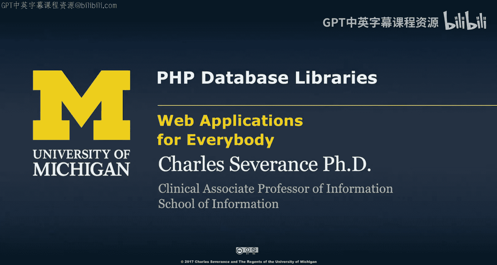
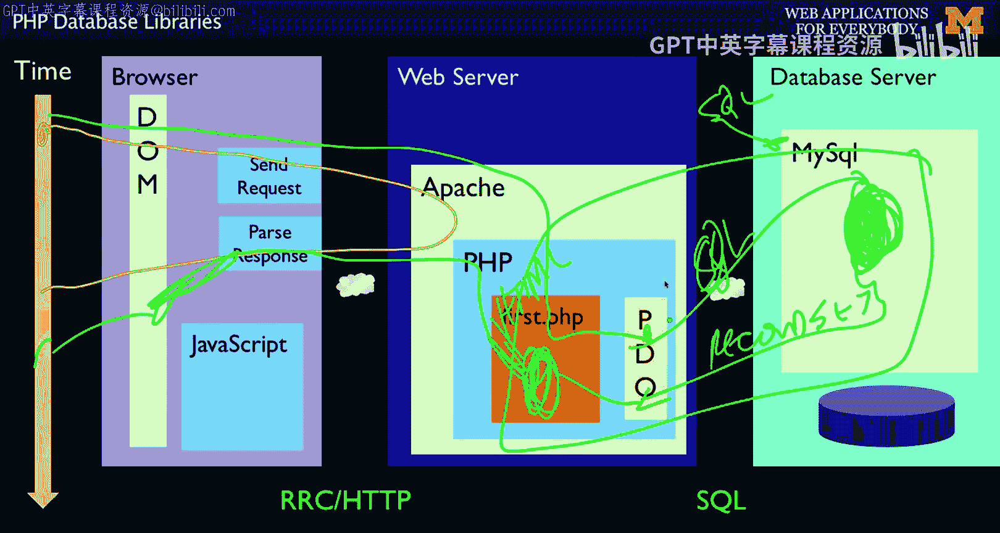
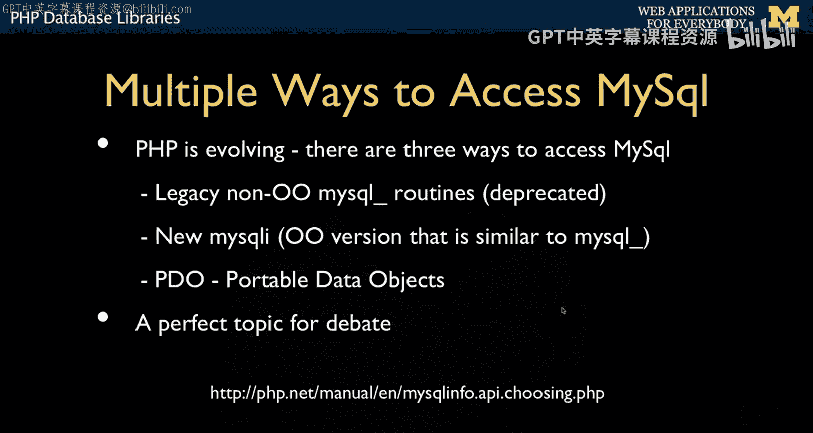
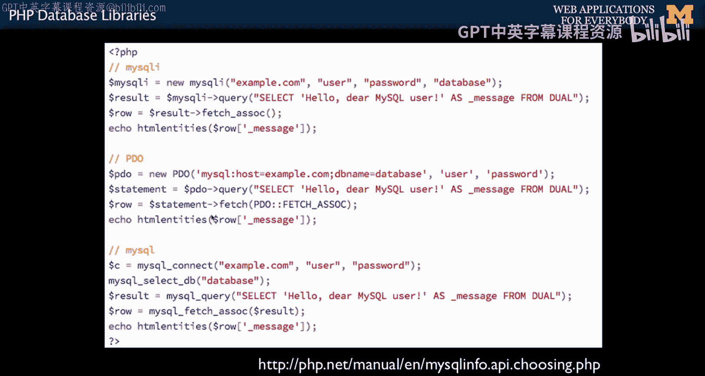
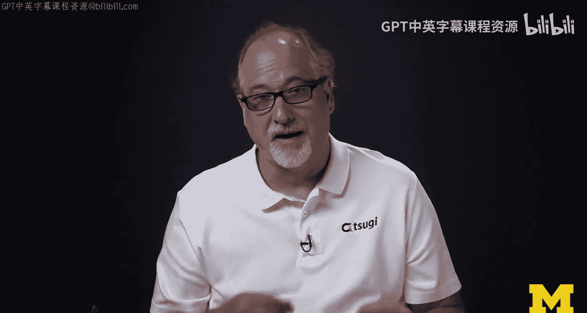

# 082：PHP数据库连接 🗄️




在本节课中，我们将学习如何将PHP与SQL数据库连接起来。我们将了解PHP如何作为中间层，接收用户请求，与数据库交互，并最终生成HTML响应。核心是使用PHP的PDO（便携式数据对象）库来安全、高效地执行数据库操作。

---


上一节我们介绍了PHP和SQL的基础知识，本节中我们来看看如何将它们结合起来。

现在我们将所有内容整合起来。我们已经讨论了SQL，也讨论了PHP。接下来我们要将它们连接在一起。这正是我最喜欢的图示开始发挥作用的地方：我们有一个请求-响应循环来回往复。现在我们要做的是，构建一个进入PHP的请求。

PHP将建立数据库连接并发送SQL命令。

SQL在此处来回传递。我们一直在做这件事，通过PHPMyAdmin直接与数据库对话。但现在我们要让PHP创建并发送SQL。

SQL将执行相同的操作：选择、读取、更新、删除等，然后返回一个称为**记录集**的结果。接着，我们将像读取文件一样遍历这个记录集。它基本上是一系列记录，我们将对其进行处理。




我们将输出一些HTML，然后生成响应。之后，它进入DOM，我们就能看到页面了。这就是我们今天要重点讨论的部分。

我们将使用一个名为**PDO**的库，即“便携式数据对象”，它是PHP 5的一部分。PHP 5是较旧的版本，而PHP 7是现代版本。

---

正如我所说，我们一直在这样做。我们拥有这个数据库服务器，并且一直通过使用PHPMyAdmin发送SQL来充当数据库管理员，然后结果直接显示在屏幕上。

现在，我们将使用PDO来完成这项工作，其中用户与我们的PHP代码对话。我们作为应用程序开发者编写一些SQL，发送它，然后结果返回给最终用户。因此，我们的工作是编写一些PHP代码来处理数据库。

我们不让用户直接与数据库对话，因为那样他们可能会看到不该看的东西。我们的职责是，只向他们展示我们应该展示的数据视图。

---

我提到过，我们目前处于PHP 5环境，并正在向PHP 7过渡。但在PHP 4及更早版本中，有另一种方法来完成这个任务。

PHP备受喜爱的一点是，即使在2、3、4版本中，访问SQL也非常容易。它是内置的。有一些例程，这些是**遗留例程**，适用于PHP 5之前的版本，例如 `mysql_*` 系列函数。

从PHP 4过渡到PHP 5时，他们决定进行改进。事实证明，在PHP 4中，针对不同的数据库（如Oracle、SQLite）有不同的函数集。这些函数并非全部内置，但MySQL和SQLite的是内置的。

发生了两件事。他们希望构建一个面向对象的版本。因为每个人都已经使用了这些函数大约15年，并且非常习惯它们。所以随着PHP 5的发布，他们做了两件事。

首先，他们转向了面向对象的方式。但事实证明，你只能建立一个连接。你甚至不能同时连接到两个数据库，除非先连接一个，断开，再连接另一个。除了我们非常熟悉它们之外，这种方式有很多不受欢迎的地方。

因此，他们希望做一个面向对象的版本，因为这样你可以打开一个到数据库A的连接，再打开一个到数据库B的连接，并为每个连接拥有一个对象。当你想与某个数据库对话时，就操作对应的对象，从而实现同时连接。这非常好，对吧？

他们不确定人们是否还想使用旧 `mysql_*` 函数的模式。因此，他们创建了一个新东西叫 **MySQLi**。它是一个面向对象的版本，但调用序列与我们钟爱的 `mysql_*` 例程完全相同。就像我们在面向对象课程中看到的 `Date::add` 一样，它只是将非面向对象的例程重做为面向对象的例程。他们这样做了。

然后他们又说，让我们从头开始，看看其他语言是如何实现一些非常漂亮的功能的。他们研究了所有不同的MySQL、Oracle等接口，思考哪些模式最优雅。于是他们创建了一个全新的东西，拥有全新的API，并不试图模仿旧有的样子。

当时我们不知道，在转向PHP 5时，我们所有人会转向这两种方式中的哪一种。旧的函数仍然能用，但它们有些过时且不太受欢迎。我当时正在教课，有一段时间我想，好吧，我有所有这些源代码、示例代码，我就用MySQLi吧。但我很快排除了这个想法，因为PDO中有太多让编写SQL变得更容易的绝妙特性。

所以争论持续了一段时间，但我想在这一点上，我们基本都使用PDO了。在这门课中，我只使用PDO。鉴于我刚才所说的一切，你可以争论一会儿，但我认为争论已经结束，PDO赢得了辩论。

我只想给你看一些示例代码，因为你可能会遇到旧代码。

以下是旧式的经典 `mysql_*` 函数示例。因为它总是以 `mysql_` 开头，所以一看就知道这基本上是PHP 5之前的代码。它不是面向对象的，并且存在各种架构上的缺陷。但它之所以被怀念，是因为我们使用了它十多年并且非常擅长它。

```php
// 遗留的 mysql_* 方式 (PHP < 5, 不推荐使用)
$link = mysql_connect('localhost', 'user', 'password');
mysql_select_db('database_name', $link);
$result = mysql_query('SELECT * FROM table', $link);
while ($row = mysql_fetch_array($result)) {
    // 处理每一行数据
}
```



然后是 **MySQLi** 方式。你看，它使用了 `new` 关键字，它是一个对象。但它只支持MySQL。函数 `mysql_query` 变成了 `mysqli->query`。这基本上是一对一的翻译，除了它是面向对象的语法。它的优点是，如果你的应用需要连接两个数据库，你可以建立多个数据库连接。


```php
// MySQLi 方式 (面向对象风格)
$mysqli = new mysqli('localhost', 'user', 'password', 'database_name');
$result = $mysqli->query('SELECT * FROM table');
while ($row = $result->fetch_assoc()) {
    // 处理每一行数据
}
```

但我想很少有人真正使用过那个功能。所以我们最终选择了 **PDO**。

PDO是一种面向对象的模式，它是一个新事物，它完成这些工作，并且会指明要使用哪种数据库等等。然后我们运行查询，这里有一个稍微不同的模式。这里的区别不仅在于PDO是面向对象的（O代表便携式数据对象），它还拥有不同的API模式。

就像我说的，我以为我会喜欢MySQLi，但现在我非常喜欢PDO，我不喜欢旧式的 `mysql_*`，也不那么喜欢MySQLi。所以我们在这里使用PDO。

你可能会看到那些旧代码，所以要有所准备。无论哪种方式，所有PHP代码的最终目标都是创建这个SQL字符串，将其发送到数据库，取回一些记录，然后遍历这些记录。

---

接下来，我们将实际讨论如何通过PHP插入数据。

---





本节课中我们一起学习了PHP与数据库连接的核心概念。我们回顾了从遗留的 `mysql_*` 函数到面向对象的MySQLi，再到如今广泛采用的PDO的演变过程。PDO以其面向对象的设计、支持多种数据库以及更安全的编程模式而胜出。我们理解了PHP在Web应用中的角色：作为中间层处理用户请求，生成SQL与数据库交互，并将结果转化为HTML响应。下一节我们将深入探讨如何使用PDO执行数据插入操作。