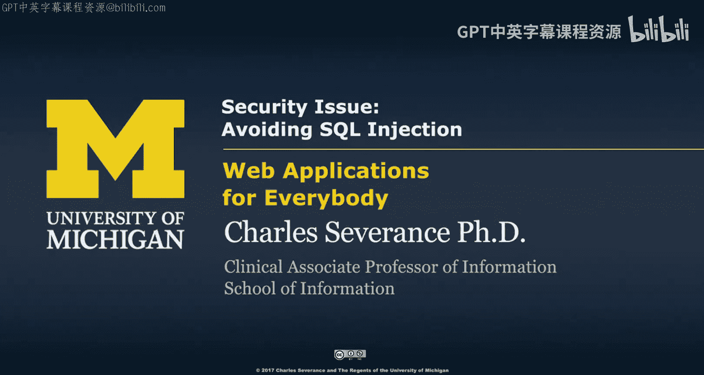
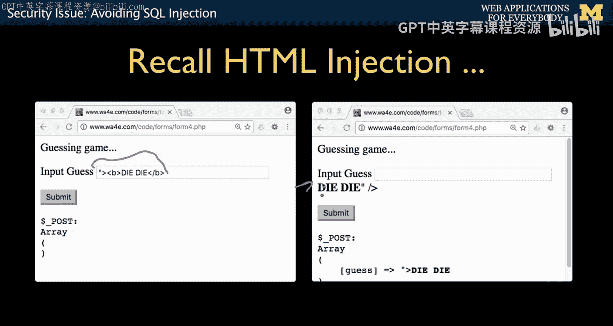
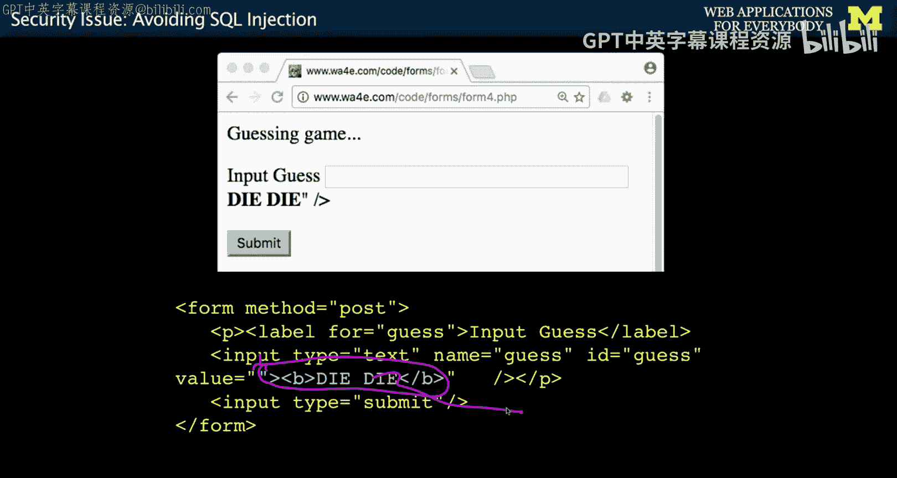
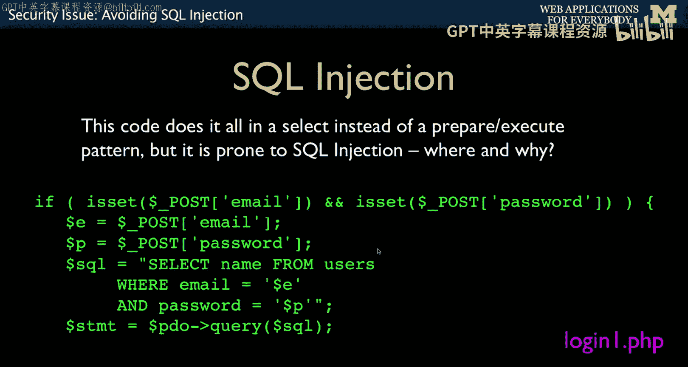
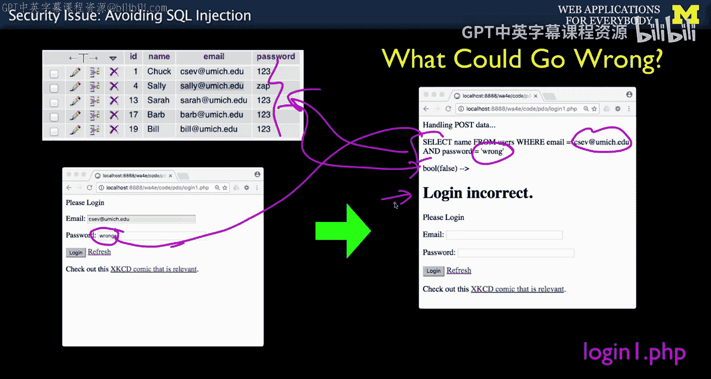
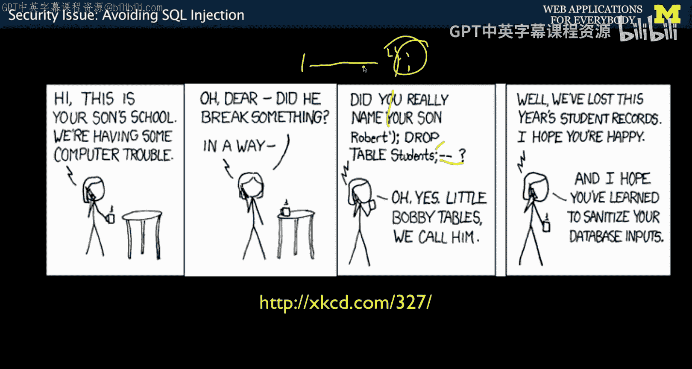
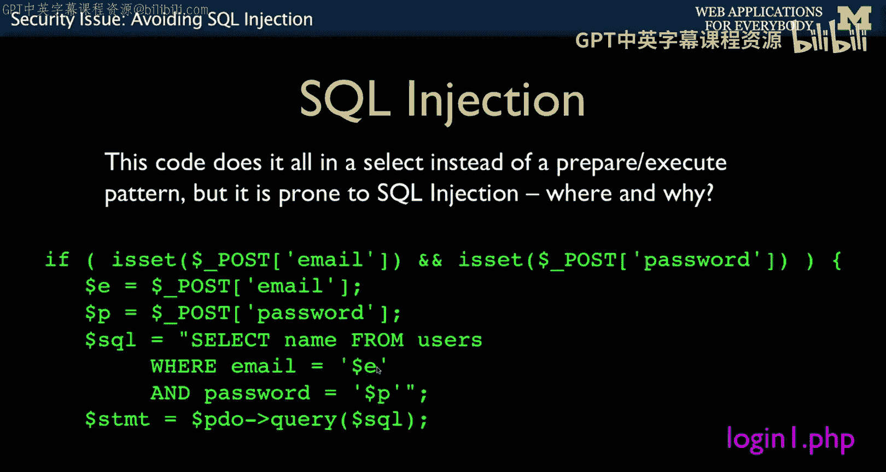
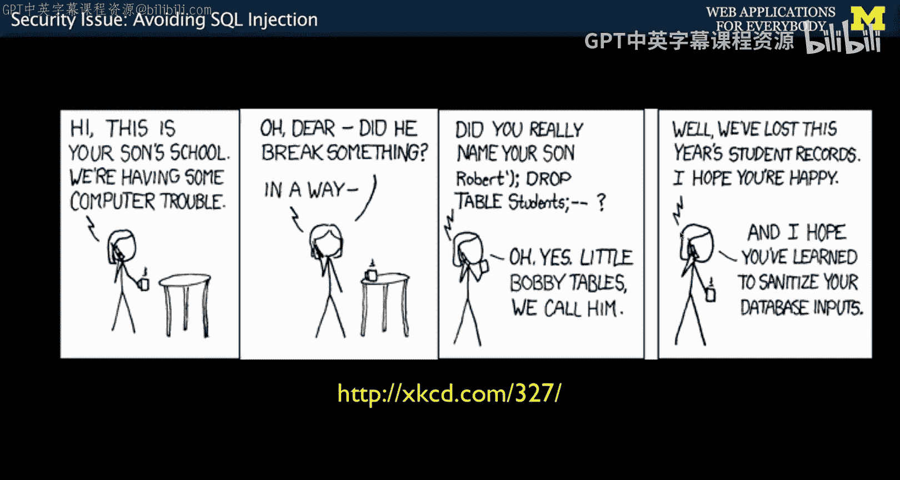
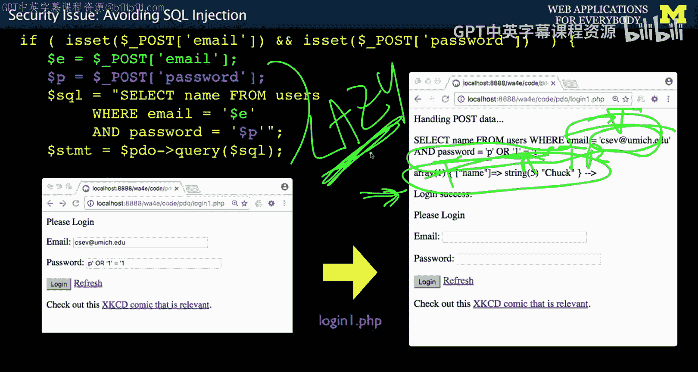
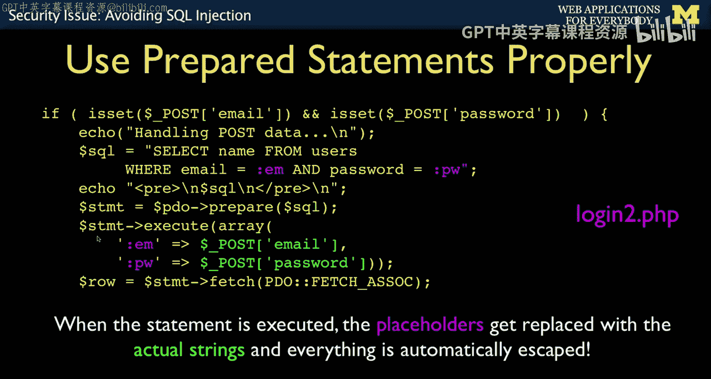

# 085：防范SQL注入 🛡️





在本节课中，我们将要学习一个至关重要的Web安全概念：SQL注入。我们将了解什么是SQL注入，它如何发生，以及如何通过正确的编程实践来防范它。






## 概述

上一节我们介绍了数据库连接的基本操作。本节中我们来看看一个常见的安全漏洞——SQL注入。这是一种攻击者通过用户输入来操纵数据库查询的技术，可能导致数据泄露、篡改甚至删除。

## SQL注入的原理



SQL注入与之前讨论的HTML注入原理相似。它发生在应用程序将用户输入的数据直接拼接到SQL查询语句中时。如果攻击者发现了这一点，他们就可以通过精心构造的输入来改变查询的原始意图。

以下是导致SQL注入的**危险代码模式**：
```php
$email = $_POST['email'];
$password = $_POST['password'];
$sql = "SELECT name FROM users WHERE email='$email' AND password='$password'";
$stmt = $pdo->query($sql);
```
在这段代码中，用户输入的`$email`和`$password`被直接放入SQL字符串。双引号内的变量会被PHP直接替换为其值。



## 一个生动的例子

假设我们有一个登录表单。当用户行为良好时，一切正常。

*   用户输入：`email = csev@umich.edu`, `password = 12345`
*   生成的SQL：`SELECT name FROM users WHERE email='csev@umich.edu' AND password='12345'`

然而，恶意用户会尝试不同的输入。





*   用户输入：`email = csev@umich.edu`, `password = p' OR '1'='1`
*   生成的SQL：`SELECT name FROM users WHERE email='csev@umich.edu' AND password='p' OR '1'='1'`



此时，`WHERE`子句的条件变成了“密码等于‘p’ **或者** ‘1’等于‘1’”。由于‘1’=‘1’永远为真，整个条件将永远成立，攻击者就能在没有正确密码的情况下成功登录。这就是SQL注入攻击。

## 如何防范SQL注入

防范SQL注入的关键是：**永远不要将用户输入直接拼接到SQL语句中**。



幸运的是，我们之前学习的PDO和预处理语句（Prepared Statements）正是为了解决这个问题而设计的。当使用参数化查询时，用户输入的数据会被自动、安全地处理，从而防止注入。

以下是安全的代码模式：
```php
$email = $_POST['email'];
$password = $_POST['password'];
$sql = "SELECT name FROM users WHERE email=:em AND password=:pw";
$stmt = $pdo->prepare($sql);
$stmt->execute(array( ':em' => $email, ':pw' => $password ));
```
在这段代码中，`:em`和`:pw`是占位符。`execute()`方法会确保传入的数据被正确地转义和处理，然后再与查询语句组合。这样，即使用户输入中包含引号或SQL关键字，也会被当作普通数据处理，而不会破坏查询结构。


## 总结

本节课中我们一起学习了SQL注入的安全威胁及其防范方法。核心要点是：直接拼接用户输入到SQL查询中是极其危险的做法。而使用PDO的预处理语句和参数化查询，可以自动、有效地防止SQL注入攻击，这是编写安全数据库应用程序的基石。




下一节，我们将讨论数据库操作中的异常处理，了解在PHP与数据库交互过程中哪些情况会抛出错误。