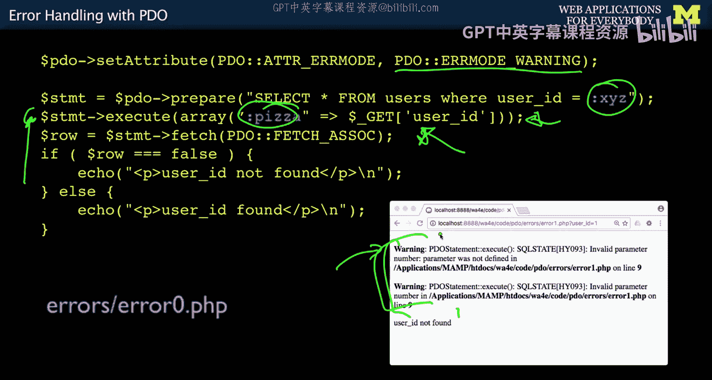
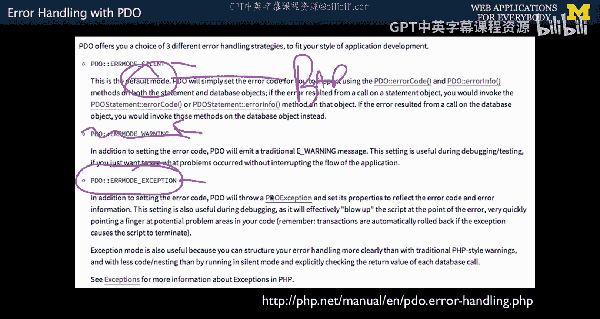
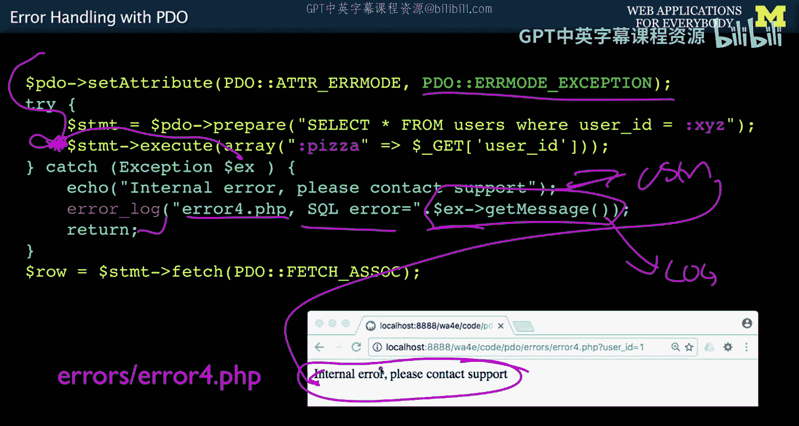
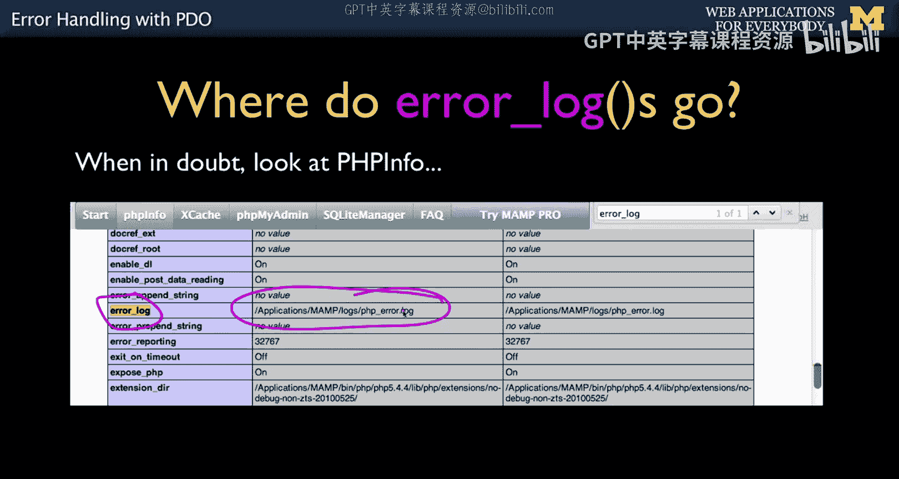
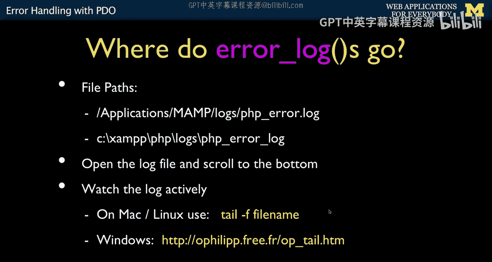

# 086：PDO错误处理 🛡️


在本节课中，我们将学习PHP数据对象（PDO）的错误处理机制。理解并正确配置错误处理方式，对于开发稳定、安全的数据库应用程序至关重要。我们将探讨不同的错误模式，并学习如何在开发和生产环境中妥善处理错误。

## 概述

PDO的错误处理方式有其独特之处。到目前为止，我们所做的操作在语法上基本是正确的。本节将讨论可能出错的情况以及如何处理这些错误。

## PDO的错误模式

PDO提供了几种处理错误的方式。上一节我们介绍了数据库连接，本节中我们来看看如何应对执行SQL时可能发生的错误。



以下是PDO的三种主要错误模式：
*   **`PDO::ERRMODE_SILENT`**： 静默模式。这是默认模式，发生错误时不会主动提示，需要手动检查 `$stmt->errorCode()`。**不推荐使用**。
*   **`PDO::ERRMODE_WARNING`**： 警告模式。发生错误时会产生一个 `E_WARNING` 级别的PHP警告，但脚本会继续执行。
*   **`PDO::ERRMODE_EXCEPTION`**： 异常模式。发生错误时会抛出一个 `PDOException` 异常。**这是推荐在开发中使用的模式**。

你可以通过以下代码设置错误模式：
```php
$pdo->setAttribute(PDO::ATTR_ERRMODE, PDO::ERRMODE_EXCEPTION);
```



## 为什么推荐异常模式？

让我们通过一个例子来理解不同模式的区别。假设我们有一段从GET参数获取用户ID并查询数据库的代码。

```php
// 假设URL是 error.php?user_id=1
$user_id = $_GET['user_id'];
$stmt = $pdo->prepare('SELECT name FROM users WHERE id = :xyz');
$stmt->execute(array(':xyz' => $user_id));
$row = $stmt->fetch(PDO::FETCH_ASSOC);
```

这段代码在语法正确时运行良好。但是，如果我们犯了一个错误，比如在 `execute` 方法中使用了未定义的参数名：

```php
$stmt->execute(array(':abc' => $user_id)); // 错误！参数名应该是 :xyz
```

如果设置为 `PDO::ERRMODE_WARNING`，PHP会产生一个警告，但脚本会继续执行。`$stmt->fetch()` 会失败，最终可能只是向用户显示“用户未找到”，而开发者却不知道底层SQL已经出错了。这是一种糟糕的策略。

因此，我建议始终使用 `PDO::ERRMODE_EXCEPTION`。在异常模式下，同样的错误会导致脚本立即终止（除非被捕获），并清晰地指出问题所在，这有助于开发者快速定位和修复语法或逻辑错误。

## 使用Try-Catch捕获异常

在开发中，让错误直接暴露出来是好事。但在生产环境中，我们可能不希望将详细的错误信息展示给最终用户。这时，可以使用 `try-catch` 块来优雅地处理异常。

以下是处理异常的模式：



```php
try {
    $user_id = $_GET['user_id'];
    $stmt = $pdo->prepare('SELECT name FROM users WHERE id = :xyz');
    // 故意制造一个错误
    $stmt->execute(array(':abc' => $user_id));
    $row = $stmt->fetch(PDO::FETCH_ASSOC);
    // 如果成功，继续处理$row
} catch (PDOException $e) {
    // 错误发生时会跳转到这里
    echo "内部错误，请联系管理员。"; // 给用户看的友好信息
    error_log("数据库查询错误（文件：" . __FILE__ . "）：" . $e->getMessage()); // 记录到日志供开发者查看
    exit(); // 终止脚本执行
}
```


在这个模式中，用户只会看到“内部错误，请联系管理员。”这样友好的信息。而详细的错误信息，包括错误消息和文件位置，则通过 `error_log()` 函数被记录到了服务器的错误日志中，不会泄露给用户。

## 查看错误日志

错误日志是开发者调试的重要工具。日志文件的位置因服务器配置而异。



你可以通过创建一个包含 `phpinfo();` 函数的PHP文件来查找日志路径，然后在输出页面中搜索 `error_log`。

例如，在MAMP（Mac）环境中，日志路径可能类似于：`/Applications/MAMP/logs/php_error.log`。



在开发时，持续查看日志文件非常有用。在Linux或Mac上，你可以使用 `tail -f` 命令动态监控日志：

```bash
tail -f /path/to/your/php_error.log
```

在Windows上，你也可以找到类似的工具（如 `Tail for Windows`）。这样，每当有错误发生时，你都能在终端或命令行窗口中实时看到，而无需反复打开日志文件。

## 总结


本节课中我们一起学习了PDO错误处理的核心知识。我们首先了解了PDO的三种错误模式，并明确了在开发时应始终使用 **`PDO::ERRMODE_EXCEPTION`** 模式。接着，我们探讨了如何利用 **`try-catch`** 语句来捕获异常，从而在生产环境中向用户展示友好信息，同时将详细错误 **记录到日志** 供开发者排查。最后，我们介绍了如何查找和实时监控PHP错误日志文件。正确配置错误处理机制，是构建健壮Web应用程序的关键一步。