# 088：数据插入与删除详解 🛠️

在本节课中，我们将学习如何使用PHP的PDO（PHP Data Objects）进行数据库的基本操作，包括插入新数据和删除现有数据。我们将通过分析三个逐步演进的示例代码（`user1.php`、`user2.php`、`user3.php`）来理解其实现原理。

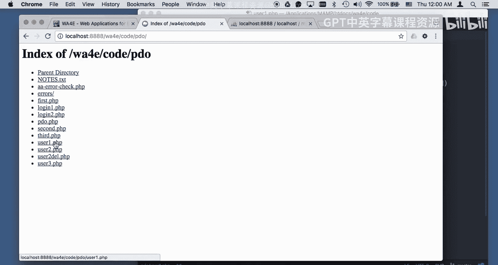

## 准备工作与环境设置

在开始编写代码之前，需要确保你的本地开发环境已正确配置。这包括运行一个本地服务器（如XAMPP、MAMP）并设置好数据库连接。我们在之前的视频中已经完成了这些步骤。核心的数据库连接信息通常保存在一个独立的文件中，例如 `pdo.php`，其中包含数据库的ID和密码。

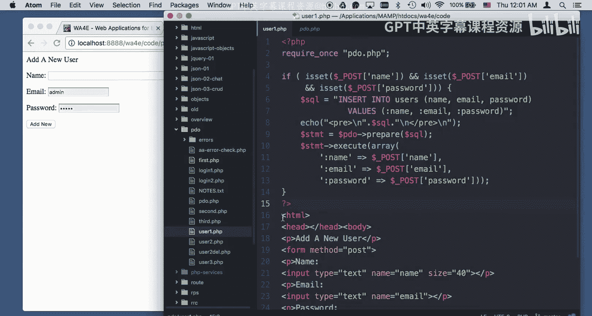

## 示例一：基础数据插入 (`user1.php`)

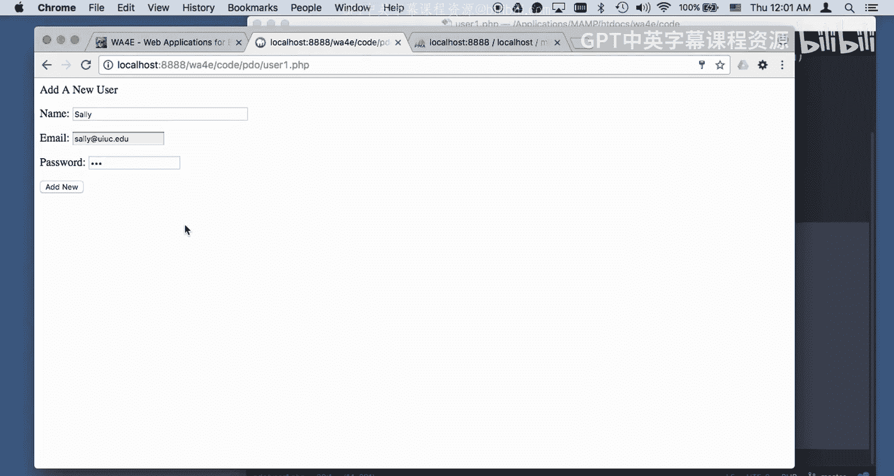

`user1.php` 文件展示了最基本的插入操作。它采用了模型-视图-控制器（MVC）模式的思想，将数据处理逻辑放在文件顶部，而将HTML模板放在底部。

### 代码逻辑解析

文件顶部的“静默处理代码”负责所有后台逻辑。当页面通过GET请求访问时，由于没有POST数据，代码会直接跳过处理部分，渲染底部的表单。这个表单包含三个字段：`name`、`password`和`email`。

当用户填写表单（例如，姓名：Sally，邮箱：sally@iu.edu，密码：999）并点击提交后，浏览器会发送一个POST请求。

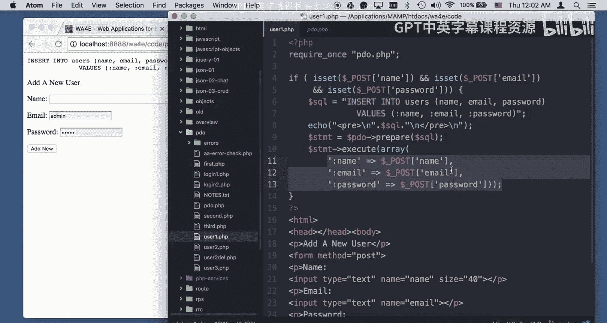

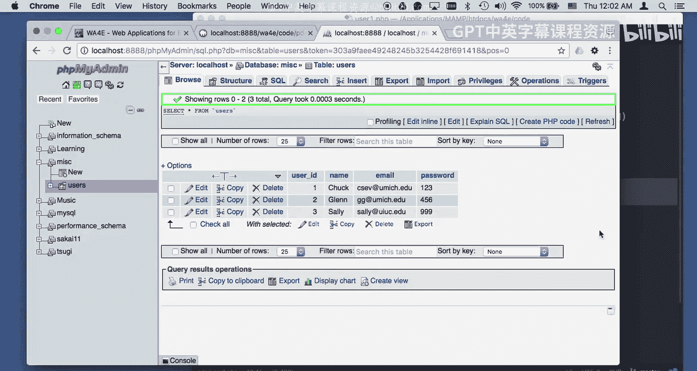

此时，代码再次从顶部开始执行。因为这次是POST请求，所以 `$_POST[‘name’]`、`$_POST[‘email’]` 和 `$_POST[‘password’]` 这三个变量将被设置。

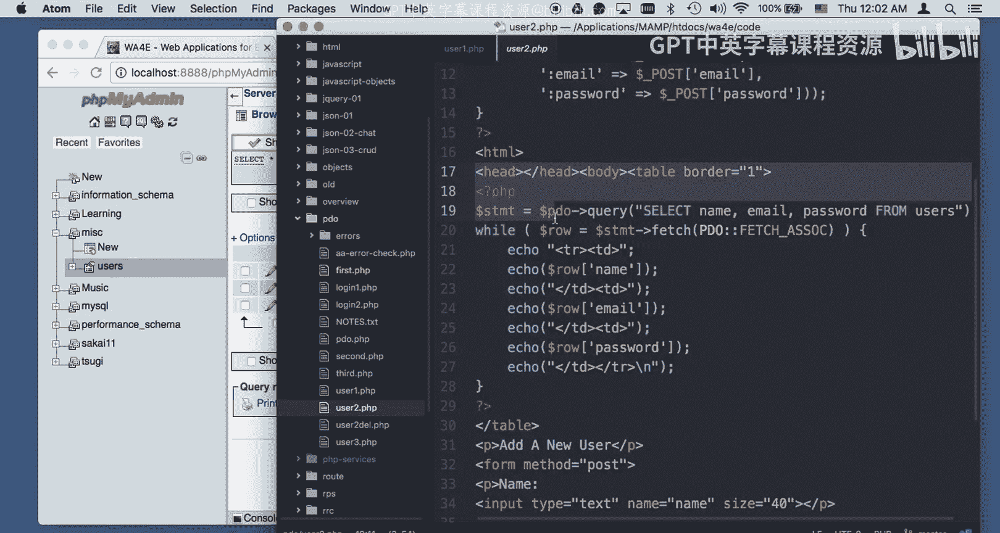

### 执行SQL插入

以下是执行插入操作的核心代码：

```php
$sql = “INSERT INTO users (name, email, password) VALUES (:name, :email, :password)”;
$stmt = $pdo->prepare($sql);
$stmt->execute(array(‘:name’ => $_POST[‘name’],
                     ‘:email’ => $_POST[‘email’],
                     ‘:password’ => $_POST[‘password’]));
```

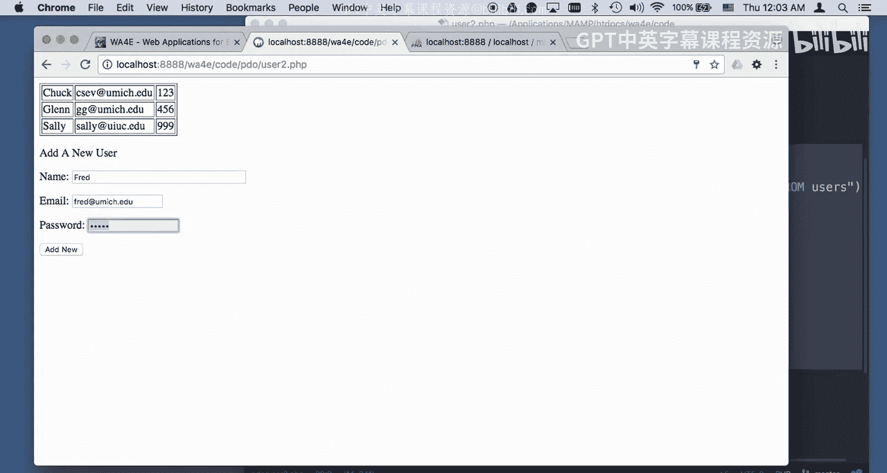

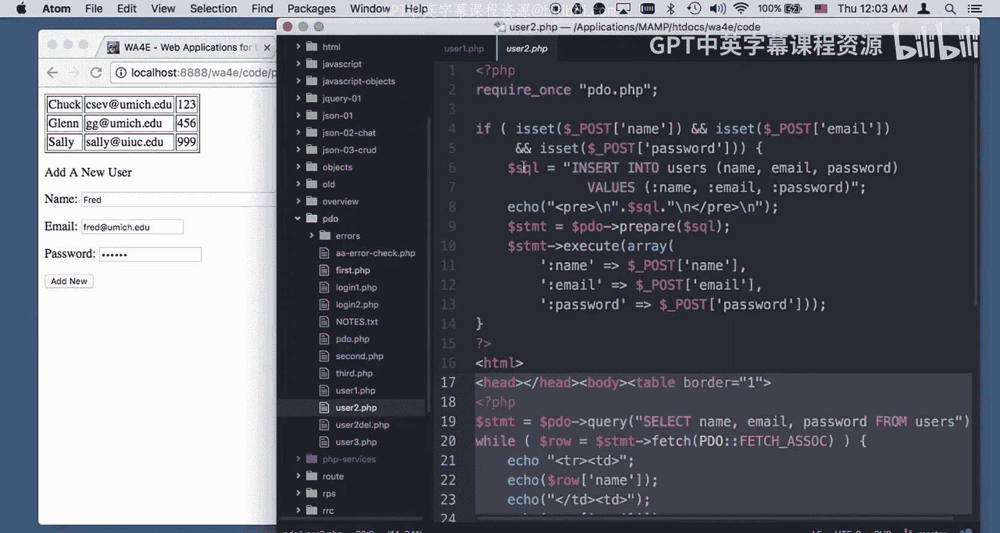

这里使用了PDO的预处理语句和命名占位符（如 `:name`）。这种方法可以防止SQL注入攻击，我们稍后会详细讨论其重要性。代码执行后，新用户“Sally”就被插入到数据库的`users`表中。

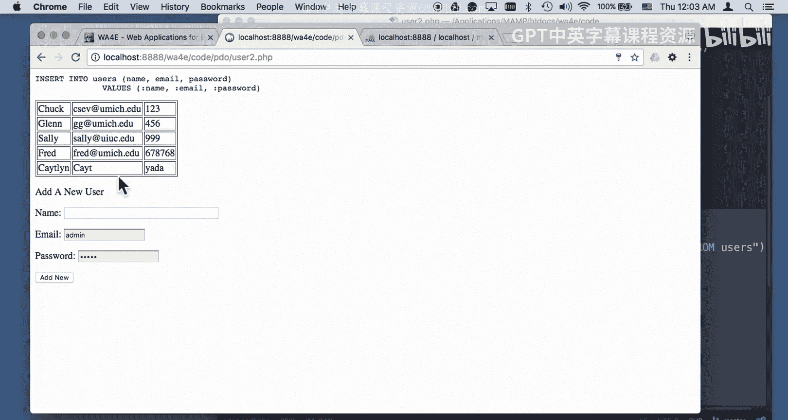

## 示例二：插入并显示数据 (`user2.php`)

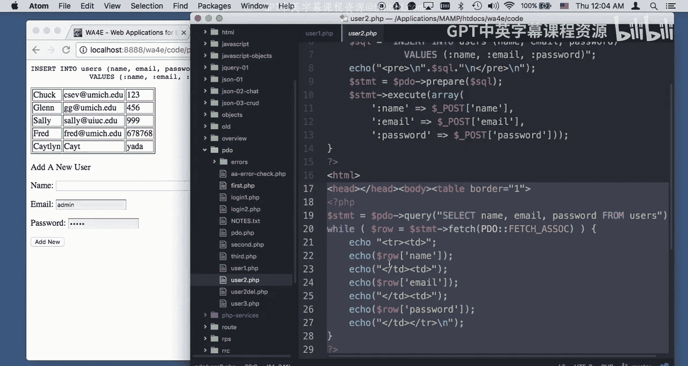

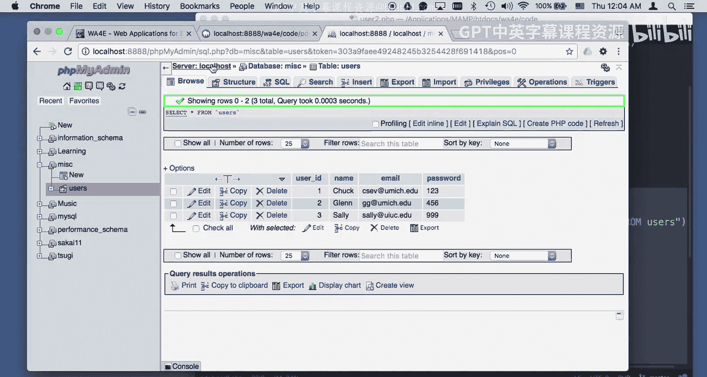

`user2.php` 在 `user1.php` 的基础上增加了一个功能：在每次插入操作后，显示数据库中所有用户的列表。

### 功能增强

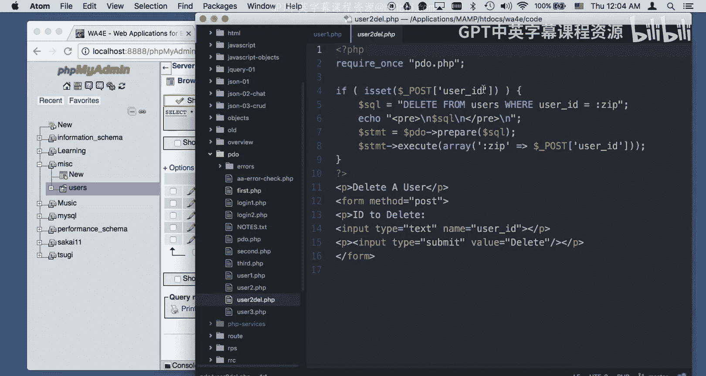

除了包含与 `user1.php` 相同的插入代码外，`user2.php` 在页面底部添加了一个表格。这个表格通过查询数据库并循环遍历所有用户记录来动态生成。

因此，当访问 `user2.php` 时，你首先会看到数据库中现有的所有用户列表，然后在列表下方是那个熟悉的输入表单。

当你通过这个表单添加一个新用户（例如，Fred）并提交后，会发生以下事情：
1.  POST请求触发插入逻辑，将Fred添加到数据库。
2.  代码执行完毕后，继续向下运行。
3.  执行一个`SELECT`查询，获取包括新用户Fred在内的所有用户数据。
4.  用更新后的数据重新生成并显示表格。

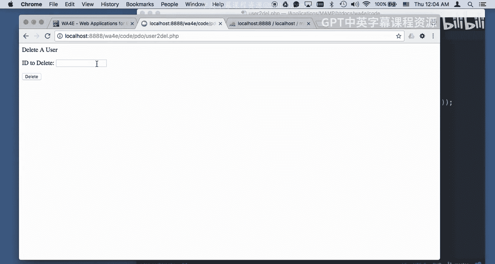

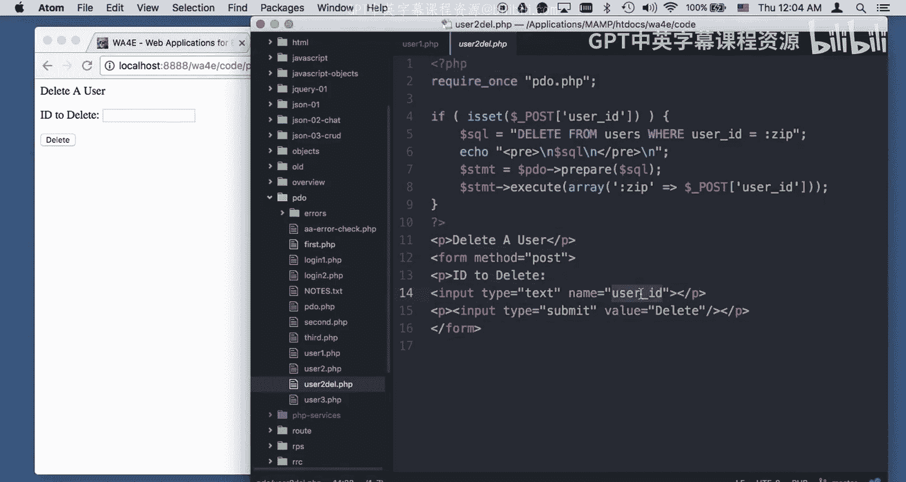

这样，页面就实现了“添加即显示”的交互效果，让我们能够即时看到操作结果。

## 示例三：集成插入与删除 (`user3.php`)

`user3.php` 将前两个示例的功能整合在一起，并加入了删除功能，形成了一个简易的用户管理界面。

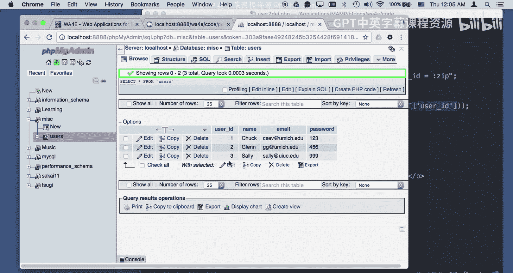

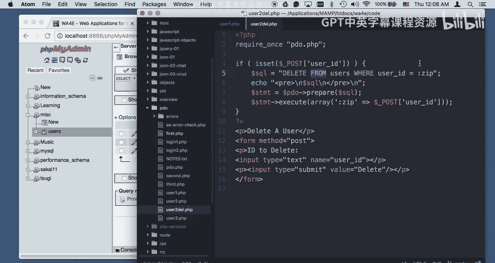

### 安全删除操作

在Web开发中，删除操作**不应该**通过GET请求直接执行，因为这可能导致恶意链接轻易删除数据。安全的做法是使用POST请求。

在 `user3.php` 中，我们为每个用户行添加了一个删除按钮。这个按钮实际上是一个微型表单：

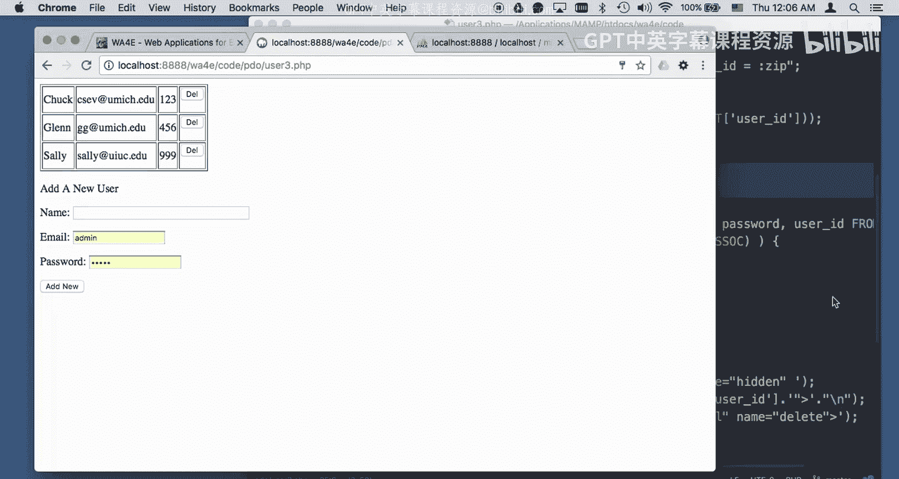

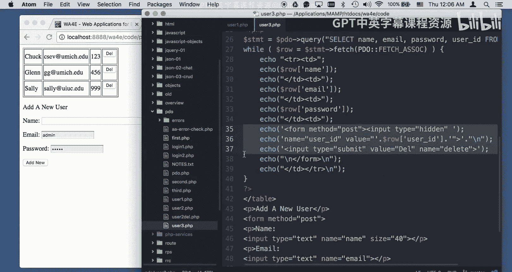

```html
<form method=“post”>
    <input type=“hidden” name=“user_id” value=“3”>
    <input type=“submit” name=“delete” value=“Del”>
</form>
```
*   它使用 `method=“post”`。
*   它包含一个隐藏字段 `user_id`，其值是对应用户的主键ID。
*   提交按钮的 `name` 属性被设置为 `“delete”`。

### 处理多种表单提交

现在，页面上有多个表单：一个用于“添加新用户”，另外每个用户行都有一个“删除”表单。服务器端代码需要区分是哪种操作。

以下是处理逻辑：
*   **判断添加操作**：检查 `$_POST[‘name’]`、`$_POST[‘email’]` 等添加表单的字段是否被设置。如果被设置，则执行插入。
*   **判断删除操作**：检查 `$_POST[‘delete’]` 按钮是否被点击（即该变量是否存在）。如果存在，则读取 `$_POST[‘user_id’]` 的值并执行删除。

删除的SQL语句如下：
```php
$sql = “DELETE FROM users WHERE user_id = :zip”;
$stmt = $pdo->prepare($sql);
$stmt->execute(array(‘:zip’ => $_POST[‘user_id’]));
```
**重要提示**：如果执行的DELETE语句没有匹配到任何行（例如，尝试删除一个不存在的`user_id=42`），这**不是**一个SQL语法错误。数据库只是执行了一个没有影响任何行的操作，这是完全合法的。

### 动态生成删除表单

在循环输出用户表格时，我们为每一行动态生成其对应的删除表单。关键代码如下：
```php
echo ‘<td>’;
echo ‘<form method=“post”><input type=“hidden”‘;
echo ‘ name=“user_id” value=“’ . $row[‘user_id’] . ‘“>’;
echo ‘<input type=“submit” name=“delete” value=“Del”>’;
echo ‘</form>’;
echo ‘</td>’;
```
这里，我们将数据库中的用户ID（`$row[‘user_id’]`）直接拼接到了HTML属性中。因为`user_id`是我们自己生成的数字，所以这里不需要额外的HTML字符转义。

最终，整个页面实现了无缝的交互：添加用户后，新用户立即出现在列表中；点击某个用户的“Del”按钮，该用户会立刻从列表和数据库中消失，页面随之刷新。

## 总结

本节课我们一起学习了使用PHP PDO进行数据库操作的核心流程。
1.  **数据插入**：我们学会了如何构建INSERT语句，使用命名占位符绑定参数，并通过POST请求安全地添加新数据。
2.  **数据查询与显示**：我们掌握了在执行插入操作后，如何查询数据库并将结果以表格形式展示给用户。
3.  **数据删除**：我们理解了为何删除操作必须使用POST请求，并学会了如何通过隐藏字段传递主键ID，以及如何安全地执行DELETE语句。
4.  **集成应用**：最后，我们将插入、显示和删除功能整合到一个页面中，通过判断不同的POST变量来区分和处理不同的用户操作，构建了一个功能完整的简易用户管理模块。

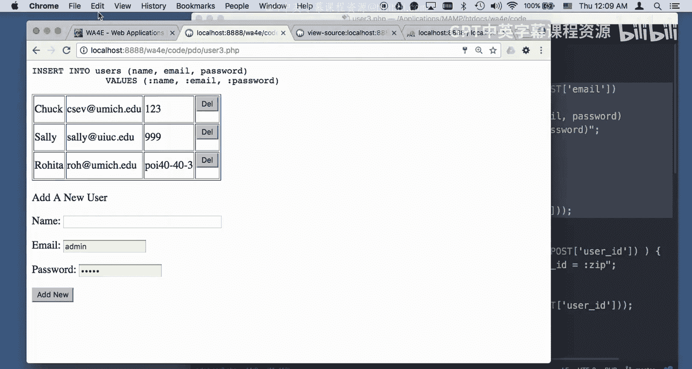


这些代码示例清晰地展示了Web应用程序中“增删查”基本操作的实现模式，是构建更复杂应用的基础。