# 092：会话管理 🍪


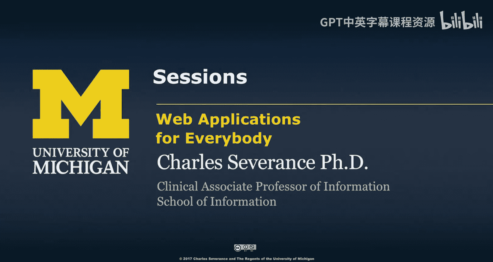

在本节课中，我们将要学习PHP中的会话管理。我们将了解会话是什么，它们与Cookie的关系，以及如何在PHP应用程序中有效地使用会话来存储跨多个请求的用户数据。

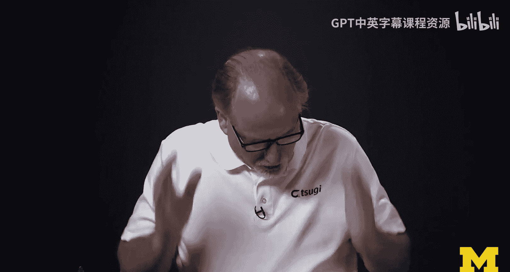

---

## 会话与Cookie的关系

上一节我们介绍了Cookie，本节中我们来看看会话。会话与Cookie相关，但必须区分它们。Cookie是浏览器和HTTP层面的概念。回顾一下，服务器发送一个Cookie，它被存储在浏览器中。


然后，浏览器在后续请求中将其发送回来，例如 `x=4`。我们见过 `Set-Cookie` 请求和 `Cookie` 头。


会话则是我们存储在服务器端的数据。你不会将当前账户余额甚至当前登录用户的信息（至少未加密的）存储在Cookie中，因为Cookie是浏览器的一部分，用户可以修改、删除或丢弃它。

我们可以使用Cookie来有效地“解锁”一个会话。会话是一小段数据，通常存储在Web服务器上（也可以存储在各种外部服务器或数据库中，但为简单起见，我们默认它存储在服务器上的一个小文件中）。

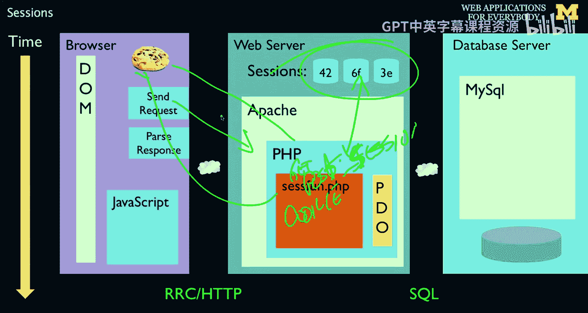

因此，当一个请求到来时，我们有 `$_GET`、`$_POST`（来自表单和参数）和 `$_COOKIE`。一旦我们理清所有信息，这里的数据就会是 `$_SESSION`。

会话的酷炫之处在于它是一种双向连接。Cookie也是双向的，我们可以使用 `setcookie` 来发送它。但会话数据使用起来非常方便，它是另一个超全局变量。

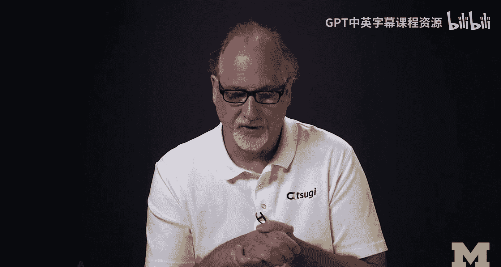

现在，基于我们对Cookie的了解，来探讨如何在PHP中实现和使用会话。

---

## 会话的工作原理

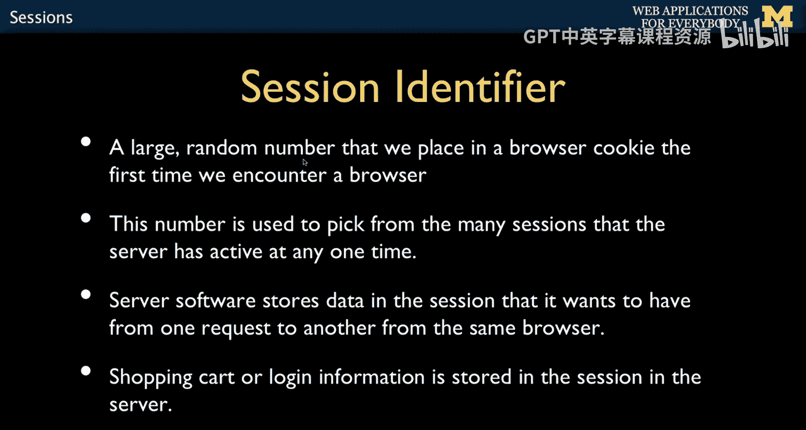

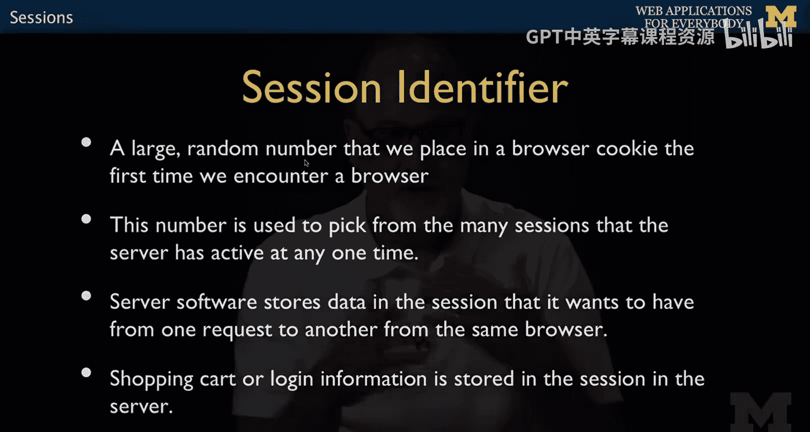

当遇到一个新浏览器时，我们检查是否存在一个会话Cookie（它仍然是一个Cookie，但专用于会话）。如果不存在，我们就生成一个大的随机数作为唯一标识符，然后将其作为Cookie发送，并在服务器上创建一个具有相同标识符的会话。


当下一个请求到来时，我们看到这里有一个会话Cookie，然后我们就可以重新连接到那个会话。PHP为我们处理了很多这类会话工作，就像一个Web框架。

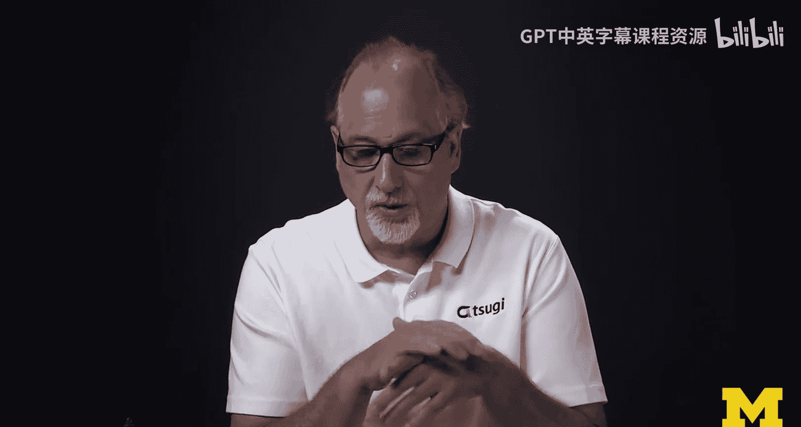

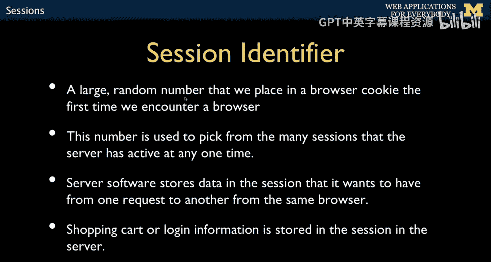

会话标识符的安全性基于“通过隐匿实现安全”。我们选取一个大的随机数，将其转换为十六进制字符，放入浏览器Cookie中。


如果有人以某种方式窃取了你的会话标识符，他们就可以通过更改自己浏览器中的Cookie来冒充你的会话。但由于这些标识符是很大的随机数，并且通常只存活很短时间（例如关闭浏览器后会话就失效），我们一般不太担心这个问题。

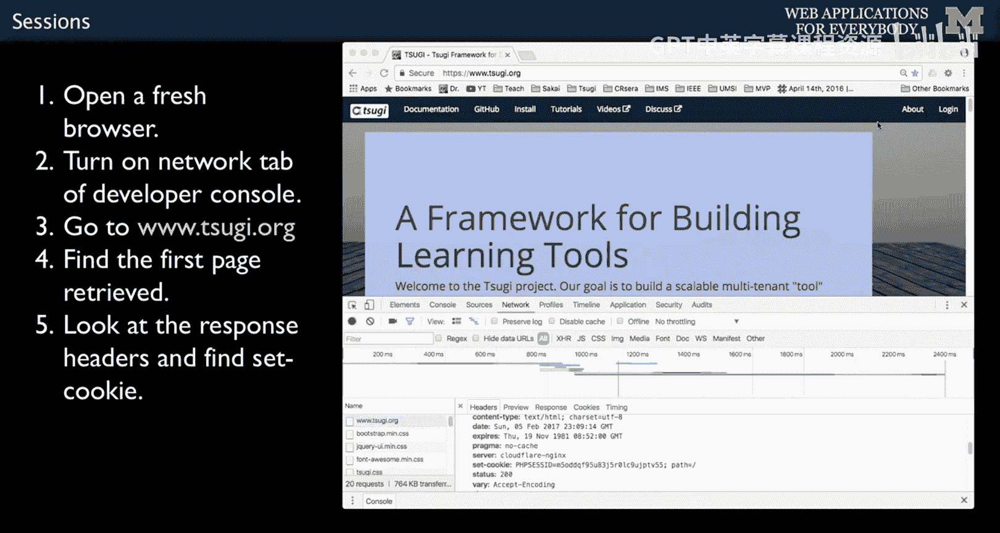


我们倾向于不在会话中存储太多数据。如果你查看一个典型的PHP应用，首次访问时就会看到一个名为 `PHPSESSID` 的Cookie（默认名称，可在PHP配置中更改）。这个Cookie在你按下登录按钮之前就存在了。会话和登录是不同的概念，登录我们稍后讨论。会话只是一个存储数据的双向场所。


最终结果是：一个浏览器拥有一个包含大随机数的会话Cookie；另一个浏览器拥有不同的Cookie；更多浏览器，不同用户，不同Cookie。在服务器内部，我们有一个与每个标识符对应的小存储空间。

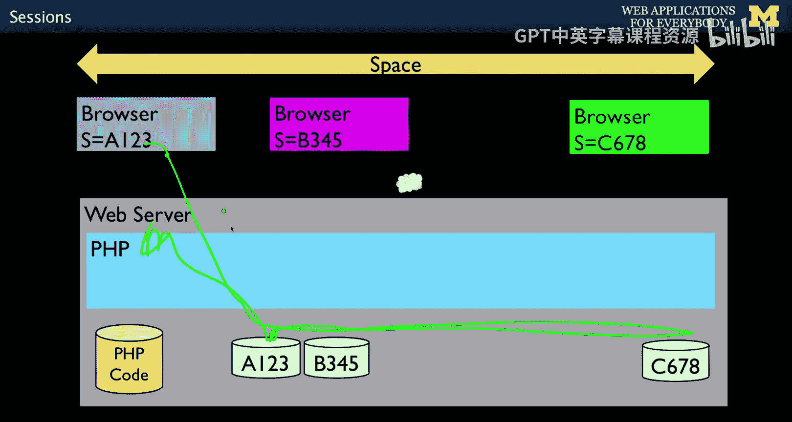

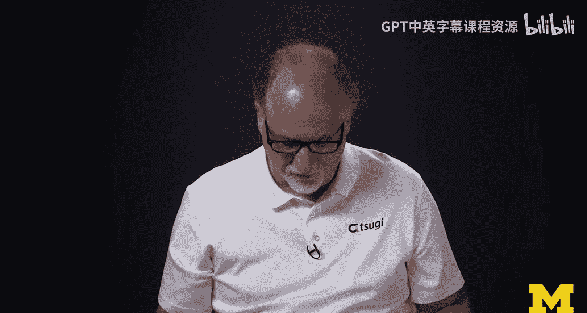


当请求到来时，我们可以通过Cookie重新关联，在所有会话中查找并选择正确的会话，然后将其作为 `$_SESSION` 交给PHP。


因此，Cookie可以“解锁”或为我们选择会话。

---

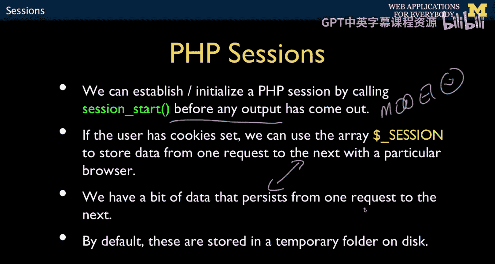

## 在PHP中使用会话

PHP内置了对会话的良好支持。我们基本上通过在输出任何内容之前调用 `session_start()` 来建立或创建新的PHP会话。你会看到很多操作都必须在输出之前完成，这属于“模型”代码，而非“视图”代码。

如果用户启用了Cookie，我们就可以使用 `$_SESSION` 变量在请求之间存储数据。这是一个双向变量：你可以从中取出数据，也可以存入数据。

现在你有了一个可能希望保留的东西，而POST数据在每次请求-响应周期后都会消失并重新创建，但会话不会。它被重新关联。你拥有Cookie，它重新关联会话，默认情况下我们将这些东西存储在磁盘上。

以下是会话数据随时间变化的过程：


一旦会话建立，Cookie进来，它将磁盘上的会话数据拉入 `$_SESSION` 变量。如果你更改了其中的数据，那么这些数据会被写回磁盘，然后响应发出。稍后，另一个请求（可能带有GET参数）到来，我们再次拉入会话数据，可以对其进行更改，然后发送响应。时间流逝，一个POST请求到来，带来新的POST数据，我们拉出会话数据，如果做了更改，就存回会话，然后发送请求。如此循环。

这就像跨越一系列请求-响应周期的全局变量。它是一个数组，一个键值对数组，你可以选择键名，做任何操作。但我们不在会话中存放巨型数据，而是像为应用存储一些“面包屑”，比如登录状态。

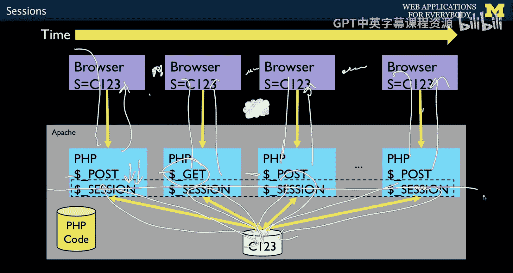

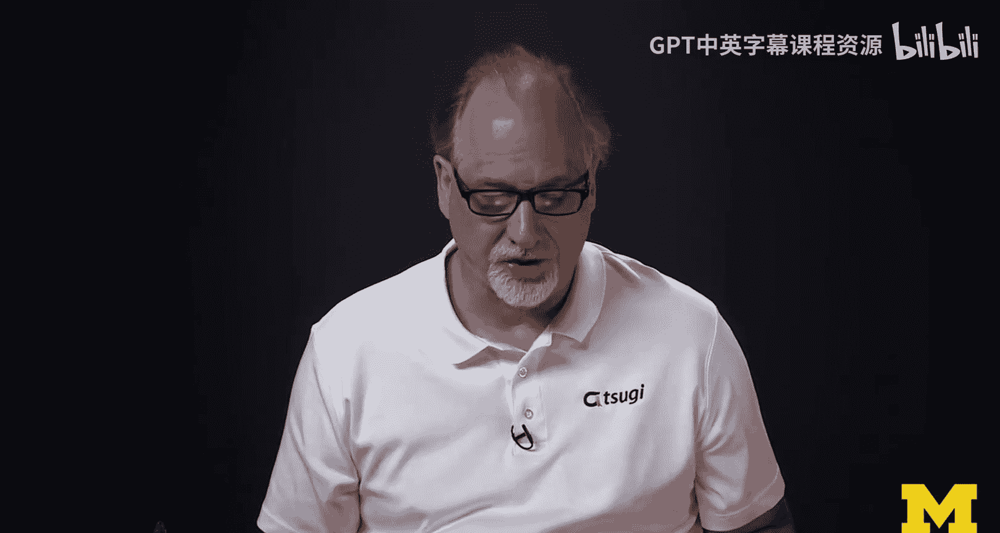


你可以通过 `phpinfo()` 找到服务器配置的会话存储位置，甚至可以查看会话文件。你会看到一个小文件，由会话ID作为键名。当请求到来时，它会找到这个小文件。文件内容不一定可读，但有时可以，里面是一系列键值对。这是一种我们不直接查看的魔法格式，但存储在 `$_SESSION` 变量中的内容就是以此格式存储在磁盘上的。

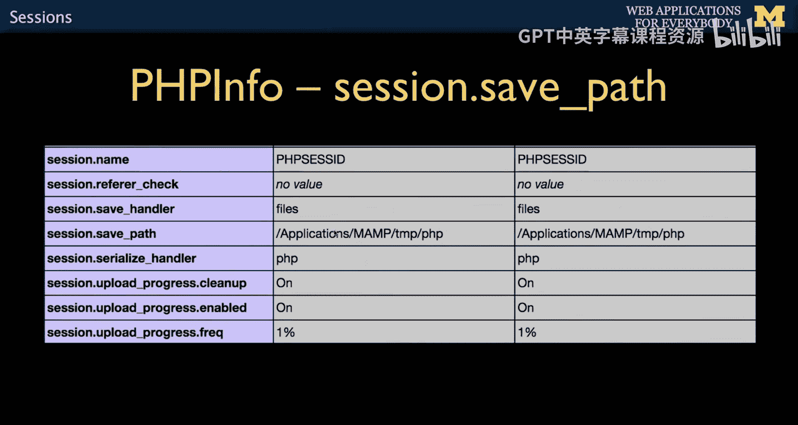

有些人通过查看这些文件来调试应用。其工作方式是：在你的应用非常早期，在任何输出之前，调用 `session_start()`。`session_start()` 做两件事之一：如果Cookie不存在，则创建一个空会话并设置Cookie；如果Cookie存在，则重新关联旧的会话。无论哪种情况，完成后就可以使用 `$_SESSION` 变量了。


在调用 `session_start()` 之前不能使用 `$_SESSION`。`$_GET`、`$_POST` 和 `$_COOKIE` 在第一行代码执行前就已设置，而 `$_SESSION` 只有在调用 `session_start()` 后才被设置。

你可以使用 `session_destroy()` 清除所有键。然后，只需使用赋值语句将数据存入会话。

---

## 代码示例与演示

以下是一段可以运行和试验的代码：

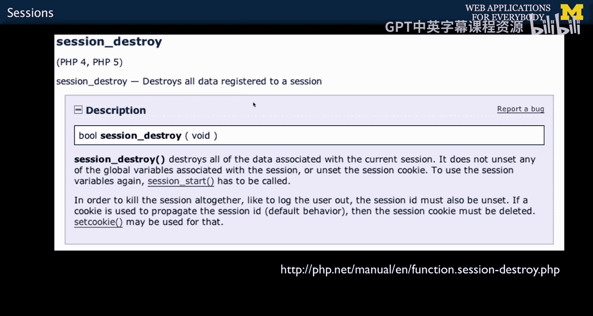

```php
<?php
session_start();
?>
<html>
<body>
<?php
if (!isset($_SESSION[‘pizza’])) {
    echo(“Session is empty<br/>\n”);
    $_SESSION[‘pizza’] = 0;
} else if ($_SESSION[‘pizza’] < 3) {
    $_SESSION[‘pizza’] = $_SESSION[‘pizza’] + 1;
    echo(“Added one...\n”);
} else {
    session_destroy();
    session_start();
    echo(“Session Restarted\n”);
}
?>
<p><a href=”sessfun.php”>Click Me!</a></p>
<p>Our Session ID is: <?php echo(session_id()); ?></p>
<pre>
<?php print_r($_SESSION); ?>
</pre>
</body>
</html>
```

代码流程如下：请求到来，我们调用 `session_start()`。如果会话中没有 `pizza` 这个键，我们打印“Session is empty”，然后设置 `$_SESSION[‘pizza’] = 0`。接着打印出会话内容。

下一次请求到来，`session_start()` 执行，`pizza` 现在等于0（从磁盘拉入 `$_SESSION`）。因为存在 `pizza` 键，条件判断为假。然后检查 `pizza` 是否小于3，是则将其旧值0加1，存储为1。然后完成并输出。时间流逝，磁盘上存储着1。请求再次回来，`pizza` 等于1，它小于3，我们加1变成2，运行，再次回来变成3，依此类推。

关键在于，在 `$_SESSION[‘pizza’] = $_SESSION[‘pizza’] + 1;` 这个语句中，你正在从会话中读取和写入数据，而会话在服务器端，不在浏览器。Cookie解锁会话，Cookie重新关联会话，但Cookie不是会话本身。会话是存储在服务器上的键值对，其超全局变量名为 `$_SESSION`。它是在调用 `session_start()` 后才建立的。如果你在这之前打印 `$_SESSION`，它不存在。但调用 `session_start()` 后，它就存在了。

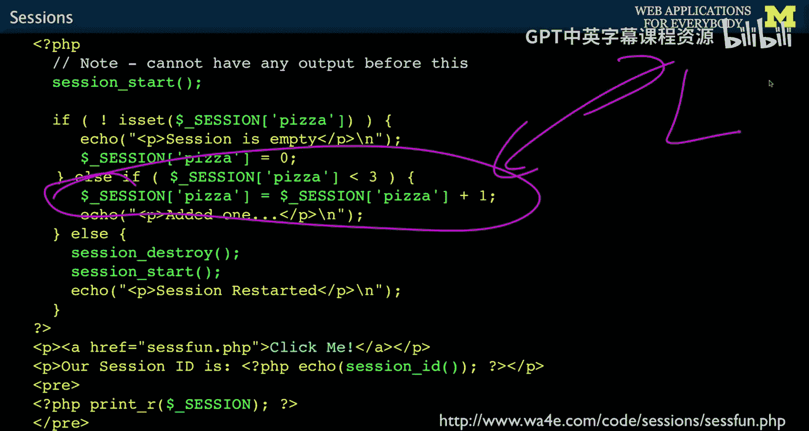


`session_start()` 从磁盘读取数据。如果你的某些PHP代码完全不使用会话，那么如果你不打算使用 `$_SESSION` 变量，就不需要调用 `session_start()`。

以下是点击链接时的演示：首次点击创建会话ID并设置为0。

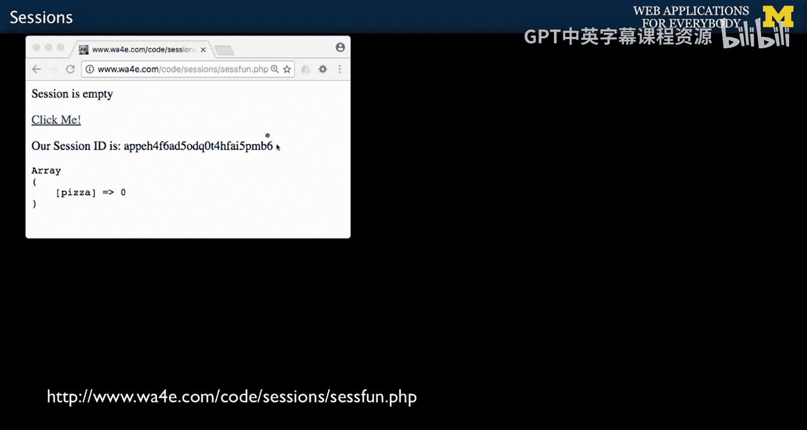

继续点击，值变为1、2、3，然后调用重置，清空它。


对应的代码逻辑是：如果值达到3或更大，就调用 `session_destroy()`，然后重新启动会话并运行。`session_destroy()` 不会改变会话ID，但会删除其中的所有键，从而清空会话。


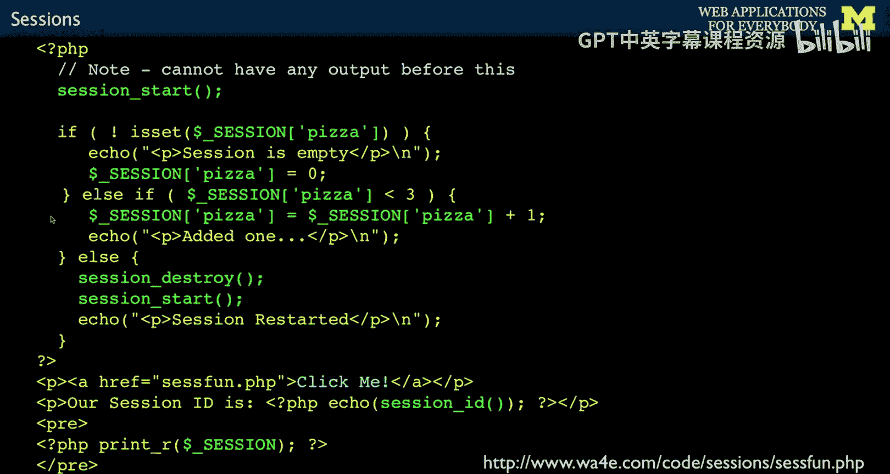
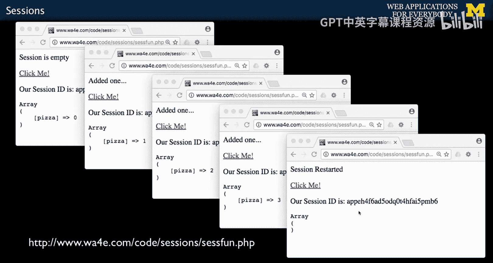

---


## 无Cookie的会话


接下来我想讨论会话如何在不使用Cookie的情况下工作，我认为这是PHP一个非常酷的特性。


---


本节课中我们一起学习了PHP会话管理。我们理解了会话是存储在服务器端、用于跨请求保持数据的机制，而Cookie是客户端用于携带会话标识符以“解锁”对应会话的钥匙。我们学习了如何使用 `session_start()` 初始化会话，如何使用 `$_SESSION` 超全局数组存取数据，以及如何使用 `session_destroy()` 清除会话。我们还通过示例代码看到了会话数据如何在请求间持续存在。最后，我们提到了会话也可以在不依赖Cookie的情况下工作，这为更多场景提供了灵活性。掌握会话是构建需要状态保持的交互式Web应用的基础。