# 101：登录与注销3 🔐

在本节课中，我们将学习一个简单的登录与注销应用程序。我们将深入探讨其代码结构，理解如何通过会话（Session）管理用户登录状态，以及如何使用“闪现消息”（Flash Message）在页面间传递一次性信息。这个应用演示了模型-视图-控制器（MVC）模式、POST重定向（PRG）模式等核心概念的实际应用。

## 应用概述与文件结构

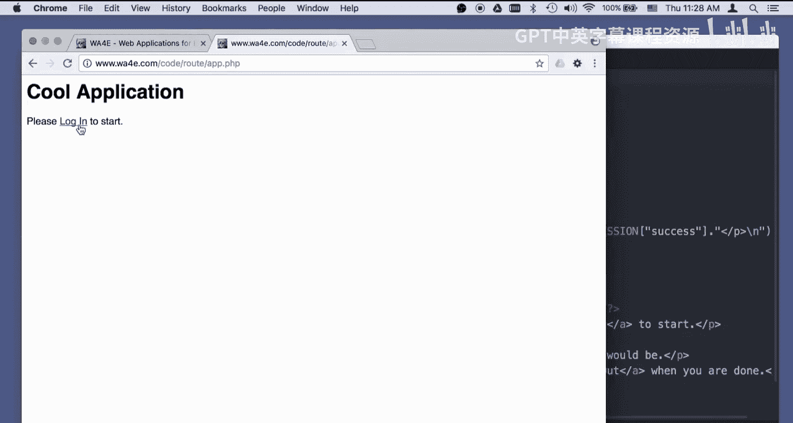

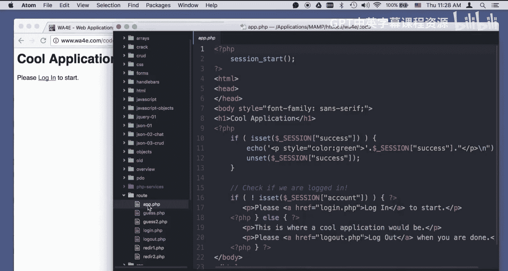

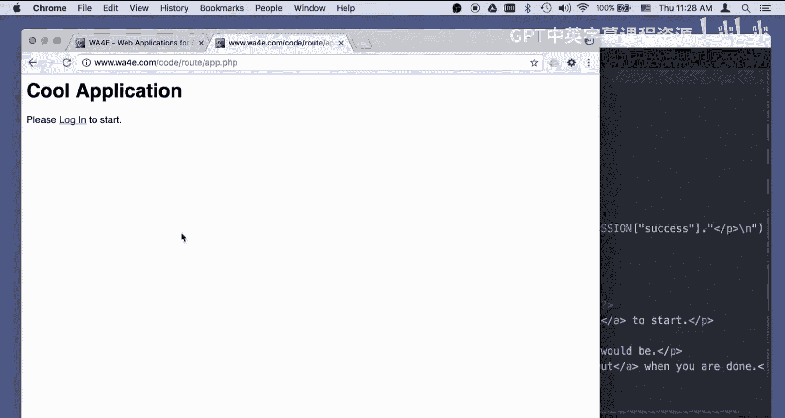

这个应用程序由三个核心PHP文件组成：
*   **`app.php`**：主应用页面，根据用户登录状态显示不同内容。
*   **`login.php`**：处理用户登录的表单和逻辑。
*   **`logout.php`**：处理用户注销的逻辑。

应用程序的核心逻辑是：通过检查会话（Session）中是否存在 `account` 键来判断用户是否已登录。

## `app.php`：主页面逻辑

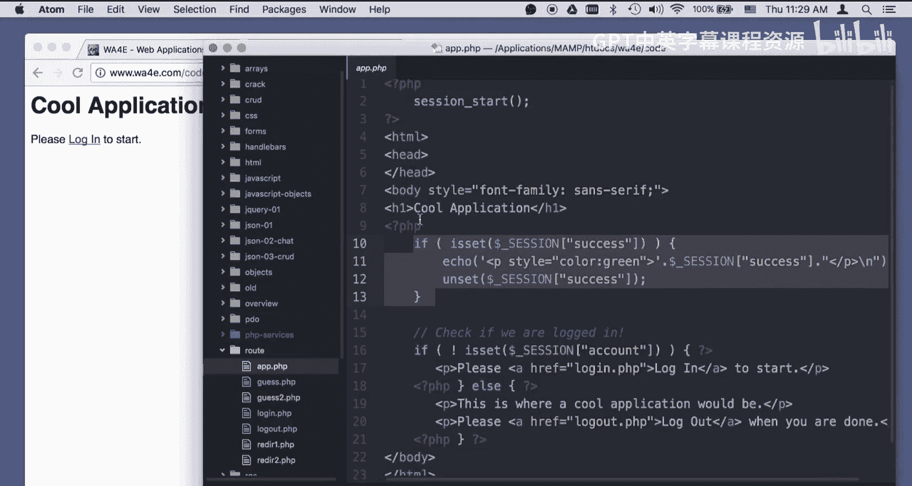

上一节我们介绍了应用的整体结构，本节中我们来看看主页面 `app.php` 是如何工作的。

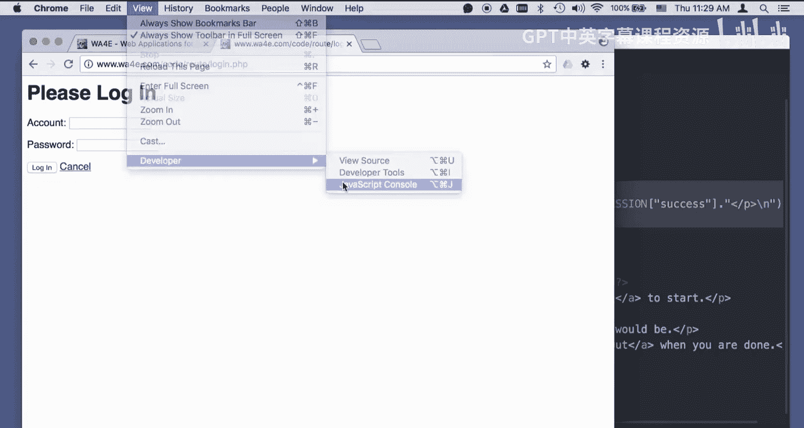

`app.php` 的模型部分非常简单，主要是启动会话。视图部分则根据会话状态动态显示内容。

以下是 `app.php` 的核心逻辑步骤：

1.  **启动会话**：使用 `session_start()` 函数。
2.  **检查登录状态**：判断 `$_SESSION` 数组中是否存在名为 `account` 的键。
3.  **显示内容**：
    *   如果 `account` 键**不存在**，显示“请登录”的提示。
    *   如果 `account` 键**存在**，显示“欢迎使用酷应用”的提示和一个“注销”链接。
4.  **处理闪现消息**：检查会话中是否存在 `success` 消息，如果存在则显示（通常为绿色），显示后立即从会话中删除该消息，使其只出现一次。

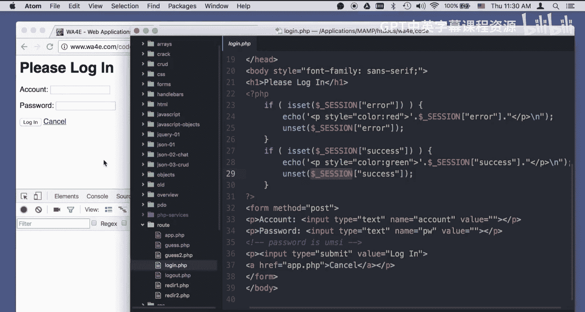

其核心判断逻辑可以用以下伪代码表示：
```php
if (isset($_SESSION[‘account’])) {
    // 用户已登录，显示应用主界面和注销链接
} else {
    // 用户未登录，显示登录提示
}
```

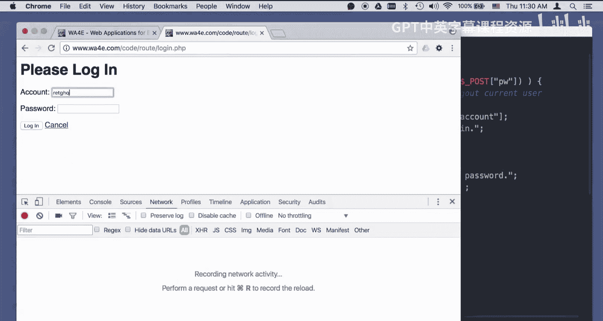

## `login.php`：登录处理与闪现消息

现在，让我们进入登录页面 `login.php`，看看它是如何验证用户并管理消息的。

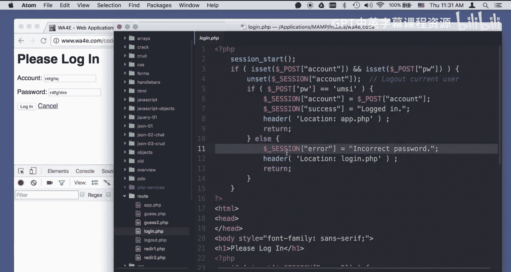

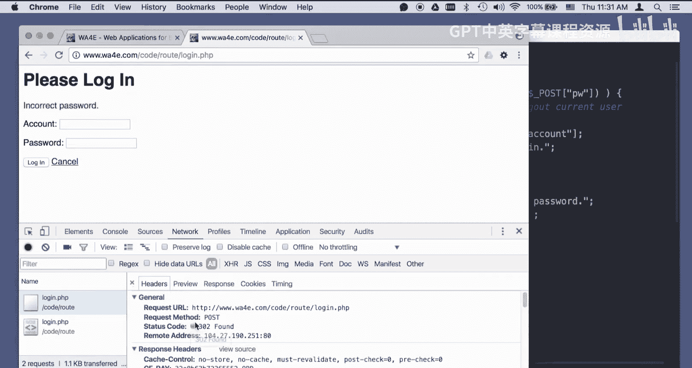

`login.php` 的代码分为两部分：顶部的控制器逻辑（处理POST请求）和底部的视图逻辑（显示HTML表单）。它引入了“闪现消息”的概念，用于在重定向后显示一次性提示。

以下是 `login.php` 处理登录请求的详细流程：

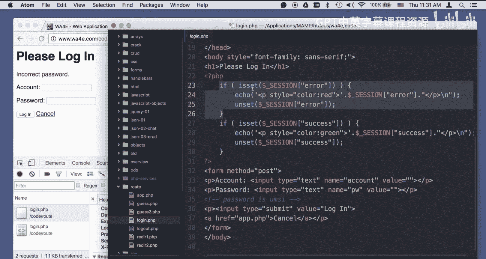

1.  **启动会话**。
2.  **处理POST请求（控制器部分）**：
    *   无论提交什么，先执行 `unset($_SESSION[‘account’])`，这相当于注销当前用户（如果存在）。
    *   检查提交的密码是否等于硬编码的字符串 `‘umsi’`。
    *   **如果密码错误**：
        *   在 `$_SESSION[‘error’]` 中设置错误信息（例如“密码错误”）。
        *   使用 `header(‘Location: login.php’)` 重定向回登录页面本身。
    *   **如果密码正确**：
        *   在 `$_SESSION[‘success’]` 中设置成功信息（例如“登录成功”）。
        *   在 `$_SESSION[‘account’]` 中设置用户标识（例如用户名）。
        *   使用 `header(‘Location: app.php’)` 重定向到主页面 `app.php`。
3.  **显示页面（视图部分）**：
    *   在表单上方，检查 `$_SESSION` 中是否存在 `error` 或 `success` 键。
    *   如果存在，则显示相应消息（错误为红色，成功为绿色）。
    *   **关键步骤**：显示消息后，立即使用 `unset()` 函数将其从 `$_SESSION` 中删除。这就是“闪现”的含义——消息只在下一次页面加载时出现一次，刷新后就会消失。

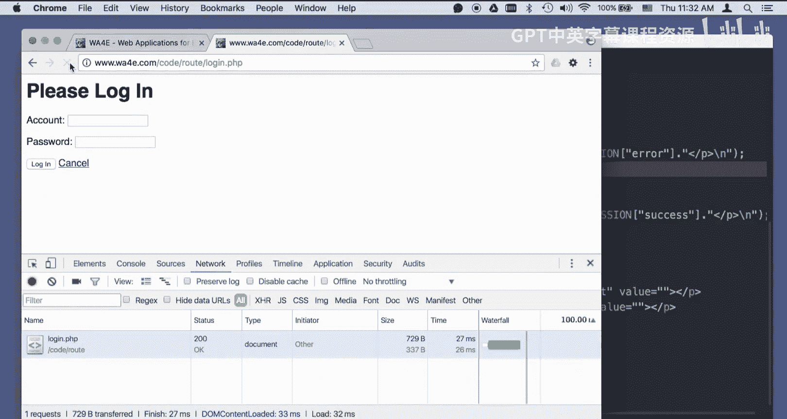

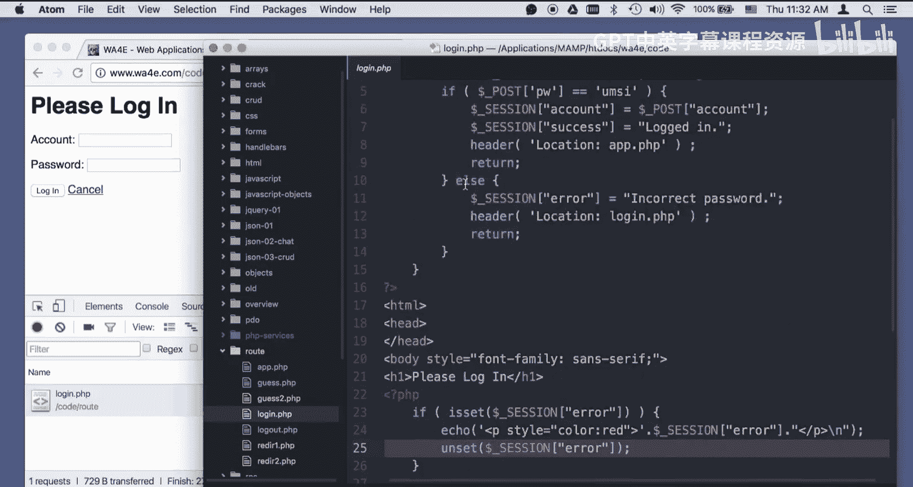

这个“POST-处理-重定向-GET显示”的循环，就是POST重定向（PRG）模式的典型应用，它避免了表单重复提交，并允许我们在重定向后的页面上显示消息。

## `logout.php`：注销流程

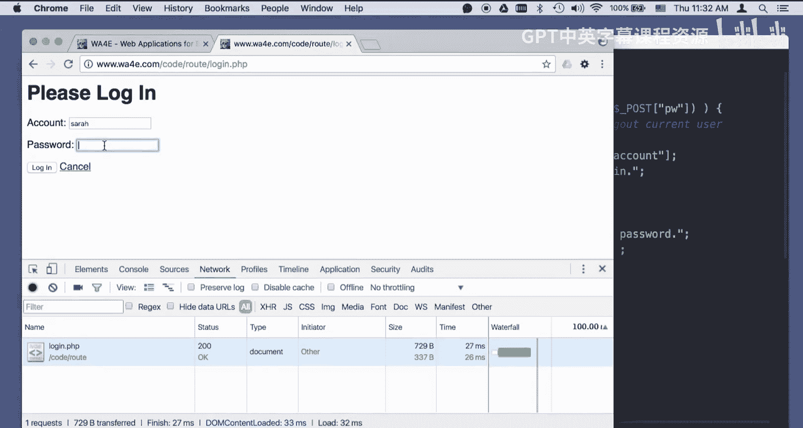

最后，我们来看最简单的部分——注销。理解了登录状态是如何通过会话管理的，注销就变得非常直观。

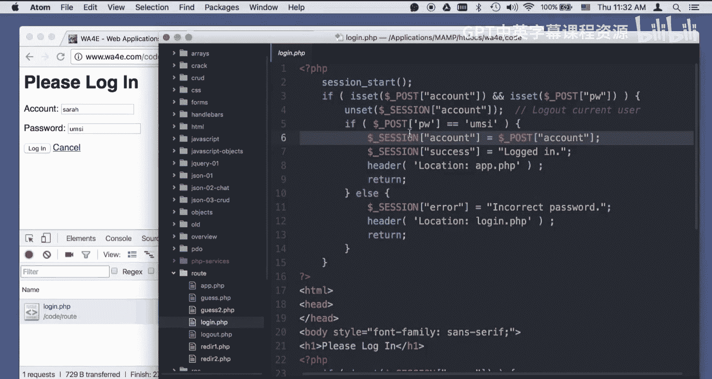

`logout.php` 的代码极其简洁，它的唯一目的就是清除用户的登录状态。

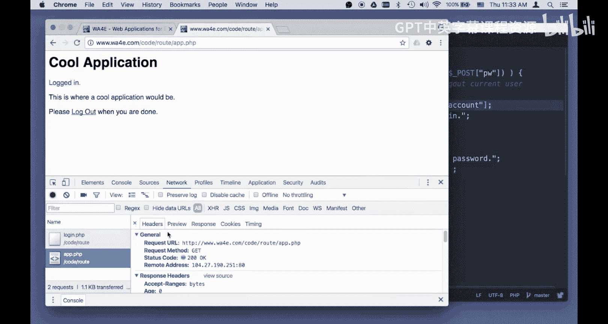

以下是 `logout.php` 的执行步骤：

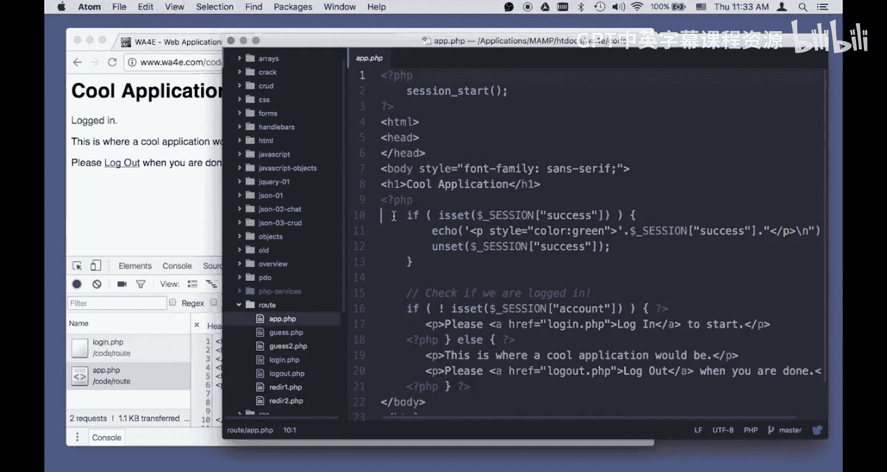

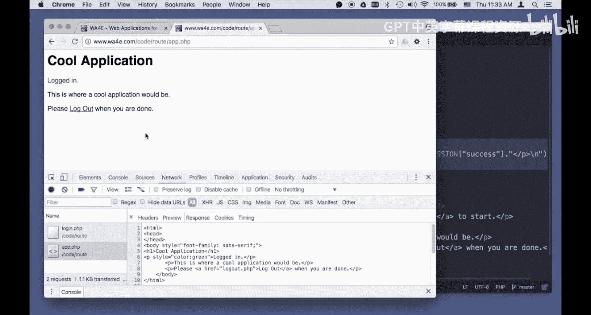

1.  **启动会话**。
2.  **销毁会话数据**：使用 `session_destroy()` 或 `unset($_SESSION[‘account’])` 来移除登录标识。示例中使用了 `session_destroy()` 来清除整个会话。
3.  **重定向**：使用 `header(‘Location: app.php’)` 将用户带回主页面 `app.php`。

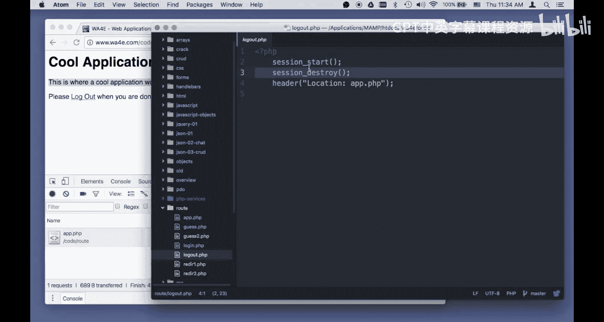

当用户回到 `app.php` 时，由于会话中已没有 `account` 键，页面将显示“请登录”的提示，从而完成整个注销流程。

## 总结

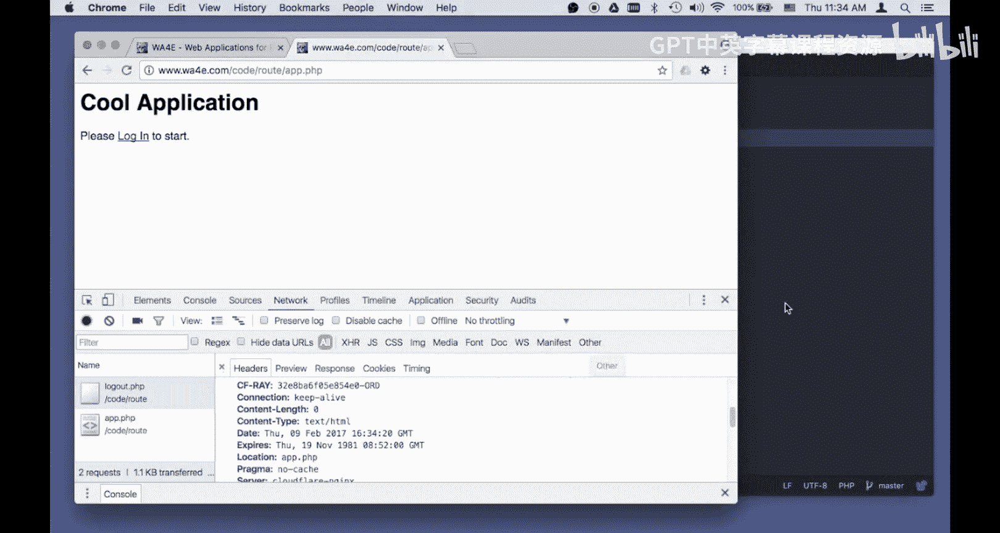

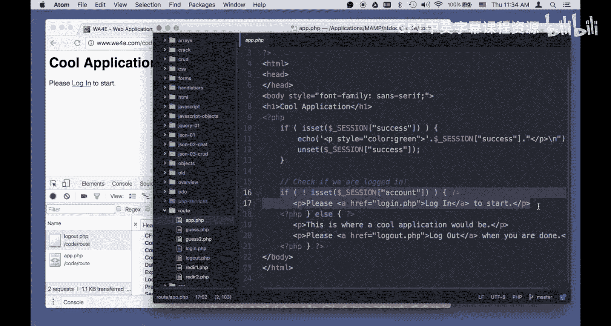

本节课中我们一起学习了一个完整的登录/注销应用实例。我们深入分析了三个文件：
*   **`app.php`** 作为**视图**，根据模型（会话状态）决定显示内容。
*   **`login.php`** 充当了**控制器**（处理POST逻辑）和**视图**（显示表单）的角色，并实践了**闪现消息**和**POST重定向**模式。
*   **`logout.php`** 作为**控制器**，执行状态清理并重定向。

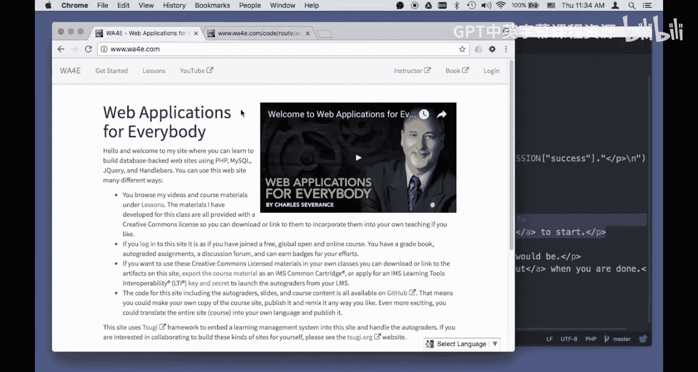


这个小型应用清晰地展示了如何使用PHP会话管理用户状态、如何在不同的请求周期（POST/GET）间安全地传递信息，以及MVC和PRG模式如何协同工作以构建一个健壮、用户友好的Web交互流程。