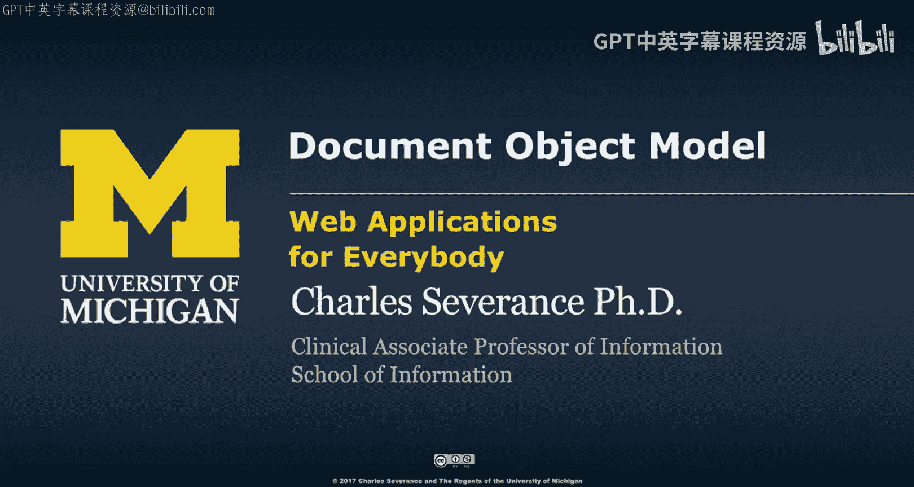
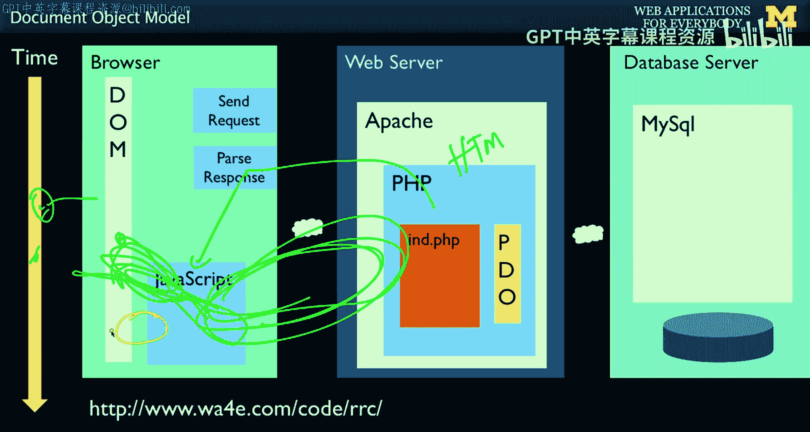
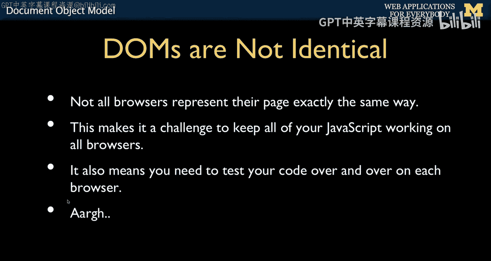
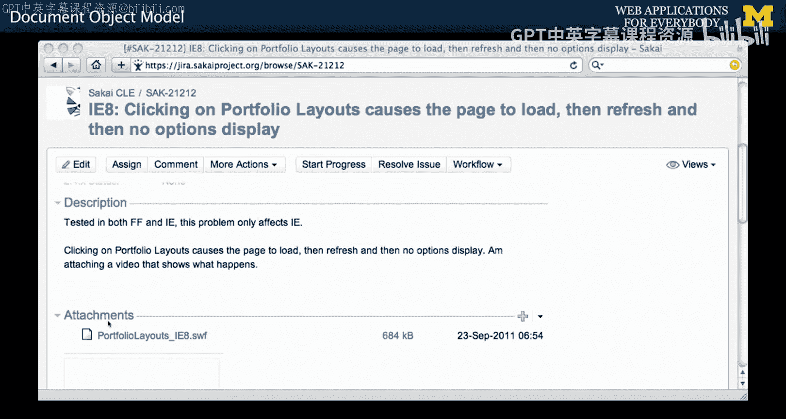
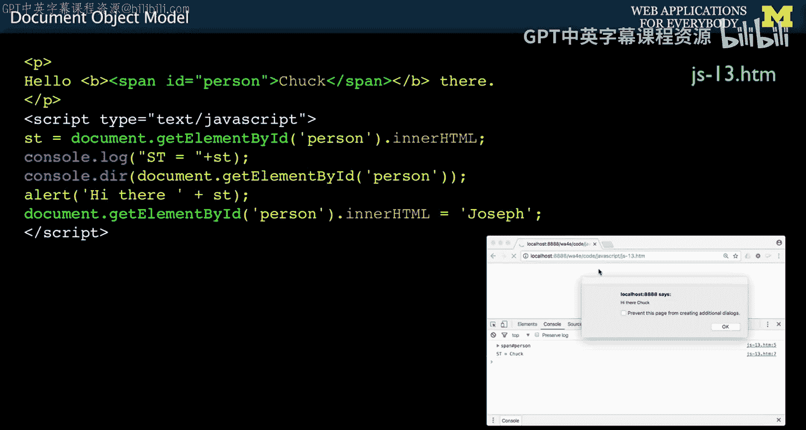
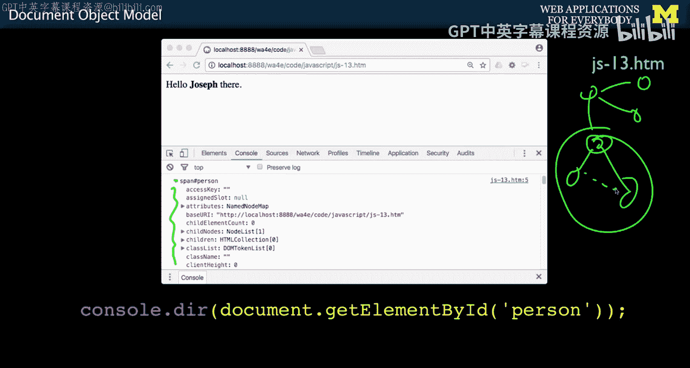
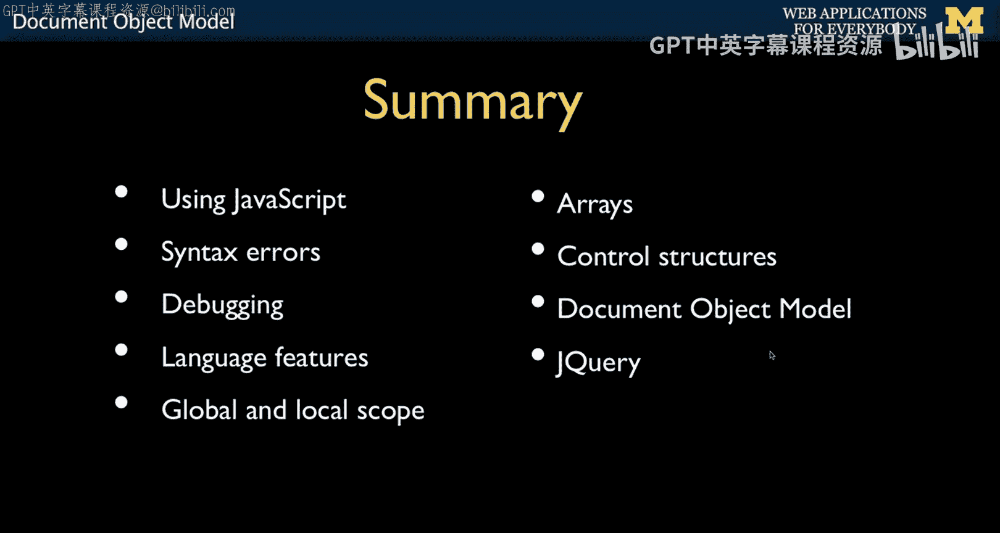

# 115：JavaScript文档对象模型 🧩




在本节课中，我们将学习如何使用JavaScript来操作文档对象模型（DOM）。DOM是网页在浏览器中的内部表示，通过JavaScript操作DOM，我们可以在不重新加载页面的情况下，动态地改变网页的内容和结构，从而实现丰富的交互体验。



## 从JavaScript操作DOM

上一节我们介绍了JavaScript的基础语法，本节中我们来看看如何用它来操作DOM。



在请求-响应周期中，DOM是我们最终在浏览器中看到的网页内容。现在，我们将看到JavaScript如何查看、提取DOM中的元素，以及如何将新内容插入到DOM中。我们已经见过如何使用`document.write`来追加内容，而本节将深入探讨如何交互式地操作DOM，这是实现无需请求-响应周期的交互功能的核心。



## DOM的历史与挑战 😡

DOM的概念由来已久。当JavaScript在1995年诞生时，DOM就已经存在。但当时的问题是，不同的浏览器（如IE、Firefox）各自独立发展，它们解析HTML后形成的内部数据结构（即DOM）并不相同。

由于这种不一致性，早期规范并未强制规定DOM的具体形状或结构（例如，某个元素的子元素必须是特定的顺序）。这意味着，开发者无法编写完全通用的代码来直接遍历所有浏览器的DOM。为了解决这个问题，浏览器引入了一种独立于DOM结构的方法来查找元素。

## 通过ID查找元素

由于不同浏览器的DOM“形状”不同，早期开发者无法编写像`document.X.Y.Z.sub4`这样依赖固定结构的代码。为了解决这个问题，他们引入了一个在所有浏览器中都通用的函数：`getElementById`。

这个函数的思想是：我们不需要知道一个元素在DOM树中的具体位置，只要给它标记一个唯一的ID，就可以通过这个ID直接找到它。

以下是其工作原理：
*   在HTML中，我们使用`id`属性为元素提供一个唯一的标识符。例如：`<span id="person">Chuck</span>`。
*   在JavaScript中，我们使用`document.getElementById('person')`来获取这个`<span>`标签对应的DOM对象。
*   获取到这个对象后，我们可以通过其`innerHTML`属性来读取或修改标签内的内容。



**代码示例：查找并修改元素**
```javascript
// 查找ID为'person'的元素
let element = document.getElementById('person');
// 读取元素内部的HTML内容
console.log(element.innerHTML); // 输出: Chuck
// 修改元素内部的HTML内容
element.innerHTML = 'Joseph';
```
执行上述代码后，网页上原本显示“Chuck”的地方会立刻变为“Joseph”，而无需刷新页面。浏览器控制台的`console.dir()`函数可以帮助我们查看DOM对象的详细属性，是调试代码的有用工具。



## 简单的DOM交互示例

理解了如何查找和修改元素后，我们可以创建一些简单的交互。以下是一个通过点击按钮来改变文本的例子：

**HTML部分：**
```html
<span id="stuff">Initial Text</span>
<button onclick="document.getElementById('stuff').innerHTML = 'Back'">Back</button>
<button onclick="document.getElementById('stuff').innerHTML = 'Forth'">Forth</button>
```
**交互逻辑：**
*   页面初始显示“Initial Text”。
*   点击“Back”按钮，`id="stuff"`的`<span>`内容会变为“Back”。
*   点击“Forth”按钮，其内容会变为“Forth”。
*   这个过程完全在浏览器中完成，没有与服务器进行任何通信。

## 动态添加DOM元素

我们可以进行更复杂的操作，比如动态地向页面中添加新元素。以下示例展示了一个点击“more”链接，不断向列表中添加新项目的功能。

**HTML与JavaScript代码：**
```html
<ul id="thelist">
  <li>First Item</li>
</ul>
<a href="#" onclick="add(); return false;">more</a>

<script>
let counter = 1; // 全局计数器
function add() {
  // 1. 创建一个新的<li>元素
  let newItem = document.createElement('li');
  // 2. 为这个新元素设置一个类名和内容
  newItem.className = 'x';
  newItem.innerHTML = 'Item ' + counter;
  // 3. 找到<ul>元素，并将新的<li>添加为其子元素
  let theList = document.getElementById('thelist');
  theList.appendChild(newItem);
  // 4. 计数器加1
  counter++;
}
</script>
```
**执行流程如下：**
1.  每次点击“more”链接，都会调用`add()`函数。
2.  `add()`函数会创建一个新的`<li>`元素节点。
3.  设置这个新节点的内容和属性。
4.  通过`getElementById`找到目标`<ul>`列表。
5.  使用`appendChild`方法将新创建的`<li>`节点插入到`<ul>`列表的末尾。
6.  页面会立即更新，显示新增的项目。

## 从原生操作到jQuery 😊

上述方法代表了1995年至2005年左右操作DOM的方式。虽然功能强大，但存在两个主要问题：
1.  **代码冗长繁琐**：即使是简单的操作，也需要多行代码。
2.  **浏览器兼容性**：不同浏览器之间存在差异，开发者需要编写大量额外代码来处理这些差异。

为了解决这些问题，在2000年代中期出现了一系列JavaScript库，其中最为流行和持久的就是**jQuery**。jQuery主要解决了两个痛点：
*   **简化语法**：它提供了一套更简洁、更易读的API来操作DOM。
*   **处理兼容性**：它内部封装了不同浏览器之间的差异，开发者只需调用jQuery的方法，它就会自动处理兼容性问题。

因此，在现代Web开发中，对于复杂的DOM操作，使用jQuery或类似的现代框架（如React, Vue）已成为标准做法。当然，对于非常简单的任务，直接使用`getElementById`等原生方法仍然是可行且轻量的选择。



本节课中我们一起学习了JavaScript操作文档对象模型（DOM）的基础知识。我们从DOM的历史挑战讲起，学习了如何使用`getElementById`和`innerHTML`来查找和修改页面元素，并实现了动态添加内容的交互功能。最后，我们了解了为什么jQuery等库会被广泛采用，以简化开发并解决浏览器兼容性问题。掌握这些核心概念，是构建动态、交互式网页应用的重要一步。