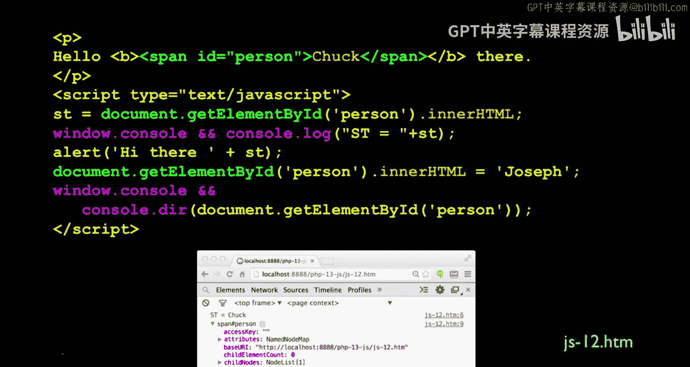
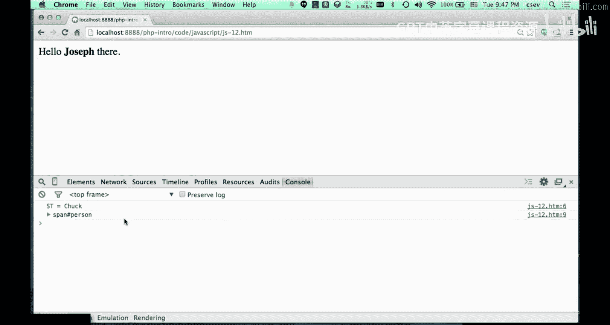
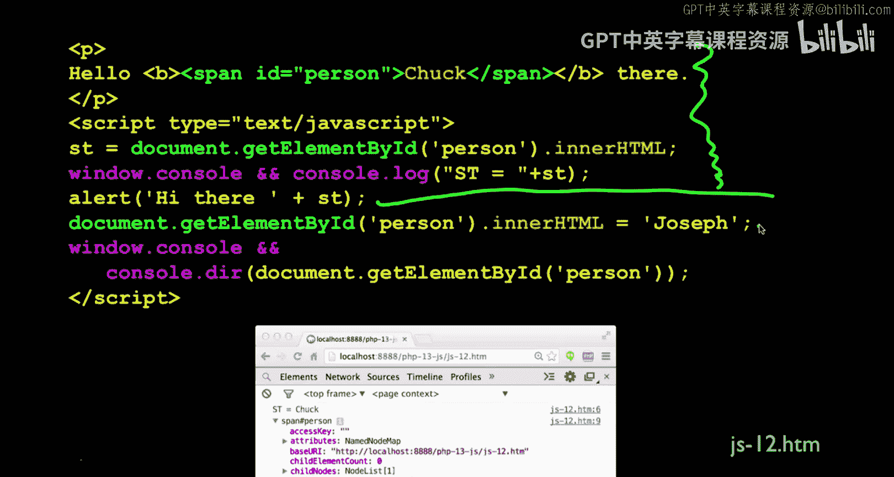
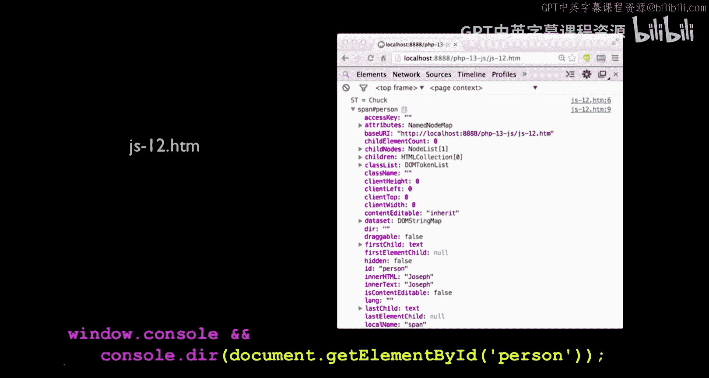
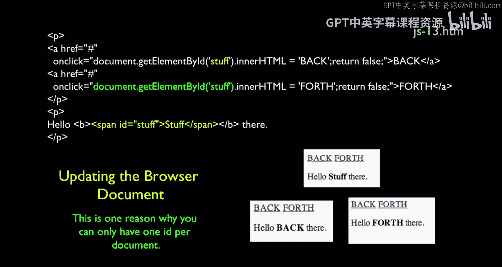
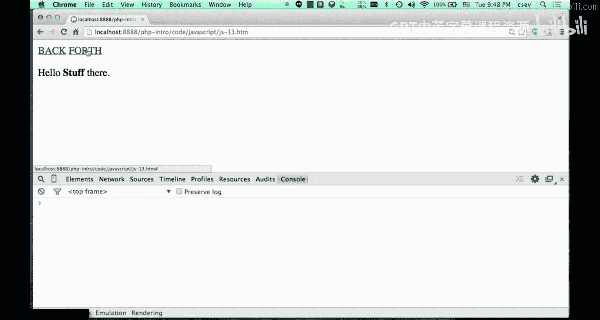
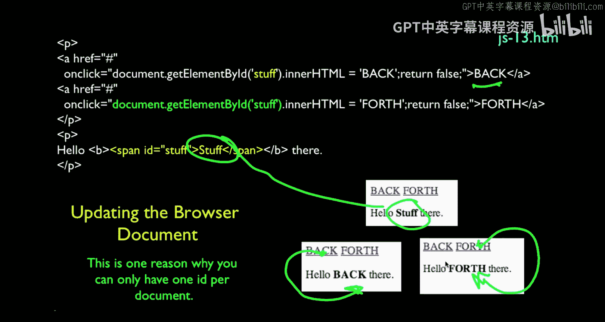
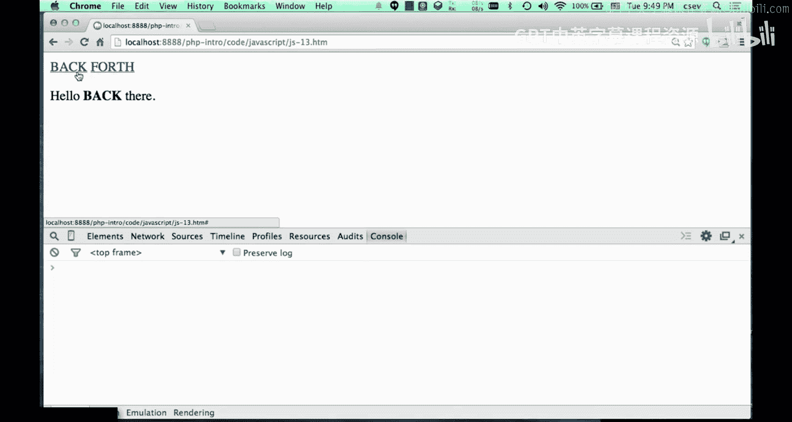

# 116：文档对象模型(DOM)代码详解

在本节课中，我们将学习如何使用JavaScript与网页的文档对象模型（DOM）进行交互。我们将通过具体的代码示例，了解如何查找、读取和修改网页上的元素。

## 概述

文档对象模型（DOM）是HTML文档的结构化表示。JavaScript可以通过DOM来访问和操作网页的内容、结构和样式。本节我们将通过两个示例，学习使用`document.getElementById`方法查找元素，并使用`innerHTML`属性来读取和修改元素的内容。

## 查找与读取DOM元素



上一节我们介绍了DOM的基本概念，本节中我们来看看如何具体地查找并获取一个DOM元素。

假设我们有一个包含以下HTML代码的网页：
```html
<span id="person">Chuck</span>
```
这个字符串“Chuck”被包裹在一个`<span>`标签内，并且该`<span>`标签的ID是“person”。

在JavaScript中，我们使用`document`对象开始一切操作。以下是查找并操作该元素的代码：
```javascript
let st = document.getElementById('person');
```
这段代码的作用是：`document.getElementById`方法会遍历整个页面，找到ID为“person”的那个元素。

这个表达式的结果（存储在变量`st`中）就是指向那个`<span>`标签的一个“句柄”或引用。变量`st`现在是一个指向页面中那一小部分DOM的对象。

我们可以对这个元素进行各种操作。如果我们只想获取这个标签内部的HTML文本内容，我们需要使用`.innerHTML`属性。
```javascript
console.log(st.innerHTML); // 输出: Chuck
```
`st.innerHTML`会“深入”到标签内部，提取出实际的HTML文本内容，也就是该标签的子内容。我们可以打印它，也可以改变它。

## 修改DOM元素内容



我们不仅可以读取DOM元素的内容，还可以动态地修改它。

使用相同的元素句柄，我们可以通过赋值来改变其内容：
```javascript
st.innerHTML = 'Joseph';
```
这是一个赋值语句，它将覆盖文档对象模型中这一部分的内容并改变它。





为了清晰地观察整个过程，我们可以在代码中添加一些`console.log`语句和`alert`弹窗来放慢执行速度。以下是完整的示例代码：
```javascript
let st = document.getElementById('person');
console.log(st.innerHTML); // 在控制台记录原始内容
alert(st.innerHTML); // 用弹窗显示原始内容
console.log(st); // 在控制台记录st对象本身
st.innerHTML = 'Joseph'; // 将内容修改为‘Joseph’
```
当代码执行时，它会先查找ID为“person”的`<span>`，提取其`innerHTML`，并在控制台和弹窗中显示“Chuck”。浏览器此时会因弹窗而暂停。点击弹窗的“OK”后，JavaScript继续执行，将内容改为“Joseph”，浏览器会立即重新渲染DOM以显示新内容。如果没有弹窗，这个变化会发生得非常快，肉眼难以察觉。





## 响应点击事件修改DOM

上一个例子是顺序执行的直线代码。现在，我们来看看如何响应用户的点击操作来动态修改DOM。

以下示例结合了`onclick`事件处理程序。HTML结构如下：
```html
<span id="stuff">stuff</span>
<br>
<a href="#" onclick="document.getElementById('stuff').innerHTML='back'; return false;">back</a>
<br>
<a href="#" onclick="document.getElementById('stuff').innerHTML='forth'; return false;">forth</a>
```
页面上有一个ID为“stuff”的`<span>`，其初始内容是“stuff”。下面有两个链接（`<a>`标签），分别带有`onclick`事件。

以下是每个链接被点击时发生的事：
*   当点击第一个链接（文字为“back”）时，会执行`document.getElementById(‘stuff’).innerHTML=‘back’;`，将`<span>`的内容改为“back”。
*   当点击第二个链接（文字为“forth”）时，会执行`document.getElementById(‘stuff’).innerHTML=‘forth’;`，将`<span>`的内容改为“forth”。
*   `return false;`是为了阻止链接的默认跳转行为。



因此，用户可以通过点击“back”和“forth”链接，让“stuff”这个词在“back”和“forth”之间来回切换。除非刷新页面从服务器重新加载原始HTML，否则内容不会自动变回初始的“stuff”。



## 总结


本节课中我们一起学习了JavaScript操作DOM的核心方法。我们掌握了如何使用`document.getElementById()`根据ID查找元素，以及如何使用`.innerHTML`属性来读取和修改元素内的HTML内容。我们还通过实例看到了如何将这种操作与`onclick`事件结合，实现与用户交互的动态网页效果。这些是构建交互式Web应用的基础技能。