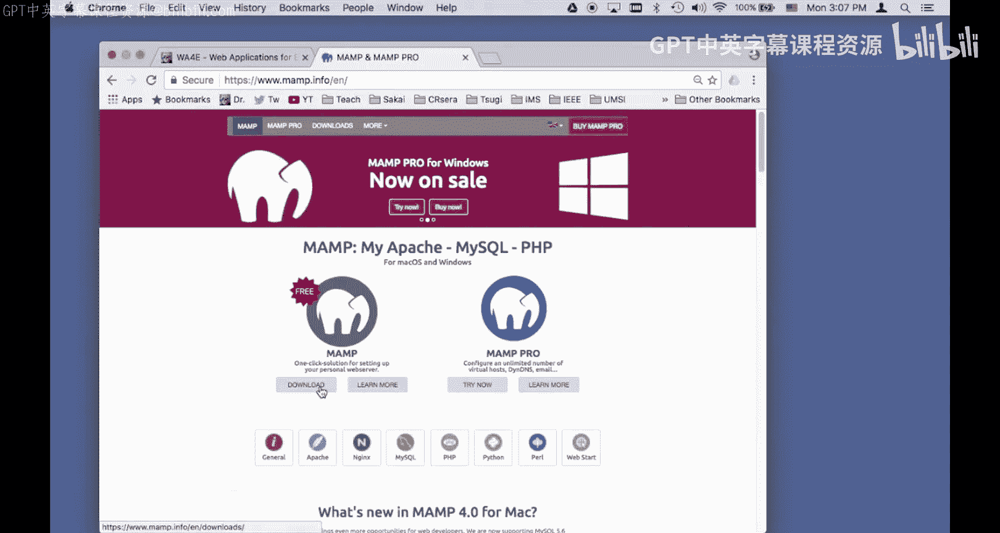
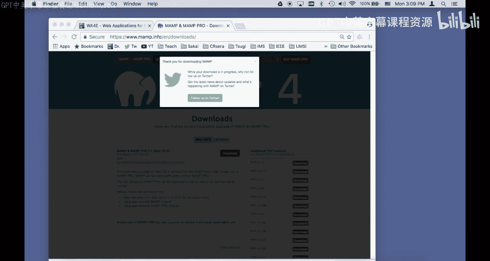
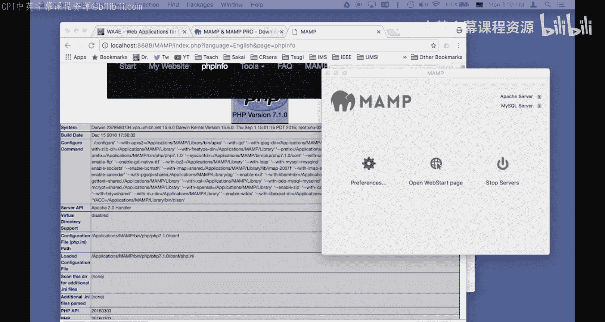
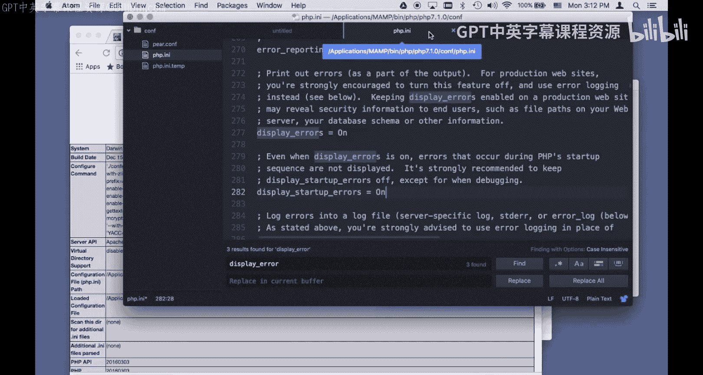
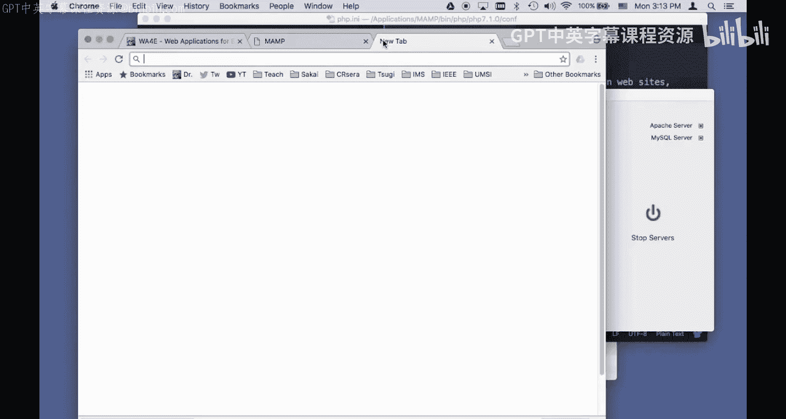
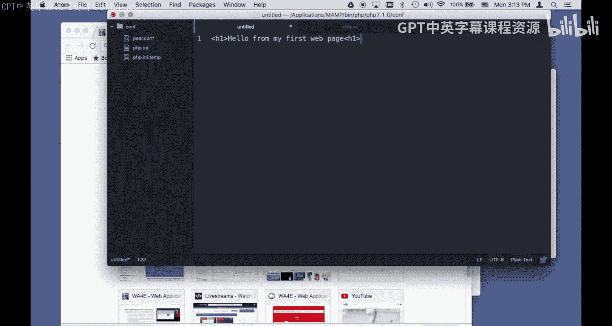
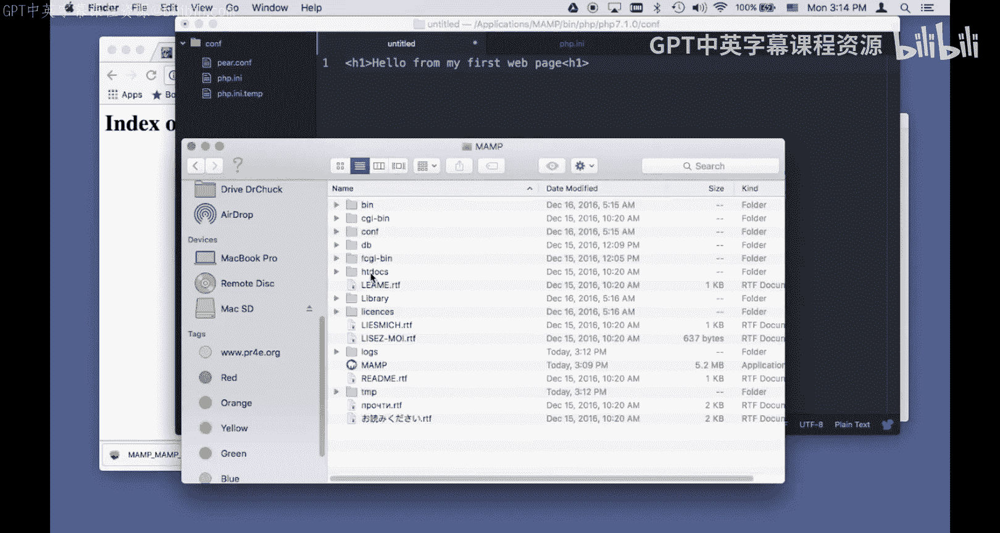
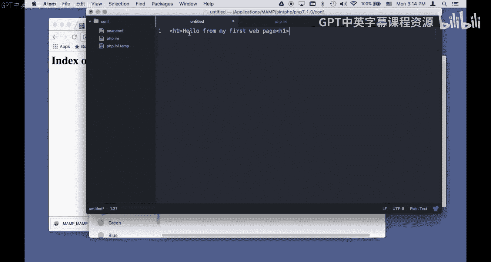
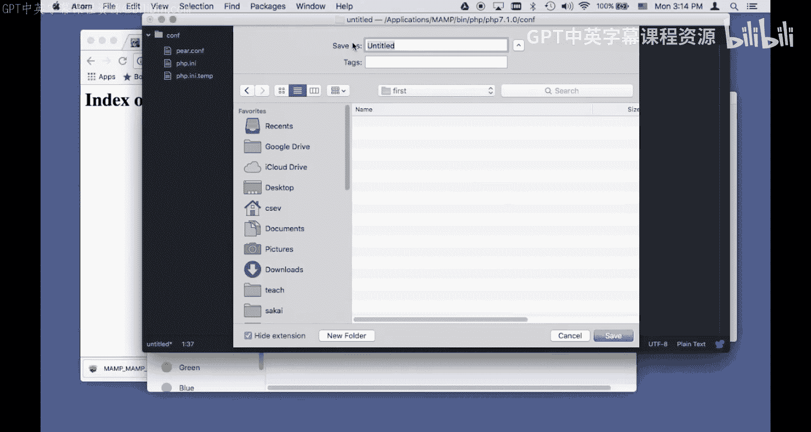
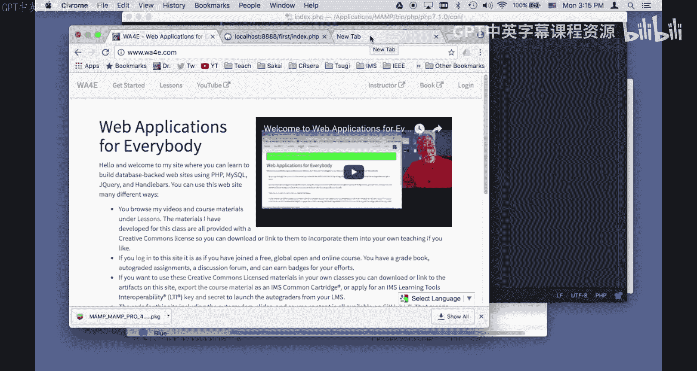

# 118：在Macintosh上安装MAMP 🍎



在本教程中，我们将学习如何在Macintosh电脑上安装和配置MAMP软件。MAMP是一个集成了Apache服务器、MySQL数据库和PHP的本地开发环境，是进行Web应用程序开发的理想工具。我们将完成从下载、安装到基本配置和创建第一个PHP页面的全过程。

## 下载与安装MAMP

首先，我们需要从官方网站下载MAMP的安装程序。

1.  访问 `mamp.info` 网站。
2.  下载适用于Macintosh的MAMP安装包。



下载完成后，进入“下载”文件夹，找到MAMP的安装文件。双击该文件以启动安装程序。

在安装过程中，请接受所有默认设置，并按照屏幕提示完成安装。

## 启动与查看MAMP

安装完成后，我们可以启动MAMP并查看其配置信息。

1.  打开“访达”，进入“应用程序”文件夹。
2.  找到并打开“MAMP”文件夹。
3.  启动“MAMP”应用程序。

启动后，MAMP控制面板会显示系统配置信息，例如PHP版本和配置文件位置。这对于后续的配置调整非常重要。



## 配置PHP以显示错误信息

在开发过程中，我们希望PHP能显示所有错误信息，以便于调试。默认情况下，MAMP可能关闭了此功能。

上一节我们启动了MAMP，本节中我们来看看如何修改PHP配置以开启错误显示。

1.  在MAMP控制面板中，找到PHP配置文件的路径。通常位于：`/应用程序/MAMP/bin/php/php[版本号]/conf/php.ini`。
2.  使用文本编辑器（如TextEdit）打开这个 `php.ini` 文件。
3.  在文件中搜索 `display_errors` 和 `display_startup_errors` 这两个配置项。
4.  将它们的值从 `Off` 修改为 `On`。

**核心配置修改示例：**
```ini
display_errors = On
display_startup_errors = On
```

> **注意：** 此设置仅推荐用于本地开发环境。在生产环境中，应关闭错误显示以防止敏感信息泄露。

修改完成后，保存文件。为了使新配置生效，必须重启MAMP服务器。

1.  在MAMP控制面板中，点击“停止服务器”。
2.  等待服务器完全停止后，再点击“启动服务器”。



服务器重启后，可以通过访问MAMP的“WebStart页面”并查看“PHP信息”来验证配置是否生效。在PHP信息页面中搜索 `display_errors`，确认其状态已变为 `On`。

## 创建并运行第一个PHP页面

现在，我们的开发环境已经配置完成，可以开始编写第一个PHP程序了。



上一节我们配置了PHP环境，本节我们将创建一个简单的PHP文件并通过本地服务器访问它。



首先，我们需要知道网站文件的存放目录。对于MAMP，默认的网站根目录是：
```
/应用程序/MAMP/htdocs/
```

以下是创建第一个PHP页面的步骤：

1.  打开文本编辑器，创建一个新文件。
2.  输入以下简单的PHP代码：
    ```php
    <?php
    echo "Hello from my first web page!";
    ?>
    ```
3.  将文件保存到 `htdocs` 目录下。例如，我们可以在 `htdocs` 中新建一个名为 `first` 的文件夹，然后将文件以 `index.php` 为名保存到该文件夹中。完整路径为：`/应用程序/MAMP/htdocs/first/index.php`





文件保存后，即可通过浏览器访问该页面。

1.  确保MAMP服务器正在运行（控制面板指示灯为绿色）。
2.  打开浏览器，访问地址：`http://localhost:8888/first/`




浏览器将自动寻找并打开 `first` 文件夹下的 `index.php` 文件，页面上会显示“Hello from my first web page!”这句话。

## 总结

在本节课中，我们一起学习了在Macintosh上搭建PHP本地开发环境的完整流程。

我们首先从官网下载并安装了MAMP软件。接着，我们启动了MAMP，并通过修改 `php.ini` 配置文件，开启了 `display_errors` 和 `display_startup_errors` 选项，以确保在开发时能看到所有错误信息。最后，我们在MAMP的网站根目录 `htdocs` 下创建了第一个PHP文件，并通过本地服务器成功运行了它。




现在，你已经拥有了一个功能完备的本地PHP开发环境，可以开始进行Web应用程序的学习和开发了。