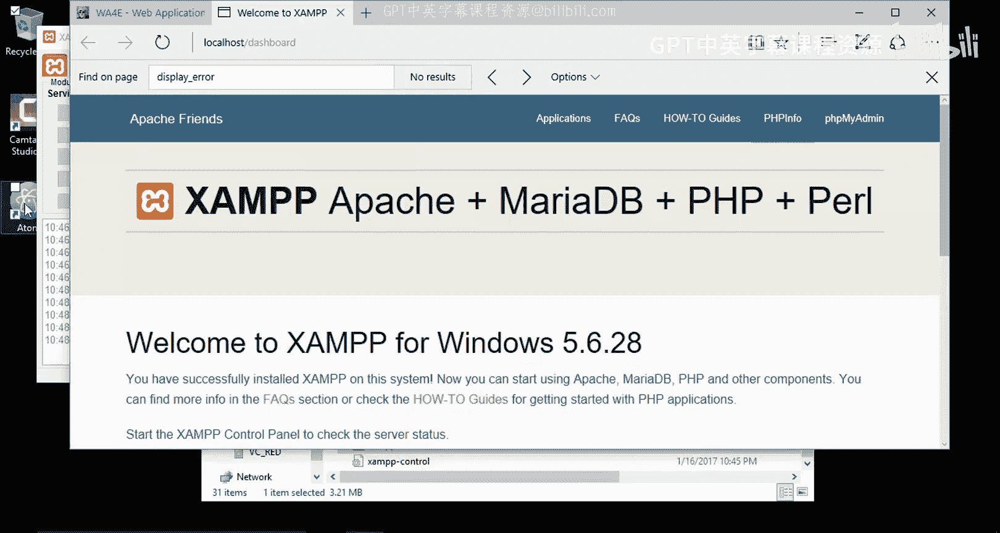
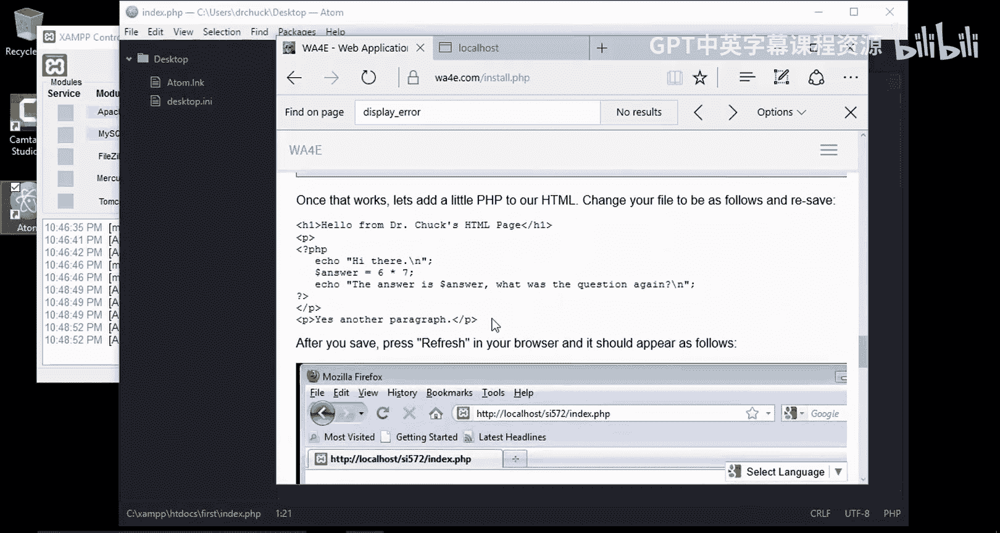

# 120：在Windows 10上安装XAMPP 🖥️


在本节课中，我们将学习如何在Windows 10操作系统上安装XAMPP。XAMPP是一个集成了Apache、MySQL、PHP和Perl的免费开源软件包，是本地Web开发环境的理想选择。我们将从下载安装包开始，完成安装配置，并运行一个简单的PHP程序来验证环境是否搭建成功。


## 下载XAMPP安装程序


首先，我们需要从Apache Friends官方网站下载适用于Windows的XAMPP安装程序。

以下是下载步骤：
1.  访问Apache Friends网站。
2.  找到适用于Windows的XAMPP版本。
3.  点击下载链接，开始下载安装程序。

下载完成后，安装程序通常位于系统的“下载”文件夹中。

## 运行安装程序

上一节我们下载了安装程序，本节中我们来看看如何运行并安装它。

运行下载好的安装程序，按照向导提示进行安装。建议将XAMPP安装在默认路径（通常是 `C:\xampp`），以避免潜在的权限问题。在组件选择界面，可以根据需要取消勾选不需要的组件，例如Tomcat、Perl或Fake Sendmail，以简化安装。

安装过程可能需要一些时间，请耐心等待。

## 启动XAMPP控制面板

安装完成后，我们不会立即启动控制面板。首先，我们需要知道它的位置。通常，XAMPP被安装在 `C:\xampp` 目录下。在该目录中，可以找到 `xampp-control.exe` 文件，这就是控制面板。

启动控制面板时，可能会提示选择语言。首次启动时，如果系统弹出任何安全对话框，请务必选择“允许”或“是”，以确保软件能正常运行。

## 启动Apache和MySQL服务

现在，我们通过控制面板来启动Web开发所需的核心服务：Apache（Web服务器）和MySQL（数据库服务器）。

在XAMPP控制面板中，找到Apache和MySQL对应的行，分别点击“Start”按钮。启动成功后，按钮旁边的状态指示灯会变为绿色。如果启动过程中出现任何红色错误提示，请根据提示信息排查问题。

为了便于日后访问，建议将XAMPP控制面板固定到任务栏。

## 验证安装与配置PHP

当Apache和MySQL服务都成功运行后，我们可以在浏览器中访问 `http://localhost` 来打开XAMPP的仪表盘。这证明本地Web服务器已正常工作。



接下来，我们需要确保PHP的配置适合开发。一个关键的设置是 `display_errors` 变量，它控制是否在页面上显示PHP错误信息。在开发阶段，应将其设置为开启（On），以便于调试；在生产环境则应关闭（Off）。


以下是检查与修改 `display_errors` 设置的步骤：
1.  在XAMPP控制面板中，点击Apache一行的“Config”按钮，选择“PHP (php.ini)”。
2.  在打开的配置文件中，使用 `Ctrl+F` 搜索 `display_errors`。
3.  确认其值是否为 `On`。如果需要修改，将其改为 `On` 并保存文件。
4.  保存后，需要在控制面板中重启Apache服务以使更改生效。


修改完成后，可以再次访问 `http://localhost` 并点击“PHPInfo”页面，搜索 `display_errors` 来确认设置已生效。

## 创建并运行第一个PHP程序


环境配置妥当后，我们来创建一个简单的PHP程序进行测试。首先，需要使用一个文本编辑器（如VS Code、Sublime Text或Notepad++）编写代码。



所有需要通过本地服务器访问的网页文件，都必须放在XAMPP的 `htdocs` 目录下（例如 `C:\xampp\htdocs`）。

以下是创建和测试程序的步骤：
1.  在 `htdocs` 目录下创建一个新文件夹，例如命名为 `first`。
2.  在文本编辑器中新建文件，输入以下混合了HTML和PHP的代码：
    ```php
    <!DOCTYPE html>
    <html>
    <head>
        <title>My First PHP Page</title>
    </head>
    <body>
        <h1>Hello World from HTML</h1>
        <?php
            echo "<p>Hello World from PHP.</p>";
            $sum = 6 + 4;
            echo "<p>The sum of 6 and 4 is: " . $sum . "</p>";
        ?>
    </body>
    </html>
    ```
3.  将这个文件保存到 `first` 文件夹中，并命名为 `index.php`（完整路径如 `C:\xampp\htdocs\first\index.php`）。
4.  打开浏览器，访问地址 `http://localhost/first/index.php`。
5.  如果页面成功显示，并且包含了由PHP计算输出的结果，则说明你的XAMPP开发环境已经完全搭建成功。


---


本节课中我们一起学习了在Windows 10上安装和配置XAMPP开发环境的完整流程。我们从下载安装包开始，完成了安装、启动核心服务（Apache和MySQL）、验证安装并配置了关键的PHP设置，最后通过创建并运行一个简单的PHP程序，确认了整个环境工作正常。现在，你已经拥有了一个本地的Web服务器环境，可以开始进行PHP编程和数据库操作了。