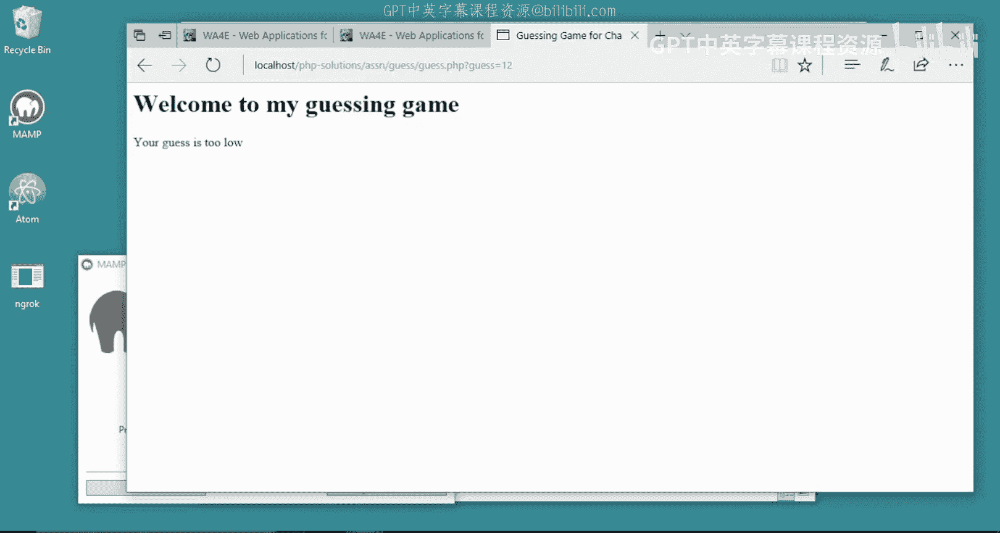
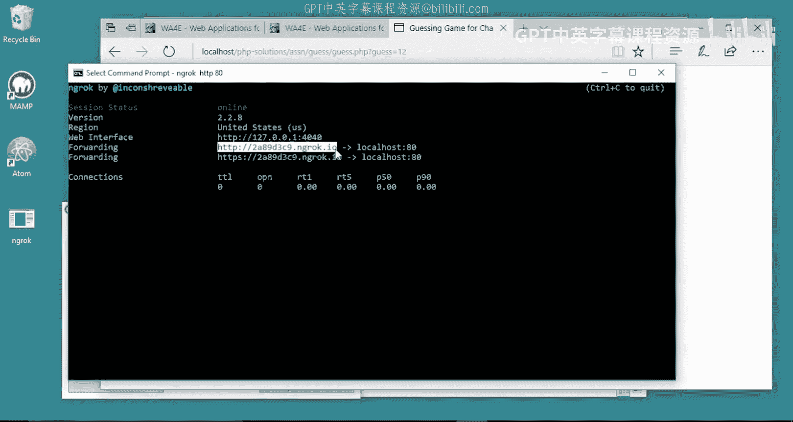
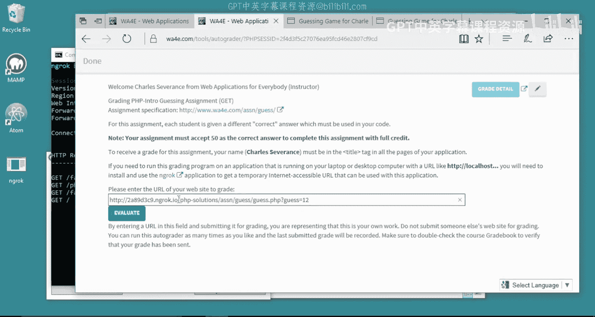
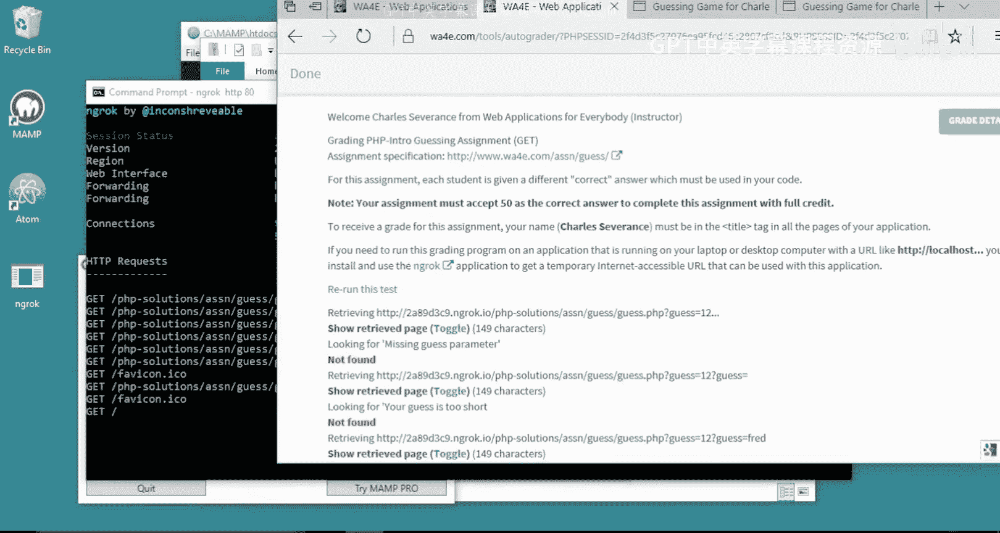
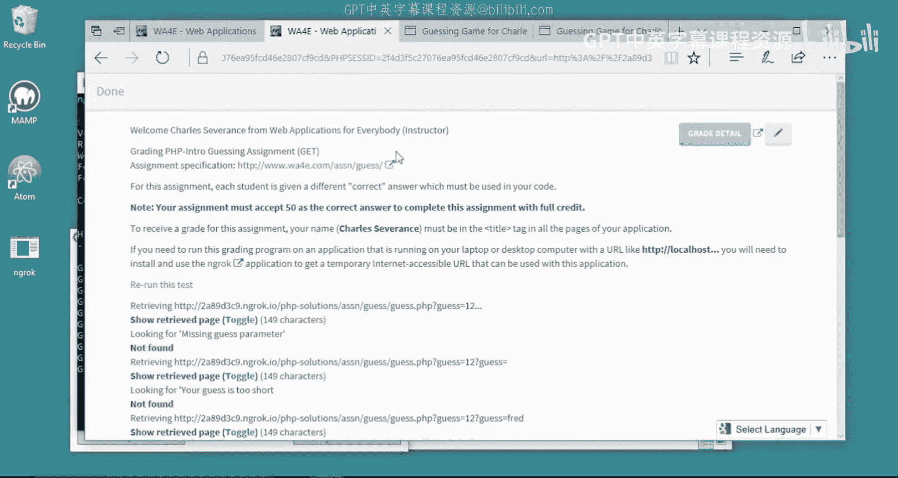
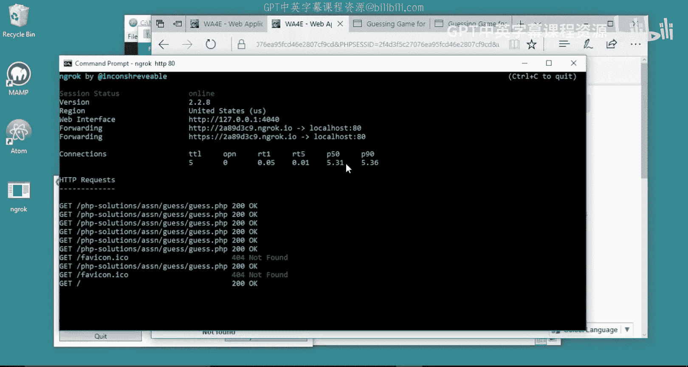
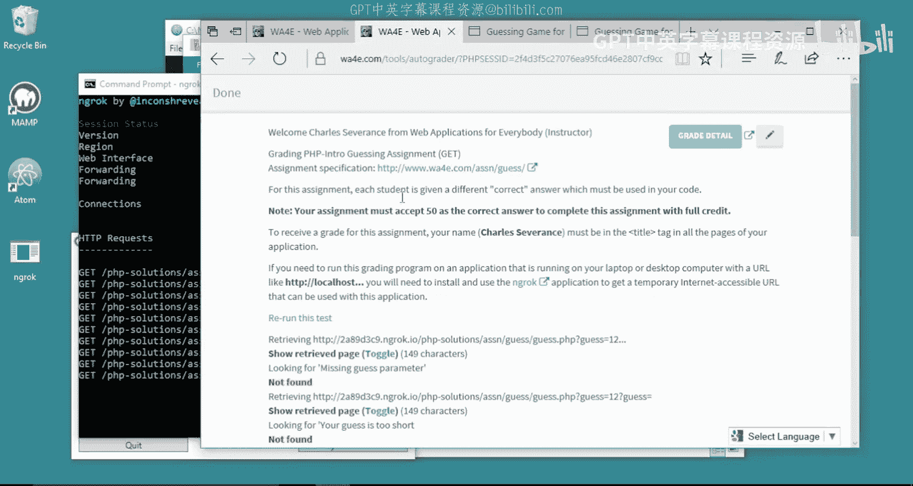
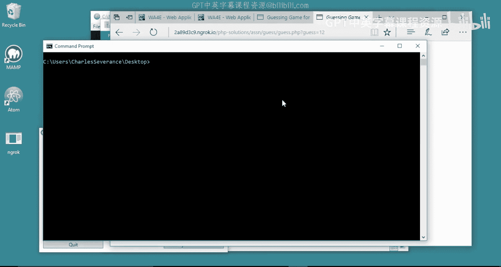

# 121：在Windows系统中使用Ngrok连接自动评分器 🖥️➡️🌐

在本节课中，我们将学习如何使用Ngrok工具，将运行在你本地计算机上的Web应用程序临时暴露到公网上，以便完成需要与自动评分器交互的作业。

## 概述

当你完成一个Web应用程序作业后，代码通常运行在你的本地计算机上，地址类似于 `localhost`。然而，自动评分器位于互联网上，无法直接访问你本地的 `localhost` 地址。这就像你的电脑有一道防火墙，阻止了外部世界的访问。为了解决这个问题，我们需要使用Ngrok。Ngrok能为你本地运行的服务创建一个临时的、可公开访问的网址，让自动评分器能够与你的代码进行通信。

## 下载与安装Ngrok

首先，我们需要在电脑上安装Ngrok软件。

1.  访问Ngrok官方网站（ngrok.com）。
2.  注册一个免费账户并下载适用于Windows系统的版本。
3.  下载完成后，打开安装文件。为了方便在命令行中使用，建议将Ngrok的可执行文件放在一个易于访问的位置，例如桌面。

## 启动本地服务器并运行Ngrok



假设你的Web应用程序已经在本地运行，并监听80端口（Web服务器的默认端口）。

以下是启动Ngrok并创建隧道的关键步骤：



1.  打开命令提示符（CMD）。
2.  使用 `cd` 命令切换到存放 `ngrok.exe` 文件的目录。例如，如果放在桌面，可以输入：
    ```bash
    cd %USERPROFILE%\Desktop
    ```
3.  输入以下命令启动Ngrok，将本地80端口的服务暴露到公网：
    ```bash
    ngrok http 80
    ```
4.  命令执行后，Ngrok会启动并在命令行中显示一个控制台界面。其中最重要的信息是 **Forwarding** 后的网址，例如 `https://a1b2c3d4.ngrok.io`。这个就是你的本地应用临时的公网地址。

## 在自动评分器中使用临时地址



现在，你拥有了一个可以公开访问的地址。





1.  复制Ngrok生成的Forwarding地址（例如 `https://a1b2c3d4.ngrok.io`）。
2.  打开你的浏览器，访问这个地址，你应该能看到和本地 `localhost` 完全一样的应用程序页面。
3.  如果你的应用有特定路径（例如 `guessinggame.php?guess=12`），你需要将这个完整路径拼接到Ngrok地址后面。例如：
    ```
    https://a1b2c3d4.ngrok.io/guessinggame.php?guess=12
    ```
4.  最后，将这个完整的、可公开访问的URL提交到课程自动评分器的相应输入框中。自动评分器现在就能通过这个临时地址访问并测试你本地运行的代码了。你可以在Ngrok的命令行窗口中看到评分器与你的应用之间所有的请求和响应记录。

## 任务完成后的操作



作业提交并评分完成后，为了安全起见，你应该关闭这个临时的公网通道。

1.  回到运行Ngrok的命令行窗口。
2.  按下 `Ctrl + C` 组合键，即可停止Ngrok服务。
3.  服务停止后，之前生成的临时地址立即失效，外部无法再访问你的本地应用。

**请注意**：每次运行 `ngrok http 80` 命令，系统都会生成一个全新的随机地址。因此，每次提交作业前，都需要获取并使用最新的地址。



## 总结




本节课我们一起学习了如何使用Ngrok工具解决开发中的常见问题：让运行在本地环境（`localhost`）的Web应用程序能够被互联网上的服务（如自动评分器）临时访问。关键步骤包括下载Ngrok、通过命令行建立隧道获取公网地址，以及将包含完整路径的该地址提交给评分系统。记住，使用完毕后务必断开Ngrok连接以保障本地计算机的安全。