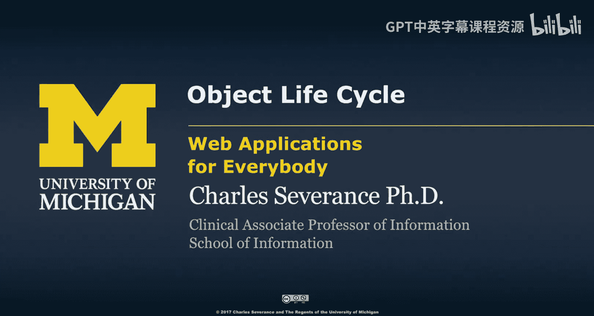
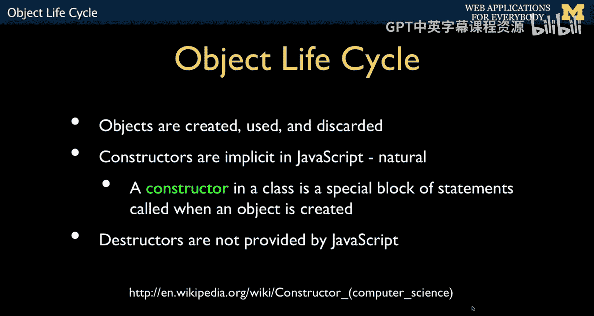
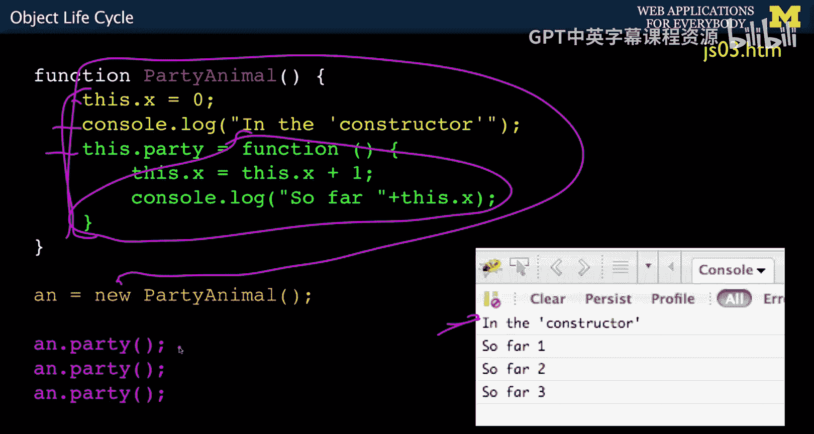
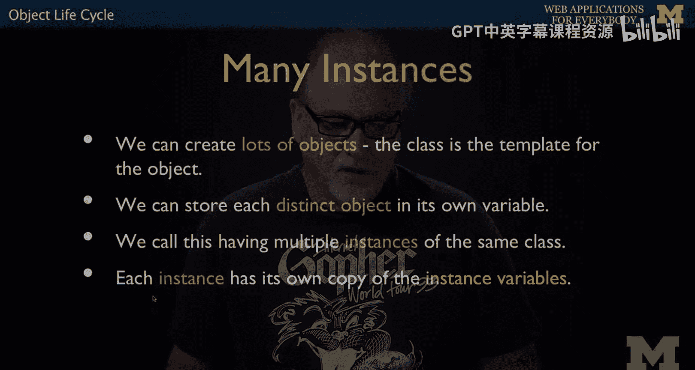
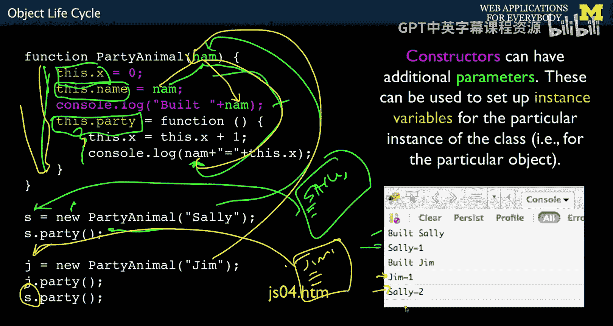
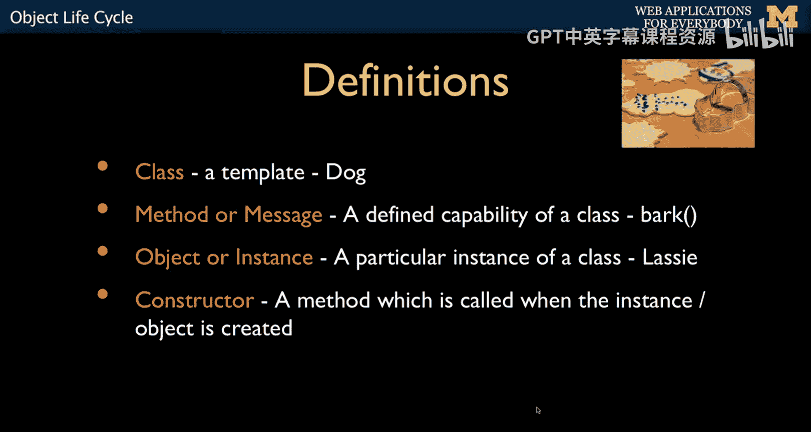

# 127：JavaScript对象生命周期 🧬




在本节课中，我们将要学习JavaScript中对象的生命周期，包括如何创建、使用以及理解其构造和销毁过程。我们将重点探讨构造函数的概念、实例的创建，以及JavaScript对象模型的独特之处。


---



## 构造函数与对象创建

上一节我们介绍了对象的工作原理和创建方式。本节中，我们来看看对象生命周期中的第一个关键环节：构造函数。


构造函数是在从类创建对象的瞬间运行的代码。在JavaScript中，构造函数是隐式的，因为它利用了“一等函数”的本质。构造函数就是定义类形态的所有代码。

```javascript
function Person(name) {
    console.log('Built ' + name);
    this.x = 0;
    this.name = name;
    this.party = function() {
        this.x = this.x + 1;
        console.log(this.x + ' ' + this.name);
    };
}
```

当使用 `new` 关键字时，构造函数中的代码（如 `console.log` 和属性赋值）会运行。但像 `this.party` 这样的函数定义代码会被记住并赋值给该属性，而不会立即执行。

---



## 创建多个实例


以下是创建多个对象实例的步骤说明。



我们可以从一个类创建多个实例或对象。类本身就像一个“饼干模具”，我们可以用它“盖章”多次，得到多个独立的对象。每个对象都拥有自己的一份实例变量副本。

```javascript
// 创建第一个实例，传入参数“Sally”
let s = new Person('Sally');
s.party(); // 输出：1 Sally

// 创建第二个实例，传入参数“Jim”
let j = new Person('Jim');
j.party(); // 输出：1 Jim

// 再次调用第一个实例的方法
s.party(); // 输出：2 Sally
```

在这个例子中：
1.  我们通过 `new Person('Sally')` 调用构造函数，创建了第一个对象。参数 `'Sally'` 被传递给构造函数，并赋值给实例变量 `this.name`。
2.  方法 `this.party` 被创建，其内部代码引用了 `this.name`。对于 `s` 实例，这个 `name` 是“Sally”。
3.  我们再次调用构造函数 `new Person('Jim')`，创建了第二个完全独立的对象 `j`，其 `name` 是“Jim”。
4.  当我们调用 `s.party()` 和 `j.party()` 时，它们分别操作各自对象内部的 `x` 变量，互不干扰。

这就是面向对象编程的魅力：创建一个模板（类），然后生成多个独立运作的对象。

---

## 对象生命周期总结

到目前为止，我们讨论了如何制作一个包含方法（或消息）和属性的类模板。构造函数是我们进行所有初始化设置的地方，而对象或实例则是我们从构造函数中得到的结果。

关于析构函数（对象销毁时运行的代码），需要说明的是：JavaScript没有显式的析构器。这是因为JavaScript的一切都是动态的，对象的销毁时机不如Java或C++等语言中那样可预测。在PHP中，由于请求-响应周期的特性，析构函数的行为相对更可预测一些。在对象生命周期中，构造函数最为重要，析构函数处于次要地位。

---



## JavaScript对象的独特之处


本节内容较为简短，因为大家可能已经对面向对象有基本了解。我们真正想强调的是JavaScript特有的“秘密武器”。



JavaScript对象是**动态可扩展**的。你可能会注意到，当我们写 `this.x = 0` 时，我们并没有提前声明这个属性。实际上，可执行代码在运行时创建了新的属性。同样，在运行时你也可以创建新的方法。

这些对象非常强大。回想一下数组，我们甚至可以在不知不觉中使用JavaScript对象。例如，使用花括号 `{ key: value, key: value }` 可以创建一个没有方法、只有一组属性的对象。因此，我们有时将JavaScript对象视为关联数组（或字典）的等价物。

---

## 课程总结


本节课中我们一起学习了JavaScript对象的生命周期。我们理解了**构造函数**是如何在对象创建时隐式运行的代码，并学会了如何通过一个类模板创建多个独立的**实例**。每个实例都拥有自己的属性和方法副本。我们还了解到JavaScript对象具有动态可扩展的特性，这与许多其他语言不同。接下来，我们将探讨jQuery，这可能是我们在编写JavaScript代码时使用到的最强大的对象库。