# 129：jQuery基础 🧩

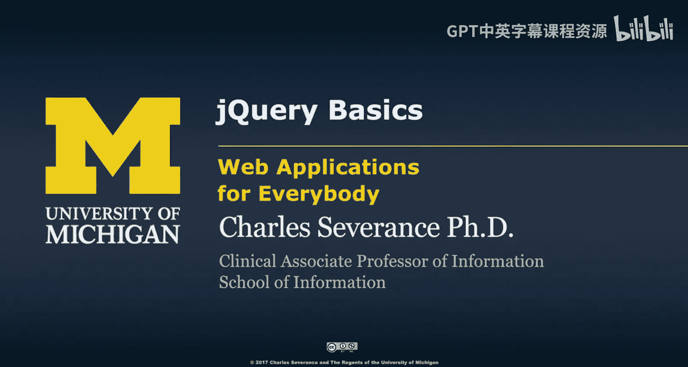

在本节课中，我们将要学习jQuery的基础知识。jQuery是一个强大的JavaScript库，它极大地简化了在浏览器中操作文档对象模型（DOM）、处理事件以及与服务器交互的过程。通过本教程，你将理解jQuery的核心概念、基本语法以及它如何让Web开发变得更加简单高效。

## 概述

我们已经学习了JavaScript，了解了文档对象模型（DOM），也认识到DOM本身存在一些缺陷。我们还学习了JavaScript的面向对象编程。所有这些知识在一定程度上都是为了让我们能够使用jQuery，因为jQuery让我们的工作变得非常简单。

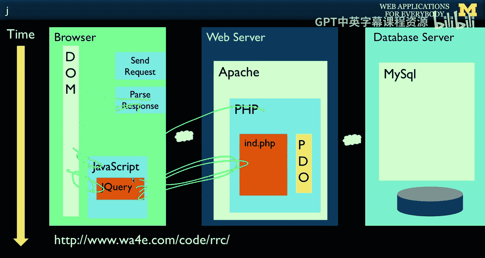

在Web应用的整体架构中，我们获取HTML，解析响应，一部分内容进入DOM，另一部分实际上是JavaScript。JavaScript与DOM进行交互。jQuery是一个客户端库，它让JavaScript的使用变得更加容易。我们使用jQuery所做的一切，无论是操作DOM还是最终与服务器进行通信，都变得更加简单。你无需担心浏览器的兼容性等问题。

jQuery让我们能够完成那些原本需要复杂方式才能实现的事情。虽然我们可以用困难的方式去做，但现在没有人再愿意那样做了，所以大家都使用jQuery。

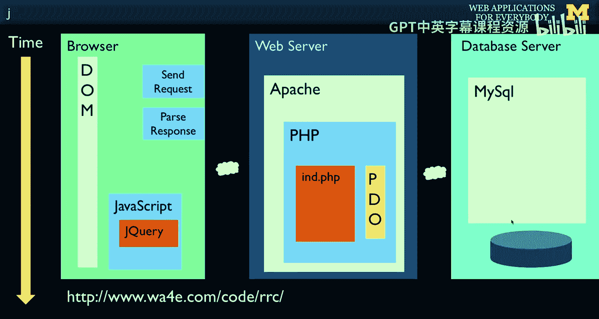

## jQuery的定位与趋势

目前，我们的重点正朝着浏览器端转移。在接下来的课程中，甚至在其他课程中，趋势将更多地聚焦于这个方向。我们将在浏览器中做越来越多酷炫的事情，而在服务器端做的事情会越来越少。

我们最初是从在服务器端做所有事情开始的。当然，我们仍然需要处理数据库，但总体上我们正朝着浏览器端移动。Web应用普遍在浏览器中实现越来越多的交互性，因为这能提供更好的用户体验。

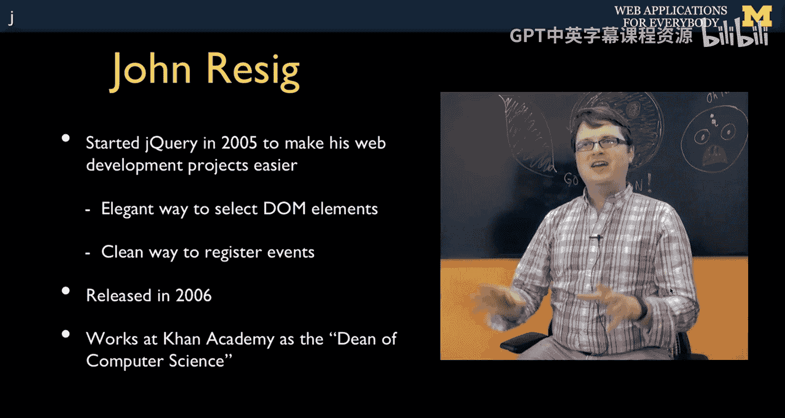

你可以争论是否所有事情都应该在浏览器中完成，但毫无疑问，很多功能正变得在浏览器中交互，因为它非常动态，并且工作起来更像桌面应用程序。

## jQuery的诞生与理念

现在，或者如果你还没有，请观看John Resig的视频访谈。我提供这些访谈是因为我希望你理解创造jQuery背后的理念。是的，jQuery是一段代码，但它也是John Resig个性的表达。John Resig是一位非常聪明的计算机科学家。

在2005年，他厌倦了使用JavaScript构建交互式Web应用，也厌倦了处理非可移植性的代码。同时，他也看到了JavaScript本身的优雅之处，以及JavaScript面向对象模式的工作原理。他认为JavaScript并不是一门糟糕的语言，实际上它是一门令人印象深刻的语言。

作为一名年轻的本科生计算机科学家，他认为这是一个可以进行体面工作的、整洁的计算机科学领域。JavaScript不再仅仅被认为是做一些弹出窗口、滚动等烦人事情的“垃圾”语言。在2005、2006、2007年这段时间，JavaScript在浏览器中逐渐成熟，成为一个有才华的计算机科学家愿意工作的体面领域。

如今，十年过去了，我们看到像Angular和React这样的东西，JavaScript真正成为了焦点，并且通过Node.js等技术，JavaScript也正在接管服务器端。

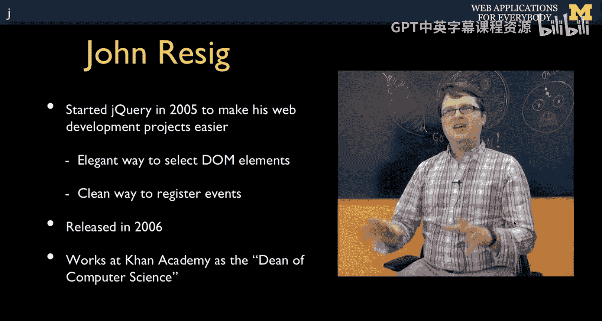

## jQuery解决的核心问题

John Resig思考的是：我们在浏览器中经常需要做哪些事情？一是需要在DOM中找到东西并对其进行操作，比如改变颜色、隐藏或显示等。另一件事是处理事件，也就是我们目前看到的如`onclick`或`onchange`之类的事件。

像点击这样简单的事情工作得很好，但像“知道文档何时完全加载”以及“所有图像何时完成加载”这样的事情，结果在每个浏览器中都非常不同。因此，jQuery也对此进行了标准化，确保你知道文档何时加载到足以运行JavaScript来开始操作DOM。你希望DOM是完整的，不希望JavaScript去寻找那些尚未完全存在的东西。

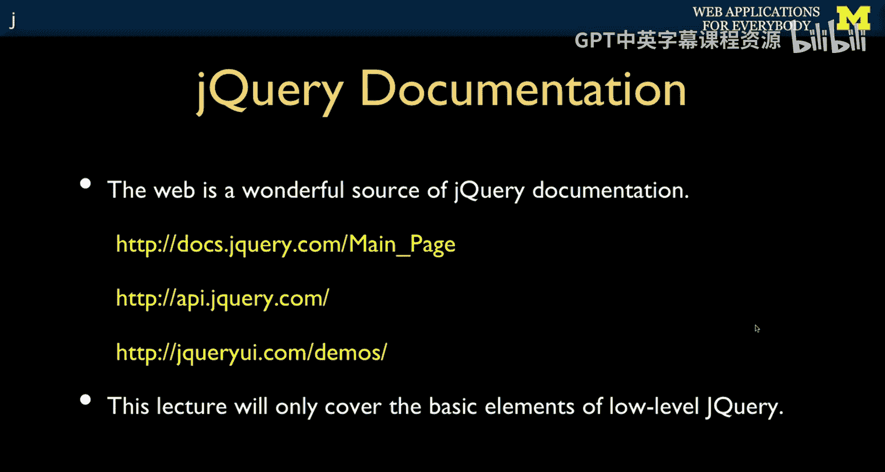

jQuery于2006年发布，大约是JavaScript创建10年后。John目前（指课程录制时）在可汗学院工作，他和我一样，是让每个人学习编程的大力支持者，也支持将编程教学下放到高中阶段。他是一位很棒的人，他的访谈很有趣，我鼓励你去看看。

## jQuery的成功因素

本节课不会详细列出jQuery的所有功能和细节。John谈到，在2005、2006年，jQuery还有其他竞争对手，比如Prototype和MooTools，它们就像不同的“宗教”，而jQuery只是其中之一。但jQuery在很短的时间内就胜出了。

John认为，并且我也同意，jQuery在05、06年获胜的原因是它拥有更好的文档。他花了很多时间来记录他所做的工作，不仅仅是编写出色的代码并让自己能够使用它，更是为了让其他人也能使用它。

实际上，你会说类似这样的话：“如何使用jQuery让图像从左到右滑动出现？”你输入这个问题，然后就会在Stack Overflow或jQuery页面上找到答案。jQuery的文档非常出色，既全面，又提供了几乎可以满足你需求的、只有几行代码的小片段。

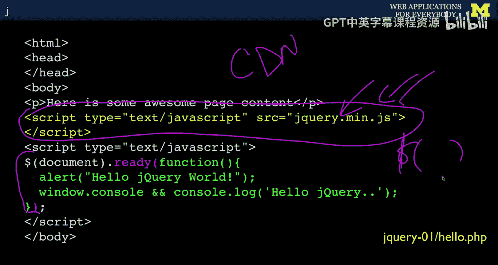

你只需将问题输入搜索引擎，然后去Stack Overflow或jQuery官网，复制粘贴五行代码，放到你的项目中，它就开始工作了。然后你修改其中的两行，就能完全实现你想要的效果。因此，我在这节课中真的只打算讨论jQuery所做的最基本的事情，因为你知道可以自己查找其他内容。

## 加载jQuery库

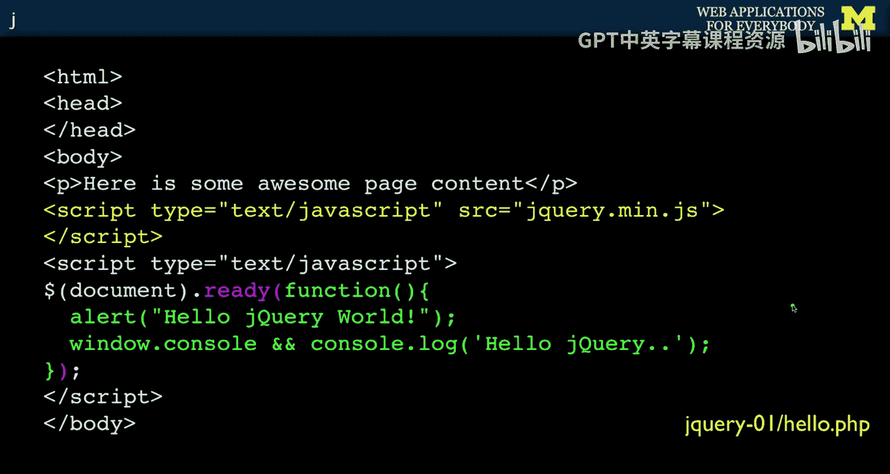

以下是第一个jQuery示例。我们需要做的第一件事是加载jQuery库。

这只是一个文件。你需要把这个文件放在某个地方。实际上，你可以从互联网上加载它。谷歌托管了它的副本。有一些叫做CDN（内容分发网络）的东西，它们提供无限、超快的带宽。所以，如果你不想从自己的服务器加载，你甚至不必这样做。

如果你查看jQuery文档，他们会提供几种将jQuery引入你的应用程序的版本，并且有不同的jQuery版本和插件。但现在，我们只是从一个文件中的jQuery副本开始。我们直接把它放在文件里。所以，文件中有一个jQuery版本。我们只需加载它。

包含像这样的东西，它可能不应该产生任何输出。它只是定义函数、函数、函数，或者可能创建一些类，但没有对象，也没有输出。这就是它的作用：它只是定义jQuery。

## jQuery的核心：$ 对象

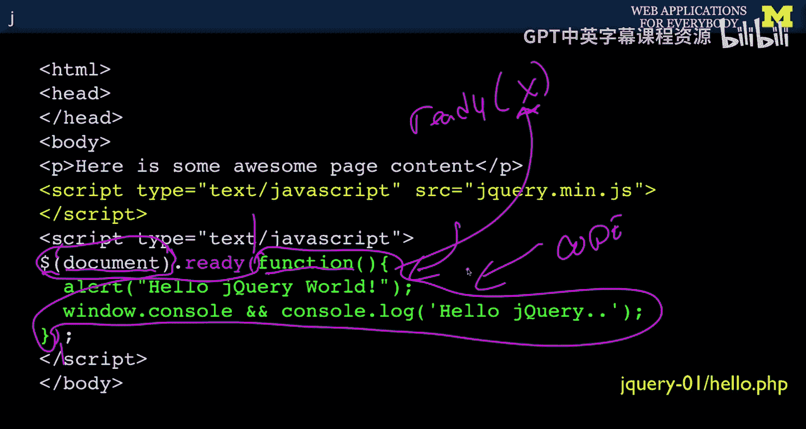

jQuery最有趣的一点是，它做的最重要的事情是定义一个名为**美元符号（`$`）**的全局对象。

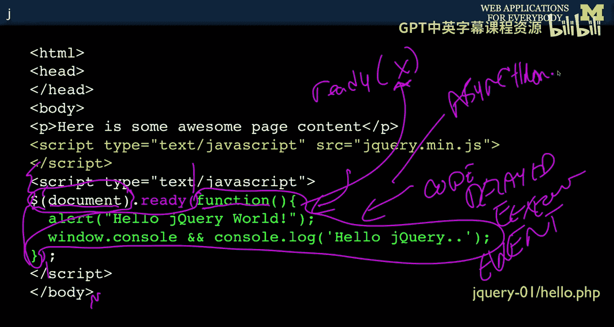

当你查看jQuery并看它的代码时，你会看到这种`$(...)`的写法。大多数人看到这个会说：“哦，这就像是JavaScript的一种魔法。”但事实并非如此。

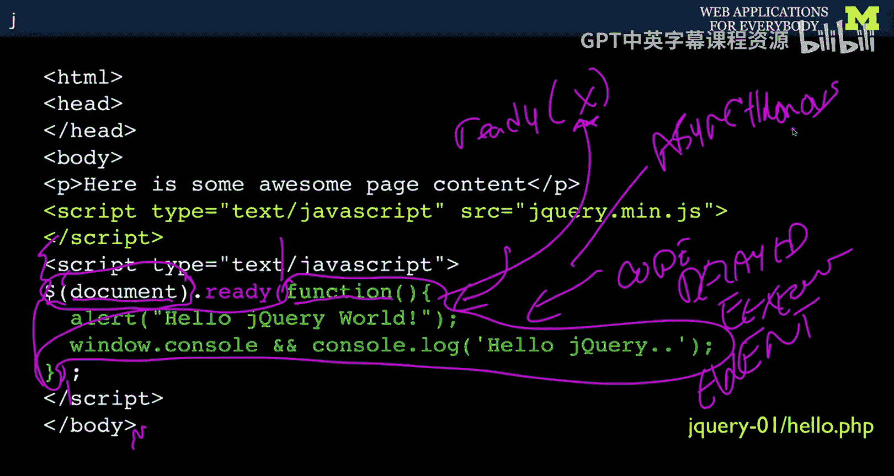

它实际上是一个名为`$`的函数/对象。如果你回溯到JavaScript的基础，你会说变量名可以是字母，可以以大写或小写字母、下划线或美元符号开头。我之前说过，美元符号有点俗气，因为它让我们想起Perl和Bash等其他脚本语言。

在JavaScript的头十年里，没有人使用任何带美元符号的东西。然后John Resig出现了，他想：“我应该给我的对象起什么名字呢？哇，没人用美元符号。”结果大约在那时，人们开始意识到这一点，并且还有其他一些东西也开始使用美元符号。

但`$`被使用了，所以它看起来像语言语法，但实际上不是，它只是一个对象的名称。现在我们用括号调用那个对象，并传入一个参数。这帮助我们理解。

我必须承认，当我第一次看jQuery时，我觉得它就像一堆花括号、分号和括号，就像有人扔了一堆标点符号，发生了一场车祸，一盒标点符号撒得到处都是，然后你把它捡起来。这就是jQuery看起来的样子。但当你编写这些东西时，你必须让它工作，所以让我们快速理解这里发生了什么。

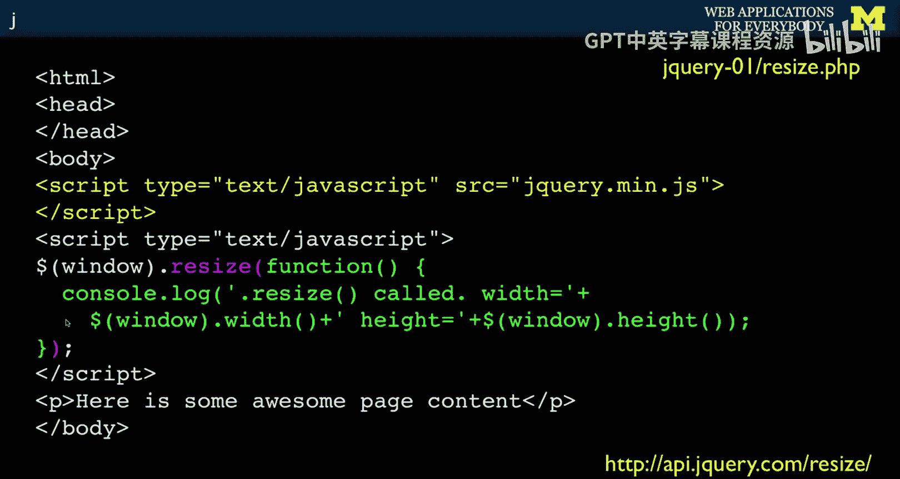

## 理解 `$(document).ready()`

`$`是一个对象的名称。我们用一个参数调用这个对象。
这个参数是`document`。`document`是JavaScript的概念，是文档对象模型，在所有在浏览器中运行的JavaScript中预定义。所以，传入`document`。这是浏览器中已经存在的预定义对象之一。

我们这样做会返回代码。记住，函数是一等公民。
我们将在那个调用中调用`ready`方法。
从`function(){`到`}`是`ready`方法。
`ready`方法有一个参数，我们称之为`ready`。我们可以叫它`x`，但我们不这么叫。
我们仍然传递一个参数，但我们传递的是**代码**。因为在JavaScript中，由于函数是一等公民，可以传递代码。
所以，`function(){ ... }`这部分实际上是一个常量？它被传递给了`ready`。
我们应该传递给`ready`的是我们想要执行的代码。
所以这是**延迟执行**。这段代码直到jQuery确定文档完全加载并准备好被查看时才会执行。
因此，它会在且仅会在那时调用我们的代码。这是在注册一个事件。
事件是“当文档准备就绪时”。

所以我们注册事件，然后我们必须放入要运行的代码。我们传递代码。
在这一点上，当代码运行时，jQuery只是保留这段代码并记住它。
它稍后运行，在`<body>`完成且其他东西加载完毕之后的某个时间。然后它运行我们的代码。
所以这是**延迟执行**。这是一个**事件**。
这是另一种说法，延迟执行、事件，它也是**异步的**。
你无法确切知道代码何时运行。
jQuery知道你的代码应该运行的时刻。
你已经交给了它你想要在此事件发生时运行的代码。
这是一等公民函数。如果你理解了它，它绝对是美妙的。
你可以看到为什么像Resig这样早期构建jQuery的人会说：“哦，等等，这是一门美妙的语言。”一等公民函数使这与您体验过的任何其他编程语言都不同。就像我之前说的，Smalltalk、Lisp和其他语言也有这个概念，但JavaScript是第一个让一等公民函数如此直接可用的语言。

## 基本语法模式

现在，让我解释一下这是做什么的。这就是语法。
但过一段时间，你会进行复制粘贴。你会说：“哦，复制粘贴，复制粘贴。”你会停止思考它。你只会考虑这里的这部分代码。
所以在某种程度上，这变成了我们一遍又一遍重复的神奇惯用语。
我们加载jQuery库。
`$(document).ready(function(){ ... });`这一行就像一个惯用语，表示“当文档准备就绪时，运行这段代码”。这也是一个完成语句的惯用语，包括分号等。
我们告诉jQuery的是：在`<body>`完成且其他事情结束后，来运行我们的代码。这就是我们的要求。
当它发生时，我们将运行一个`alert`，我们将执行一个`console.log`，这样我们可以看到发生了什么。如果你运行这个，你会看到它发生。

## 处理窗口调整大小事件

下一个概念，jQuery做的两件事之一是设置事件。我们看到的第一个是设置一个事件。
在这个例子中，我们将要求每当窗口调整大小时被调用。
同样，我们加载jQuery库，但这次我们传递`window`。

让我试着画一下这个图。`window`是你看到的部分，而文档对象模型（DOM）是所有内容。如果你有滚动条，窗口只看到DOM的一部分。你向上或向下滚动，可能看到这部分，可能看到下面的那部分。所以，并非所有DOM在任何给定时间都显示在窗口中。
`window`是你可以看到的部分。DOM是所有网页内容。
DOM的一部分显示在窗口中，但它不是窗口本身。所以DOM没有宽度和高度，因为窗口是你正在看的东西。DOM是整个背后的网页。
DOM的一部分正显示在窗口中，但它不是那个东西。所以文档没有宽度或高度。因此，你必须说：“嘿，我现在所在的窗口有多宽？”
所以我们将`window`传递给jQuery，我们有一组不同的事件可以接入。我们说：“好的，我希望每当这个窗口调整大小时调用我。”调整大小意味着你抓住角落把它变大或变小。当窗口调整大小时，调用我的代码。
所以这是一种惯用的方式，表示我有几行代码，希望在每次窗口调整大小时都运行。

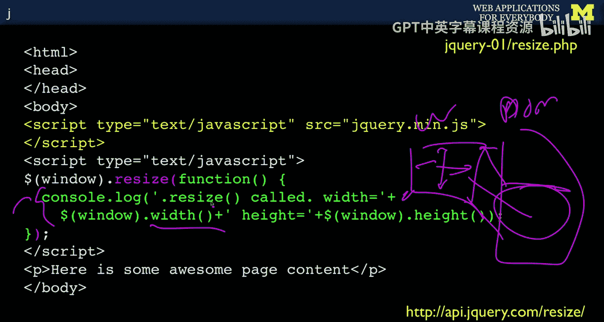

我们将要运行的代码是这段代码。我们将在控制台输出“It has been resized”，然后获取窗口宽度。`window.width()`是jQuery的window对象中的一个方法，告诉你它有多宽。
现在我们查看那个窗口，我们看到宽度，我们看到高度。
事实证明，如果不使用jQuery，计算这个是很困难的。去Google或Stack Overflow搜索“如何在不使用jQuery的情况下找到窗口宽度”，他们会给你一大堆代码，并且会问：“你想让它工作在哪些浏览器上？IE7？等等等等。这是你在IE7中写的，这是你在某某浏览器中写的。”你会说：“不，别那样做。用jQuery的`window.width()`。”它准确地告诉你像素数。`window.height()`也准确地告诉你像素数。
通常你不会打印这个，你可能需要调整DOM中的一些内容，这样如果你把它变小，你可能想隐藏一列之类的，你在这段代码中做类似的事情。
但这是接入文档对象模型和窗口事件结构的另一个例子，意思是“在调整窗口大小时回调我”。这基本上是说，当他们调整窗口大小时回调我，并在他们调整窗口大小时运行这段代码。

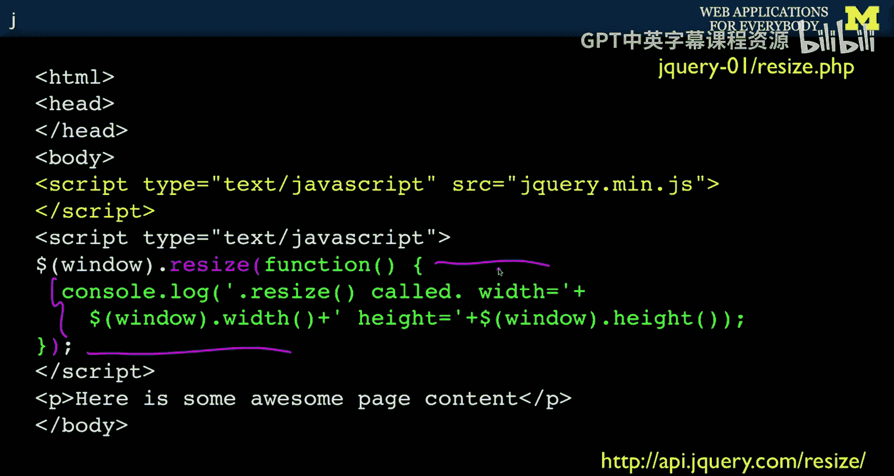

这部分和之前的部分都只是你可以从一个地方复制粘贴到另一个地方的惯用东西，尽管你应该知道语法的真正含义。

## 操作DOM元素

除了接入事件，你能做的另一件事是更改文档对象模型（DOM）。如果你回顾前几节课，我使用了`getElementById`并更改了DOM，这基本上是做同样的事情。

这是一个例子，比如那些你经常看到的旋转的小动画指示器（spinner），表示正在等待。我们将向你展示如何隐藏和显示这些东西。
我们放置一个``标签，并给它一个ID。记住`id=`，每个文档中只有一个。我们将有`spinner.gif`，设置高度和宽度。
然后我们说`display: none`。这意味着默认情况下，这个spinner在页面上，但它是隐藏的。
然后我们将有一个小的切换按钮。
我们将有一个事件，一个`onclick`。有一种在jQuery中注册事件的方法我没有展示，这是一种老式的`onclick`，但没关系，因为每当我们点击“toggle”时，这段JavaScript将运行。所以它将是jQuery。
我们说`$("#spinner")`，而不是发送整个`document`或整个`window`。`"#spinner"`表示：去查找ID为`spinner`的元素，这会抓取整个标签。
然后这是一个jQuery函数，叫做`toggle`。`toggle`的作用是查看`display: none`。它检查它。如果当前不是`display: none`，它就改变它。如果正在显示，它就设置为`display: none`。所以它是切换状态。如果你在检查元素中观察这个，你会注意到这个在变化。你不需要记住，也不需要写一个变量来弄清楚，你只是说，显示它或不显示它。还有`.show()`和`.hide()`。`.hide()`如果你想隐藏它，`.show()`显示它，你可以这样做。
所以这是一种抓取DOM一部分的方法，然后你可以对该部分执行某些方法。你需要去阅读jQuery文档来查看所有方法。

## 更改元素样式

我们也可以抓取某些东西并改变它的颜色。
这里我们将有一个叫做“red”的小按钮。我们将抓取这个段落，因为我们要说`$("#paragraph")`，意思是“给我这个段落”。
这个段落没有CSS，没有其他CSS。
然后一旦我们抓取那个段落，`$("#paragraph").css()`。这是一个jQuery方法`css`。我们传入一个CSS变量`background-color`，并将其设置为`red`。
这意味着无论这个段落是什么，它将有一个红色的背景色。每次你点击那个按钮。
类似地，如果你点击这个“green”按钮，它将去抓取那个，将背景色设置为绿色。所以你点红、绿、红、绿，这个小段落将在红色和绿色之间来回切换。

这基本上就是jQuery如何工作来抓取东西并操作它们，同样，这只是非常基础的开端。

## 下一步：表单与服务器通信

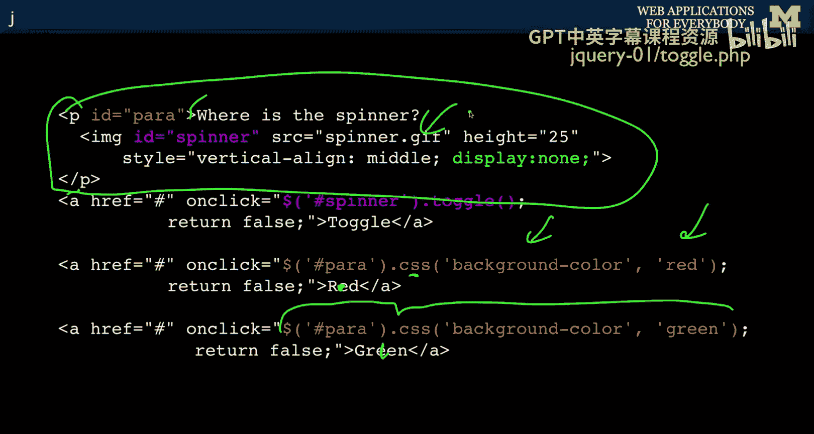

下一个jQuery示例我们将展示如何实际查看表单、自动提交表单以及在jQuery中与服务器通信。