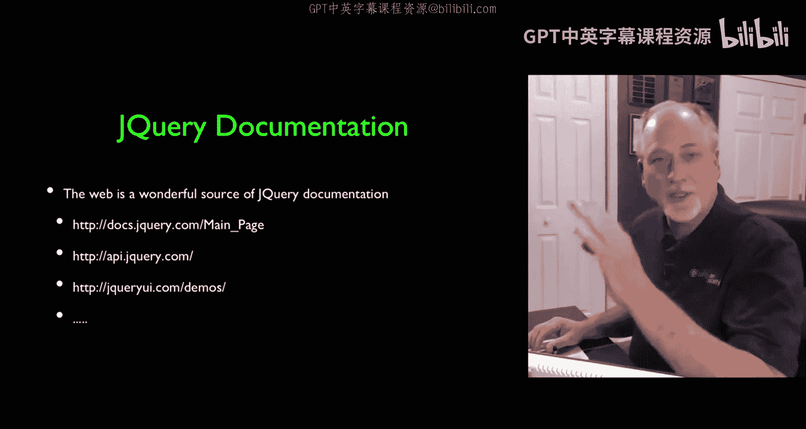
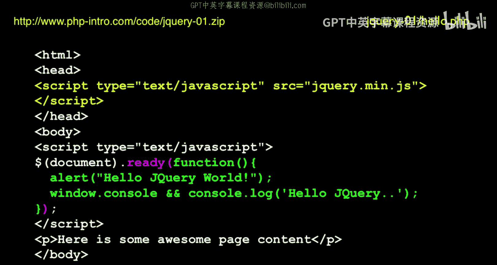
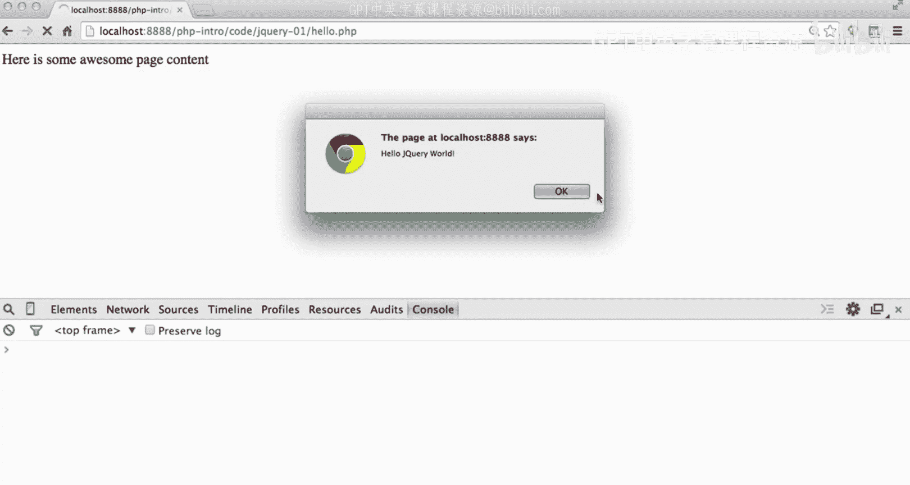
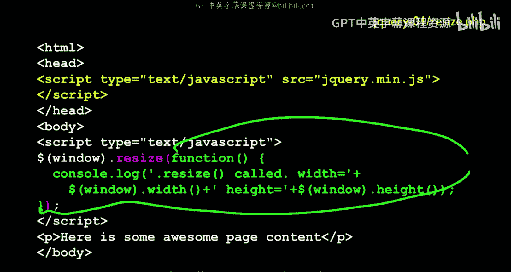
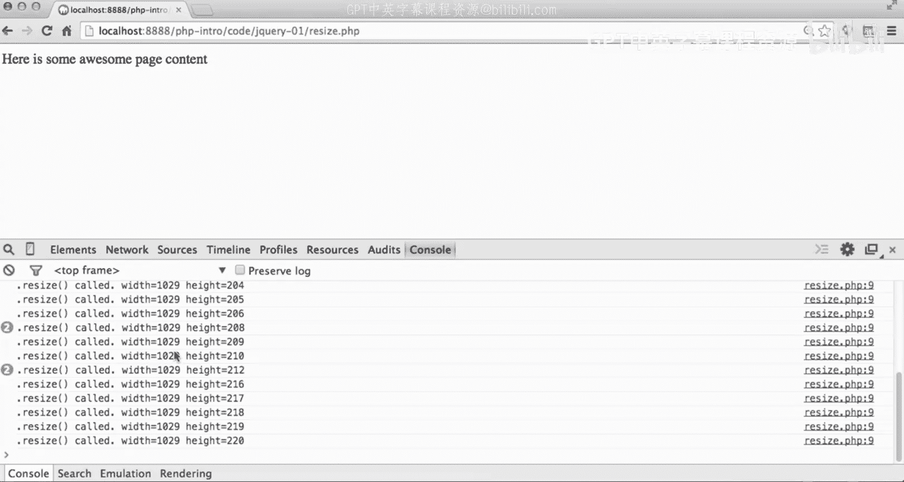
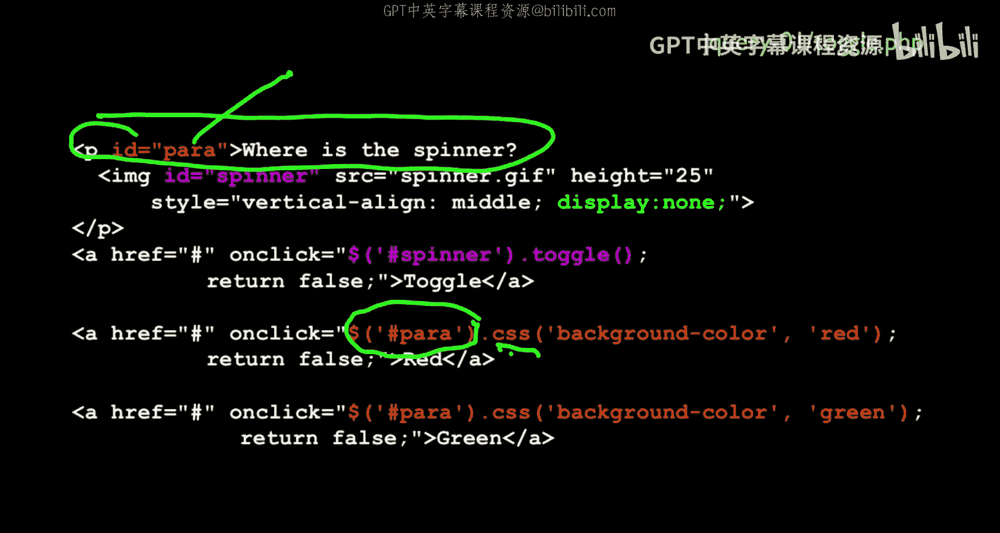
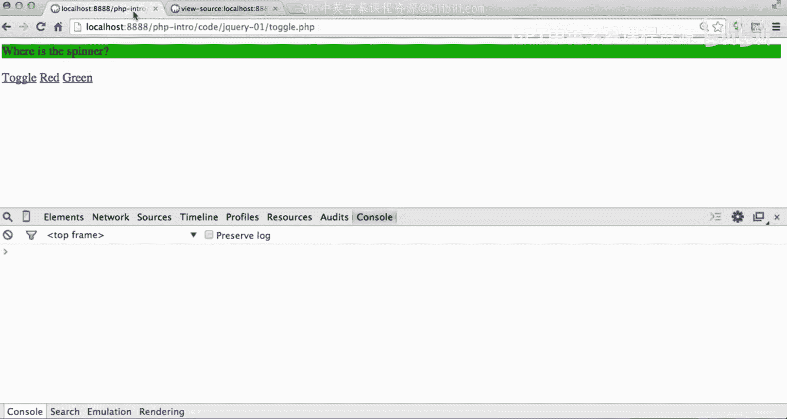

# 130：jQuery基础详解

在本节课中，我们将学习jQuery库的核心概念，了解它如何简化JavaScript编程，并掌握其基本语法和常用模式。我们将从jQuery的引入开始，逐步讲解如何响应页面事件、操作DOM元素以及修改CSS样式。

## 概述

jQuery是一个广泛使用的JavaScript库，它解决了不同浏览器之间JavaScript和文档对象模型（DOM）的兼容性问题。jQuery通过提供简洁、一致的API，使得开发者能够更轻松地编写跨浏览器兼容的代码。本节课将介绍jQuery的基本用法，包括如何引入库、响应页面加载和窗口调整事件，以及如何查询和操作DOM元素。



## jQuery的引入与`$(document).ready()`

我们首先讨论如何在HTML文档中引入jQuery库，并确保我们的代码在页面完全加载后执行。

在HTML文档的`<head>`部分，我们引入jQuery库。有些开发者倾向于将脚本放在`<body>`标签的末尾，但这里我们采用放在`<head>`中的方式。引入后，jQuery库会扩展DOM的功能，并定义一个名为`$`的全局函数。

`$`是一个函数，`$(document)`是其调用方式之一，它返回一个包含多种方法的jQuery对象。`.ready()`就是其中一个方法。这种链式调用语法是jQuery的特色。

```javascript
$(document).ready(function() {
    alert("Hello dophP");
    console.log("Hello jQuery");
});
```



这段代码的核心含义是：当文档（包括所有图片）完全加载就绪时，执行我们提供的函数。函数内部首先弹出一个警告框，然后在浏览器控制台输出一条日志信息。这是一种常见模式，用于在页面加载完成后“注入”交互功能。

让我们运行这段代码。页面加载时，会先获取HTML，然后加载jQuery库，最后在文档就绪时触发我们的函数，弹出警告并打印日志。`$(document).ready()`确保了我们的代码在DOM完全构建后才执行，这非常重要，因为过早操作DOM元素可能会失败。

## 响应窗口调整事件：`$(window).resize()`



上一节我们介绍了如何在页面加载后执行代码。本节中，我们来看看如何响应浏览器窗口大小调整这类动态事件。

除了文档就绪事件，jQuery还可以让我们轻松响应其他事件，例如窗口调整大小。`$(window)`返回一个代表浏览器窗口的jQuery对象，其`.resize()`方法用于注册窗口调整大小事件的处理器。

```javascript
$(window).resize(function() {
    console.log("Window resized to: " + $(window).width() + "x" + $(window).height());
});
```



这段代码注册了一个事件处理器。每当用户调整浏览器窗口大小时，括号内的函数就会被调用。在函数内部，我们向控制台打印了当前窗口的宽度和高度。在实际应用中，你可能会根据新的窗口尺寸来重新布局页面元素、显示或隐藏某些内容。

运行代码后，当你拖动浏览器窗口边缘改变其大小时，控制台会不断输出新的窗口尺寸信息。这演示了jQuery如何让我们“接入”到各种浏览器事件中。



## 查询与操作DOM元素：jQuery选择器与方法

我们已经学会了响应事件，现在来看看jQuery的核心功能：查询DOM元素并对其进行操作。这通常被称为“查询-执行”模式。

jQuery使用CSS选择器语法来查找DOM元素。`$("#spinner")`会查找`id`为`spinner`的元素。找到元素后，我们可以调用jQuery方法对其进行操作，例如`.toggle()`用于切换元素的显示/隐藏状态，`.css()`用于修改元素的CSS样式。

以下是几个操作示例：
*   **切换显示/隐藏**：`$("#spinner").toggle();` 会切换ID为`spinner`的元素的可见性。
*   **修改CSS样式**：`$("p").css("background-color", "red");` 会将所有`<p>`段落标签的背景色改为红色。

让我们看一个综合例子。假设页面上有一个段落，里面包含一个初始隐藏的图片（spinner），以及几个按钮：



```html
<p id="mypara">这是一个段落。</p>
<a href="#" onclick="$('#spinner').toggle(); return false;">切换Spinner</a>
<a href="#" onclick="$('#mypara').css('background-color', 'red'); return false;">红色背景</a>
<a href="#" onclick="$('#mypara').css('background-color', 'green'); return false;">绿色背景</a>
```

*   点击“切换Spinner”按钮，会显示或隐藏spinner图片（通过切换`display`的`none`属性）。
*   点击“红色背景”或“绿色背景”按钮，会改变整个段落的背景颜色。

所有这些操作都在浏览器端瞬间完成，没有发起新的网络请求（请求-响应周期），也没有改变原始的HTML DOM结构，只是动态修改了元素的CSS属性。jQuery提供了大量类似的方法，如`.animate()`用于动画，`.fadeIn()`/`.fadeOut()`用于淡入淡出效果等，具体需要查阅jQuery的官方文档。



## 总结


本节课中我们一起学习了jQuery的基础知识。我们了解了jQuery如何作为一个强大的工具来解决浏览器兼容性问题。我们掌握了引入jQuery库的方法，以及使用`$(document).ready()`来确保代码在页面加载后执行。我们还学习了如何用`$(window).resize()`来响应窗口调整事件。最重要的是，我们理解了jQuery的“查询-执行”范式，即使用`$()`配合选择器来查找元素，然后调用`.toggle()`、`.css()`等方法对其进行操作。jQuery的官方文档非常出色，包含了大量可即取即用的代码片段，是进一步学习的最佳资源。