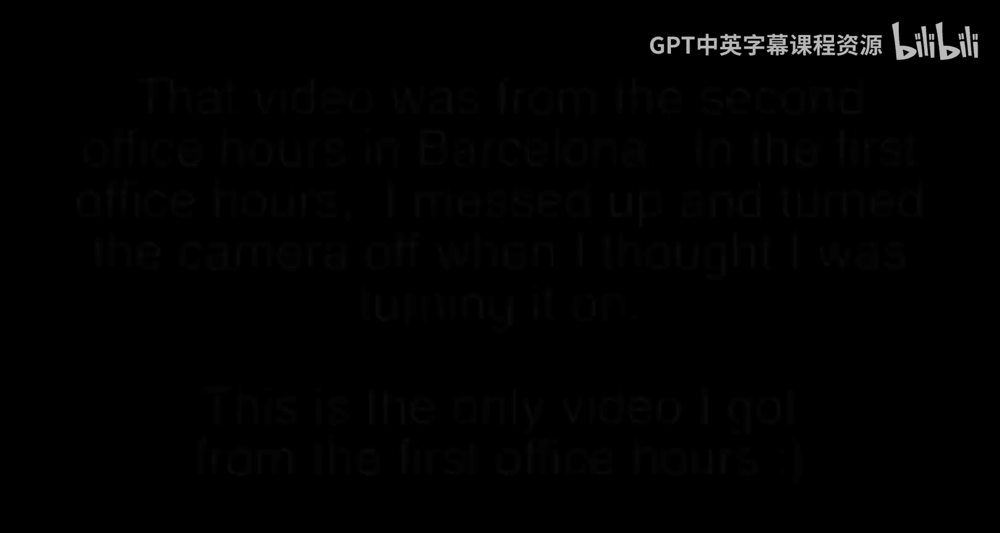
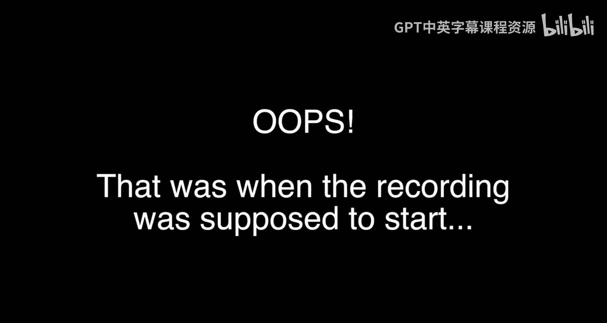

# 135：巴塞罗那

在本节课中，我们将回顾密歇根大学课程在巴塞罗那举行的一次附加办公时间。本次办公时间旨在与学生面对面交流，分享学习体验。

## 课程概述

这是课程在巴塞罗那举行的第二次办公时间。第一次办公时间的视频不慎丢失，但讲师有幸在另一天再次举办，因此有了这次会面。部分学生参加了两次活动，同时也有许多新同学加入。

## 与会学生介绍

以下是参加本次办公时间的部分学生自我介绍。

*   Ia：计划开始学习互联网历史课程。
*   el：正在学习Python，并已完成专项课程。
*   Christina：一名语言学家，正在学习Python。
*   co：正在学习Python。
*   Marta：正在学习Python专项课程，认为它非常有趣并大力推荐。
*   Sean：有幸见到讲师，并对大家能拥有这样有趣的师生交流表示高兴。
*   Teresa：正在享受Python课程，认为可以从中学习很多。

## 活动总结

本次巴塞罗那办公时间圆满成功，讲师与优秀的学生们进行了愉快的交流。我们期待下一次会面。

---

本节课中我们一起回顾了一次在巴塞罗那举行的课程办公时间，通过学生的自我介绍，我们感受到了共同学习的社区氛围。