# 137：JSON与jQuery 🚀

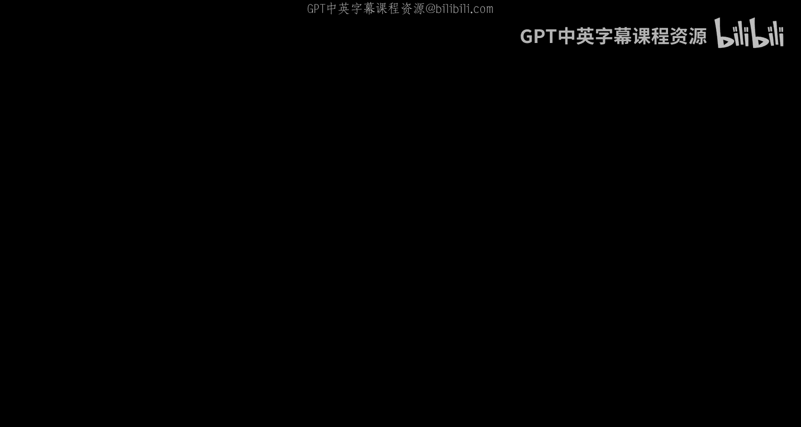

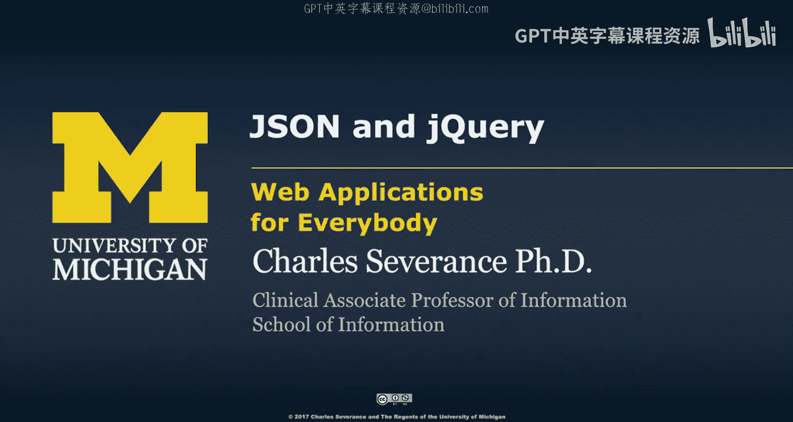

在本节课中，我们将学习JSON、jQuery和PHP如何协同工作，以实现浏览器与服务器之间的数据交换。整个过程看似简单，但其背后蕴含着强大的功能。

## JavaScript对象语法回顾

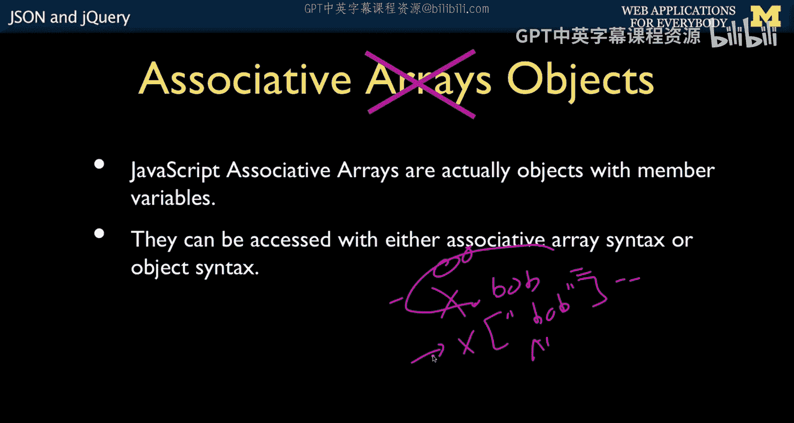

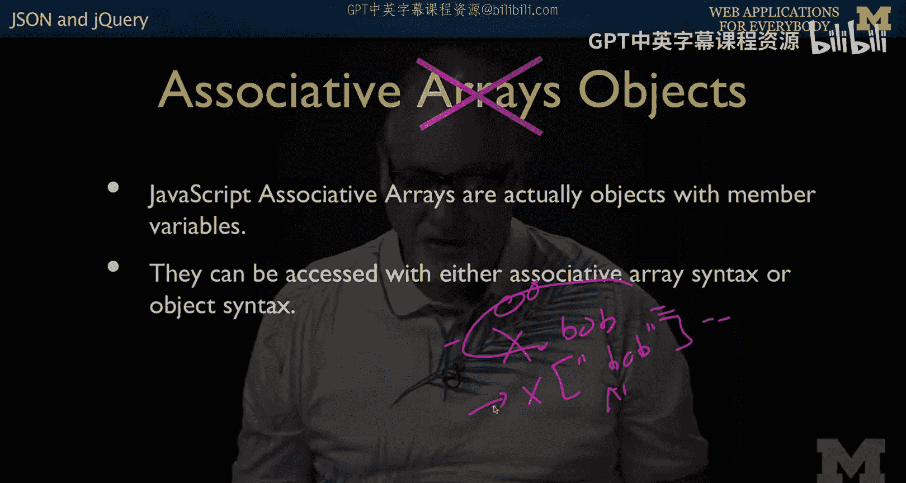

上一节我们介绍了Web应用的基本概念，本节中我们来看看JavaScript中对象的两种访问方式。


在JavaScript中，我们使用对象。它们不完全是关联数组，而是键值对。它们可以通过关联数组语法或对象语法来访问。

以下是两种等价的语法：
```javascript
x.bob // 对象语法
x["bob"] // 关联数组语法
```
第一种是面向对象的语法，第二种是看似数组的语法。本质上，后者是实际发生的情况，而前者是后者的快捷方式。在阅读代码时，有些程序员只使用其中一种语法，而另一些则使用另一种。我倾向于尽可能使用点格式，但有时必须使用双引号格式。请记住，JavaScript中的这两种语法含义完全相同，它们不是不同的东西，而是同一事物的两种表达。

## JSON语法基础

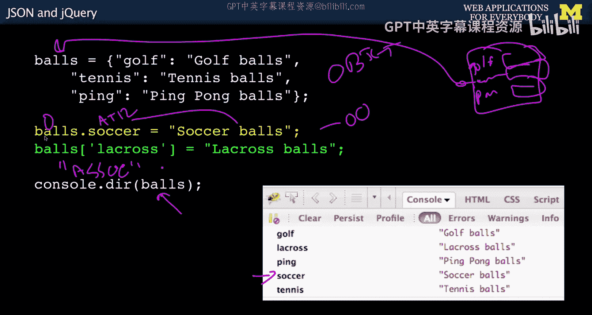

上一节我们回顾了JavaScript对象，本节中我们来看看JSON的具体语法。

JSON本质上就是JavaScript对象语法。以下是一个创建对象的示例：
```json
{
  "name": "Chuck",
  "age": 64,
  "retired": true,
  "offices": ["3357D", "123Main"],
  "skills": {
    "C++": true,
    "Python": true
  }
}
```
对象以花括号 `{}` 开始和结束。内部是键值对，键和值之间用冒号分隔。值可以是不同类型，不一定是数字，也可以是布尔值，甚至可以是一个列表。例如，属性 `offices` 映射到一个包含两个字符串的双元素列表。属性 `skills` 则映射到一个嵌套的对象。这些是键值对，而在 `skills` 内部又有另一个包含 `C++` 和 `Python` 的对象。这就像在任何编程语言中构造对象一样。在PHP中，可以有数组中的数组，它们可以是线性数组或键值数组，但在这里，这是一个对象。


需要强调的是，对象和数组并不完全相同。上面示例中的 `{}` 定义了一个对象，而 `[]` 定义了一个数组，`skills` 内部又是一个对象。

## 从JavaScript到JSON

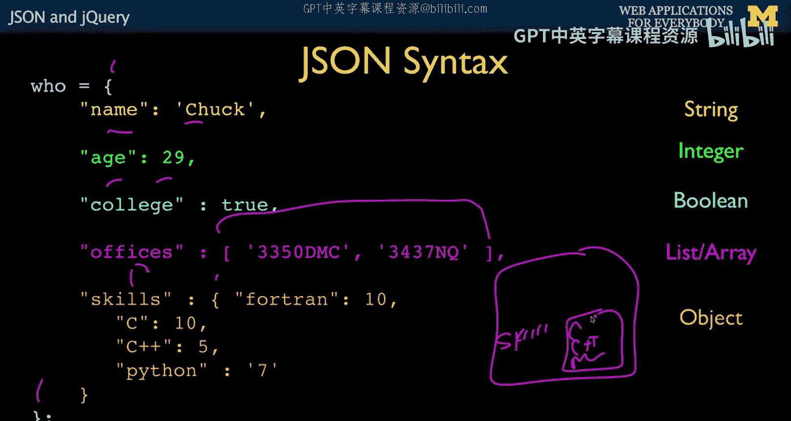


上一节我们了解了JSON的静态结构，本节中我们来看看如何在JavaScript代码中动态创建和使用它。

以下是一些直接运行此内容的JavaScript代码：
```javascript
const who = { "all": "done" };
```
这只是一个可执行的JavaScript赋值语句。它恰好是JSON语法和JavaScript常量语法。这就像执行 `who = 42;` 一样，只是这里构造了一个带有键 `all` 和值 `done` 的对象，并将其赋值给 `who`。再次强调，这仍然只是语法。我们还没有将其变成网络传输协议，它仍然只是JavaScript常量语法。

## 实现网络传输协议

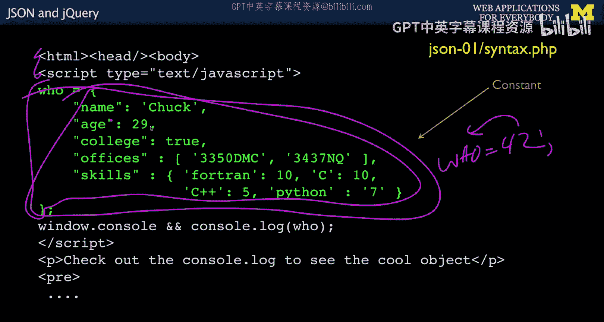


上一节我们看到了JSON在代码中的形态，本节中我们来看看如何将其作为数据在网络上传输。

这是一个重要的环节。如果幻灯片上有40行代码，你可能会觉得它复杂且充满挑战。但这里发生的事很神奇，而代码只有寥寥几行。我们将通过一个名为 `json.php` 的文件来演示。

首先，我们使用 `sleep(2)` 让程序稍微慢下来，以便在开发者控制台中观察发生的情况。当我们打算向浏览器发送JSON时，需要告诉浏览器内容类型。回想一下，内容类型可以是文本、HTML、JPEG或PNG。这是一个响应头，用于告知浏览器接下来发送的数据块是什么。我们告诉浏览器这是JSON，并指定为UTF-8编码，以支持亚洲字符等。

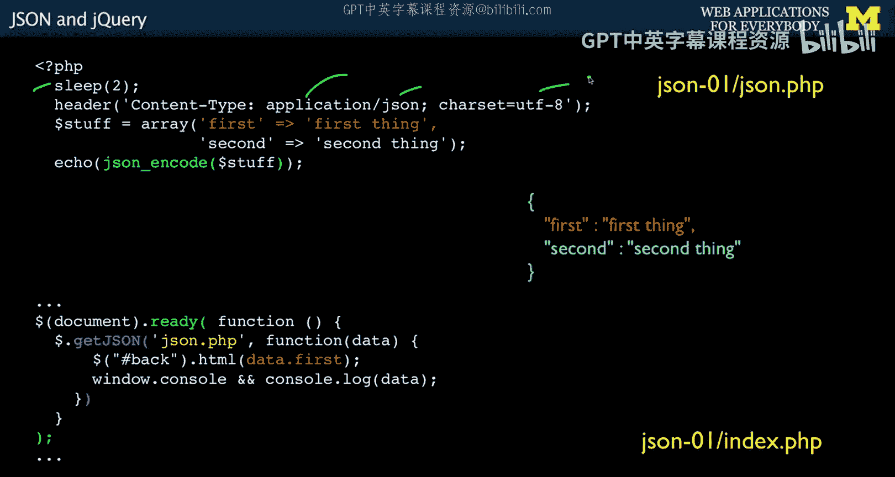

在PHP中，必须在产生任何输出之前设置所有头部信息，所以这行代码放在最前面。


## PHP端的序列化

上一节我们设置了响应头，本节中我们来看看PHP端如何准备和发送JSON数据。

现在，我们有一些PHP代码。在实际应用中，这可能会从数据库读取数据，但我们现在先不关心这个。目前，我们只是创建一个数组。
```php
$array = array("first" => "first thing", "second" => "second thing");
```
这是在PHP内部创建一个关联数组。然后，我们将进行序列化，接着发送这个网络传输协议，在JavaScript端接收并解析它。这正是我们现在要做的。

序列化PHP数组使用PHP内置的函数 `json_encode`。你传入一个数组，它可以是线性数组或键值数组，它会自动生成正确的JSON。在本例中，由于是键值数组，它会生成一个带有键值对的JSON对象。然后，`echo` 输出的就是这个序列化后的字符串。如果你直接访问这个PHP页面，在浏览器中看到的正是这个字符串。它可能看起来是压缩在一起的，但你可以对其进行“美化打印”，使其具有缩进，便于阅读。通常在传输时不会美化打印，因为数据主要是由代码解析，而不是由人阅读。我们往往在需要查看时，才复制粘贴并进行美化打印。

这段PHP代码运行后，表示“我必须发送一些JSON”，创建一个内部结构（这里可以有很多代码），将其序列化并发送回去。这就是PHP端的请求-响应周期。

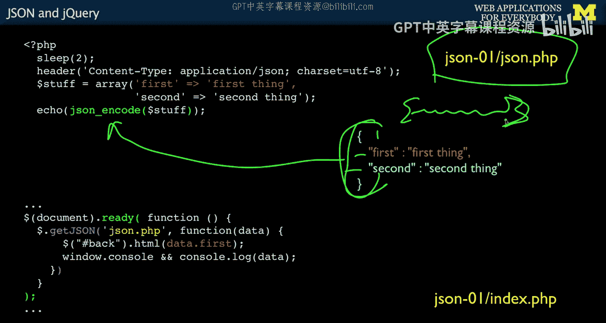


## JavaScript端的反序列化

上一节我们完成了PHP端的发送，本节中我们来看看JavaScript端如何接收和处理这些数据。

我们不会将其放在 `onclick` 方法中，而是直接展示其工作原理。假设我们有一个页面 `index.php`，里面有一些内容。我们使用 `$(document).ready()`，这是一个惯用写法，表示在文档加载完成后运行此代码。可以将其理解为在 `</body>` 和 `</html>` 标签之后执行。

然后，我们调用 `$.getJSON`。之前我们使用过 `$.post`，它发送POST数据并获取HTML返回。而 `$.getJSON` 将发起一个GET请求，并期望返回JSON。我们指定服务器URL，即运行在服务器上的 `json.php` 代码。`$.getJSON` 知道返回的是JSON，因此它会自动进行反序列化，然后将反序列化后的数据传递给我们的回调函数。

请记住，这是事件发生时运行的代码。它将传递反序列化后的数据，这是一个JavaScript对象，而不是字符串。所以，你需要区分网络传输协议（它只是一个字符串）和反序列化后的东西（它是一个活的JavaScript对象）。在本例中，`data` 就是一个活的JavaScript对象。因此，我可以打印出 `data.first`，它对应着PHP数组中 `"first"` 键的值。

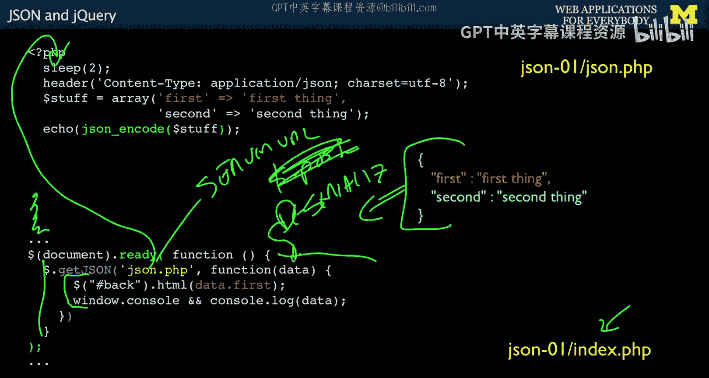


这真是太神奇了。让我们梳理一下流程：我们在浏览器中，调用 `$.getJSON`，发送一个GET请求到 `json.php`。`json.php` 可以做任何事情（例如与数据库对话），这里为了简单，它创建了一个结构，序列化后输出一个包含花括号等的字符串，这就是网络传输协议。时间在流逝，这是异步代码，它在等待响应返回。但在数据返回之前，它已经被反序列化了。所以，运行的回调函数接收到的 `data` 已经是反序列化后的对象。获取数据、等待返回、序列化、反序列化——序列化发生在PHP端，而反序列化则内置于 `$.getJSON` 中，它在数据返回给我们之前就完成了反序列化。

整个流程的代码量非常少。正如之前所说，这在10年或15年前可能需要数千行代码。这真的很简单。但我们必须理解这里的每一行代码，因为一旦掌握了这个，我们将构建更复杂的代码。所以不要想着以后再去弄明白，因为后续我们会发送更多代码，进行多次这样的操作，并与数据库交互等等。

## 构建一个简单的聊天工具

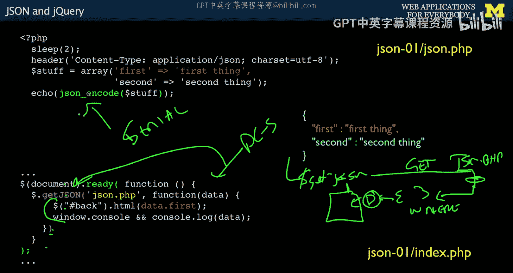

上一节我们完整地走通了数据交换的流程，本节中我们来看看如何将这些知识应用到一个简单的聊天工具中。


现在，让我们简单讨论一下如何将其转化为一个简单的聊天工具。其核心思想是，客户端定期或通过事件（如发送消息）向服务器请求新的聊天数据（JSON格式），服务器处理请求并返回包含消息列表的JSON，客户端再使用jQuery动态更新页面上的聊天内容。这避免了整个页面的刷新，实现了更流畅的用户体验。

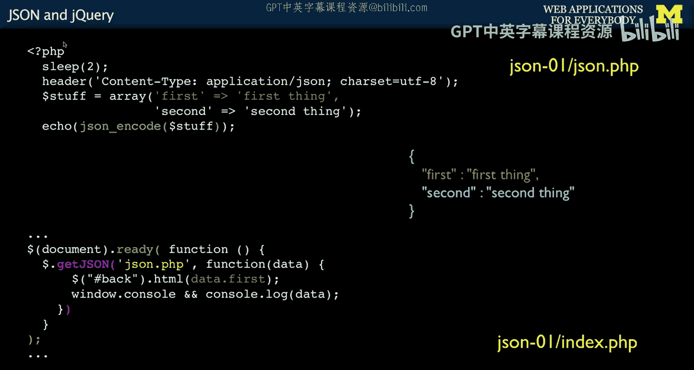


本节课中我们一起学习了JSON、jQuery和PHP如何协同工作，实现了浏览器与服务器之间高效的数据交换。我们回顾了JavaScript对象的两种访问语法，了解了JSON的基本结构，掌握了在PHP中将数组序列化为JSON字符串并发送，以及在JavaScript中使用jQuery的 `$.getJSON` 接收并自动反序列化数据的过程。整个过程代码简洁，但功能强大，是现代Web应用实现动态内容加载的基础。